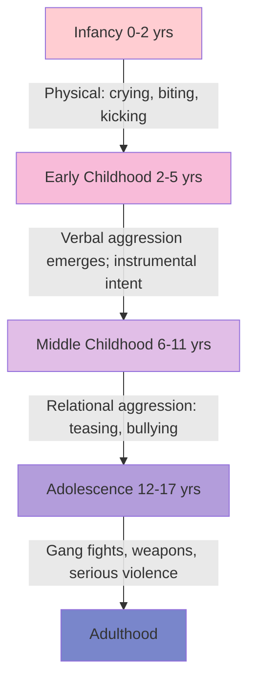
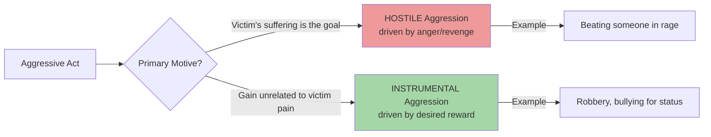
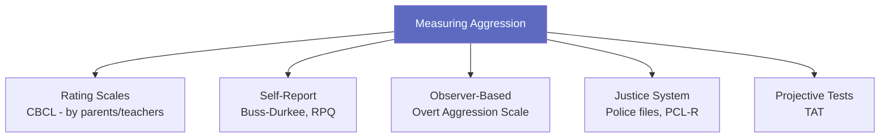

# Nature, Types, and Measurement of Aggression

## Introduction

Human aggression is one of the most studied and yet most misunderstood phenomena in social psychology. At its core, **aggression is any behaviour directed toward another individual with the proximate intent to cause harm**, where the perpetrator believes the behaviour will harm the target, and the target is motivated to avoid it (Bushman & Anderson, 2001; Baron & Richardson, 1994; Berkowitz, 1993).

This definition immediately helps us exclude some important cases: accidental harm is not aggression because intent is absent; pain experienced during a dental procedure is not aggression because the person is not motivated to avoid it; and pain sought in sexual masochism is not aggression because it is actively solicited (Baumeister, 1989). Intent and the victim's motivation to escape are both essential criteria.

When we hear "aggression," we typically imagine physical force—a fistfight, an assault. But by the definition above, **spreading vicious gossip about someone to ruin their reputation** would also constitute aggression. The category is broader and more socially embedded than popular usage suggests.

:::info Learning Objectives
After studying this section, you should be able to:
- Define aggression with its essential components
- Differentiate between major typologies of aggression
- Describe key measurement instruments for aggression
- Distinguish accidental harm from intentional aggression
:::

---

## What Is Aggression? A Formal Definition

The most widely accepted definition in research literature:

> **Aggression = Delivery of an aversive stimulus from one person to another, with intent to harm, with an expectation of causing such harm, when the other person is motivated to escape or avoid the stimulus.**

Three necessary conditions:
1. **Intent to harm** — the aggressor must intend the aversive outcome
2. **Belief harm will occur** — not just hoping but expecting harm
3. **Target motivation to avoid** — the victim does not want this experience

In human research, harm has been broadly construed to include:
- **Physical harm** — kicking, hitting, stabbing
- **Psychological harm** — humiliating, threatening, intimidating
- **Relational harm** — malicious gossiping, social exclusion

### Aggression as Antisocial Behaviour

Antisocial behaviour is behaviour by which people are disadvantaged and basic norms are violated (examples: lying, stealing, truancy). **Aggressive behaviour is a specific, more serious form of antisocial behaviour.** It is a key component of several clinical disorders including:

- Conduct Disorder (CD)
- Oppositional-Defiant Disorder (ODD)
- Attention Deficit Hyperactivity Disorder (ADHD)
- Intermittent Explosive Disorder (IED)

### Developmental Trajectory

Aggressive behaviour shows a characteristic developmental pattern. During infancy and toddlerhood (especially 18–24 months), outbursts of anger peak and include physical forms: crying, screaming, biting, kicking, throwing, breaking objects (Achenbach, 1994). At this stage, intention is primarily instrumental (getting something).

As verbal skills develop, language can be used either peacefully or aggressively. By middle childhood, aggression can take subtler relational forms—teasing, bullying, social exclusion. During early adolescence, more serious violence emerges including gang fights and weapons use (Greydanus et al., 1992).

---

## Types of Aggression

Theoretical perspectives suggest that **typographically and functionally distinct subtypes of aggression exist** (Dodge & Schwartz, 1997). Different stimuli combine with different physiological and mental processes to create distinct forms. The major classification systems overlap somewhat, each with slightly different emphases.

### 4.2.1 Clinical Classification

Heavily influenced by Feshbach (1970), the clinical literature distinguishes two fundamental forms:

| Type | Also Called | Characteristics |
|------|-------------|-----------------|
| **Affective/Reactive/Hot-Blooded** | Defensive, impulsive | Violent response to perceived aggression by others; emotionally charged, relatively uncontrolled |
| **Predatory/Instrumental/Cold-Blooded** | Proactive | Controlled, purposeful aggression lacking emotion; used to achieve goals including domination |

The "hot-blooded" form erupts from provocation and emotional flooding. The "cold-blooded" form is calculated and strategic—the hallmark of predatory criminals and bullies who use aggression as a tool.

### 4.2.2 Instrumental vs. Hostile Aggression

Developed by Feshbach (1970) and elaborated by Atkins et al. (1993):

- **Instrumental Aggression**: Produces positive reward or advantage for the aggressor *unrelated to* the victim's suffering. The harm to the victim is incidental. Example: robbing someone to get money.

- **Hostile Aggression**: Aims specifically to inflict pain or injury on the victim. The victim's suffering *is* the goal. Example: beating someone out of rage with no material gain.

> ⚠️ **Critical Limitation**: Many real aggressive episodes contain *both* instrumental and hostile components, making clean classification difficult.

### 4.2.3 Proactive and Reactive Aggression

This widely studied distinction maps closely onto the instrumental/hostile divide:

| Dimension | Reactive Aggression | Proactive Aggression |
|-----------|---------------------|----------------------|
| **Trigger** | Response to provocation (attack, insult) | Initiated without apparent provocation |
| **Emotion** | Anger, hostility, self-defence | Little anger; goal-directed |
| **Motivation** | Threat response | Obtaining goods, asserting power, peer approval |
| **Example** | Punching back after being hit | Bullying to gain social status |

Reactive and proactive aggression are essentially equivalent to affective and instrumental aggression respectively. Research shows these subtypes have different neural correlates and respond differently to intervention.

### 4.2.4 Positive vs. Negative Aggression

While aggression is generally seen negatively, Blustein (1996) argued the term is ambiguous and can denote both positive and negative behaviours:

**Positive Aggression** (Ellis, 1976) includes healthy, productive behaviour that promotes:
- Survival and self-protection
- Standing firm against negation
- Pushing for new possibilities
- Building autonomy and identity in childhood/adolescence
- Healthy self-assertion and independence

The key insight: *a certain degree of dominance and assertiveness helps facilitate engagement in competitive and cooperative activities with peers.* Channelled properly, aggression enables mastery of environment and self.

**Negative Aggression** is defined as:
- Acts resulting in personal injury or destruction of property (Bandura, 1973)
- Attacking behaviour that harms another of the same species (Atkins et al., 1993)
- Actions directed toward the goal of harming another living being (Moyer, 1968)
- Encroaching on territory causing financial, physical, and emotional damage

Negative aggression is considered unhealthy because it induces heightened emotions that can be damaging in the long term.

---

## The Measurement of Aggression

Measuring aggression presents significant methodological challenges—direct observation is often impractical or unethical, and self-reports may be distorted by social desirability. Multiple methods have therefore been developed.

### Rating Scales

**Child Behaviour Checklist (CBCL)** (Achenbach, 1994):
- Completed by parents or teachers
- Widely used in clinical and research settings
- Assesses a range of behavioural problems including aggression

### Self-Report Measures

**Buss-Durkee Hostility Inventory (BDHI)** (Buss & Durkee, 1957):
- Most popular self-report measure of aggression
- Assesses different aggressive attitudes and behaviours
- Includes subscales for assault, indirect aggression, verbal aggression, irritability, negativism, resentment, and suspicion

**Reactive-Proactive Aggression Questionnaire (RPQ)**:
- Brief self-report measure with reading age of 8 years
- Can reliably and validly distinguish proactive from reactive aggression

### Observer-Based Measures

**Overt Aggression Scale (OAS)** (Yudofsky, 1986):
- Measures four types of ward behaviour in psychiatric patients
- Completed by nurse raters
- Categories: verbal aggression, physical aggression against objects, against self, and against others

### Justice System Measures

Three approaches used in forensic/criminal contexts:
1. **Official files** from police, courts, and correctional agencies
2. **Self-report delinquency scales** (e.g., Self-Reported Delinquency)
3. **Psychopathy Checklist–Revised (PCL-R)** (Hare, 1991): most popular clinical instrument for assessing psychopathic behaviour traits

### Projective Tests

**Thematic Apperception Test (TAT)** (Murray, 1957): clinical projective test that can also assess aggressive themes in narrative responses.

---

## Indian Context: Aggression in India

Understanding aggression in India requires attention to cultural context. Research has noted:

- **Societal context**: High population density in urban areas (crowding effect discussed in causes), economic disparities, and rapid social change are background risk factors
- **Family dynamics**: Authoritarian parenting styles in some traditional families may interact with aggression development in children
- **School bullying**: Rising awareness of bullying in Indian schools, with interventions being developed
- **Road rage**: High traffic density combined with heat (both environmental stressors) contributes to road rage, documented in major cities

---

## External Resources

### Wikipedia Articles
- [Aggression](https://en.wikipedia.org/wiki/Aggression) — Comprehensive overview
- [Hostile versus Instrumental Aggression](https://en.wikipedia.org/wiki/Aggression#Hostile_vs._instrumental) — Typology overview
- [Reactive Aggression](https://en.wikipedia.org/wiki/Reactive_aggression) — Clinical and research perspectives

### Educational Videos
- 🎥 [**Crash Course Psychology: Aggression**](https://www.youtube.com/watch?v=e4eOEEpJl0c) — Excellent overview with examples
- 🎥 [**Types of Aggression Explained**](https://www.youtube.com/watch?v=ZmEBm0T3NRw) — Visual walkthrough of typologies

### Recent Research Papers (2020–2024)
- Bushman, B.J. (2022). "Violent video games and aggression: Revisiting the evidence." *Perspectives on Psychological Science*
- Hasan, Y. et al. (2023). "A meta-analysis of reactive and proactive aggression." *Aggressive Behavior*, 49(2), 120-135
- Raine, A. (2021). "A neurodevelopmental marker for limbic maldevelopment in antisocial personality disorder and psychopathy." *British Journal of Psychiatry*, 218(4)

---

## Memory Aids

### CHAP Mnemonic for Aggression Definition
- **C** — Carry out with **intent** to **C**ause harm
- **H** — **H**arm expected to occur
- **A** — **A**versive stimulus delivered
- **P** — **P**erpetrator believes target wants to avoid it

### Hot vs. Cold Aggression
- **HOT** = Hostile, Outburst, Triggered (reactive, emotional)
- **COLD** = Calculated, Objective-driven, Low emotion (instrumental, proactive)

---

## Self-Assessment Questions

**Level 1 – Recall:**
1. What are the three necessary conditions for an act to be considered "aggression"?
2. Why is pain during a dental procedure NOT considered aggression?
3. Name two standardised instruments used to measure aggression.

**Level 2 – Understanding:**
4. A robber assaults a shopkeeper to steal cash. Classify this act using the instrumental vs. hostile framework. Justify your answer.
5. How does positive aggression differ from negative aggression? Give one example of each.
6. Why is relational aggression (e.g., social exclusion, gossip) now considered as important as physical aggression?

**Level 3 – Application & Analysis:**
7. A student consistently bullies classmates to gain social status among peers. Classify this behaviour as reactive or proactive aggression and explain the mechanisms involved.
8. If you were designing a study to measure aggression ethically in a school setting, which measurement method(s) would you choose and why?
9. How might the developmental trajectory of aggression (from physical in infancy to relational in adolescence) inform prevention programmes?

---

**Source PDFs**:
- 📄 [Block-2/Unit-4.pdf — Pages 69–75](/pdfs/MPC-004%20Advanced%20Social%20Psychology/Block-2/Unit-4.pdf)
- 📚 MPC-004 Advanced Social Psychology
