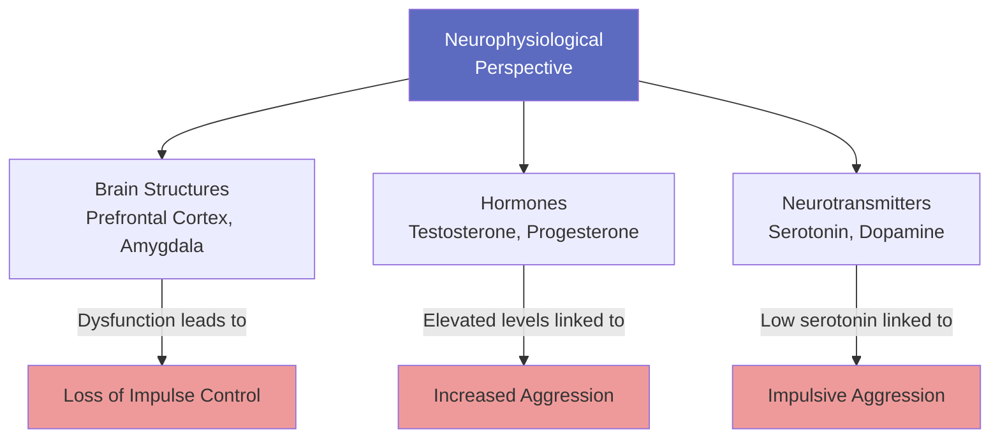
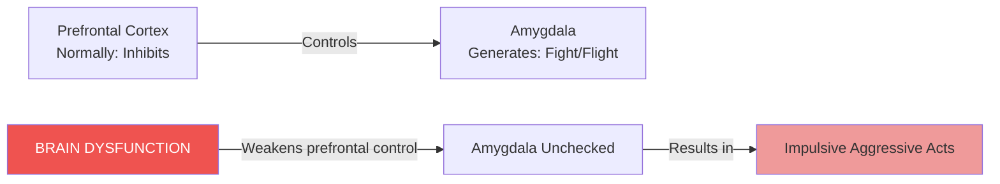
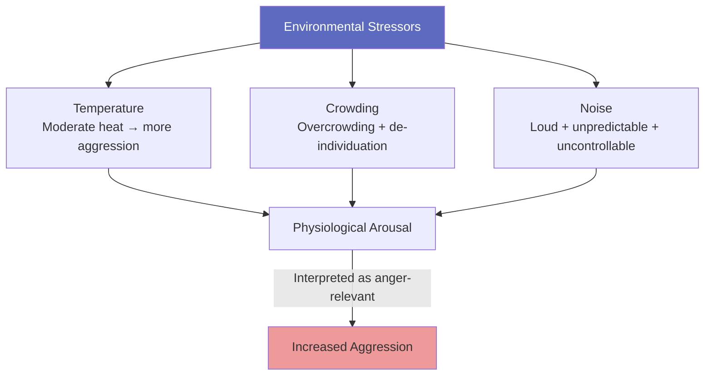

# Causes of Aggressive Behaviour

## Introduction

Aggression does not arise in a vacuum. Researchers across neuroscience, genetics, developmental psychology, and environmental psychology have converged on a **multi-causal model** of aggressive behaviour. Understanding these causes is essential not just for theory but for designing effective interventions. As the research makes clear, no single cause is sufficient—it is the *interaction* between biological predispositions, parental behaviour, and environmental conditions that shapes whether a person becomes chronically aggressive.

:::info Learning Objectives
- Explain neurophysiological perspectives on aggression
- Describe biological causes: brain dysfunction, testosterone, serotonin, nutrition
- Analyse gene-environment interaction in aggression
- Evaluate the role of parental rearing style and parent-child interaction
- Understand environmental stressors: temperature, crowding, noise
:::

---

## 4.4.1 Neurophysiological Perspectives

The neurophysiological perspective argues that **aggression is primarily a biological response controlled by the brain**. Key principles:

1. The brain, hormones, and neurotransmitters are central to aggressive behaviour
2. Behaviour is largely governed by biological forces rather than environmental ones
3. Aggression is innate, not learned

This perspective is most influential in explaining serious, chronic aggression and violence. However, it should be noted that biological factors rarely act alone—they typically interact with psychosocial risk factors.

---

## 4.4.2 Biological Causes

Research indicates that biological processes can predispose individuals to aggression. Five specific processes have received sustained attention:

### 4.4.2.1 Brain Dysfunction

Evidence for a neurological basis of aggression comes from multiple sources:

**Neuropsychological Tests**: Violent offenders show poor functioning of the **frontal and temporal regions** of the brain—areas critical for impulse control, planning, and social judgment.

**EEG Studies**: Aggressive prisoners show more EEG abnormalities, particularly **excessive slow-wave activity** in aggressive psychopaths—a sign of reduced cortical arousal.

**Brain Imaging**: Aggressive prisoners show **reduced glucose metabolism** in the prefrontal cortex. Individuals with antisocial personality disorder show an **11% reduction in prefrontal grey matter volume** compared to controls.

**The Mechanism**: The prefrontal cortex normally acts to **control and regulate emotional reactions** generated by deeper limbic structures, particularly the **amygdala** (the seat of fear and rage responses). When the prefrontal cortex is poorly functioning, it cannot suppress aggressive impulses, leading to impulsive, disinhibited aggression.

### 4.4.2.2 Testosterone

Sex hormones play a demonstrated role in shaping aggressive behaviour:

- **Violent male offenders** have significantly higher testosterone levels than non-violent controls
- **Female criminals** are more likely to commit crimes during the **menstrual phase** when progesterone is low; aggression is reduced near ovulation when estrogen/progesterone are high (Carlson, 1998)
- **Anabolic steroid users** (e.g., weightlifters) become more aggressive and hostile
- **Normal men given testosterone** experimentally become more irritable and hostile

> ⚠️ **Caution**: Testosterone is associated with aggression but the relationship is **bi-directional**—aggression can also *raise* testosterone levels. Social dominance itself influences hormonal levels.

### 4.4.2.3 Serotonin

Serotonin is the neurotransmitter most consistently linked to aggression:

- **Both animal and human research** show that aggressors have **lower serotonin levels**
- Low serotonin is specifically associated with **impulsive aggression**
- Alcohol consumption (which reduces serotonin) plays a significant role
- Social dominance influences serotonin levels in primates—dominant animals have *higher* serotonin

The brain-chemistry → aggression link is complex because **the environment plays a key role in regulating neurochemistry** (Carlson, 1998). This undercuts purely biological reductionism.

### 4.4.2.4 Nutrition Deficiency

An emerging area of research:

| Nutritional Factor | Aggression Link |
|-------------------|-----------------|
| **Iron deficiency** | Directly associated with aggressive behaviour and conduct disorder |
| **Zinc deficiency** | Linked with aggression in both animals and humans |
| **Food additives** | Hypoglycemia-related aggression studied |
| **Prenatal malnutrition** | Children of women starved during the Dutch Hunger Winter (WWII) had 2.5× the rate of antisocial personality disorder in adulthood |

**Mechanism**: Early malnutrition negatively impacts brain growth and development, and brain impairments predispose to antisocial and violent behaviour by impairing cognitive functions (Liu, Raine, Venables, & Mednick, 2004).

**Birth Complications**: Forceps delivery and other birth complications are believed to cause central nervous system damage → brain impairment → predisposition to aggression. Crucially, birth complications *alone* rarely cause aggression—they interact with psychosocial risk factors like disadvantaged family environment and poor parenting (Arsenault et al., 2002).

---

## 4.4.3 Environment and Genes

Twin and adoption studies paint a nuanced picture:

| Genetic Component | Finding |
|-------------------|---------|
| Twin concordance (adolescent delinquency) | **87% for monozygotic, 72% for dizygotic twins** |
| Genetic vulnerability | Children with antisocial birth parents are *especially* susceptible to unfavourable family conditions |
| Genetic vs. environmental effects | Large shared (family) environmental effect, moderate non-shared, modest genetic effect |
| Age differences | Genetic element is stronger for **adult criminality** than for childhood conduct disorder |

**Key Insight**: Genetics does not determine aggression directly. Rather, *genetic vulnerability combined with unfavourable environments* is the strongest predictor. A biologically predisposed child raised in a warm, structured family may never become aggressive.

---

## 4.4.4 Parental Rearing Style

Five parenting dimensions are repeatedly and strongly associated with long-term antisocial behaviour in children (Patterson & colleagues):

1. **Poor supervision** — inadequate monitoring of children's activities
2. **Erratic, harsh discipline** — inconsistent punishment, physical punishment
3. **Parental disharmony** — conflict, hostility between parents
4. **Rejection of the child** — emotional unavailability, negative attribution
5. **Low involvement** — disengagement from the child's life and activities

> **Research Finding**: Among antisocial boys aged 10, differences in parenting styles predicted over **30% of the variance in aggression** two years later.

---

## 4.4.5 Parent-Child Interaction Patterns

Observational research in homes reveals a specific pattern in families with aggressive children:

- **Polite, considerate behaviour is ignored** — rendered ineffective, extinguished
- **Yelling and tantrums** are responded to — the child gets attention or the parent gives in
- **Result**: Children learn that *aggression works*. They are trained by the family system.

This is essentially an operant conditioning mechanism: aggressive behaviour is **inadvertently reinforced** while prosocial behaviour is **inadvertently punished by neglect**.

---

## 4.4.6 Parental Influence on Emotions and Attitudes

Difficulties can often be traced to infancy. A significant proportion of toddlers who later develop conduct problems show **disorganised attachment patterns**—experiencing fear, anger, and distress on reunion with their caregiver after even brief separations. This response reflects **frightening, unavailable, and inconsistent parenting**.

Remarkably, **the security of infant attachment can be predicted before birth** from the emotionally distorted, confused way the mother talks about her own childhood relationships—revealing intergenerational transmission of attachment patterns.

By middle childhood, children who have been aggressively parented develop:
- **Hostile attribution bias**: Quick to interpret neutral acts by others as hostile
- **Empathy deficits**: Difficulty judging others' feelings
- **Limited prosocial repertoire**: Poor at generating constructive conflict solutions
- **Belief aggression works**: Expecting aggressive responses to be effective
- **Fragile self-esteem**: Sensitivity to disrespect, swift retaliation to perceived slights

---

## 4.4.7 Difficulties with Friends and School

The developmental cascade continues into peer relationships:
- Children with aggressive tendencies **lack skills to participate and take turns** without upsetting peers
- **Peer rejection** ensues quickly
- Rejected children cluster with other antisocial children, reinforcing deviant values
- Academic failure (often linked to reading difficulties) → no qualifications → unemployment → persistent aggression

This pattern shows how early aggression creates a social snowball effect, progressively narrowing life opportunities.

---

## 4.4.8 Predisposing Child Characteristics

**Hyperactivity/ADHD**: Largely genetically determined. Children with ADHD don't start off aggressive but, over time, their restless and impulsive pattern provokes retaliation from peers, leading to fights. When hyperactivity and conduct disorder coexist early, the long-term prognosis is especially poor.

**Lower IQ**: Delinquents consistently show IQ scores **8–10 points below** non-delinquent peers—and this difference predates the onset of aggressive behaviour.

**Other predisposing traits**:
- Irritability and explosiveness
- Lack of social awareness and social anxiety
- Reward-seeking behaviour

**The Transactional View**: As children age, their environment is increasingly *shaped by their own behaviour and choices*. There are **turning points** where certain decisions set the scene for years. It is not just the level of antisocial behaviour but how that behaviour shapes the social world that matters for long-term outcomes.

---

## 4.4.9 Environmental Stressors

### 4.4.9.1 Temperature

The **heat-aggression hypothesis** has robust support:

- Studies across the USA found that **moderately hot temperatures (84°F/29°C)** produced the most violence, with some decrease at extreme heat (Baron & Bell)
- Anderson's broader analysis of violent crimes (rape, murder, assault) found a **steady increase with temperature with no plateau** at extreme heat
- Lab studies: Participants gave more electric shocks as temperature rose

**Cultural caveat**: This would not straightforwardly predict that people in hotter countries are more aggressive overall—culture, social norms, and infrastructure moderate the effect.

**Mechanism**: Both heat and crowding produce **physiological arousal**, which can be interpreted as aggression-relevant or as excitement depending on context.

### 4.4.9.2 Crowding

Higher population density → higher aggression:

- Most aggression observed in **heavily congested roads**
- More prison riots when **population density is higher**
- More aggression observed in a **day nursery** as it became more crowded
- Link to **de-individuation** and invasion of personal space

However, this pattern does not hold for close-knit families—suggesting that **overcrowding** (unwanted proximity) rather than density per se is the issue.

**Cultural differences**: Arabs tend to stand very close during conversation without increased aggression—cultural norms about personal space moderate the effect.

### 4.4.9.3 Noise

Glass and Singer's classic experiment:
- Participants completed a maths task under noise vs. quiet, then a proof-reading task (all quiet)
- Those exposed to noise in the first task **made more errors** in the subsequent task
- Errors were greatest when noise was: (a) very loud, (b) random/unpredictable, (c) uncontrollable

**Conclusion**: It is the **lack of control** over noise, not just the noise itself, that is most damaging. Predictable, controllable noise is less aversive.

---

## Integrative Summary: The Bio-Psycho-Social Model

No single cause explains aggression. The most accurate model is **bio-psycho-social**:

| Level | Risk Factors |
|-------|-------------|
| **Biological** | Brain dysfunction, high testosterone, low serotonin, birth complications, nutrition deficits |
| **Genetic** | Hereditary predisposition (stronger for adult criminality) |
| **Parental** | Poor supervision, harsh/erratic discipline, rejection, low involvement, coercive interaction patterns |
| **Social/Peer** | Peer rejection, association with antisocial peers, academic failure |
| **Environmental** | Heat, crowding, noise, poverty, social inequality |

The interaction between levels is key: a biologically predisposed child in a harsh environment with inconsistent parenting and peer rejection faces compounding risks.

---

## External Resources

### Wikipedia Articles
- [Aggression - Biological Basis](https://en.wikipedia.org/wiki/Aggression#Biological_basis) — Comprehensive overview
- [Serotonin and Aggression](https://en.wikipedia.org/wiki/Serotonin#Aggression) — Neurochemistry
- [Testosterone and Aggression](https://en.wikipedia.org/wiki/Testosterone#Psychological_and_social_effects) — Hormonal mechanisms
- [Dutch Hunger Winter](https://en.wikipedia.org/wiki/Dutch_famine_of_1944%E2%80%9345) — Prenatal malnutrition effects

### Educational Videos
- 🎥 [**Neuroscience of Violence | Robert Sapolsky**](https://www.youtube.com/watch?v=Y0Oa4Lp5fLE) — Stanford professor explains biology of aggression
- 🎥 [**Crash Course Psychology: Frustration-Aggression**](https://www.youtube.com/watch?v=e4eOEEpJl0c) — Overview

### Recent Research Papers (2020–2024)
- Raine, A. (2022). "Biosocial studies of antisocial and violent behaviour in children and adults." *Annual Review of Criminology*, 5, 1–25
- Lozier, L.M. et al. (2023). "Testosterone and reactive aggression: A meta-analytic review." *Psychoneuroendocrinology*, 148
- Craig, S.G. & Moretti, M.M. (2021). "The role of early environments in aggressive behaviour: A developmental framework." *Development and Psychopathology*, 33(2)

---

## Memory Aids

### BEPPER — Biological Causes
- **B**rain dysfunction (prefrontal)
- **E**nvironment × Genes (interaction)
- **P**arenting (5 dimensions)
- **P**eer difficulties
- **E**nvironmental stressors (TCN = Temperature, Crowding, Noise)
- **R**eproductive hormones (testosterone)

### Temperature–Aggression Rule of Thumb
"**Moderately hot → most aggression**; extreme heat → some reduction (Baron & Bell) OR continued rise (Anderson)" — know *both* findings and their difference!

---

## Self-Assessment Questions

**Level 1 – Recall:**
1. Name five parenting dimensions associated with antisocial behaviour in children (Patterson's model).
2. What is the role of the prefrontal cortex in regulating aggression?
3. Which nutrient deficiencies are linked to aggressive behaviour?

**Level 2 – Understanding:**
4. Explain how coercive parent-child interaction patterns inadvertently reinforce aggressive behaviour in children.
5. Why is the relationship between testosterone and aggression described as "bi-directional"?
6. How does uncontrollable noise increase aggression compared to controllable noise?

**Level 3 – Application & Analysis:**
7. A child shows poor impulse control, low IQ, frequent peer rejection, and lives in overcrowded conditions. Apply the bio-psycho-social model to explain this child's elevated aggression risk.
8. Critics argue that the heat-aggression hypothesis cannot explain why people in tropical countries are not more violent. How would you respond to this critique?
9. Design a home-based intervention targeting parent-child interaction patterns to reduce a 7-year-old's aggressive behaviour.

---

**Source PDFs**:
- 📄 [Block-2/Unit-4.pdf — Pages 75–80](/pdfs/MPC-004%20Advanced%20Social%20Psychology/Block-2/Unit-4.pdf)
- 📚 MPC-004 Advanced Social Psychology
