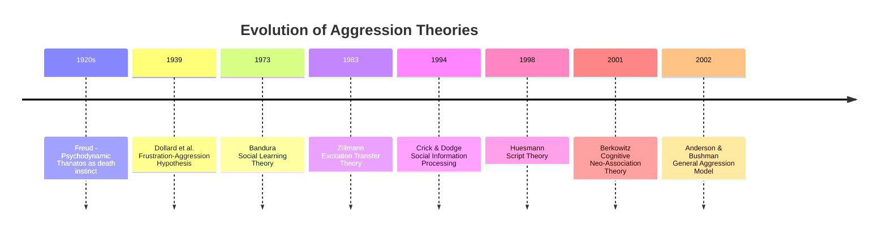
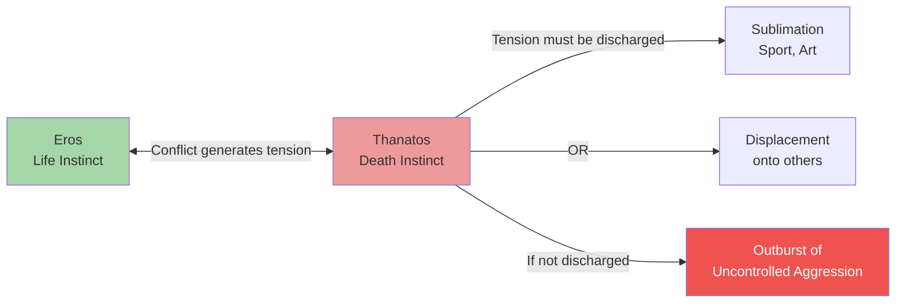
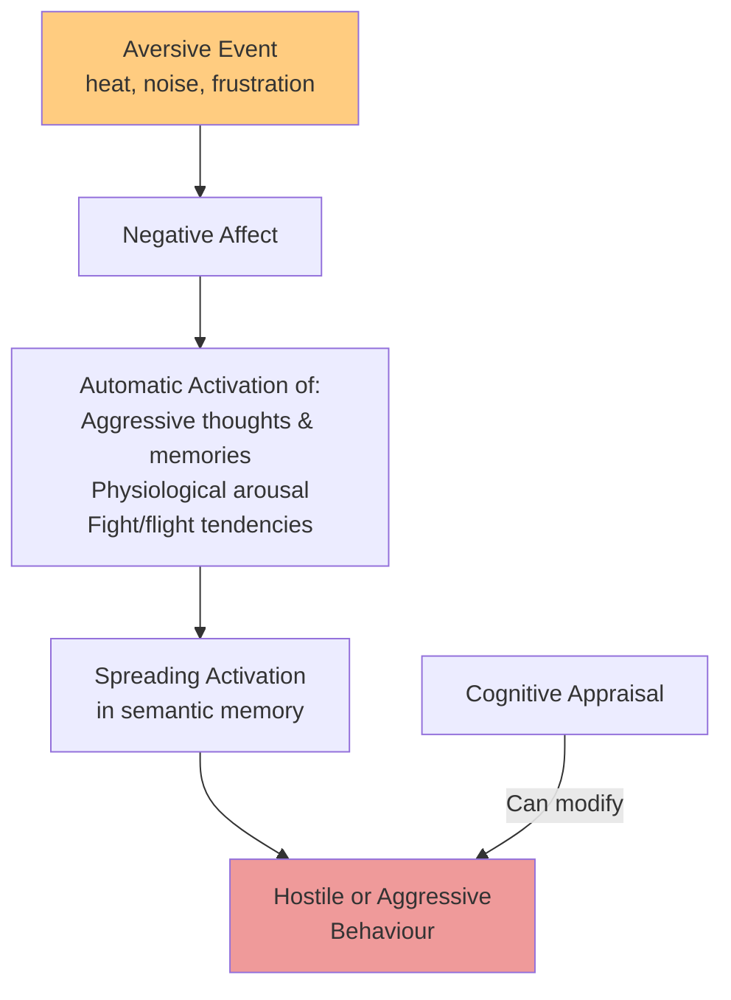
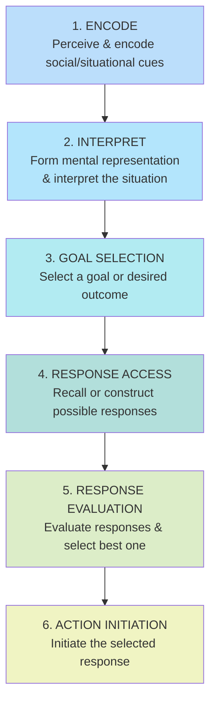
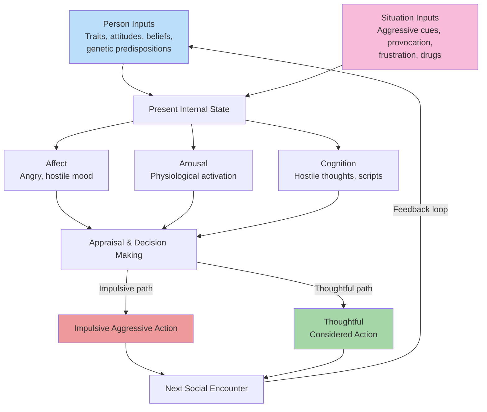

# Theories of Aggression

## Introduction

Why do humans aggress? Over the past century, theorists from diverse frameworks — psychoanalytic, behaviourist, cognitive, and neurobiological — have proposed competing and complementary accounts. No single theory captures the full complexity of aggression; each illuminates different aspects of this multi-determined behaviour. Understanding these theories is essential both for academic psychology and for designing effective interventions.

This unit covers **nine major theories** in sequence, progressing from older instinct-based accounts to modern integrated frameworks.

:::info Learning Objectives
- Explain Freud's psychodynamic theory of aggression (Eros vs. Thanatos)
- Describe the frustration-aggression hypothesis and its revisions
- Apply cognitive neo-association theory to explain aggression from aversive events
- Analyse social learning, script, and excitation transfer theories
- Understand social information processing in aggressive children
- Critically evaluate the General Aggression Model (GAM)
:::

---

## Overview: The Theoretical Landscape

---

## 4.5.1 Psychodynamic Theory (Freud)

Freud argued that all human beings possess two fundamental instincts in perpetual conflict:

- **Eros (Life Instinct)**: Drive toward life, love, creativity, and construction
- **Thanatos (Death Instinct)**: Drive toward death, destruction, and aggression

The conflict between these instincts creates **tension in the unconscious mind** that must be discharged. This discharge can occur through:

1. **Sublimation**: Channelling aggression into socially acceptable outlets (sport, competition, art)
2. **Displacement**: Redirecting aggression onto substitute targets (scapegoating)

Failure to relieve these aggressive impulses results in **outbursts of uncontrollable aggression**.

This model is also called the **Hydraulic Model** of aggression — aggression builds up like pressure in a hydraulic system and must be released. The concept of **catharsis** (releasing tension through aggressive outlets) flows from this model.

**Critical Evaluation**:
- ✅ Explains why aggression seems to arise without obvious external provocation
- ❌ Non-falsifiable — cannot be empirically tested
- ❌ Catharsis hypothesis has largely been **empirically disconfirmed** — watching or performing aggression often *increases* rather than decreases subsequent aggression

---

## 4.5.2 Frustration-Aggression Theory (Dollard et al., 1939)

This is essentially a **behaviourist approach** that treats aggression as a learned response to frustration.

**Core Claims** (Dollard, Doob, Miller, Mowrer, & Sears, 1939):
1. **Frustration always causes aggression**
2. **Aggression is always caused by frustration**

Frustration occurs when an individual encounters external stimuli that prevent goal attainment — prolonged queuing, overcrowding, or failure to achieve a goal. Frustration is **cumulative** — it builds until discharged via aggressive behaviour.

This is also called **Drive-Reduction Theory**: aggression reduces the built-up drive created by frustration.

### Berkowitz's Revision

Leonard Berkowitz revised the original hypothesis because the original "frustration → aggression" link is too absolute. His revision:

- Frustration creates a **readiness** for aggression but is not sufficient alone
- An **aggressive cue** (weapon, aggression-associated stimulus) must be present to trigger actual aggression
- This became the foundation for the **Cognitive Neo-Association Theory** (see below)

**Classic Example**: The "weapons effect" — people who see a gun nearby give more electric shocks to a confederate than those in a room without guns.

---

## 4.5.3 Cognitive Neo-Association Theory (Berkowitz, 1993)

Berkowitz's later theory is substantially more sophisticated than the original frustration-aggression hypothesis:

**Core Claim**: Aversive events (frustrations, provocations, loud noises, uncomfortable temperatures, unpleasant odours) produce **negative affect**, which automatically activates thoughts, memories, motor reactions, and physiological responses associated with **both fight and flight tendencies**.

**Spreading Activation Mechanism**: In memory, aggressive thoughts, emotions, and behavioural tendencies are **linked in semantic networks** (Collins & Loftus, 1975). When a concept is activated (primed), activation spreads to related concepts:
- "Hurt" → "harm" → "injury" → "pain"
- "Gun" → "shoot" → "kill" → "war"

This explains the **weapons effect**: merely seeing a weapon primes aggression-related concepts, increasing the likelihood of aggressive behaviour.

**Contributions**:
- Explains *why* aversive events increase aggression (via negative affect)
- Subsumes the earlier frustration-aggression hypothesis
- Particularly suited to explain **hostile aggression** and priming effects

---

## 4.5.4 Social Learning Theory (Bandura, 1973, 2001)

According to social learning theory, people acquire aggressive responses **the same way they acquire other complex social behaviours** — either through:

1. **Direct experience**: Being rewarded for aggressive behaviour (e.g., getting what you want after bullying)
2. **Observational learning (Modelling)**: Watching others be aggressive and be rewarded

**Bandura's Bobo Doll Studies** (classic): Children who observed adults aggressively hitting a Bobo doll were significantly more likely to imitate that aggression, especially when the aggressive model was rewarded.

**Patterson's Coercion Theory**: Patterson's work on family interactions and antisocial behaviour shows that:
- Children learn coercive interaction patterns at home
- These patterns are then transferred to peer and school settings

Social learning theory explains **acquisition** of aggressive behaviours but also explains the **cognitive beliefs and expectations** that guide social behaviour (scripts for when aggression is appropriate, expected consequences, etc.).

**Key Contributions**:
- Explains cultural transmission of aggression across generations
- Provides basis for understanding media violence effects
- Suggests modelling-based interventions (showing prosocial alternatives)

---

## 4.5.5 Script Theory (Huesmann, 1998)

Huesmann proposed that when children **observe violence in mass media**, they learn **aggressive scripts**.

**What is a Script?** A script is a cognitive schema that:
- Defines how a situation works
- Specifies the roles of participants
- Guides behaviour in that type of situation

**How Scripts Develop**:
1. Child observes violent media content
2. Aggression-relevant script is encoded in memory
3. Script may be retrieved later and used as a guide for behaviour
4. **Even a few rehearsals can change expectations and intentions**

Scripts become **unitary concepts in semantic memory** when their components are strongly associated — once activated, the whole script pattern is activated.

**Example**: A child repeatedly watching action heroes solve problems through violence develops a script: "When threatened → escalate → use force → win." This script may be retrieved in social conflicts.

**Relationship to Social Learning**: Script theory is a more specific, cognitively detailed account of how observational learning shapes aggressive behaviour patterns.

---

## 4.5.6 Excitation Transfer Theory (Zillmann, 1983)

**Core Insight**: Physiological arousal dissipates slowly. If two arousing events occur close together in time, **arousal from the first event can be misattributed to the second**.

**Mechanism**:
1. First arousing event (e.g., exercise, sexual excitement, fear)
2. Second event related to anger occurs *before* arousal fully dissipates
3. Residual arousal from Event 1 is **misattributed** to Event 2
4. The person feels *more* angry than they would otherwise

**Classic Example**: 
- Person exercises vigorously (high arousal)
- Shortly after, someone insults them
- The residual arousal from exercise is misattributed to the insult → *much stronger* anger and aggressive response than if insulted after being calm

**Practical Implications**:
- Explains why arguments in already-arousing contexts (traffic, sport, loud music) escalate more quickly
- People should be aware that physiological arousal from unrelated sources can amplify anger responses

---

## 4.5.7 Social Interaction Theory (Tedeschi & Felson, 1994)

This theory interprets aggressive behaviour as **social influence behaviour**: the actor uses coercive actions to produce change in the target's behaviour.

**Coercive actions can serve to**:
1. Obtain something of value (information, money, goods, sex, services, safety)
2. Exact retributive justice for perceived wrongs
3. Create desired social and self-identities (toughness, competence, dominance)

**Key Insight**: This theory explains findings that aggression often results from **threats to high self-esteem**, particularly **unwarranted high self-esteem (narcissism)** — when a narcissist's inflated self-image is challenged, coercive aggression is used to reassert dominance.

**Example**: Gang violence to defend "honour" or reputation — aggression as identity management.

---

## 4.5.8 Social Information Processing (SIP) Theories (Crick & Dodge, 1994)

Crick and Dodge developed an influential model explaining why some children become chronically aggressive through **distorted information processing in social situations**.

**The Six-Stage SIP Model**:

**How Aggressive Children Differ at Each Stage**:

| Stage | Aggressive Children's Pattern |
|-------|-------------------------------|
| **Encoding** | Focus more on aggression-relevant stimuli; remember more aggression-related details |
| **Interpretation** | **Hostile Attribution Bias**: Attribute hostile intent to others even in ambiguous situations |
| **Goal Selection** | More egocentric and antisocial goals; prioritise domination over relationship maintenance |
| **Response Access** | Generate more aggressive alternatives; repertoire dominated by aggressive, impulsive options |
| **Response Evaluation** | Short-term consequence estimation; expect aggression to be effective (self-efficacy for aggression) |
| **Action** | Initiate aggressive response |

**The Hostile Attribution Bias** is particularly important — aggressive children see the world through an aggression-tinted lens. When a peer accidentally bumps into them, they perceive it as deliberate hostility.

**Origin of Biased SIP**:
- Experiences of aggression, abuse, and inappropriate parenting in the family
- Media consumption reinforcing aggressive scripts
- Peer group experiences that reward aggressive schemas

**Intervention Implication**: SIP-based therapies target these cognitive distortions — teaching children to accurately interpret social cues and generate prosocial responses.

---

## 4.5.9 General Aggression Model (Anderson & Bushman, 2002)

The GAM is the most comprehensive current theory, integrating existing mini-theories into a unified whole based on **knowledge structures**.

**What are Knowledge Structures?**
Schemas arising from experience that:
- Influence perception
- Can become automated
- Are linked to affective states, beliefs, and behaviour
- Guide responses to the environment

Knowledge structures include:
- **Perceptual schemas**: What patterns you notice
- **Person schemas**: Expectations about types of people
- **Behavioural scripts**: What behaviours are appropriate in various situations

**The GAM Cycle**:
1. **Input**: Person characteristics (traits, history) + Situational factors (provocation, cues)
2. **Routes**: Affect, arousal, and cognition as internal state
3. **Appraisal**: Automatic or controlled processing
4. **Action**: Impulsive (automatic) or thoughtful (deliberate)
5. **Feedback**: Action shapes the next social encounter → cumulative effects on personality and behaviour

**Why GAM is Influential**: It explains why:
- Violent video games may increase aggression (by rehearsing aggressive scripts and desensitising affect)
- Context matters (person × situation interaction)
- Chronic aggressors develop stable aggressive knowledge structures over time

---

## Comparative Analysis: All Nine Theories

| Theory | Core Mechanism | Explains Best | Limitation |
|--------|----------------|---------------|------------|
| Psychodynamic | Death instinct; hydraulic tension | Spontaneous aggression | Non-falsifiable; catharsis disconfirmed |
| Frustration-Aggression | Frustration → aggression drive | Reactive, goal-blocked aggression | Too absolute; many frustrations don't cause aggression |
| Cognitive Neo-Association | Aversive events → negative affect → priming | Priming, weapons effect | Does not explain proactive aggression |
| Social Learning | Observation + reinforcement | Media violence, cultural transmission | Less biological grounding |
| Script Theory | Cognitive scripts learned from media | Media violence effects, habitual aggression | Mechanism of script retrieval unclear |
| Excitation Transfer | Residual arousal misattribution | Escalation in already-arousing contexts | Limited to short time windows |
| Social Interaction | Coercive influence seeking | Identity-based aggression, narcissism | Less developmental focus |
| SIP | Hostile attribution bias in processing | Childhood aggression, reactive aggression | Less applicable to proactive aggression |
| GAM | Integrated knowledge structures | Both reactive and proactive aggression | Very broad; hard to test all components |

---

## External Resources

### Wikipedia Articles
- [Frustration-Aggression Hypothesis](https://en.wikipedia.org/wiki/Frustration%E2%80%93aggression_hypothesis)
- [General Aggression Model](https://en.wikipedia.org/wiki/General_aggression_model)
- [Social Learning Theory](https://en.wikipedia.org/wiki/Social_learning_theory)
- [Social Information Processing](https://en.wikipedia.org/wiki/Social_information_processing_(theory))

### Educational Videos
- 🎥 [**Crash Course Psychology: Aggression Theories**](https://www.youtube.com/watch?v=e4eOEEpJl0c)
- 🎥 [**Bandura's Bobo Doll Experiment**](https://www.youtube.com/watch?v=pc5LrVMpWFg) — Classic social learning demonstration
- 🎥 [**General Aggression Model Explained**](https://www.youtube.com/watch?v=7kOZvQTBSks)

### Recent Research Papers (2020–2024)
- Anderson, C.A. et al. (2023). "The general aggression model: From its origins to its current status." *Annual Review of Psychology*, 74
- Greitemeyer, T. & Mügge, D.O. (2021). "Hostile attribution bias mediates the link between social exclusion and aggression." *Social Psychology*, 52(3)
- Wilkowski, B.M. & Robinson, M.D. (2022). "The anatomy of anger: An integrative cognitive model of trait anger and reactive aggression." *Journal of Personality*, 90(1)

---

## Memory Aids

### PF-CS-ESG Mnemonic (Theory Order)
- **P**sychodynamic (Freud)
- **F**rustration-Aggression (Dollard)
- **C**ognitive Neo-association (Berkowitz)
- **S**ocial Learning (Bandura)
- **S**cript Theory (Huesmann)
- **E**xcitation Transfer (Zillmann)
- **S**ocial Interaction (Tedeschi)
- **S**IP (Crick & Dodge)
- **G**AM (Anderson & Bushman)

### Key Researcher Quick Reference
- Freud → Thanatos/Eros/Hydraulic model
- Dollard → Frustration-always-causes-aggression
- Berkowitz → Cognitive priming; weapons effect; negative affect
- Bandura → Bobo doll; observational learning
- Huesmann → Scripts from media
- Zillmann → Residual arousal misattribution
- Tedeschi & Felson → Coercive social influence
- Crick & Dodge → Six-step SIP; hostile attribution bias
- Anderson & Bushman → GAM; integrated model

---

## Self-Assessment Questions

**Level 1 – Recall:**
1. What does Freud's "hydraulic model" of aggression mean?
2. What were the two absolute claims in the original frustration-aggression hypothesis (Dollard et al., 1939)?
3. Define "hostile attribution bias" as used in social information processing theory.

**Level 2 – Understanding:**
4. How does Berkowitz's cognitive neo-association theory *extend* the frustration-aggression hypothesis rather than replace it?
5. Explain how residual arousal from exercise could lead someone to react more aggressively to a minor insult (Excitation Transfer Theory).
6. Compare script theory and social learning theory. In what ways are they similar? Where do they differ?

**Level 3 – Application & Analysis:**
7. A teenager who grew up watching action movies repeatedly interprets peers' accidental jostling as deliberate provocation and responds violently. Which two theories best explain this pattern? Justify your analysis.
8. Using the General Aggression Model, trace how a person's genetic predisposition toward irritability, combined with provocation in a hot room, might lead to an impulsive aggressive act.
9. Critically evaluate the psychodynamic theory of aggression. What empirical evidence supports or challenges it?
10. A violent criminal claims they were provoked into the act. Using Social Interaction Theory, provide an alternative interpretation of their motivation.

---

**Source PDFs**:
- 📄 [Block-2/Unit-4.pdf — Pages 80–85](/pdfs/MPC-004%20Advanced%20Social%20Psychology/Block-2/Unit-4.pdf)
- 📚 MPC-004 Advanced Social Psychology
