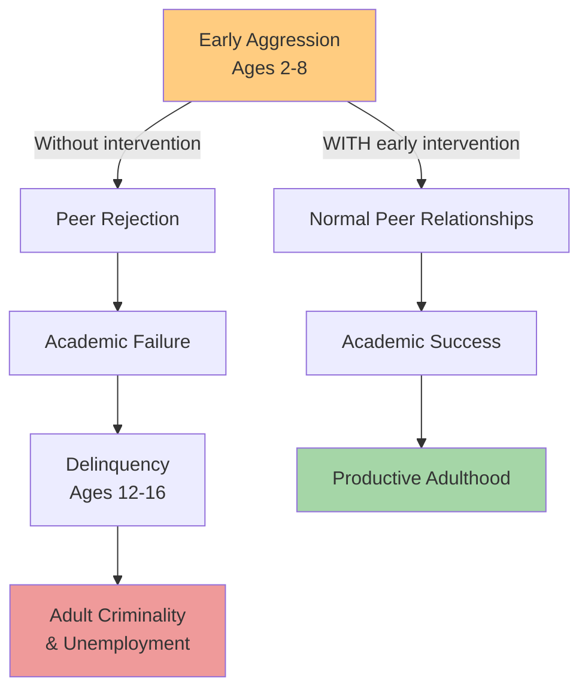
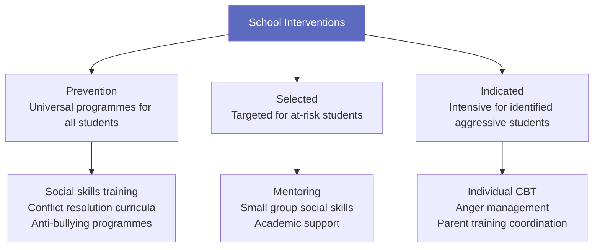

# Intervention to Reduce Aggression

## Introduction

Understanding the causes and theories of aggression leads naturally to the question: **How can we reduce it?** This section examines evidence-based interventions targeting the major modifiable risk factors identified in earlier sections. The overarching principle is clear: **treatment needs to be targeted at major modifiable risk factors**, its outcome measured objectively, and delivered **as early as possible**.

The rationale for early intervention is strong: conduct disorder can be reliably detected early, has high continuity if untreated, is **amenable to treatment at a young age**, and is **very hard to eradicate in older children and adults**.

:::info Learning Objectives
- Describe the rationale for early intervention in aggressive behaviour
- Evaluate parent training programmes (Patterson model, videotape-based)
- Explain management strategies for hyperactivity/ADHD
- Understand school-based prevention programmes
- Recognise the limitations of various approaches
:::

---

## Why Early Intervention Is Critical

Research across multiple studies converges on several key findings:

1. **Conduct disorder is detectable early** — aggressive behaviour patterns can be identified reliably in young children
2. **High continuity** — without intervention, aggressive patterns persist and escalate
3. **Age determines treatability** — teenage interventions show only small effects; childhood interventions are substantially more effective
4. **Cascading consequences** — early aggression leads to peer rejection, academic failure, delinquency, and unemployment if unaddressed

---

## What Does NOT Work (Evidence-Based Negatives)

Before examining what works, it is important to note what has **NOT been shown to be effective** in treating conduct disorder:

- **Individual psychotherapy** (psychodynamic or CBT-based) — little published evidence of effectiveness
- **Pharmacotherapy alone** — not effective for conduct disorder (although useful for ADHD)
- **General eclectic family work** — not consistently effective
- **Formal family therapy** — not consistently effective for conduct disorder

> ✅ **What DOES work**: **Behaviourally based programmes to help parents**. These have been *consistently* shown to be effective.

---

## 4.6.1 Parent Training Programmes

### The Patterson Model

The pioneering work by **Gerald Patterson and colleagues** at the Oregon Social Learning Center demonstrated that **directly instructing parents while they interact with their children** leads to:
- Significant and lasting reduction in behavioural problems
- Changes in the coercive parent-child interaction patterns identified as causal

**Core Principles (derived from coercion theory)**:
1. Identify and consistently reinforce prosocial behaviour (which is typically *ignored* in aggressive families)
2. Use consistent, non-harsh consequences for aggressive behaviour
3. Improve monitoring and supervision of the child's activities
4. Reduce parental disharmony and increase involvement

### Programme Requirements for Consistent Effectiveness

Research on parent training identifies essential elements:

| Feature | Requirement |
|---------|-------------|
| **Number of sessions** | At least **10 sessions** |
| **Booster sessions** | Desirable several months after initial programme |
| **Timing** | **Early intervention** — teenage programmes show only small effects |
| **Trainer qualifications** | Professionals trained in specific methods |
| **Standardisation** | Manual-based approach with a training centre |

---

## 4.6.2 Developing an Effective Programme

Effective programmes are **multi-disciplinary** — bringing together two or three disciplines (e.g., psychologist, social worker, paediatrician). Structure:

1. **Team formation**: Professionals from relevant disciplines
2. **Manual development**: Standardised curriculum ensures consistency
3. **Training centre**: Qualified trainers who have themselves been trained in the specific methods
4. **Minimum 10 sessions**: Sufficient for skills acquisition and consolidation
5. **Booster sessions**: Follow-up several months later to prevent drift
6. **Early delivery**: Childhood programmes far more effective than adolescent

---

## 4.6.3 Training Using Videotapes

A **cost-effective alternative** to individual one-to-one treatment, allowing larger numbers to be served:

### Format
- **10–14 parents** attend a weekly two-hour session for **12 weeks**
- Two therapists lead each group
- Videos show short vignettes of parents and children in common situations
- Videos demonstrate both "right" and "wrong" ways to handle children
- **Key learning**: The powerful effect of parents' behaviour on their child's activity

### Methods Used
- **Group discussion**: Therapists promote discussion so all members grasp principles
- **Role play**: Practice of new techniques
- **Practical homework**: Set each week
- **Trouble-shooting review**: Homework reviewed with problem-solving approach

### Effectiveness
This approach has been demonstrated to be effective in:
- Community samples
- Clinical populations
- Cross-cultural settings

The group format also reduces isolation and provides social support for parents who often feel stigmatised.

---

## 4.6.4 Other Training Programmes

**The Puckering Programme** (more intensive):
- **Format**: One full day per week for **16 weeks**
- **Target**: Quite severely damaged families
- **Outcome**: Effective in improving parenting in families with serious problems, enabling children to be removed from child protection "at risk" registers

This programme is particularly relevant for high-need families where less intensive approaches may be insufficient.

---

## 4.6.5 Failure of Parent Training

Parent training is not universally successful. The most common reasons for failure:

1. **Parental psychiatric difficulties**: Depression significantly impairs a parent's capacity to engage with and implement behavioural programmes
2. **Drug and alcohol problems**: Substance misuse undermines consistent parenting practices
3. **Personality difficulties**: Personality disorders in parents create instability that sabotages programme engagement

**Implication**: For families where parents have these additional difficulties, **parent mental health treatment must accompany** any parent training programme. Treating the child's aggression without addressing the parent's psychiatric difficulties is unlikely to succeed.

---

## 4.6.6 Management of Hyperactivity (ADHD)

Hyperactivity/ADHD is **distinct from conduct disorder** but the two frequently coexist, creating a particularly challenging clinical picture. Management requires modified approaches:

### Behavioural Management Adaptations

| Standard Conduct Disorder Approach | Modified ADHD Approach |
|------------------------------------|------------------------|
| Rewards given consistently | Rewards given **more frequently and contingently** |
| Long tasks | Tasks **broken down into shorter components** |
| General rules | **Specific, clear rules for each different situation** (ADHD children struggle to generalise) |
| Infrequent reward changes | Rewards **changed more often** to maintain novelty and motivation |

### School-Specific Challenges for ADHD
- Demands for concentration are high
- Distractions from other children are greater than at home
- Adult supervision is lower

Despite these challenges, applying the above behavioural principles in schools *can* lead to useful improvements.

### Pharmacological Management
**Medications used**: Methylphenidate (Ritalin) or dexamphetamine

**Reserved for**: Children with **severe symptoms in both home and school** settings (the hyperkinetic syndrome), which occurs in just over **1% of boys**

- Short-term effects of drug treatment are large
- Less is known about long-term benefits
- Medication is complementary to, not a replacement for, behavioural management

---

## 4.6.7 Interventions at Schools

Schools provide a critical setting for early prevention:

**Why Schools Are Important**:
- Children spend the majority of their waking hours in school
- Schools can intervene before problems become entrenched
- School programmes can reach entire populations, not just identified high-risk children

**Key Principle**: Early preventive educational programmes can **reduce later aggressive behaviour**.

### Types of School Interventions

**Evidence-Based School Programmes**:
1. **Social skills training**: Teaching children to interpret social cues accurately (directly targeting hostile attribution bias)
2. **Conflict resolution curricula**: Teaching prosocial problem-solving strategies
3. **Anti-bullying programmes**: Changing school climate to be less tolerant of aggression
4. **Mentoring programmes**: Providing positive adult role models

---

## Integrative Framework: Linking Causes to Interventions

| Causal Factor | Corresponding Intervention |
|--------------|---------------------------|
| Poor parental supervision | Parenting programme (monitoring skills) |
| Coercive interaction patterns | Patterson model (reinforcement of prosocial behaviour) |
| Hostile attribution bias | SIP-based therapy; social skills training |
| ADHD | Behavioural management + medication |
| Peer rejection | Social skills training; school-based programmes |
| Environmental stressors | Environmental design; resource provision |
| Media violence (scripts) | Media literacy education |

---

## Indian Context: Interventions in India

Several considerations are relevant for implementing these programmes in India:

- **Family structure**: Extended family systems in India can be resources or complications for parent training — grandparents and other family members may need to be included
- **Cultural norms**: Corporal punishment remains accepted in some communities; culturally sensitive approaches to shifting norms are needed
- **School-based**: CBSE and state board schools increasingly include life skills education components aligned with international evidence
- **Mental health stigma**: Parental psychiatric difficulties (depression, substance misuse) may be harder to acknowledge and treat in stigmatised contexts, limiting the reach of parent training
- **Low-income settings**: Community-based adaptations of parent training programmes are being developed and tested in urban and rural Indian settings

---

## External Resources

### Wikipedia Articles
- [Parent Management Training](https://en.wikipedia.org/wiki/Parent_management_training) — Patterson model and derivatives
- [Conduct Disorder](https://en.wikipedia.org/wiki/Conduct_disorder) — Diagnosis, prevalence, treatment
- [Applied Behaviour Analysis](https://en.wikipedia.org/wiki/Applied_behavior_analysis) — Foundation of behavioural parent training

### Educational Videos
- 🎥 [**Parent-Child Interaction Therapy (PCIT)**](https://www.youtube.com/watch?v=_2nkwjhPFOc) — Evidence-based programme demonstration
- 🎥 [**School-Based Aggression Prevention**](https://www.youtube.com/watch?v=HV7QjmpAoMo)
- 🎥 [**ADHD Management in Schools**](https://www.youtube.com/watch?v=NqFCOxHGCgQ)

### Recent Research Papers (2020–2024)
- Scott, S. & Dadds, M.R. (2021). "Practitioner Review: When parent training doesn't work — theory, practice, and beyond." *Journal of Child Psychology and Psychiatry*, 62(11)
- Frick, P.J. et al. (2022). "Effectiveness of early intervention for conduct disorder: A meta-analysis." *Clinical Psychology Review*, 89
- Webster-Stratton, C. (2023). "The Incredible Years programmes: Effectiveness and adaptations for diverse populations." *Journal of Clinical Child & Adolescent Psychology*, 52(1)

---

## Memory Aids

### PAVE — Requirements for Effective Parent Training
- **P** — Professional training in specific methods
- **A** — At least **10 sessions** (adequate dose)
- **V** — **V**ideotape-based or group-based for cost-effectiveness
- **E** — **E**arly intervention (before adolescence)

### FAIL — When Parent Training Fails
- **F** — Family disharmony unaddressed
- **A** — Alcohol/substance abuse in parents
- **I** — **I**llness (parental depression/psychiatric disorder)
- **L** — **L**ate intervention (adolescent stage)

---

## Self-Assessment Questions

**Level 1 – Recall:**
1. Why is individual psychotherapy (including CBT) generally considered insufficient for conduct disorder?
2. What minimum number of sessions is recommended for effective parent training programmes?
3. What medications are used for hyperkinetic syndrome and when are they indicated?

**Level 2 – Understanding:**
4. Explain the Patterson model: how does directly instructing parents during their child interactions reduce aggression?
5. Why do videotape-based group parent training programmes represent an advancement over individual one-to-one treatment? What are their advantages and limitations?
6. Why are school interventions important for reducing aggression, and what levels of intervention (prevention, selected, indicated) can schools implement?

**Level 3 – Application & Analysis:**
7. A 9-year-old boy has been referred for conduct disorder. His mother has depression and his father drinks heavily. Design a comprehensive intervention plan, explaining why each component is necessary.
8. A parent training programme in an urban Indian setting fails to reduce aggression in participants. List and explain four factors that might account for this failure.
9. Compare universal school prevention programmes with indicated intensive interventions. When would you choose each approach, and what are the trade-offs in terms of cost, effectiveness, and reach?

---

**Source PDFs**:
- 📄 [Block-2/Unit-4.pdf — Pages 85–87](/pdfs/MPC-004%20Advanced%20Social%20Psychology/Block-2/Unit-4.pdf)
- 📚 MPC-004 Advanced Social Psychology
