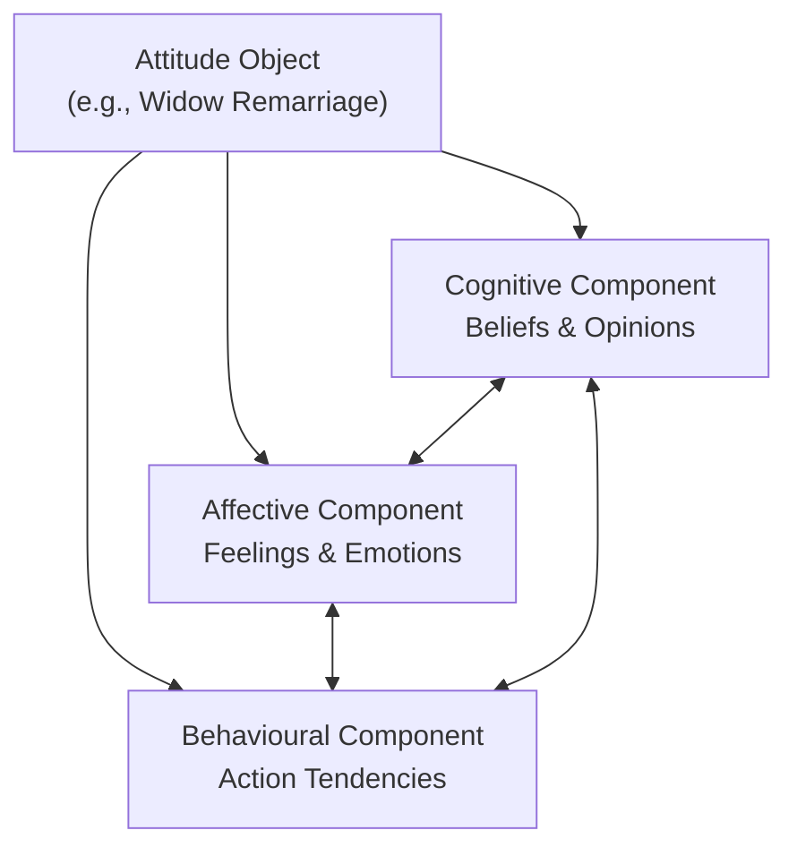
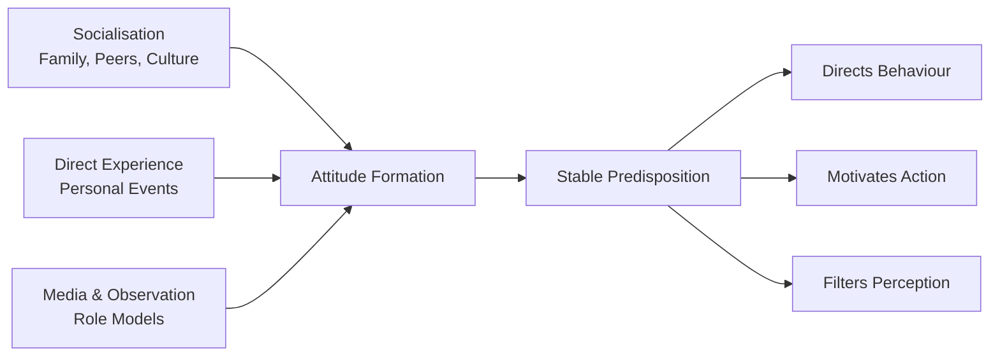

import Tabs from '@theme/Tabs';
import TabItem from '@theme/TabItem';

# Nature of Attitudes: Components, Characteristics, and Attitude-Belief Distinction

Attitude is among the most frequently studied concepts in social psychology. Every day, we express attitudes—toward people, events, policies, and objects. Understanding what attitudes are, how they are structured, and how they differ from related concepts like beliefs is foundational to social psychology.

---

**Source PDFs**:
- 📄 [Block-3/Unit-1.pdf - Pages 5–8](/pdfs/MPC-004%20Advanced%20Social%20Psychology/Block-3/Unit-1.pdf)
- 📚 MPC-004 Advanced Social Psychology

---

## What Is an Attitude?

Attitudes were originally defined as **one-dimensional**: a learned predisposition to respond in a consistently favourable or unfavourable manner toward a given object. The core was the intensity of feelings about something.

As research progressed, psychologists recognised that attitudes are more complex. Today the **tricomponent (ABC) model** is the most widely accepted framework:

| Component | Meaning | Example (Widow Remarriage) |
|-----------|---------|---------------------------|
| **A – Affective** | Emotional feeling for/against | Feeling strongly in favour of widow's right to remarry |
| **B – Behavioural** | Action tendency | Organising awareness meetings, marrying a widow |
| **C – Cognitive** | Beliefs and opinions | Believing that widow remarriage reduces loneliness and poverty |

:::info The ABC of Attitude
The three components are interlinked: what you believe (C) shapes how you feel (A), which drives what you do (B). A change in any one component can ripple through the others.
:::

---

## Properties of Attitude Components

### Valence
**Valence** refers to the degree of favourableness or unfavourableness toward an attitude object. Valence can range from extremely positive to extremely negative. A person might have very high positive valence toward free education but low negative valence toward military service.

### Multiplexity
**Multiplexity** refers to the number of elements within each component. An attitude component with many sub-elements is more complex. For example, a doctor's cognitive component about vaccination will be far more multiplex (containing knowledge of efficacy rates, side effects, immunology, public health data) than a layperson's. Higher multiplexity generally means greater knowledge but also greater potential for internal conflict.

### Consistency
**Consistency** means the degree of alignment among attitude components. Attitudinal consistency is found more among valence factors than among multiplexity factors. For instance, a person may believe education is important (C), feel proud sending children to school (A), and regularly pay school fees (B)—a highly consistent attitude cluster.

---

## Characteristics of Attitudes

### 1. Attitudes Are Learned
People are not born with attitudes; they develop them through **socialisation** and **personal experience**. Exposure to family, peer groups, culture, and media shapes attitudes over a lifetime. A child raised in an environment that values environmental conservation will likely develop favourable attitudes toward recycling.

### 2. Attitudes Give Direction
Attitudes **orient behaviour** either toward or away from an object. A positive attitude toward physical fitness will direct a person to exercise regularly; a negative attitude toward fast food will drive them away from it. This directional property makes attitudes closely linked to motivation and decision-making.

### 3. Relative Permanence
Attitudes are **relatively stable** over time. While they can change, the process is typically gradual and requires significant new experience, persuasion, or cognitive dissonance. This stability is why attitude change is a major topic in applied social psychology, especially in health behaviour, advertising, and political communication.

### 4. Attitudes Are Always Object-Directed
Attitudes do not exist in a vacuum; they are always **directed at something**: a person, group, issue, policy, product, or event. A person cannot simply have an attitude "in general"—it is always *about* something.

### 5. Motivational Properties
Attitudes have **motivational force**—they energise and direct behaviour. A strong positive attitude toward music will motivate more practice sessions; a strong negative attitude toward smoking will motivate avoidance and support for anti-smoking policies.

---

## Attitude vs. Belief: Key Distinctions

Attitudes and beliefs are closely related but importantly different. A **belief** is "an enduring organisation of perceptions and cognitions about some aspect of the individual's world." Beliefs are primarily cognitive—they represent what we think is true about an object.

| Dimension | Attitude | Belief |
|-----------|---------|--------|
| **Components** | Cognitive + Affective + Behavioural | Primarily Cognitive, secondary Behavioural |
| **Emotional Charge** | Has strong affective component | May have weak or no emotional charge |
| **Motivational Force** | Actively directs behaviour | Does not necessarily motivate action |
| **Basis** | More imagined/experiential | Based more on perceived facts |
| **Changeability** | Faster to change | More resistant to change |
| **Relationship** | Broader, encompasses beliefs | Part of attitude structure |

**Example**: A person may *believe* that reservation policies in public sector jobs are against meritocracy (cognitive-only—a belief). However, they may not feel strongly about it (no strong affect) and may not act on it (no behavioural component). This remains a belief. If they develop strong anger about it (affective) and begin writing articles or joining protests (behavioural), it has become a full attitude.

:::tip Memory Aid: BELIEF vs ATTITUDE
**B**elief = **B**rain only (cognitive)  
**A**ttitude = **A**BC (Affective + Behavioural + Cognitive)

Think: "BELIEF is just a thought; ATTITUDE is a thought, feeling, and action plan."
:::

---

## How Are Attitudes Formed?

While the PDF focuses on the nature and structure of attitudes, attitude formation draws on several processes:

**Classical Conditioning**: Repeated association of an attitude object with positive or negative stimuli forms evaluative associations. Advertisements systematically pair products with beautiful imagery, music, or celebrities to build positive attitudes.

**Operant Conditioning**: Attitudes that lead to rewards are reinforced; those leading to punishment are weakened. Parents who praise children for expressing certain views shape attitude formation.

**Observational Learning**: We adopt attitudes by observing respected models—parents, teachers, celebrities. This is particularly powerful during childhood.

**Direct Experience**: Personal encounters with attitude objects create strong, often longer-lasting attitudes than second-hand information. Direct experience of discrimination, for instance, creates much more powerful negative attitudes toward injustice than reading about it.

**Social Comparison**: We compare our attitudes with those of reference groups. Finding that our attitudes differ from those of valued peers creates pressure to conform, reshaping attitudes over time.

---

## Contemporary Research: Implicit vs. Explicit Attitudes

Modern social psychology distinguishes between:

**Explicit Attitudes**: Consciously held, verbally reported attitudes. These are what most classic research has measured.

**Implicit Attitudes**: Automatically activated evaluations that operate below conscious awareness. Measured using the **Implicit Association Test (IAT)** developed by Greenwald and colleagues, implicit attitudes can differ dramatically from explicit attitudes.

Research shows that implicit attitudes often predict spontaneous behaviour better than explicit attitudes, while explicit attitudes better predict deliberate, planned behaviour (Fazio & Olson, 2003). This dual-process understanding has transformed attitude research in the 21st century.

A landmark study by Nosek et al. (2007) involving over 2.5 million participants found that implicit racial biases were widespread even among people who explicitly endorsed racial equality—highlighting the importance of studying both layers of attitude.

---

## Real-World Applications: Attitude Change in Public Health

Understanding attitude structure is crucial for public health interventions. Research on COVID-19 vaccine hesitancy illustrates this:

- **Cognitive target**: Providing clear, accurate information about vaccine safety (targeting beliefs)
- **Affective target**: Reducing fear and anxiety through narrative stories of people who benefited (targeting emotions)
- **Behavioural target**: Making vaccination convenient, visible, and socially normative (targeting behaviour through environmental design)

A major 2021 meta-analysis by Freeman et al. (*Nature Medicine*) found that interventions targeting all three components simultaneously were far more effective at increasing vaccination rates than those targeting only knowledge—validating the tricomponent model of attitude.

---

## Indian Cultural Context

In India, attitudes often develop within a **collectivist framework** where group identity, caste, religion, and family loyalty play central roles in attitude formation. Key features:

- **Caste-based attitudes**: Research consistently shows that caste-based stereotypes remain powerful determinants of inter-group attitudes, even among educated urban populations (Deshpande & Spilimbergo, 2009)
- **Religiosity and attitude**: Studies indicate that religious identity shapes attitudes toward inter-faith marriage, gender roles, and political affiliations in distinctive ways compared to Western samples
- **Media influence**: With 600+ million social media users, online content increasingly shapes attitude formation, particularly among younger Indians, sometimes amplifying pre-existing group-based attitudes

Understanding Indian students' own attitudinal formation—often a blend of traditional collectivist norms and modern individualistic influences—is important for applying these concepts to lived experience.

---

## External Resources

### 📚 Wikipedia
- [Attitude (psychology)](https://en.wikipedia.org/wiki/Attitude_(psychology)) – Comprehensive overview of attitude definitions and research
- [Tricomponent model](https://en.wikipedia.org/wiki/Attitude_(psychology)#Components_of_attitude) – ABC structure of attitudes
- [Implicit-association test](https://en.wikipedia.org/wiki/Implicit-association_test) – Tool for measuring implicit attitudes

### 🎬 Educational Videos
- [Attitudes and Attitude Change – Crash Course Psychology](https://www.youtube.com/watch?v=xYozu6KBWP0) – 12 minutes, covers formation and change
- [What Are Attitudes? – Simply Psychology](https://www.youtube.com/watch?v=E3YeIakIYhg) – Accessible introduction to tricomponent model

### 🔬 Recent Research (2020–2024)
- Howe, L.C., & Krosnick, J.A. (2017). Attitude strength. *Annual Review of Psychology*, 68, 327–351 – Foundation paper on what makes attitudes strong or weak
- Maio, G.R., et al. (2022). Attitude change. *Annual Review of Psychology*, 73, 313–343 – Comprehensive update on mechanisms of attitude change
- Haddock, G., & Maio, G.R. (2023). *The Psychology of Attitudes and Attitude Change* (4th ed.). Sage – Authoritative text summarising modern research

---

## Self-Assessment Questions

<Tabs>
  <TabItem value="recall" label="🔵 Recall">

1. Define attitude. How did its definition evolve from one-dimensional to tricomponent?
2. What are the three components of the ABC model? Give an example for each component in relation to environmental conservation.
3. List five characteristics of attitudes described in the IGNOU unit.
4. Define valence, multiplexity, and consistency as properties of attitude components.
5. What is the key difference between attitude and belief in terms of components?

  </TabItem>
  <TabItem value="understanding" label="🟡 Understanding">

6. Why is the behavioural component sometimes described as an "action tendency" rather than an actual behaviour? Explain with an example.
7. Explain how the three components of attitude can be inconsistent with each other, and what psychological consequences this inconsistency creates.
8. A person explicitly states they value gender equality but unconsciously gives higher performance ratings to male employees. How does the implicit/explicit attitude distinction explain this discrepancy?
9. Why might a belief about climate change not automatically translate into pro-environmental behaviour? What additional attitude components are needed?

  </TabItem>
  <TabItem value="application" label="🔴 Application">

10. Design a public health campaign to change attitudes toward mental health help-seeking in India. Which components of the tricomponent model would you target and how?
11. A teacher notices that students from rural backgrounds have negative attitudes toward STEM careers. Using your knowledge of attitude formation processes, identify three specific interventions the school could implement.
12. How do social media algorithms affect attitude formation and change? Apply your understanding of attitude characteristics (especially relative permanence and motivational properties) to analyse the phenomenon of online "echo chambers."

  </TabItem>
</Tabs>

---

## Summary

Attitudes are learned, object-directed predispositions that have affective, cognitive, and behavioural components (the ABC model). They are characterised by valence, multiplexity, consistency, relative permanence, and motivational force. Importantly, attitudes differ from beliefs: beliefs are primarily cognitive, while attitudes incorporate emotional charge and action tendencies. Modern research has extended attitude theory to include implicit attitudes—automatically activated evaluations that influence spontaneous behaviour independently of consciously held positions. Understanding attitude structure is foundational to applied work in health psychology, organisational psychology, and social change.

---

*Cross-references: [Theories of Attitude Organisation](/mpc-004/block-3/theories-attitude-organisation) | [Stereotypes and Prejudice](/mpc-004/block-3/stereotypes-prejudice-discrimination) | [Social Influence and Conformity](/mpc-004/block-2/concept-social-influence-theories)*
