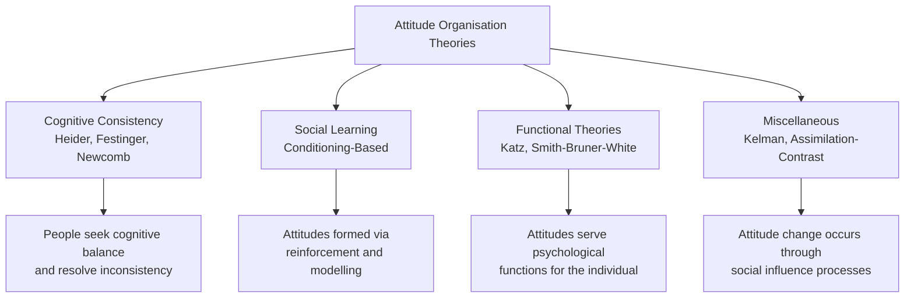
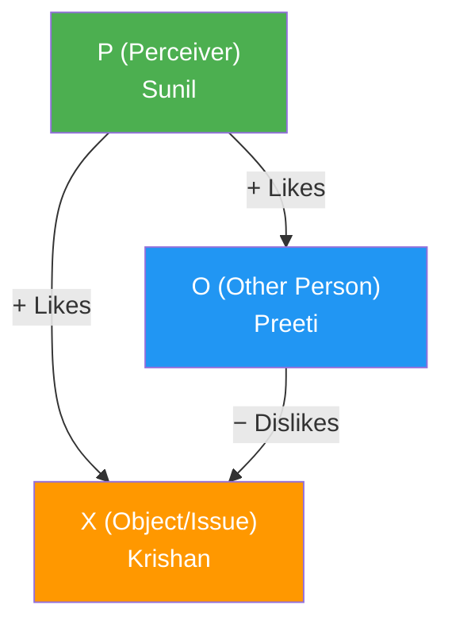
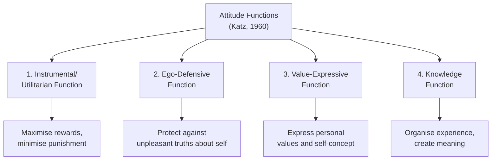
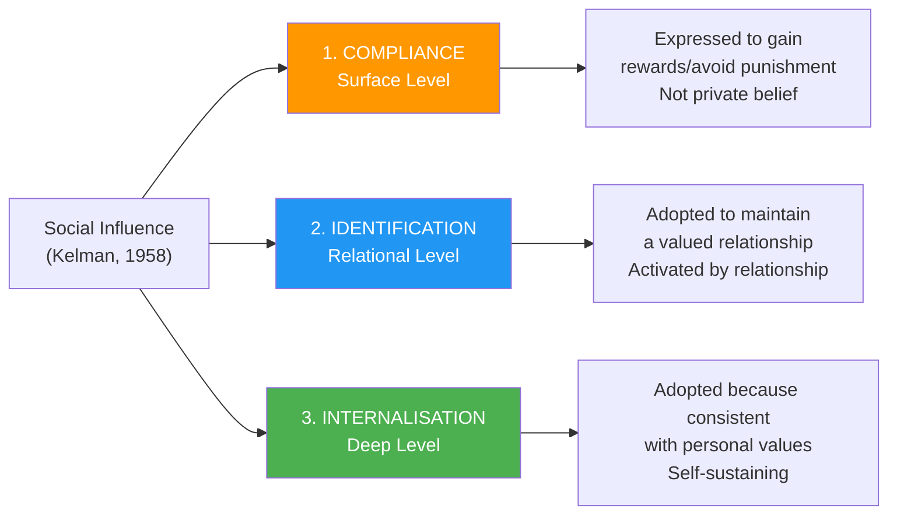

import Tabs from '@theme/Tabs';
import TabItem from '@theme/TabItem';

# Theories of Attitude Organisation: Heider, Katz, and Kelman

How are attitudes organised in the mind? Why do people maintain consistent attitude clusters, and what happens when attitudes conflict? Social psychologists have proposed numerous theoretical frameworks to answer these questions. This unit covers four major categories of attitude organisation theories, with deep coverage of Heider's Balance Theory, Katz's Functional Theory, and Kelman's Three Process Theory—all high-exam-importance topics.

---

**Source PDFs**:
- 📄 [Block-3/Unit-1.pdf - Pages 8–11](/pdfs/MPC-004%20Advanced%20Social%20Psychology/Block-3/Unit-1.pdf)
- 📚 MPC-004 Advanced Social Psychology

---

## Overview: Four Categories of Attitude Organisation Theories

The IGNOU unit classifies attitude organisation theories into four families:

| Category | Key Theories |
|----------|-------------|
| **1. Cognitive Consistency Theories** | Heider's Balance Theory, Newcomb's A-B-X Theory, Festinger's Cognitive Dissonance, Rosenberg's Affective-Cognitive Consistency, Congruity Theory |
| **2. Social Learning Theories** | Classical Conditioning-based Theory, Instrumental Conditioning-based Theory |
| **3. Functional Theories** | Katz & Stotland Theory, Smith, Bruner & White Theory |
| **4. Miscellaneous Theories** | Kelman's Three Process Theory, Assimilation-Contrast Theory, Adaptation Level Theory |

The fundamental question each theory addresses: *Why do attitudes cohere into organised systems, and what forces maintain or disrupt that organisation?*

---

## 1. Cognitive Consistency Theories

### The Core Principle
Cognitive consistency theories share a foundational assumption: **people are motivated to maintain consistency among their cognitive elements** (beliefs, attitudes, perceptions). Inconsistency creates psychological tension or discomfort, which motivates attitude change to restore balance.

### Heider's Balance Theory (P-O-X Model)

Fritz Heider (1946, 1958) proposed one of the earliest and most elegant cognitive consistency theories. The model involves three elements forming a **triad**:

- **P** = the **Perceiver** (the person holding the attitude)
- **O** = another **Other** person
- **X** = an **Object** or issue (can be a person, idea, or thing)

Relationships between any pair of elements can be:
- **Positive (+)**: liking, agreement, association
- **Negative (−)**: disliking, disagreement, disassociation

**Balanced State**: A triad is balanced when the product of the three signs is **positive**. Balanced triads feel comfortable and require no change.

**Imbalanced State**: When the product is **negative**, the triad is imbalanced—the person experiences psychological tension and is motivated to restore balance by changing one of the relationships.

#### Worked Example from IGNOU
- Sunil (+) likes Krishan
- Sunil (+) likes Preeti
- Krishan (−) dislikes Preeti

Product: (+)(+)(−) = **Negative** → **IMBALANCED**

Sunil feels uncomfortable. To restore balance, he has three options:
1. Start disliking Krishan → (+)(−)(−) = positive ✅ balanced
2. Start disliking Preeti → (−)(+)(−) = positive ✅ balanced
3. Convince Krishan to like Preeti → (+)(+)(+) = positive ✅ balanced

:::info Key Insight
Balance theory predicts that when we discover our friend dislikes someone we like, we are pressured to either change our attitude toward our friend, toward that person, or to try to broker a reconciliation. This explains many social dynamics in friendship groups.
:::

#### Triads: Balanced vs. Imbalanced

| Triad (P-O, P-X, O-X) | Product | State |
|-----------------------|---------|-------|
| (+)(+)(+) | + | ✅ Balanced |
| (+)(+)(−) | − | ❌ Imbalanced |
| (+)(−)(+) | − | ❌ Imbalanced |
| (−)(+)(+) | − | ❌ Imbalanced |
| (−)(−)(+) | + | ✅ Balanced |
| (−)(+)(−) | + | ✅ Balanced |
| (+)(−)(−) | + | ✅ Balanced |
| (−)(−)(−) | − | ❌ Imbalanced |

**Mnemonic**: *"An odd number of minus signs = Imbalanced"*

#### Critical Evaluation of Heider's Balance Theory

**Strengths:**
- Simple and elegant mathematical formulation
- Explains real-world social dynamics (why friends of friends often become friends—triadic closure)
- Empirically supported in many laboratory studies

**Limitations:**
- Ignores the *strength* of relationships (a mild dislike is treated the same as intense hatred)
- Cannot account for ambivalent attitudes (both positive and negative feelings)
- Does not specify *which* element will change when imbalance occurs
- Overly focused on triadic relationships; real social networks are far more complex

---

## 2. Katz's Functional Theory

Daniel Katz (1960), building on Katz & Stotland (1959), proposed a radically different question: not *how* attitudes are organised, but *why* people hold attitudes at all. His answer: **attitudes serve psychological functions for the individual**.

This approach explains why **attitude change is so difficult**—if an attitude serves an important function, simply providing contrary information will not change it because the person has a psychological *need* to hold that attitude.

### The Four Functions of Attitudes

#### Function 1: Instrumental (Adjustive/Utilitarian) Function
Individuals develop **favourable attitudes toward objects that reward them** and unfavourable attitudes toward objects that punish them. This is essentially attitudinal adaptation for maximising positive outcomes.

*Example*: A worker develops a positive attitude toward their union because the union secured higher wages. The attitude is "instrumental" in achieving a concrete benefit.

*Attitude Change Strategy*: To change an instrumentally-held attitude, change the reward structure. Show the person that the attitude object no longer serves their interests, or that an alternative does.

#### Function 2: Ego-Defensive Function
Attitudes can protect a person from **acknowledging unpleasant realities about themselves or the world**. This function draws on Freudian defence mechanisms—projection, denial, displacement—and explains why some attitudes are highly resistant to logical argument.

*Example*: A person with deep insecurity about their own intelligence may develop strong prejudice against educated people, dismissing intellectuals as "out of touch elites." This attitude protects the ego from confronting feelings of inadequacy.

*Example from IGNOU*: A person with low self-esteem may develop strong prejudice against minority groups to compensate for feelings of insecurity.

*Attitude Change Strategy*: Ego-defensive attitudes cannot be changed through logical argument alone. Therapy or self-insight approaches that address the underlying insecurity are needed.

#### Function 3: Value-Expressive Function
Holding attitudes **consistent with one's personal values and self-concept** provides deep satisfaction and a sense of identity. These attitudes are central to "who I am."

*Example*: A person who deeply values environmental sustainability holds strong pro-environmental attitudes. These attitudes express identity, not just calculation of reward. Challenging these attitudes feels like an attack on the self.

*Example*: Religious attitudes often serve a value-expressive function, expressing one's deepest commitments and identity.

*Attitude Change Strategy*: Show the person that the attitude actually *conflicts* with their deeper values, or that an alternative attitude better expresses those values.

#### Function 4: Knowledge Function
Humans have a **basic drive to understand and structure their experience**. Attitudes provide stable cognitive frameworks (schemas) that help interpret new information, reducing cognitive complexity.

*Example*: A general attitude that "politicians are self-serving" serves a knowledge function—it provides a ready schema for interpreting political news without having to evaluate each politician from scratch.

*Example*: Gender stereotypes, while often inaccurate, reduce the cognitive work of treating each person as fully unique.

*Attitude Change Strategy*: Provide new information that clearly demonstrates the old attitude fails to make sense of current experience. Help the person build a more accurate and useful schema.

### Summary Table: Katz's Functional Theory

| Function | Core Question | Example | Change Strategy |
|----------|--------------|---------|----------------|
| Instrumental | "What do I gain?" | Pro-union because of wage gains | Change incentive structure |
| Ego-Defensive | "What threatens me?" | Prejudice born of insecurity | Address underlying insecurity |
| Value-Expressive | "Who am I?" | Environmental attitudes express identity | Link change to core values |
| Knowledge | "How do I understand the world?" | Political cynicism as general schema | Provide better organising framework |

:::tip Exam Tip
The IGNOU exam frequently asks to "Discuss Katz's Functional Theory." Structure your answer around the four functions with clear examples for each. Remember: the theory's key insight is that attitudes serve needs—change requires addressing those needs, not just providing new information.
:::

---

## 3. Kelman's Three Process Theory

Herbert Kelman (1958, 1961) proposed that attitude change through social influence occurs via three distinct processes that differ in depth of internalisation and conditions of attitude expression.

### The Three Processes

### Process 1: Compliance
Compliance occurs when an individual **publicly accepts influence** from another person or group **to obtain a reward or avoid punishment**, but does *not* privately change their belief.

The attitude is expressed only when the influencing agent is present or surveillance is likely. Attitude is maintained only as long as the reward/punishment contingency persists.

*Classic Example from IGNOU*: An employee laughs heartily at the boss's jokes—even finding them unfunny—to avoid the boss's displeasure. The moment the boss is not present, the employee's private attitude (finding the jokes dull) reasserts itself.

*Other Examples*:
- A student agrees with a teacher's political opinion in class to avoid conflict, privately disagreeing
- A new employee follows the dress code not because they value it but to avoid criticism
- A smoker agrees with anti-smoking messages when a health worker is present but continues smoking privately

*Durability*: **Low**—attitude expression stops when the surveillant is absent.

### Process 2: Identification
Identification occurs when an individual **adopts attitudes or behaviours derived from another person or group because the relationship is satisfying and self-defining**.

The attitude is maintained as long as the valued relationship continues. Unlike compliance, the person genuinely holds the attitude *while* identified with the other, but it is maintained by the relationship, not intrinsic value.

*Examples*:
- A child adopts the political attitudes of an admired parent—not because of logical argument, but to be like the parent and maintain that relationship
- A university student adopts the values of a respected professor, genuinely holding them while that relationship is active
- Fans of celebrities sometimes adopt their views on social issues purely through identification

*Classic Example*: Children copying the behaviour and attitudes of parents or role models. As the IGNOU unit notes, identification "does not occur because the behaviour or attitude itself is satisfying—it occurs because of the satisfying relation to another person."

*Durability*: **Moderate**—maintained as long as the relationship is valued and activated.

### Process 3: Internalisation
Internalisation occurs when an individual **accepts influence because the induced attitude is congruent with their existing value system**. The attitude is intrinsically rewarding—it helps the person feel consistent, moral, and coherent.

The attitude is maintained regardless of the influencing agent's presence. It is self-sustaining and becomes part of the person's identity.

*Examples*:
- A person becomes genuinely pro-environmental because conservation aligns with their deep values about responsibility to future generations
- A student develops genuine intellectual curiosity after an inspiring teacher, which persists long after the teacher-student relationship ends
- Deeply held moral attitudes (against corruption, toward honesty) are internalised values that require no external enforcement

*Durability*: **High**—attitude is maintained regardless of context because it satisfies internal needs for consistency and value expression.

### Comparative Summary: Kelman's Three Processes

| Dimension | Compliance | Identification | Internalisation |
|-----------|-----------|---------------|-----------------|
| **Why adopted?** | Reward/punishment | Valued relationship | Value consistency |
| **When expressed?** | When surveilant present | When relationship activated | Always |
| **Private belief?** | No | Yes (while related) | Yes |
| **Durability** | Low | Moderate | High |
| **Depth of change** | Surface | Relational | Core |

:::info Real-World Application
Kelman's theory has profound implications for **attitude change programs**. Compliance-based approaches (rewards, punishments) produce only surface-level and temporary change. Identification approaches require ongoing valued relationships. Only internalisation produces lasting, self-sustaining attitude change—which is why the most effective educational and therapeutic approaches focus on connecting new attitudes to people's core values.
:::

---

## Integrating the Three Theories

These three theories offer complementary perspectives:

- **Heider** focuses on *cognitive structure*—how attitudes in a system must be balanced for the system to be stable
- **Katz** focuses on *motivation*—why people hold the attitudes they do, and what functions those attitudes serve
- **Kelman** focuses on *social influence*—how external social processes lead to attitude organisation and change

Together they explain that attitude organisation is simultaneously a cognitive, motivational, and social phenomenon. A complete understanding of any person's attitudes requires examining all three dimensions.

---

## Contemporary Research Context

### Elaboration Likelihood Model (Petty & Cacioppo, 1986)
One of the most influential modern attitude theories, the ELM distinguishes between **central route** (careful, effortful processing of strong arguments → deep, lasting attitude change) and **peripheral route** (heuristic, low-effort processing based on superficial cues → shallow, temporary change). This maps loosely onto Kelman's internalisation (central route) vs. compliance (peripheral route).

### Cognitive Dissonance (Festinger, 1957)
Leon Festinger's theory—one of the most researched in social psychology—proposes that inconsistency between attitudes and behaviour (or between two attitudes) creates psychological discomfort that motivates attitude change. A 2019 meta-analysis by van Veen et al. confirmed that cognitive dissonance reliably activates anterior cingulate cortex—a brain region associated with conflict monitoring—supporting the neurological reality of the dissonance experience.

### Modern Extensions of Functional Theory
Recent work has extended Katz's functional theory to include **social-adjustive functions** (holding attitudes to fit in with reference groups) and **self-esteem functions** (holding attitudes that make us feel good about ourselves). Maio & Olson (2000) provide a comprehensive modern review.

---

## Indian Context: Attitude Organisation in a Collectivist Culture

In India's predominantly collectivist social context, Kelman's **identification** process plays an especially prominent role. Attitudes adopted through identification with caste, religious, and family groups are extremely common. The challenge for social change programmes is that these identification-based attitudes—toward caste hierarchies, gender roles, or inter-faith relations—are genuinely held (not mere compliance) but may crumble when the group context changes or when people are exposed to different reference groups through education or urbanisation.

Research on attitude change in Indian society suggests that **identification with respected local leaders** (Gandhian community leaders, progressive religious authorities, local heroes) is often more effective at producing attitude change than information campaigns that address only the knowledge function.

---

## External Resources

### 📚 Wikipedia
- [Heider's balance theory](https://en.wikipedia.org/wiki/Consistency_theory#Heider.27s_balance_theory) – Formal explanation with examples
- [Katz's functional theory of attitudes](https://en.wikipedia.org/wiki/Functional_attitude_theory) – Overview of the four functions
- [Cognitive dissonance](https://en.wikipedia.org/wiki/Cognitive_dissonance) – Related cognitive consistency theory
- [Elaboration likelihood model](https://en.wikipedia.org/wiki/Elaboration_likelihood_model) – Modern extension of attitude change theory

### 🎬 Educational Videos
- [Cognitive Dissonance – Crash Course Psychology](https://www.youtube.com/watch?v=NP0aJSQ08-U) – Covers consistency theories accessibly
- [Attitude Change and Persuasion – Khan Academy](https://www.youtube.com/watch?v=T1MJP6-jGUU) – Overview including functional approaches

### 🔬 Recent Research (2020–2024)
- Maio, G.R., & Olson, J.M. (2022). Attitude functions: Towards a functional theory of attitudes. *Annual Review of Psychology*, 73, 313–343
- Briñol, P., & Petty, R.E. (2022). Self-validation of thoughts and the process of attitude change. *Social Psychology*, 53(2), 69–81
- Smith, N.K., et al. (2021). Balance and imbalance in attitude triads: A meta-analysis. *Journal of Experimental Social Psychology*, 95, 104130

---

## Self-Assessment Questions

<Tabs>
  <TabItem value="recall" label="🔵 Recall">

1. Name the four categories of attitude organisation theories as classified in the IGNOU unit. Give one example theory for each category.
2. Describe the three elements of Heider's Balance Theory. How do you determine if a triad is balanced or imbalanced?
3. List the four functions of attitudes according to Katz (1960).
4. Name and briefly define Kelman's three processes of attitude change.
5. What is the key difference between compliance and internalisation in Kelman's framework?

  </TabItem>
  <TabItem value="understanding" label="🟡 Understanding">

6. Using Heider's Balance Theory, analyse this situation: Priya (+) likes her college friend Rahul, Priya (+) supports the new college fee increase policy, but Rahul (−) strongly opposes the fee increase. Is this triad balanced? What will Priya likely do to restore balance?
7. A long-time smoker knows scientifically that smoking causes cancer but continues to smoke. Using Katz's ego-defensive function, explain why simply providing health information does not change this person's attitude toward smoking.
8. Explain why identification-based attitudes are more durable than compliance-based attitudes but less durable than internalisation-based attitudes. Use examples.
9. How does Katz's theory explain why wealthy individuals might develop negative attitudes toward redistribution policies even when they are told such policies benefit society overall?

  </TabItem>
  <TabItem value="application" label="🔴 Application">

10. Design an anti-corruption attitude change programme for Indian public sector employees using all three of Kelman's processes. Which process would you prioritise for long-term effectiveness? Justify.
11. A school notices that many children hold casteist attitudes learned from their families. Using Heider's Balance Theory and Kelman's Three Process Theory, design a school-based intervention to change these attitudes.
12. A company wants to change employee attitudes toward gender diversity in leadership. Using Katz's functional theory, identify which function each employee group's resistance serves, and design targeted change strategies for each.

  </TabItem>
</Tabs>

---

## Summary

Attitude organisation theories explain why attitudes cohere into stable systems and how they change. Heider's **Balance Theory** reveals that people seek cognitive harmony in attitude triads, resolving imbalance by changing one of the three relational elements. Katz's **Functional Theory** shifts focus to *why* attitudes exist: they serve instrumental, ego-defensive, value-expressive, and knowledge functions—making attitude change difficult unless the underlying function is addressed. Kelman's **Three Process Theory** identifies compliance (surface, reward-driven), identification (relational), and internalisation (value-driven) as progressively deeper mechanisms of attitude adoption. Together, these theories provide a comprehensive framework for understanding both the stability of attitudes and the conditions under which lasting attitude change is possible.

---

*Cross-references: [Nature of Attitudes](/mpc-004/block-3/nature-of-attitudes) | [Stereotypes and Prejudice](/mpc-004/block-3/stereotypes-prejudice-discrimination) | [Social Influence and Conformity](/mpc-004/block-2/concept-social-influence-theories)*
