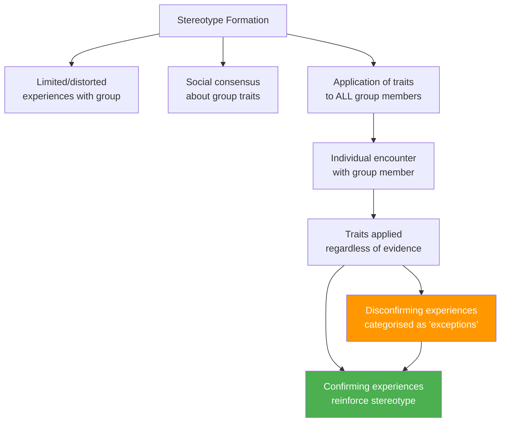
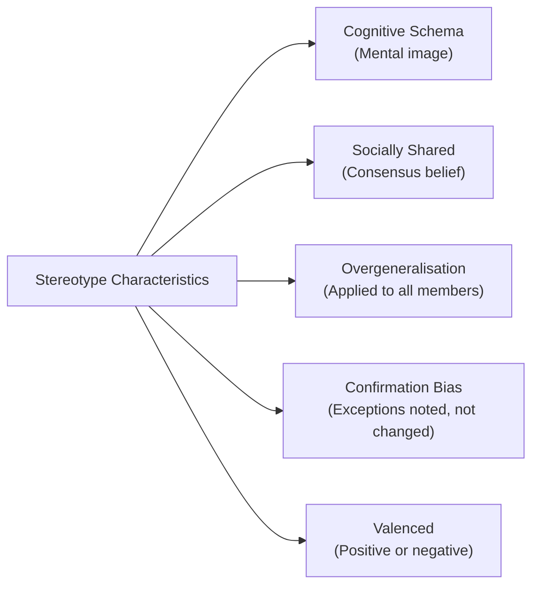
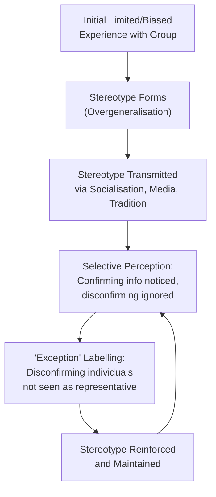
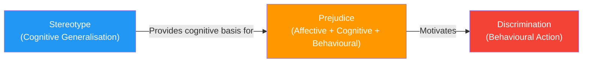

import Tabs from '@theme/Tabs';
import TabItem from '@theme/TabItem';

# Stereotypes: Nature, Development, Social Functions, and Distinction from Prejudice

"All politicians are corrupt." "Bengalis are timid." "Nepali servants are honest and brave." Every culture is steeped in stereotypes—oversimplified beliefs about groups of people that are applied uniformly to all members. Understanding stereotypes is crucial not only for social psychology but for any effort to build more equitable and just societies.

---

**Source PDFs**:
- 📄 [Block-3/Unit-1.pdf - Pages 11–14](/pdfs/MPC-004%20Advanced%20Social%20Psychology/Block-3/Unit-1.pdf)
- 📚 MPC-004 Advanced Social Psychology

---

## What Is a Stereotype?

The term *stereotype* was first used in the social science context by **Walter Lippmann** in his influential 1922 book *Public Opinion*. Lippmann described stereotypes as "pictures in our heads"—simplified, pre-formed images we carry about social groups that filter how we perceive individual members.

**Albrecht, Thomas & Chadwick (1980)** define a stereotype as: *"a belief about some particular trait being prevalent among all members of a social group. Whatever be the characteristic, it is assumed to vest in all people in that category."*

From this and related definitions, we can summarise:

- A stereotype is a **set of beliefs** used to categorise people
- Such categorisation is **exaggerated and lacks full truth**
- It provides the basis for **gross generalisation** about people
- Particular physical, social, or cultural characteristics are **ascribed** to all members of a group
- There is **social consensus** about these traits
- A person is assumed to exhibit all group traits **simply by virtue of group membership**

---

## Characteristics of Stereotypes

### 1. Mental Image / Cognitive Schema
A stereotype is a **mental picture or image** about people of a community or category. It functions as a cognitive schema—a ready-made template that guides perception and information processing.

### 2. Widely Shared Belief
Stereotypes are **socially shared**—they represent widely agreed-upon beliefs within a culture or group. For example, the stereotype that "politicians are opportunists" is held by large numbers of people across many cultures.

### 3. Gross Generalisation
A critical characteristic is **overgeneralisation**: experiences with a handful of people from a group are extended to apply to all members. The experience with a few Bengali individuals leads to the stereotype "all Bengalis are timid"—clearly an overreach.

### 4. Resistance to Disconfirmation
Stereotypes are **remarkably resistant to change** even when contradicted by evidence. When a person encounters a Bengali individual who is bold and courageous, the typical response is not to revise the stereotype but to say, "That person is an exception." This mechanism, called **subtyping**, allows the stereotype to remain intact despite disconfirming evidence.

### 5. Positive or Negative Valence
Stereotypes can be **either positive or negative**:
- **Positive**: "Japanese are industrious and diligent" | "Nepali servants are honest"
- **Negative**: "Bengalis are timid and shy" | "Politicians are corrupt"

Even positive stereotypes are problematic because they reduce individuals to group categories and can create undue pressure ("model minority" stereotype).

---

## Development and Maintenance of Stereotypes

Why do stereotypes form and persist? The IGNOU unit identifies several key factors:

### 1. Inadequate and Improper Experience
The **primary cause** of stereotypes is **limited, distorted experience** with out-group members. Stereotypes form when people have only superficial contact with members of other groups and then overgeneralise from those few encounters. Media representations, which may systematically distort how minority groups are portrayed, compound this problem.

### 2. Socialisation
Parents, teachers, and community leaders transmit stereotypes through the **socialisation process**. Many parents, believing they are preparing children for social reality, explicitly teach group-based generalisations. Children absorb these "pictures in the head" before they have any direct experience with the groups in question.

### 3. Imitation
To become accepted members of their community, people **imitate the beliefs, opinions, and attitudes** held by valued others—often without critically evaluating their logical validity. A person raised in one religious community easily absorbs the stereotypes about outgroups held by that community, not through logic but through the social desire to belong.

### 4. Traditions and Folkways
**Cultural traditions and folkways** codify and transmit stereotypes across generations. Because conforming to traditions brings social reputation and respect, people adopt culturally transmitted stereotypes as part of maintaining their social standing.

### 5. Social and Cultural Distance
**Social distance**—limited meaningful contact between groups—prevents accurate knowledge from developing. When groups do not mix in schools, neighbourhoods, or workplaces, stereotypes fill the knowledge vacuum. **Cultural distance**—differences in language, customs, and ways of life—further reduces the chance for accurate understanding, making stereotypes the primary lens through which outgroups are perceived.

### The Stereotype Maintenance Cycle

---

## Stereotypes and Social Life

Despite being oversimplified and often inaccurate, stereotypes serve real **social functions** that explain their persistence:

### 1. Understanding Social Behaviour
Stereotypes provide **ready-made frameworks for interpreting behaviour**. If a politician behaves self-interestedly, the stereotype "politicians are opportunists" provides an immediate explanatory frame. Stereotypes reduce the cognitive work of understanding complex social environments.

### 2. Controlling (Guiding) Social Behaviour
Stereotypes **automatically orient our behaviour** when we interact with members of stereotyped groups. Knowing that Americans are generally viewed as friendly and informal, we approach American strangers with a relaxed, open manner. Teachers are perceived as idealistic, so we expect conversations with teachers to take an idealistic tone.

### 3. Prediction
Stereotypes enable **behavioural prediction**—whether accurate or not. Believing that Nepali servants are honest and reliable, a family may feel confident leaving their home in the servant's care. This predictive function makes social navigation feel more manageable, even when the predictions are statistically unreliable.

:::warning The Cost of Stereotypes
While stereotypes serve these functions, they come with severe costs. They deny individuality, lead to discriminatory treatment, create self-fulfilling prophecies (where stereotype targets are led to behave in stereotype-confirming ways), and perpetuate structural inequality. The functions explain *why* stereotypes persist—not why they are *acceptable*.
:::

---

## Stereotype Threat: A Contemporary Research Finding

One of the most important discoveries in modern stereotype research is **stereotype threat** (Steele & Aronson, 1995). When members of a stereotyped group are in situations where the stereotype could apply, awareness of the stereotype can impair their performance—creating the very outcome the stereotype predicts.

*Classic Example*: When Black students are reminded of racial stereotypes about academic ability before taking a standardised test, their performance decreases compared to control conditions—even when they are equally prepared. The threat of confirming a negative stereotype consumes cognitive resources and creates anxiety that undermines performance.

Stereotype threat has been documented across many groups and domains:
- Women and mathematics (Spencer, Steele & Quinn, 1999)
- Elderly individuals and memory tests (Hess et al., 2003)
- First-generation college students and academic performance (Stephens et al., 2012)
- Low-income students and IQ tests

A major 2021 meta-analysis by Flore & Wicherts (involving 295 studies, over 20,000 participants) confirmed that stereotype threat reliably impairs performance, though effect sizes vary with situational factors.

---

## Difference Between Stereotype and Prejudice

The IGNOU unit explicitly asks students to distinguish between stereotypes and prejudice—a common exam question. The distinction is subtle but important:

| Dimension | Stereotype | Prejudice |
|-----------|-----------|----------|
| **Core nature** | Cognitive beliefs/expectations | Attitude (cognitive + affective + behavioural) |
| **Components** | Primarily cognitive | All three ABC components |
| **Emotional charge** | May lack strong affect | Has strong affective component (usually negative) |
| **Uniformity** | All group members seen as having same traits | Can be positive or negative; more individual variation |
| **Stability** | More stable and resistant to change | Somewhat less stable (more responsive to experience) |
| **Function** | Cognitive shortcut, organisation of knowledge | Often serves ego-defensive or value-expressive function |
| **Connection** | Foundation/cognitive basis for prejudice | Attitude built partly on stereotypic beliefs |

### Key Distinction (IGNOU Formulation)
- **Stereotype**: All members of a community are perceived alike because they share characteristics → primarily **cognitive**
- **Prejudice**: A type of attitude with **affective (emotional), cognitive, and behavioural** components → stronger emotional charge and action tendency

*Example*: 
- "Women are more emotional than men" → **Stereotype** (cognitive generalisation)  
- "I dislike working under female managers and avoid taking jobs where women are supervisors" → **Prejudice** (has affect and behaviour)

:::info The Stereotype → Prejudice → Discrimination Chain
While stereotypes are primarily cognitive, they provide the foundation for **prejudice** (negative attitudes toward groups), which in turn motivates **discrimination** (unequal behavioural treatment). Addressing stereotypes is therefore a prerequisite for reducing prejudice and discrimination.
:::

---

## Reducing Stereotypes: Evidence-Based Strategies

### 1. Contact Hypothesis (Allport, 1954)
Gordon Allport proposed that **direct, positive, equal-status contact** between groups reduces stereotypes and prejudice. Research by Pettigrew & Tropp (2006) meta-analysis of 515 studies found contact reliably reduces prejudice—but quality of contact matters enormously. Contact must involve equal status, common goals, cooperation, and institutional support.

### 2. Individuation
**Encouraging attention to individual characteristics** rather than group membership disrupts stereotype application. When we are motivated or required to process information carefully (rather than relying on cognitive shortcuts), we rely less on stereotypes.

### 3. Counter-Stereotypic Exemplars
Exposure to **individuals who disconfirm stereotypes**—especially highly respected exemplars—can gradually weaken stereotype strength. Research suggests brief exposure to multiple counter-stereotypic exemplars across diverse contexts is more effective than single exposures.

### 4. Media Representation
Diverse, non-stereotypic media representation is one of the most scalable interventions. Research by Martins & Harrison (2012) showed that television exposure systematically worsened self-esteem and increased stereotyping among Black and female children—conversely, positive representation can reduce stereotypes at a population level.

### 5. Empathy and Perspective-Taking
Actively taking the perspective of stigmatised group members increases empathy and reduces stereotyping. A 2018 meta-analysis by Côté et al. found perspective-taking interventions reduced prejudice across diverse group targets.

---

## Indian Context: Caste and Regional Stereotypes

India provides an important cultural context for understanding stereotypes:

**Caste-Based Stereotypes**: Despite constitutional prohibitions on caste discrimination, caste-based stereotypes remain pervasive. Research by Deshpande & Spilimbergo (2009) found systematic differences in how resumes with Dalit-sounding names were evaluated, even among educated urban respondents—demonstrating the real-world consequences of stereotyping.

**Regional Stereotypes**: Indian society is rich with regional stereotypes—"Bengalis are intellectual but impractical," "Marwaris are clever businesspeople," "South Indians are conservative"—which are transmitted through jokes, films, and cultural narratives. These stereotypes create in-group solidarity but also inter-regional friction.

**Gender Stereotypes**: Research consistently documents strong gender stereotypes in India, with women more likely to be seen as suited for nurturing roles and men for leadership—stereotypes that have documented effects on hiring decisions, educational investment, and career development (Gupta, Turban & Bhawe, 2008).

Understanding these Indian-specific stereotypes helps psychology students connect academic theory to the lived social realities they encounter.

---

## External Resources

### 📚 Wikipedia
- [Stereotype (psychology)](https://en.wikipedia.org/wiki/Stereotype) – Comprehensive overview of research and theory
- [Stereotype threat](https://en.wikipedia.org/wiki/Stereotype_threat) – Detailed coverage of Steele & Aronson's work
- [Prejudice and discrimination](https://en.wikipedia.org/wiki/Prejudice) – Distinction and relationship between concepts
- [In-group and out-group](https://en.wikipedia.org/wiki/In-group_and_out-group) – Social identity basis of stereotyping
- [Contact hypothesis](https://en.wikipedia.org/wiki/Contact_hypothesis) – Allport's theory of intergroup contact

### 🎬 Educational Videos
- [Stereotypes, Prejudice, and Discrimination – Crash Course Psychology #39](https://www.youtube.com/watch?v=7P0iP2Zm6a4) – Excellent overview, 10 min
- [Stereotype Threat – Stanford Social Psychology](https://www.youtube.com/watch?v=vBc1-qfNBrk) – Claude Steele explains his research

### 🔬 Recent Research (2020–2024)
- Flore, P.C., & Wicherts, J.M. (2021). Does stereotype threat influence performance of girls in stereotyped domains? *Journal of School Psychology*, 85, 84–101
- Kite, M.E., & Whitley, B.E. (2022). *Psychology of Prejudice and Discrimination* (4th ed.). Routledge – Comprehensive modern text
- Leitner, J.B., et al. (2023). Implicit stereotypes and the predictive brain: A new theoretical framework. *Perspectives on Psychological Science*, 18(2), 355–371
- Koch, A., et al. (2020). A social-cognition perspective on meta-stereotypes. *Psychological Bulletin*, 146(3), 193–232

---

## Self-Assessment Questions

<Tabs>
  <TabItem value="recall" label="🔵 Recall">

1. Who first used the term "stereotype" in a social science context, and in which work?
2. List five characteristics of stereotypes as discussed in the IGNOU unit.
3. Name five factors that contribute to the development and maintenance of stereotypes.
4. What three social functions do stereotypes serve according to the IGNOU unit?
5. State three key differences between stereotypes and prejudice.

  </TabItem>
  <TabItem value="understanding" label="🟡 Understanding">

6. Explain the concept of "subtyping" in stereotype maintenance. Why does encountering an exception to a stereotype usually *not* change the stereotype?
7. Why are even *positive* stereotypes considered problematic? Use the concept of individuation in your answer.
8. Explain the stereotype threat phenomenon. Why might reminding a group of a negative stereotype about them actually cause their performance to decline?
9. Social and cultural distance are listed as factors maintaining stereotypes. How does increased social contact between groups theoretically reduce stereotyping? What conditions must be met?

  </TabItem>
  <TabItem value="application" label="🔴 Application">

10. India has strong regional stereotypes (e.g., about Bengalis, Marwaris, South Indians). Using the IGNOU framework for stereotype development, trace how these stereotypes might have originally formed and why they persist today.
11. A classroom teacher notices that male students in her class are consistently underestimating female students' mathematical ability. Design an evidence-based intervention using at least two stereotype-reduction strategies.
12. A company's HR analysis reveals that candidates from lower-caste backgrounds receive fewer interview callbacks despite equal qualifications. Using your knowledge of stereotype formation and maintenance, explain why this might occur, and propose three structural interventions the company could implement.

  </TabItem>
</Tabs>

---

## Summary

Stereotypes are socially shared cognitive generalisations about the characteristics of social groups, applied uniformly to all group members. First named by Lippmann (1922), stereotypes develop through limited and biased experience, socialisation, imitation, traditions, and social/cultural distance between groups. Their persistence is maintained by confirmation bias (noting confirming instances) and subtyping (dismissing exceptions). Stereotypes serve genuine social functions—they help understand, predict, and guide social behaviour—which explains their tenacity. Modern research on stereotype threat shows that stereotypes can harm the performance of their targets. Critically, stereotypes differ from prejudice: stereotypes are primarily cognitive, while prejudice involves strong emotional (affective) and behavioural components alongside cognition. Both stereotypes and prejudice contribute to discrimination—unequal treatment of group members—making stereotype reduction a crucial goal for social psychology research and practice.

---

*Cross-references: [Nature of Attitudes](/mpc-004/block-3/nature-of-attitudes) | [Theories of Attitude Organisation](/mpc-004/block-3/theories-attitude-organisation) | [Social Influence and Conformity](/mpc-004/block-2/concept-social-influence-theories)*
