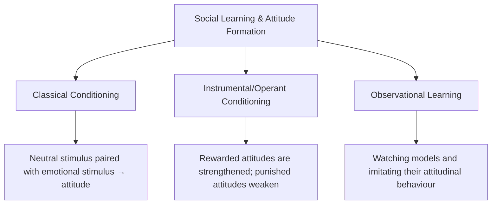
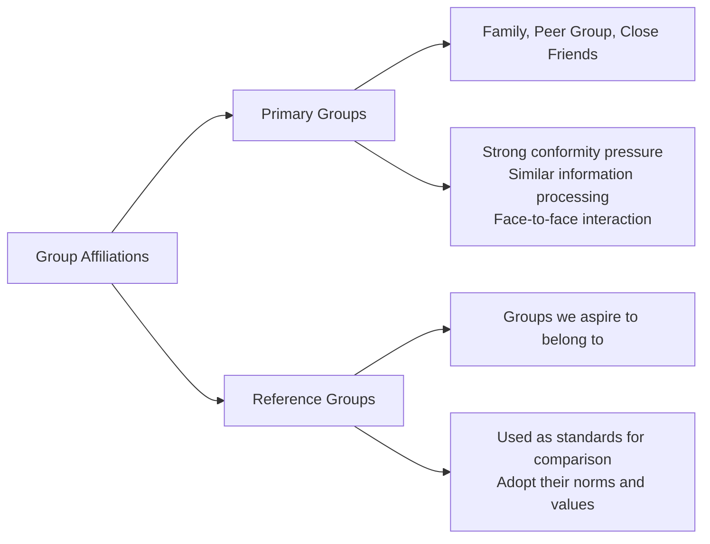
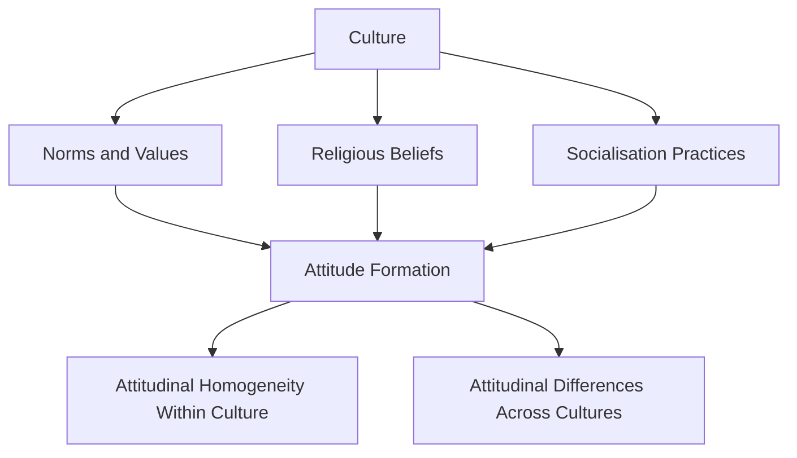
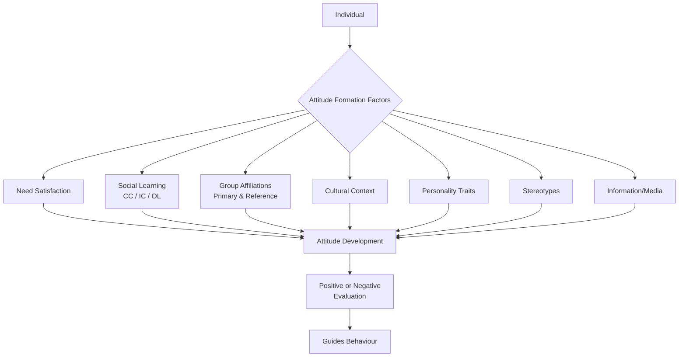

# Factors of Attitude Formation: How Attitudes Develop

## Overview

Attitudes are among the most studied constructs in social psychology. While we covered the *nature* of attitudes in the previous unit, a critical question remains: **how do attitudes actually form?** Understanding attitude formation is essential not only for academic purposes but for real-world applications in education, public health, marketing, and social change.

An attitude is a **hypothetical construct** — it cannot be directly observed but can only be inferred through observable behaviour. Attitudes are not innate; they are **acquired** through a complex interplay of psychological, social, and cultural forces. Research has identified several major factors that determine how and why specific attitudes develop.

---
**Source PDFs**: 
- 📄 [Block-3/Unit-2.pdf - Pages 15-19](/pdfs/MPC-004%20Advanced%20Social%20Psychology/Block-3/Unit-2.pdf)
- 📚 MPC-004 Advanced Social Psychology
---

## 🎯 Learning Objectives

After studying this material, you will be able to:
- Explain the process of attitude formation
- Identify and analyse key factors contributing to attitude development
- Distinguish between primary groups, reference groups, and their differential influence
- Apply conditioning principles to explain how attitudes are learned
- Critically evaluate the role of culture and personality in attitude formation

---

## 1. Need Satisfaction

One of the earliest psychological explanations for attitude formation is rooted in **motivational theory** — we develop positive attitudes toward things that help us satisfy our needs and negative attitudes toward things that obstruct goal attainment.

This principle draws on the work of **Daniel Katz (1960)**, who proposed the *Functional Theory of Attitudes*, arguing that attitudes serve distinct psychological functions:

| Function | Description | Example |
|----------|-------------|---------|
| **Utilitarian** | We like what rewards us | Positive attitude toward a scholarship programme |
| **Ego-defensive** | Protects self-esteem | Prejudice to displace internal anxieties |
| **Value-expressive** | Reflects core values | Environmental activism attitudes |
| **Knowledge** | Provides cognitive structure | Scientific attitudes toward vaccines |

**Research Evidence**: Experimental studies show that students develop favourable attitudes toward things they perceive as instrumental to goal attainment, and negative attitudes toward goal-blocking objects. This is consistent with basic reinforcement theory — we approach what satisfies us and avoid what frustrates us.

> 💡 **Real-World Application**: Understanding the utilitarian function explains why people develop brand loyalty — a product that reliably satisfies a need (functional or social) elicits positive attitude formation.

### Indian Context
In Indian educational culture, students frequently develop strong positive attitudes toward subjects that are perceived as pathways to secure employment (engineering, medicine) and correspondingly negative attitudes toward arts and humanities — directly reflecting need satisfaction (economic security) driving attitude formation.

---

## 2. Social Learning

Social learning is one of the **most powerful mechanisms** of attitude formation. The process parallels how we learn other behaviours — through conditioning and observation. Three specific learning processes are particularly important:

### 2.1 Classical Conditioning

**Ivan Pavlov's** classical conditioning framework applies directly to attitude formation. A previously neutral stimulus can acquire positive or negative emotional valence when repeatedly paired with stimuli that already elicit emotional responses.

**Classic Experiment (Staats & Staats, 1958)**: Two nationality words — *Dutch* and *Swedish* — were repeatedly presented to subjects.
- **Dutch** was consistently paired with **positive adjectives** (happy, laborious, sacred)
- **Swedish** was consistently paired with **negative adjectives** (dirty, ugly, bitter)

**Outcome**: Subjects developed *positive* attitudes toward "Dutch" and *negative* attitudes toward "Swedish" — purely through conditioning, without any direct experience of these cultures.

**Everyday Example**: When a child repeatedly hears a parent express hostility toward a particular group (ethnic, religious, political), that group becomes a conditioned stimulus that elicits negative emotional responses — the foundation of prejudice formation.

> ⚠️ **Critical Insight**: Classical conditioning of attitudes often operates **below conscious awareness**, making these attitudes particularly resistant to change through rational argument alone.

### 2.2 Instrumental (Operant) Conditioning

Building on **B.F. Skinner's** operant conditioning, this principle states that attitudes which are rewarded tend to persist and strengthen, while those that are punished tend to weaken.

**Family Dynamics**: Children learn to adopt parental attitudes because:
- Expressing attitudes similar to parents → **praise and approval** (positive reinforcement)
- Deviating from parental attitudes → **criticism and punishment** (punishment)

This explains the **intergenerational transmission of attitudes** — religious beliefs, political affiliations, cultural prejudices — which are maintained across generations through differential reinforcement.

**Research Support**: Studies show that children of authoritarian parents who consistently punish non-conformity tend to develop more rigid, conformist attitude systems.

### 2.3 Observational Learning

**Albert Bandura's** social learning theory extends conditioning models to include **vicarious learning** — we form attitudes by observing others and the consequences of their behaviour, without needing direct reinforcement ourselves.

Children observe:
- Parents' emotional reactions to outgroups
- Peer group attitudes toward academic achievement
- Media portrayals of social groups
- Heroes and role models in their community

**Bandura's Bobo Doll Studies** (1961-1963) demonstrated that children readily acquire aggressive attitudes and behaviours by merely watching adults act aggressively — even without any direct reinforcement.

> 🔗 **Related Topics**: See [Observational Learning in Bandura's Social Cognitive Theory](/mpc-003/block-2/observational-vicarious-learning-bandura) and [Skinner's Operant Conditioning](/mpc-003/block-2/skinner-operant-conditioning-personality)

---

## 3. Group Affiliations

**Group membership** is among the most powerful determinants of attitude formation. Humans are fundamentally social beings, and our attitudes are profoundly shaped by the groups we belong to and aspire to join.

### 3.1 Primary Groups

Primary groups are **immediate, intimate** groups characterised by:
- **Limited membership** with face-to-face interaction
- **Deep emotional bonds** — family, close friends, neighbourhood peers
- **High conformity pressure** — deviation is quickly noticed and sanctioned

**Four Reasons Primary Groups Create Attitudinal Homogeneity**:

1. **Conformity Pressure**: Close-knit groups exert intense social pressure for attitude similarity; deviation is immediately noticed and corrected
2. **Mutual Liking Dynamics**: Members develop favourable attitudes toward one another, and liking breeds further similarity, which produces even greater attitudinal convergence
3. **Shared Information**: All members receive similar information and interpret it through similar cognitive frameworks
4. **Socialisation of New Members**: Anyone joining the primary group quickly learns which attitudes earn acceptance and approval

**Family as Primary Group**: Parents are the most influential primary group for attitude formation in early life. Research by **Newcomb (1943, 1963)** in the famous Bennington College studies showed that women entering college with conservative attitudes (shaped by conservative families) gradually shifted toward liberalism under the influence of their new college peer group.

### 3.2 Reference Groups

A **reference group** is a group that the individual *aspires to belong to* or uses as a **standard for comparison** — even without current membership.

**Key Functions of Reference Groups**:
- **Normative influence**: We adopt attitudes that align with reference group norms to gain eventual acceptance
- **Comparative function**: We evaluate ourselves and our attitudes against reference group standards

**Example**: An aspiring professional may adopt the attitudes (toward work ethic, networking, status symbols) of successful professionals she admires — even before formally joining that professional community.

> 🔗 See [Conformity and Social Influence](/mpc-004/block-2/conformity-asch-experiment)

---

## 4. Cultural Factors

**Culture** is the invisible but powerful context within which attitudes form. Every culture transmits its norms, values, religious beliefs, and social expectations through the process of **socialisation**, shaping what members of that culture come to believe, value, and evaluate.

**Research Evidence**:
- People reared in **different cultures** exhibit systematically different attitudes
- People reared in the **same culture** show striking attitudinal similarity on core issues
- Attitude differences between cultures often reflect deep differences in values regarding individualism/collectivism, power distance, or uncertainty avoidance (Hofstede, 1980)

**Cross-Cultural Illustration**: 
- Marriage between first cousins is **viewed favourably** in many Muslim-majority cultures but **with disdain** in Hindu culture — the same behaviour elicits opposite attitudes based entirely on cultural norms
- **Arapesh vs. Mundugumor tribes** (Margaret Mead's research): Arapesh members were cooperative and kindhearted; Mundugumor members were aggressive and competitive — reflecting differential cultural emphases on personality trait development

### Cultural Dimensions and Attitudes

**Geert Hofstede's (1980, 2001)** cross-cultural research identified dimensions that predict systematic attitudinal differences:

| Dimension | High-Scoring Cultures | Low-Scoring Cultures |
|-----------|----------------------|---------------------|
| **Power Distance** | Accept hierarchy; authoritarian attitudes | Question authority |
| **Individualism** | Self-reliance attitudes | Group loyalty attitudes |
| **Uncertainty Avoidance** | Conservative, risk-averse attitudes | Open to novelty |
| **Long-term Orientation** | Thrift, perseverance values | Respect for tradition |

---

## 5. Personality Factors

**Individual personality traits** create differential susceptibility to attitude formation. Attitudes that are consonant with existing personality traits are more readily formed and maintained.

**Key Research Findings**:
- **Highly organised attitudinal systems**: Persons with internally consistent attitude systems tend to accept both strengths and weaknesses as matters of personal conscience
- **Low IQ and literacy**: Studies found that people with lower cognitive resources tend toward **conservative, suspicious, and hostile** attitudes, with a tendency to attribute personal failures to external causes (external locus of control)
- **Authoritarianism**: Adorno et al.'s (1950) classic study identified the **authoritarian personality** — a cluster of traits associated with rigid, prejudiced attitudes toward outgroups

**The Big Five and Attitude Formation**:

| Big Five Trait | Associated Attitude Tendencies |
|----------------|-------------------------------|
| **Openness** | Liberal, tolerant, curious; positive attitudes toward novelty |
| **Conscientiousness** | Conservative, structured; positive attitudes toward rules/order |
| **Extraversion** | Positive social attitudes; outgoing, group-positive |
| **Agreeableness** | Pro-social, empathetic attitudes |
| **Neuroticism** | Anxious, defensive attitudes; may underlie prejudice |

> 🔗 See [Big Five OCEAN Personality Dimensions](/mpc-003/block-3/big-five-personality-dimensions)

---

## 6. Stereotypes as Attitude Formation Factors

**Stereotypes** — oversimplified, generalised beliefs about members of social groups — play a significant role in shaping attitudes. When we hold a stereotype about a group, it predisposes us toward specific attitudinal responses to members of that group even before any direct interaction.

**Process**:
Stereotype → Predisposes evaluative judgement → Attitude formed

**Example**: The stereotype that "women are more religious and suggestible than men" leads to specific attitudes about women's roles in religious institutions, decision-making capacities, and professional suitability.

**Critical Perspective**: Stereotypes are often culturally transmitted (factor #4) and may be self-perpetuating through **confirmation bias** — we notice information that confirms our stereotypes while ignoring disconfirming evidence.

> 🔗 See [Stereotypes, Prejudice, and Discrimination](/mpc-004/block-3/stereotypes-prejudice-discrimination)

---

## 7. Given Information (Media and Communication)

Modern mass media — radio, television, newspapers, social media — play a powerful role in shaping attitudes, particularly for issues beyond our direct personal experience.

**Differential Effects**: Not all information has equal impact on attitude formation. Information that is:
- **Emotionally vivid and personally relevant** has greater impact
- **Repeated consistently** across multiple sources gains credibility
- **From trusted, credible sources** shapes attitudes more powerfully
- **Consistent with existing beliefs** is more readily incorporated

> 💡 **Contemporary Note**: Research on **algorithmic media bubbles** (Pariser, 2011) demonstrates that personalised information filtering creates echo chambers where people primarily receive information confirming existing attitudes — dramatically accelerating attitude formation and calcification along partisan lines.

---

## 🧠 Memory Aid: SNAPCASH

To remember the key factors of attitude formation:

**S** - Social learning (conditioning and observation)  
**N** - Need satisfaction (utilitarian function)  
**A** - Affiliations (group membership)  
**P** - Personality traits  
**C** - Cultural factors  
**A** - Additional information (media)  
**S** - Stereotypes  
**H** - (implied: Historical and developmental context)

---

## 📊 Integrative Model of Attitude Formation

---

## 📚 External Resources

1. **Wikipedia**: [Attitude (psychology)](https://en.wikipedia.org/wiki/Attitude_(psychology)) — comprehensive overview of attitude formation theories
2. **Wikipedia**: [Classical conditioning](https://en.wikipedia.org/wiki/Classical_conditioning) — Pavlov's foundational work
3. **Wikipedia**: [Social learning theory](https://en.wikipedia.org/wiki/Social_learning_theory) — Bandura's framework
4. **Wikipedia**: [Functional theories of attitudes (Katz)](https://en.wikipedia.org/wiki/Functional_theories_of_attitudes) — Katz's functional approach
5. **Wikipedia**: [Authoritarian personality](https://en.wikipedia.org/wiki/Authoritarian_personality) — Adorno et al.'s research on personality and attitudes
6. **📺 Video**: [Crash Course Psychology #22 - Social Thinking](https://www.youtube.com/watch?v=dDMQDd4HuOQ) — excellent overview of social cognition and attitude formation
7. **📺 Video**: [MIT OpenCourseWare: Social Psychology Lecture - Attitudes](https://ocw.mit.edu/courses/9-00sc-introduction-to-psychology-fall-2011/) — academic lecture on attitude theory
8. **📄 Research Paper**: Bohner, G., & Dickel, N. (2011). *Attitudes and attitude change*. Annual Review of Psychology, 62, 391–417. [Key Review Article]
9. **📄 Research Paper**: Maio, G.R., & Haddock, G. (2015). *The psychology of attitudes and attitude change* (3rd ed.). SAGE Publications — foundational textbook chapter
10. **📄 Research Paper**: Haddock, G., & Maio, G. R. (2022). *Contemporary perspectives on the psychology of attitudes*. Psychological Science, 33(1), 1–12 — current research directions
11. **📄 Research Paper**: Wood, W. (2000). *Attitude change: Persuasion and social influence*. Annual Review of Psychology, 51, 539–570 — classic comprehensive review

---

## ✅ Self-Assessment Questions

**Basic Level**:
1. What is meant by calling an attitude a "hypothetical construct"? Why can attitudes not be directly observed?
2. Name the three processes of social learning that contribute to attitude formation and give one example of each.
3. What is the difference between a primary group and a reference group? How does each influence attitude formation?

**Intermediate Level**:
4. Explain with examples how classical conditioning can lead to the formation of prejudiced attitudes toward ethnic or national groups.
5. A student raised in a conservative religious family attends a liberal arts university. Using what you know about group affiliations and attitude formation, predict and explain what attitudinal changes you might expect over four years.
6. How does Katz's functional theory of attitudes differ from purely learning-based explanations of attitude formation? What does each perspective explain that the other misses?

**Advanced Level**:
7. Compare and contrast the roles of **need satisfaction**, **classical conditioning**, and **cultural factors** as mechanisms of attitude formation. Under what conditions would each mechanism be most influential?
8. Critically evaluate the claim that personality traits are a cause of attitude formation rather than merely correlating with it. What evidence would you need to support a causal claim?
9. With reference to social media algorithms and personalised content feeds, apply the factors of attitude formation (especially social learning, information effects, and group affiliation) to explain the phenomenon of political polarisation in contemporary society.

---

## 📝 Key Terms Summary

| Term | Definition |
|------|-----------|
| **Attitude** | Hypothetical construct — a learned predisposition to evaluate objects in a positive or negative way |
| **Classical Conditioning** | Neutral stimulus acquires emotional valence through repeated pairing with emotionally charged stimulus |
| **Instrumental Conditioning** | Attitudes rewarded by groups tend to persist; punished attitudes weaken |
| **Observational Learning** | Attitudes formed by watching models and the consequences of their behaviour |
| **Primary Group** | Intimate, face-to-face group (family, close friends) exerting strong conformity pressure |
| **Reference Group** | Group one aspires to join; used as comparison standard shaping attitude adoption |
| **Sleeper Effect** | Over time, the credibility of a source is forgotten while the message content persists |
| **Functional Theory** | Katz's theory that attitudes serve psychological functions — utilitarian, ego-defensive, value-expressive, knowledge |
