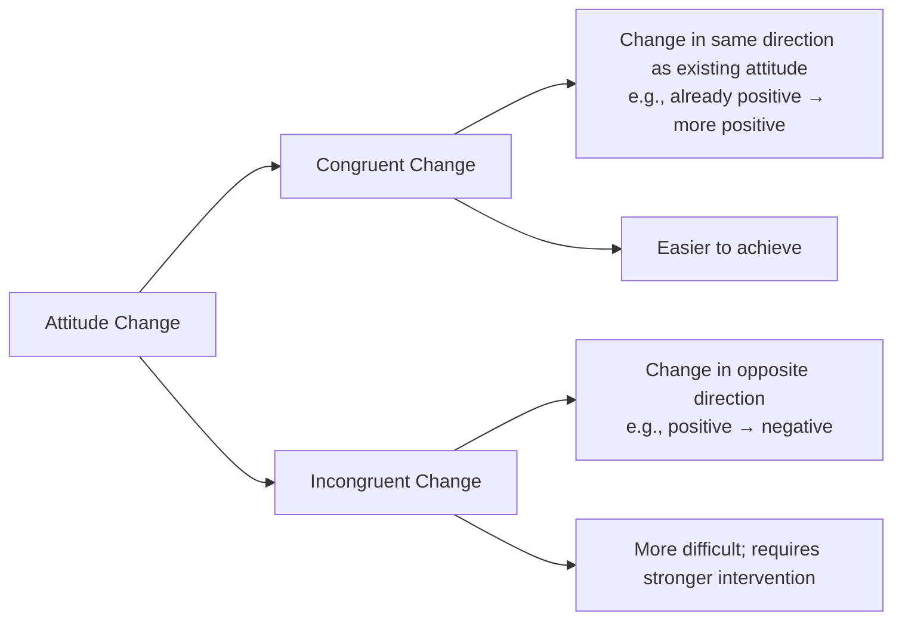
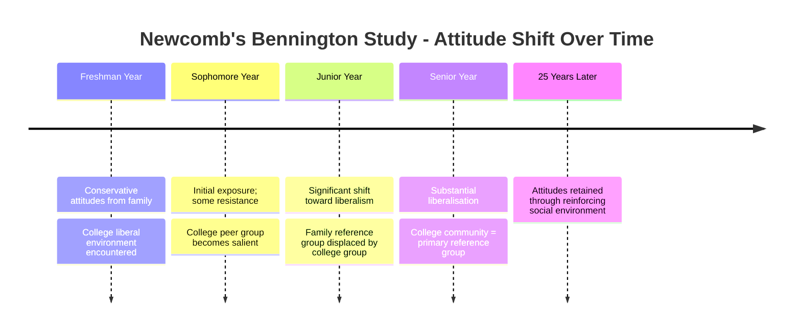
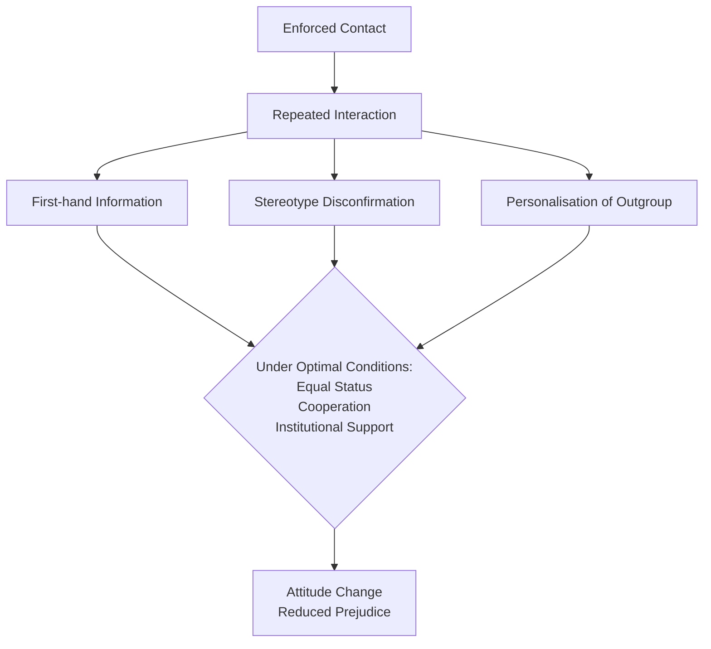
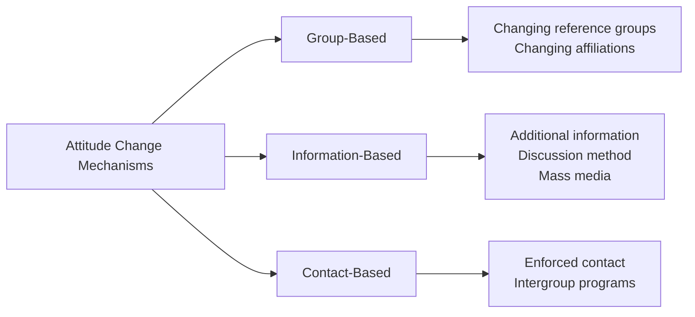

# Attitude Change: Types, Mechanisms, and Theoretical Framework

## Overview

While attitudes are described as **relatively permanent**, they are not immutable. Understanding *how attitudes change* is as important as understanding how they form — both for theoretical psychology and for practical applications in therapy, public health communication, politics, and advertising.

Attitude change is a central concern of social psychology, with decades of systematic research identifying the key mechanisms, obstacles, and facilitators of change. This unit examines the fundamental types of attitude change and the non-communication-based factors that drive it.

---
**Source PDFs**: 
- 📄 [Block-3/Unit-2.pdf - Pages 19-24](/pdfs/MPC-004%20Advanced%20Social%20Psychology/Block-3/Unit-2.pdf)
- 📚 MPC-004 Advanced Social Psychology
---

## 🎯 Learning Objectives

After studying this material, you will be able to:
- Distinguish between congruent and incongruent attitude change
- Explain how changing group affiliations leads to attitude change
- Describe the role of reference groups in initiating attitude change
- Analyse how additional information and discussion facilitate attitude change
- Apply theoretical frameworks to real-world examples of attitude change

---

## 1. Types of Attitude Change

Psychologists distinguish between two fundamental types of attitude change:

### 1.1 Congruent Change

**Definition**: When an existing attitude changes in the **same direction** — a favourable attitude becomes *more* favourable, or an unfavourable attitude becomes *more* unfavourable.

**Example**: A person who already moderately supports environmental conservation becomes an enthusiastic activist after attending climate change seminars — this is congruent change (favourable → more favourable).

### 1.2 Incongruent Change

**Definition**: When an attitude changes in the **opposite direction** — a favourable attitude becomes unfavourable, or vice versa.

**Example**: A lifelong party supporter switches to an opposing party after a major policy scandal — this is incongruent change (favourable → unfavourable).

### Factors Determining Ease of Change

Two key principles govern whether change will be easier or more difficult:

1. **Directional Principle**: *All else being equal, congruent change is easier to bring about than incongruent change.* It is far easier to intensify an existing attitude than to reverse it.

2. **Strength-Stability Principle**: *The higher the strength, stability, and internal consonance of an existing attitude, the easier congruent change becomes but the harder incongruent change becomes.* Deeply held, internally consistent attitudes are difficult to reverse.

| Attitude Characteristic | Effect on Congruent Change | Effect on Incongruent Change |
|--------------------------|---------------------------|------------------------------|
| High strength | Easier | Harder |
| High stability | Easier | Harder |
| High internal consistency | Easier | Harder |
| Recent formation | Harder | Slightly easier |
| Weakly held | Variable | Slightly easier |

---

## 2. Changing Reference Groups

One of the most powerful mechanisms of attitude change involves **changes in the individual's reference group** — the group used as a psychological standard for comparison and aspiration.

### The Bennington College Study (Newcomb, 1943, 1950)

**Theodore Newcomb's** landmark longitudinal study at Bennington College, Vermont, provides the most compelling evidence for reference group-driven attitude change.

**Background**:
- Female students entered college from **conservative family backgrounds**
- The college community actively promoted **liberal political and social attitudes**
- The college environment became the students' **primary reference group** over four years

**Findings**:
- **Freshmen** entered with conservative attitudes reflecting parental influence
- By **senior year**, the majority had shifted significantly toward **liberalism**
- Students who changed most were those who became most integrated into the college community (college as reference group)
- Students who resisted change maintained stronger ties to their family reference group

**Follow-up (Newcomb et al., 1967)**: Women retained their Bennington-influenced liberal attitudes 25 years later, largely because they had married men with similar liberal attitudes — confirming that reference groups can produce lasting attitude change.

**Theoretical Interpretation**: Attitude change occurs because adopting the reference group's attitudes is **normatively rewarding** (earns acceptance and status) and **informationally validating** (consistent information from admired others signals what is correct).

---

## 3. Changing Group Affiliations

Beyond reference groups, **actual changes in group membership** are powerful drivers of attitude change. When an individual leaves one social group and joins another, their attitudes often shift significantly toward alignment with the new group.

### Mechanisms of Group-Based Attitude Change

**Two key factors** determine the extent of attitude change following group affiliation change:

#### Factor 1: Characteristics of the New Group

The **attractiveness of the new group's norms and values** determines willingness to adopt new attitudes:
- If the new group's standards are more appealing, admired, or prestigious than the old group's standards, the individual is **more willing to change attitudes** in alignment with the new group
- Groups with high cohesion, clear norms, and attractive social identity produce more attitude change in new members

#### Factor 2: Characteristics of Membership

The **position and status** the individual holds in the new group:
- If joining the new group means **elevated status, power, and prestige**, the individual is more strongly motivated to adopt the new group's attitudes
- High-status positions in the new group create stronger incentives for attitude alignment

**Political Example**: When a politician switches parties (e.g., from BJP to Congress), several dynamics operate:
- The elevated national platform gained through switching **increases motivation** to fully align with the new party's attitudes
- Public visibility of the switch creates **commitment** to maintaining new attitudes
- New peer relationships in the new party further reinforce the attitude shift

> 💡 **Contemporary Relevance**: This framework explains why people who move to new countries, join new religious communities, start new careers, or enter new social classes often undergo substantial attitudinal transformation — the new group provides powerful normative and informational pressure for attitude change.

---

## 4. Role of Additional Information in Attitude Change

Beyond group influences, **information received through various channels** can bring about attitude change. However, the *social context* in which information is received critically determines its effectiveness.

### Three Types of Information Social Situations

**Social psychologists have identified three situational factors** that modulate the attitude-change impact of new information:

#### Situation 1: Public vs. Private Reception of Information

- Information received **in front of others** produces faster and greater attitude change than information received in private
- **Public setting** creates social accountability and allows information to be validated through others' visible reactions

#### Situation 2: Prior Public Commitment

- When an individual has **publicly declared their attitude**, that public commitment creates psychological rigidity — new information is less effective at changing the attitude
- When attitudes are held **privately** (not publicly declared), additional information is more effective at producing change because there is no public stance to maintain consistency with

This principle underlies **cognitive dissonance theory** (Festinger, 1957) — public commitment creates pressure to maintain attitudinal consistency.

#### Situation 3: Discussion Method vs. Lecture Method

**Classic experiment on attitude change toward beef consumption**:

| Method | Process | Attitude Change |
|--------|---------|----------------|
| **Discussion Method** | Housewives discussed benefits together and reached unanimous conclusion | **30%** changed attitude toward increased beef consumption |
| **Lecture Method** | Expert presented same arguments without audience discussion | **Only 3%** changed attitude |

**Why Discussion is More Effective**:
- Active participation creates a sense of **autonomy and ownership** over the conclusion reached
- Social consensus among peers is more psychologically compelling than expert authority
- Discussion allows individuals to voice objections and have them addressed in real time, reducing resistance
- **Commitment effect**: Publicly expressing agreement in a group discussion creates stronger commitment to the new attitude

> 🔗 **Related**: See [Compliance Strategies](/mpc-004/block-2/compliance-cialdini-principles-strategies) — the foot-in-the-door technique leverages similar commitment dynamics

---

## 5. Enforced Contact and Attitude Change

**Enforced contact** refers to situations where two opposing parties are **compelled to interact** with each other — sharing a space, working together, or cohabitating.

**Theory**: Forced interaction:
1. Provides **first-hand information** about the outgroup, replacing stereotype-based attitudes
2. Creates **opportunity to test** prior attitudinal beliefs against actual experience
3. Through **repeated exposure** (mere exposure effect), familiarity can reduce hostility
4. Facilitates **personalisation** — seeing outgroup members as individuals rather than group representatives

**Gordon Allport's Contact Hypothesis (1954)**: Mere contact is insufficient; *optimal* contact requires:
- **Equal status** between the groups in the contact situation
- **Cooperative** (not competitive) interdependence
- **Institutional support** from authority
- **Personal acquaintance** (opportunity to learn about individuals)

**Classic Example**: When an Indian and Pakistani are assigned to share living quarters (enforced contact), repeated interaction provides direct disconfirmation of negative stereotypes — potentially producing incongruent attitude change (hostile → less hostile).

**Research Evidence**: **Deutsch & Collins (1951)** found that White housewives in racially integrated housing projects showed dramatically more positive attitudes toward Black residents than those in segregated projects — supporting the contact hypothesis.

---

## 📊 Comparison: Mechanisms of Attitude Change

| Mechanism | Strength | Duration | Best For |
|-----------|----------|----------|----------|
| **Reference group change** | High | Long-lasting | Deep value-based attitudes |
| **Group affiliation change** | High | Sustained if group maintained | Identity-linked attitudes |
| **Discussion method** | Moderate-High | Moderate | Information-based attitudes |
| **Enforced contact** | Variable | Can be lasting | Intergroup prejudice |
| **Lecture/information** | Low-Moderate | Short-term | Simple informational attitudes |

---

## 🧠 Memory Aid: "RAGE-D"

Remember the main mechanisms of non-persuasion-based attitude change:

**R** - Reference group change (Newcomb's Bennington study)  
**A** - Affiliation group change (new group membership)  
**G** - Group discussion method (30% vs 3% change)  
**E** - Enforced contact (contact hypothesis)  
**D** - Additional information (context-dependent)

---

## 📚 External Resources

1. **Wikipedia**: [Attitude change](https://en.wikipedia.org/wiki/Attitude_change) — comprehensive overview
2. **Wikipedia**: [Contact hypothesis](https://en.wikipedia.org/wiki/Contact_hypothesis) — Allport's seminal theory
3. **Wikipedia**: [Cognitive dissonance](https://en.wikipedia.org/wiki/Cognitive_dissonance) — Festinger's theory of attitude-behaviour consistency
4. **Wikipedia**: [Bennington College study](https://en.wikipedia.org/wiki/Theodore_Newcomb#Bennington_Study) — Newcomb's landmark research
5. **📺 Video**: [Crash Course Psychology - Social Influence](https://www.youtube.com/watch?v=UGxGDdQnpGs) — engaging overview of social influence on attitudes
6. **📺 Video**: [MIT OpenCourseWare: Attitudes and Persuasion](https://ocw.mit.edu) — academic lecture series
7. **📄 Research Paper**: Petty, R.E., & Cacioppo, J.T. (1986). *The elaboration likelihood model of persuasion*. Advances in Experimental Social Psychology, 19, 123–205 — foundational model
8. **📄 Research Paper**: Allport, G.W. (1954). *The nature of prejudice*. Addison-Wesley — contact hypothesis classic
9. **📄 Research Paper**: Newcom, T. M. (1943). *Personality and social change: Attitude formation in a student community*. Dryden Press — Bennington study original
10. **📄 Research Paper**: Tropp, L.R., & Pettigrew, T.F. (2005). *Relationships between intergroup contact and prejudice among minority and majority status groups*. Psychological Science, 16(12), 951–957 — modern contact hypothesis research

---

## ✅ Self-Assessment Questions

**Basic Level**:
1. What is the difference between congruent and incongruent attitude change? Which is generally easier to achieve and why?
2. Describe two factors that determine the extent of attitude change following a change in group affiliation.
3. What is "enforced contact" and under what conditions can it lead to attitude change?

**Intermediate Level**:
4. Explain Newcomb's Bennington College study. What does it tell us about the role of reference groups in attitude change? What might explain why some students did *not* change their attitudes?
5. Why was the **discussion method** approximately 10 times more effective than the lecture method in changing housewives' attitudes toward beef consumption? Apply at least two theoretical concepts in your explanation.
6. A community leader wants to reduce prejudice between two rival neighbourhood groups. Using the contact hypothesis, design a programme that would be most likely to achieve meaningful attitude change.

**Advanced Level**:
7. Evaluate the limitations of **enforced contact** as an attitude change strategy. Under what conditions might enforced contact *increase* rather than decrease intergroup hostility?
8. Compare the relative effectiveness of changing reference groups, group affiliations, and persuasive communication as mechanisms of attitude change. For which type of attitudes (ego-defensive vs. utilitarian vs. value-expressive) would each mechanism be most effective?
9. Apply **cognitive dissonance theory** to explain why public commitment to an attitude reduces the impact of additional information — and how this understanding could be exploited in social influence campaigns.
