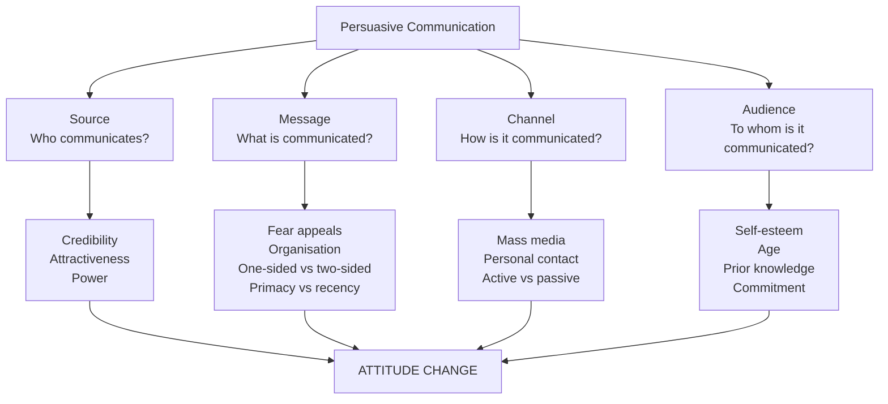
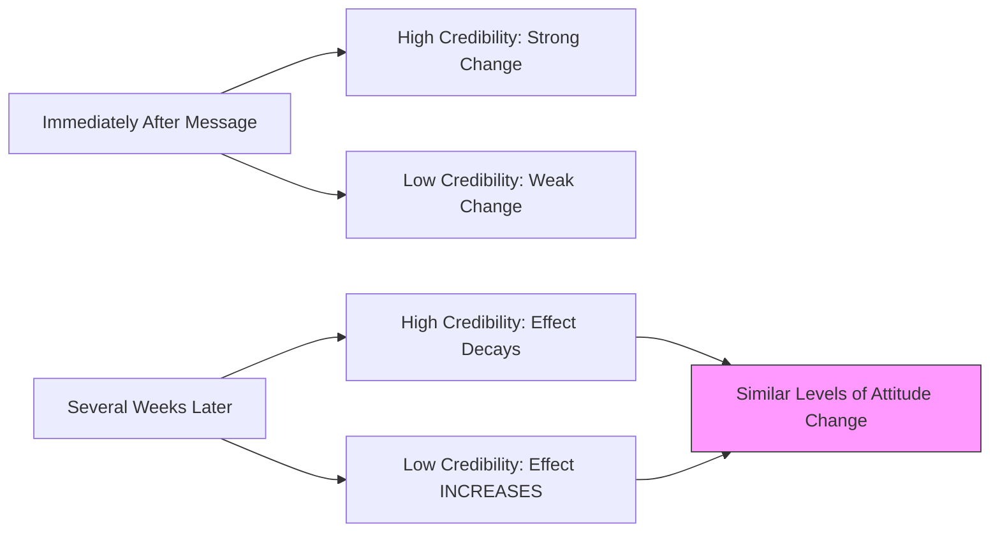
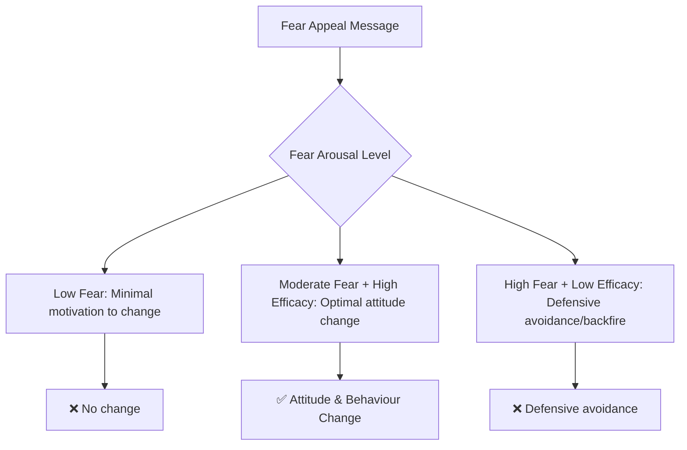
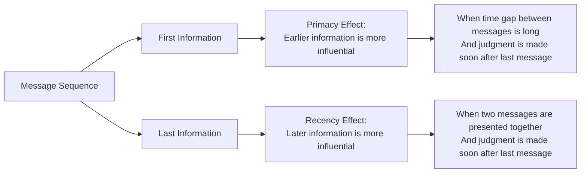
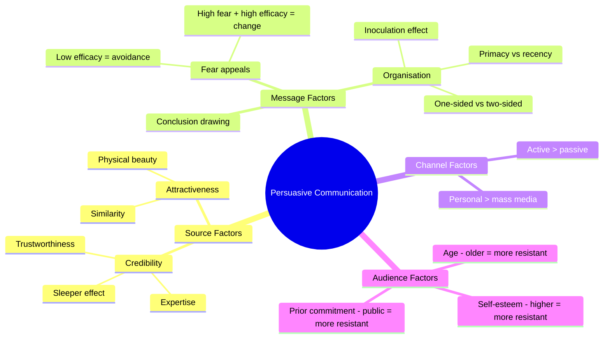

# Persuasive Communication and Attitude Change

## Overview

**Persuasive communication** is the deliberate use of messages designed to change the attitudes, beliefs, or behaviours of an audience. It is one of the most extensively researched topics in social psychology, with enormous practical implications for advertising, public health, politics, education, and conflict resolution.

The study of persuasion gained systematic scientific momentum through the **Yale Communication Research Program** (Hovland, Janis & Kelley, 1953), which systematically examined "Who says What to Whom through Which Channel with What Effect" — a framework that continues to organise research on persuasion today.

---
**Source PDFs**: 
- 📄 [Block-3/Unit-2.pdf - Pages 20-24](/pdfs/MPC-004%20Advanced%20Social%20Psychology/Block-3/Unit-2.pdf)
- 📚 MPC-004 Advanced Social Psychology
---

## 🎯 Learning Objectives

After studying this material, you will be able to:
- Define persuasive communication and identify its core components
- Explain how source credibility and communicator attractiveness affect attitude change
- Analyse the effectiveness of fear appeals in changing attitudes
- Compare the relative effectiveness of one-sided versus two-sided communication
- Apply concepts of primacy, recency, and channel effects to real-world persuasion
- Describe how audience characteristics modulate persuasion effectiveness

---

## The Framework of Persuasive Communication

Effective persuasive communication depends on four interacting factors:

---

## 1. Source of Communication

The **source** — the person or organisation delivering the persuasive message — is a critical determinant of persuasion effectiveness. Research identifies three key source characteristics:

### 1.1 Credibility of the Communicator

**Credibility** combines two dimensions:
- **Expertise**: The degree to which the communicator is perceived as knowledgeable about the topic
- **Trustworthiness**: The degree to which the communicator is perceived as honest and unbiased

**Classic Research (Hovland & Weiss, 1951)**:
- Two groups received identical health-related information
- Group 1 was told the information came from a **highly credible expert**
- Group 2 was told the information came from a **low-credibility source**
- **Result**: Group 1 showed significantly greater attitude change

**The Sleeper Effect**:

One of the most counterintuitive findings in attitude research is the **sleeper effect** — the phenomenon where the *initially lower* persuasion of a low-credibility source *catches up* to that of a high-credibility source over time.

**Explanation**: Over time, people tend to **dissociate the message content from its source** — they remember *what* was said but forget *who* said it. The content of a persuasive message therefore gradually becomes judged on its own merits, independent of source credibility.

**Practical Implication**: Low-credibility sources (like political opponents' arguments) may have greater long-term impact than immediately expected — their messages "live on" in memory even as source cues fade.

### 1.2 Attractiveness of the Communicator

Physical attractiveness and perceived similarity are powerful — sometimes surprisingly powerful — determinants of persuasion effectiveness.

**Two Dimensions of Attractiveness**:

| Dimension | Description | Example |
|-----------|-------------|---------|
| **Physical Beauty** | Visually attractive communicators produce more attitude change | Beautiful celebrities endorsing products |
| **Similarity** | Communicators perceived as similar to the audience are more persuasive | Same-group endorsers in advertising |

**Physical Beauty**: Studies consistently show that physically attractive communicators elicit more favourable evaluations and greater attitude change — the **"halo effect"** generalises positive feelings from appearance to message content.

**This explains why**:
- Advertisements feature beautiful celebrities rather than ordinary-looking experts
- Doctors who are physically attractive are rated as more competent
- Politicians' physical appearance significantly affects voting intentions

**Similarity Effect**: 
- People are more influenced by communicators perceived as similar to themselves
- Similarity signals shared interests, shared values, and reduced likelihood of deception
- **Classic Study**: Black American students were more influenced by a Black communicator than a White communicator delivering identical messages — demonstrating in-group source advantage

> **Indian Advertising Note**: This explains the prevalence of fair-skinned actors in Indian product endorsements — the complex interplay of physical attractiveness standards, aspirational similarity, and social status as persuasion variables.

### 1.3 Power of the Communicator

**French & Raven's (1959) Power Taxonomy** identifies types of communicator power that affect attitude change:
- **Expert power**: Specialised knowledge (doctor recommending treatment)
- **Referent power**: Desired identification (celebrity endorser)
- **Reward power**: Control over outcomes (employer's attitude recommendations)
- **Coercive power**: Threat (usually produces compliance, not genuine attitude change)
- **Legitimate power**: Formal authority (government health campaigns)

> 🔗 See [Concept of Social Influence — French & Raven Power](/mpc-004/block-2/concept-social-influence-theories)

---

## 2. Characteristics and Content of Communication

The **structure, organisation, and content** of the message itself critically determine its persuasive impact.

### 2.1 Fear-Arousing Appeals

Fear appeals are messages designed to **arouse fear about negative consequences** of not complying with the advocated position — but they also provide a clear pathway to **reduce that fear**.

**Optimal Fear Appeal Structure**:
1. **Threat**: Vivid description of serious harm that could occur
2. **Severity**: Emphasise the gravity of the consequences
3. **Susceptibility**: Make the threat personally relevant
4. **Efficacy**: Provide clear, effective actions that will reduce the threat

**Classic Example**: Cigarette package warnings:
- "Cigarette smoking causes lung cancer, heart disease, emphysema, and may complicate pregnancy"
- Followed by encouragement to call a quit-smoking helpline

**Research Findings (Leventhal, 1970; Witte, 1992)**:
- **Moderate-to-high fear appeals** with **high efficacy messages** are most effective
- Fear alone (without efficacy/solution) can produce **defensive avoidance** — people psychologically distance themselves from the threat rather than changing their attitude/behaviour
- **Extended Parallel Process Model (EPPM)**: When threat is high AND efficacy is high → attitude change; when threat is high AND efficacy is low → defensive avoidance

### 2.2 Organisation of Communication

The *way* a message is structured significantly affects its persuasive impact. Three key organisational issues:

#### Issue 1: One-Sided vs. Two-Sided Communication

**One-sided communication**: Presents only arguments favouring the advocated position.  
**Two-sided communication**: Presents arguments for *and against* the advocated position, with the favoured position ultimately winning.

**Classic Experiment — WWII Allied Forces Study (Hovland et al., 1949)**:

Allied forces soldiers were preparing for the ongoing Pacific war after Germany's surrender. Two versions of a persuasive communication were tested:
- **One-sided**: Only arguments about Japanese military strength and likelihood of long war
- **Two-sided**: Same arguments *plus* arguments for a shorter war (Allied victories, Japanese losses, low Japanese morale)

**Results (highly nuanced)**:

| Condition | One-Sided More Effective | Two-Sided More Effective |
|-----------|--------------------------|--------------------------|
| **Education level** | High school educated soldiers | College-educated soldiers |
| **Initial stance** | Expected long war | Expected short war |
| **Inoculation effect** | Vulnerable to counter-propaganda | Resistant to counter-propaganda |

**The Inoculation Effect** (McGuire, 1961):
The most dramatic finding was the **inoculation against counter-propaganda**:
- After exposure to arguments that Russia would not produce atomic bomb for 5 years...
- Both groups were then exposed to *counter-communication* (Russia could produce bomb sooner)
- **One-sided group**: Only **2%** retained the original position
- **Two-sided group**: **67%** retained the original position despite counter-communication

This is the **inoculation effect** — exposure to weakened counter-arguments (in two-sided communication) builds psychological "antibodies" against stronger counter-propaganda, much like biological vaccination.

> 💡 **Modern Relevance**: The inoculation effect is directly applicable to **misinformation resistance research** (Cook et al., 2017). Pre-bunking misinformation by exposing people to weakened versions of false claims builds resistance to actual misinformation — the psychological equivalent of a vaccine.

**Practical Guidelines**:
- Use **one-sided communication** for: already sympathetic audiences, low-education audiences, situations where counter-arguments are unlikely
- Use **two-sided communication** for: educated, sceptical audiences, situations where counter-arguments will be encountered, long-term attitude maintenance

#### Issue 2: Should Communication Draw Its Own Conclusion?

Research generally shows that **explicit conclusions** (telling the audience what to think) are more effective for complex topics, while **implicit conclusions** (letting the audience draw their own) may be more effective for highly educated or involved audiences who resist being told what to think.

#### Issue 3: Primacy vs. Recency Effect

**Primacy Effect**: The **first** information presented has greater impact.
- Occurs when: significant time passes between the two messages, AND judgement is made immediately
- Explanation: First information creates a **framework or schema** that colours interpretation of subsequent information

**Recency Effect**: The **last** information presented has greater impact.
- Occurs when: both messages are presented in close temporal succession, AND judgement is made after some delay
- Explanation: The most recently received information is most accessible in memory at the time of judgement

**Practical Application**: In legal proceedings, opening statements have primacy effects (juries develop early schemas); closing arguments rely on recency effects (recent memory at verdict time).

---

## 3. Channel of Communication

The **medium** through which the message is delivered significantly moderates persuasive impact.

### Mass Media vs. Personal Contact

| Channel | Characteristics | Persuasive Impact |
|---------|----------------|------------------|
| **Mass Media** (TV, radio, print) | Impersonal, one-way, large reach | Lower per-message impact, but massive reach |
| **Personal Contact** | Face-to-face, interactive, personalised | Higher per-message impact |

**Research Finding**: Personal contact is consistently more effective than mass media in producing attitude change.

**Explanations**:
- Personal contact allows **real-time adaptation** to the audience's reactions
- **Social accountability** — changing one's attitude in front of the communicator feels natural
- Interpersonal **liking** and relationship effects enhance persuasion
- Non-verbal cues in personal contact add emotional weight and credibility

### Active vs. Passive Reception

**Active participation** (discussion, role-playing, generating arguments) is more effective than **passive reception** (reading pamphlets, watching presentations).

**Reason**: Active generation of arguments, even on behalf of an opposing position (**counter-attitudinal advocacy**), leads to internalisation of those arguments — consistent with **cognitive dissonance theory**.

> 💡 **Application**: Health education campaigns that involve patients in role-playing doctor-patient conversations about medication adherence produce better outcomes than pamphlets or lectures alone.

---

## 4. Characteristics of the Audience

The **receiver of the communication** is not a passive receptacle — their characteristics profoundly modulate persuasion effectiveness.

### 4.1 Self-Esteem and Self-Confidence

**Counterintuitive finding**: People with **high self-esteem and self-confidence** are *less* susceptible to attitude change.

**Explanation**:
- High self-esteem individuals have greater confidence in their existing attitudes
- They feel less social pressure to conform
- They are more likely to scrutinise messages critically and resist illegitimate pressure

**Low self-esteem** individuals may show greater initial compliance but may also be less capable of comprehending complex arguments — so the relationship is curvilinear.

### 4.2 Age

**Attitude rigidity increases with age**:
- Older individuals tend to be **more resistant** to persuasive communication
- Age brings **greater cognitive consistency** — attitudes become more interconnected and mutually reinforcing
- **Impressionable Years Hypothesis** (Krosnick & Alwin, 1989): Attitudes formed during adolescence and early adulthood (roughly 14-24 years) are particularly stable because they are formed during a critical socialisation window

**Practical Implication**: Public health campaigns, political mobilisation, and commercial advertising are most effective when targeting **young adults** — attitudes formed early tend to persist.

### 4.3 Initial Attitude Strength

The **strength and extremity** of prior attitudes affects susceptibility:
- **Weakly held** attitudes are more easily changed
- **Centrally important** attitudes (tied to identity and values) are highly resistant
- **Recently formed** attitudes are more malleable than long-held ones

### 4.4 Prior Commitment

Public prior commitment increases resistance:
- If a person has **publicly stated their attitude**, subsequent persuasion attempts become a form of direct challenge — activating **reactance** (Brehm, 1966) — the motivation to reassert freedom by *not* changing

---

## 🧠 Memory Aid: "SMCA"

The four components of persuasive communication:

**S** - Source (credibility, attractiveness, similarity, power)  
**M** - Message (fear appeals, organisation, one-sided/two-sided, primacy/recency)  
**C** - Channel (mass media vs. personal contact, active vs. passive)  
**A** - Audience (self-esteem, age, prior commitment, initial stance)

---

## 📊 Comprehensive Summary of Persuasion Research

---

## 📚 External Resources

1. **Wikipedia**: [Persuasion](https://en.wikipedia.org/wiki/Persuasion) — comprehensive overview of persuasion theory and research
2. **Wikipedia**: [Elaboration likelihood model](https://en.wikipedia.org/wiki/Elaboration_likelihood_model) — Petty & Cacioppo's major persuasion framework
3. **Wikipedia**: [Sleeper effect (psychology)](https://en.wikipedia.org/wiki/Sleeper_effect_(psychology)) — credibility dissociation over time
4. **Wikipedia**: [Inoculation theory](https://en.wikipedia.org/wiki/Inoculation_theory) — McGuire's framework for resistance to persuasion
5. **Wikipedia**: [Fear appeal](https://en.wikipedia.org/wiki/Fear_appeal) — research on fear-based persuasion
6. **📺 Video**: [Yale Communication Research Program — Historical Overview](https://www.youtube.com/watch?v=K0WPbY6F5xc) — origins of persuasion science
7. **📺 Video**: [Crash Course Psychology: Social Influence and Persuasion](https://www.youtube.com/watch?v=UGxGDdQnpGs) — engaging introductory lecture
8. **📺 Video**: [Robert Cialdini: Science of Persuasion](https://www.youtube.com/watch?v=cFdCzN7RYbw) — applied persuasion principles
9. **📄 Research Paper**: Petty, R.E., & Cacioppo, J.T. (1986). *The elaboration likelihood model of persuasion*. Advances in Experimental Social Psychology, 19, 123–205 — central theory of persuasion processing
10. **📄 Research Paper**: Hovland, C.I., Janis, I.L., & Kelley, H.H. (1953). *Communication and persuasion*. Yale University Press — foundational Yale programme
11. **📄 Research Paper**: Cook, J., Lewandowsky, S., & Ecker, U. K. (2017). *Neutralizing misinformation through inoculation: Exposing misleading argumentation techniques reduces their influence*. PLOS ONE, 12(5) — modern inoculation research
12. **📄 Research Paper**: Pornpitakpan, C. (2004). *The persuasiveness of source credibility: A critical review of five decades of evidence*. Journal of Applied Social Psychology, 34(2), 243–281 — comprehensive credibility review

---

## ✅ Self-Assessment Questions

**Basic Level**:
1. What is meant by the "sleeper effect" in attitude change research? Give a practical example.
2. Why are physically attractive communicators more persuasive? What two dimensions of attractiveness are relevant to persuasion?
3. Define the "inoculation effect" and describe the study that originally demonstrated it.

**Intermediate Level**:
4. A public health campaign wants to convince teenagers to avoid smoking. Should it use one-sided or two-sided communication? Should it use fear appeals? Justify your recommendations based on research evidence.
5. Under what conditions is the **primacy effect** versus the **recency effect** more likely to occur? Apply these principles to the design of a political campaign speech.
6. Compare the relative persuasive effectiveness of a television advertisement versus a face-to-face conversation about the same product. What factors explain the differences?

**Advanced Level**:
7. Critically evaluate the **Elaboration Likelihood Model (ELM)** as an integrative framework for understanding the various persuasion findings described in this unit. How does the central vs. peripheral route distinction account for the moderating effects of audience characteristics (education, involvement, self-esteem)?
8. The "inoculation effect" suggests that exposing people to weakened counter-arguments builds resistance to future persuasion attempts. Design an anti-misinformation campaign using inoculation principles to protect people against climate change denial. What specific arguments would you pre-bunk, and how would you present them?
9. Critically compare **source credibility** and **message quality** as determinants of attitude change. Under what conditions does each factor dominate, and what does this tell us about the limits of rational models of persuasion?
