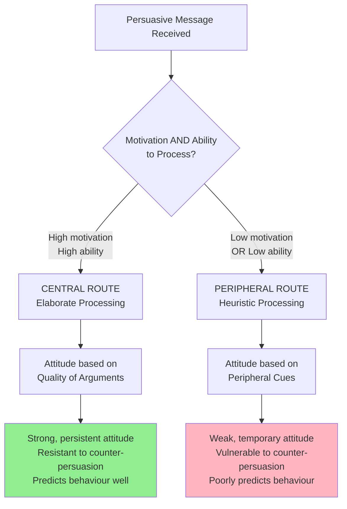
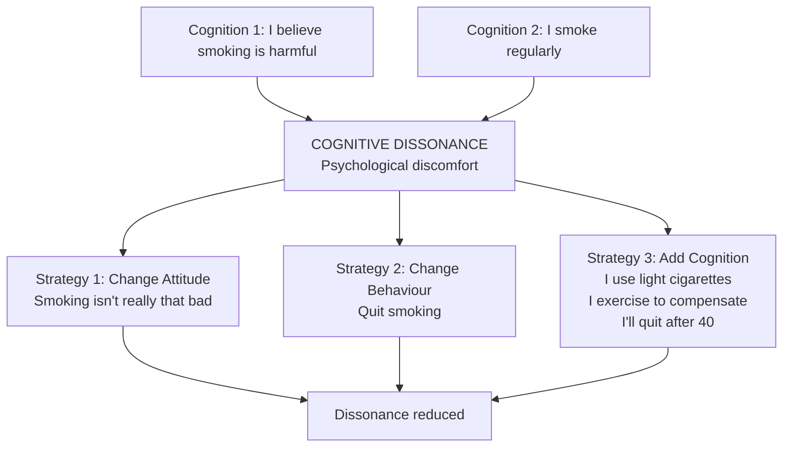
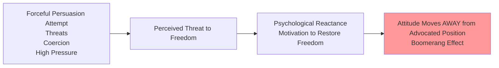
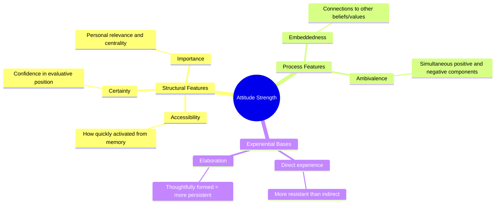
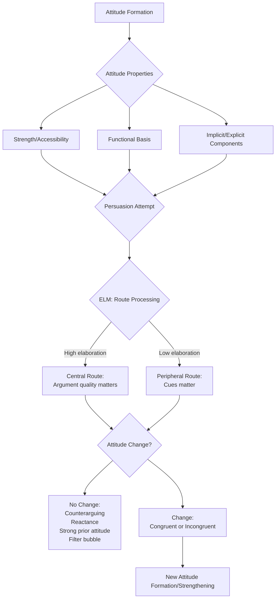

# Attitude Change: Modern Models, Resistance, and Applications

## Overview

The earlier sections of this unit examined factors of attitude formation and the mechanisms of attitude change through persuasive communication. This final section integrates those findings into **modern theoretical models** that explain *when* and *how* persuasion operates, and examines the **psychology of attitude resistance** — why attitudes sometimes stubbornly refuse to change despite powerful persuasive attempts.

Understanding both the *processes* of change and the *barriers* to change is essential for anyone working in psychology, public health, education, marketing, or political communication.

---
**Source PDFs**: 
- 📄 [Block-3/Unit-2.pdf - Pages 19-24](/pdfs/MPC-004%20Advanced%20Social%20Psychology/Block-3/Unit-2.pdf)
- 📚 MPC-004 Advanced Social Psychology
---

## 🎯 Learning Objectives

After studying this material, you will be able to:
- Describe and apply the Elaboration Likelihood Model (ELM) to persuasion phenomena
- Explain cognitive dissonance theory and its role in attitude-behaviour consistency
- Describe psychological reactance and its implications for attitude change campaigns
- Analyse the relationship between attitude strength and resistance to change
- Apply attitude change principles to contemporary issues (social media, health communication)

---

## 1. The Elaboration Likelihood Model (ELM)

The **Elaboration Likelihood Model** (Petty & Cacioppo, 1981, 1986) is widely regarded as the most comprehensive and influential framework for understanding attitude change through persuasion. It addresses a paradox in the persuasion literature: *why do some persuasion variables (like source credibility) work in some situations but not others?*

### The Core Distinction: Two Routes to Persuasion

### The Central Route

When people are **motivated and able** to think carefully about a persuasive message, they process it via the **central route**:
- They carefully analyse the **quality and strength** of the arguments
- They generate counter-arguments and evaluate supporting evidence
- Attitude change depends primarily on **argument quality**
- Source attractiveness, credibility of tone, etc. have minimal effect

**Result**: Attitudes formed via the central route are **strong, lasting, resistant to change, and predictive of behaviour**.

**When does central route processing occur?**
- High personal relevance of the topic
- High need for cognition (trait motivation to think)
- Low distraction in the processing environment
- Sufficient knowledge/ability to evaluate arguments

### The Peripheral Route

When people have **low motivation or low ability** to process a message carefully, they rely on **peripheral cues** — heuristics and simple decision rules:
- **"Credible sources are correct"** → follows expert's recommendation without analysing arguments
- **"More arguments = stronger position"** → persuaded by quantity, not quality
- **"Beautiful people are trustworthy"** → attracted by communicator aesthetics
- **"Liking = agreement"** → agrees with likeable communicators

**Result**: Attitudes formed via the peripheral route are **weak, temporary, easily changed, and poor predictors of behaviour**.

### Integrating Prior Research with ELM

The ELM elegantly explains many earlier, seemingly contradictory findings:

| Finding | ELM Explanation |
|---------|----------------|
| Source credibility affects low-education audiences more | Low-education → peripheral route → credibility as heuristic cue |
| Two-sided arguments better for educated audiences | Educated → central route → value argument quality and fairness |
| Attractive communicators more persuasive for low-involvement topics | Low involvement → peripheral route → attractiveness as cue |
| Message quality matters for personally relevant topics | High relevance → central route → argument quality dominates |
| Sleeper effect | Peripheral cue (source) decays faster than message content |

---

## 2. Cognitive Dissonance Theory

**Leon Festinger's Cognitive Dissonance Theory (1957)** explains how **inconsistency between attitudes and behaviour** can drive attitude change.

### Core Principle

When people hold **two cognitions** (beliefs, attitudes, awareness of behaviours) that are psychologically inconsistent, they experience **cognitive dissonance** — an uncomfortable state of psychological tension.

**Dissonance motivates reduction** through one of three strategies:
1. **Change the attitude** to align with the behaviour
2. **Change the behaviour** to align with the attitude
3. **Add new cognitions** to reduce the perceived inconsistency

### Insufficient Justification Effect

One of dissonance theory's most powerful predictions: when people are induced to behave counter to their attitudes with **insufficient external justification**, they change their *attitudes* to justify their behaviour.

**Classic Study (Festinger & Carlsmith, 1959)**:
- Participants performed a boring task for one hour
- Group 1: Paid **$20** to tell the next participant the task was interesting
- Group 2: Paid **$1** to tell the next participant the task was interesting
- Later asked: How interesting was the task, really?

**Result**: The **$1 group** rated the task as significantly *more* interesting than the $20 group!

**Explanation**: $20 provides sufficient external justification for lying — no dissonance. $1 provides insufficient justification — the $1 group experienced dissonance and resolved it by *convincing themselves* the task was actually interesting.

### Applications in Attitude Change

**Forced Compliance**: Getting people to *behave* in ways contrary to their attitudes (with minimal pressure) can shift their attitudes to match the behaviour. This is the basis of:
- School pledges and commitment contracts
- Volunteering and service-learning programmes (voluntarily performing prosocial behaviour changes attitudes toward the beneficiary group)
- Role-playing exercises in attitude-change workshops

**Public Commitment**: Inducing people to publicly commit to a position (even one they weakly hold) strengthens that attitude — explaining the effectiveness of **commitment and consistency** as persuasion principles (Cialdini, 1984).

> 🔗 See [Compliance Strategies — Cialdini](/mpc-004/block-2/compliance-cialdini-principles-strategies)

---

## 3. Psychological Reactance

**Brehm's Reactance Theory (1966)** explains a common paradox: **sometimes persuasion attempts backfire**.

When people perceive that their **freedom to hold their own attitudes is being threatened**, they experience **psychological reactance** — a motivational state directed at restoring perceived freedom, often by *moving toward* the threatened position.

**Boomerang Effect**: A persuasion attempt so forceful or coercive that it causes attitude change in the *opposite* direction.

**Examples**:
- A teenager forbidden from seeing a romantic partner becomes more attracted to them
- Heavy-handed anti-drug advertising increases drug experimentation among high reactance adolescents
- Mandatory diversity training without autonomy can increase, not decrease, prejudice

**Implications for Persuasion Design**:
- Use **choice-enhancing** language ("You might consider...", "Many people find it helpful...")
- Avoid overt threats or commands
- Present messages as informationally rather than prescriptively
- Allow audience members to feel they are making autonomous decisions

---

## 4. Attitude Strength and Resistance to Change

Not all attitudes are equally susceptible to change. **Attitude strength** is a multidimensional construct that predicts both attitude persistence and behavioural impact.

### Dimensions of Attitude Strength

### Strong vs. Weak Attitudes

| Feature | Strong Attitudes | Weak Attitudes |
|---------|-----------------|----------------|
| **Accessibility** | Quickly activated | Slowly activated |
| **Persistence** | Stable over time | Decay without reinforcement |
| **Resistance** | Hard to change | Easily changed |
| **Behaviour prediction** | Strongly predict behaviour | Poor behaviour predictors |
| **Formation basis** | Direct experience, deep processing | Peripheral cues, indirect experience |

**Key Finding**: Attitudes formed through **direct personal experience** are significantly stronger and more resistant to change than attitudes formed through indirect information or peripheral cue processing (Fazio & Zanna, 1981).

---

## 5. Contemporary Applications

### 5.1 Health Communication Campaigns

Effective health campaigns (anti-smoking, safe sex, vaccine promotion) must address both attitude formation and resistance:

**Using ELM**: 
- **High-involvement audiences** (personal risk perception is high): Use strong, evidence-based arguments (central route)
- **Low-involvement audiences**: Use attractive messengers, vivid imagery, social proof (peripheral cues)

**Addressing Reactance**:
- Frame messages around freedom and autonomy: "You have the right to make informed choices"
- Use narrative approaches (personal stories) rather than prescriptive commands
- Provide efficacy information (specific steps to achieve the advocated behaviour)

### 5.2 Social Media and Algorithmic Influence

Contemporary attitude change operates in a radically transformed information environment:

**Filter Bubbles** (Pariser, 2011): Algorithmic curation creates personalised information environments where individuals primarily encounter attitude-consistent content — dramatically **reducing exposure to counter-attitudinal information** and hardening existing attitudes.

**Mechanisms**:
1. **Selective exposure** accelerated by algorithms
2. **Confirmation bias** in attention and sharing
3. **Social proof cues** (likes, shares) operate as peripheral route cues
4. **Viral misinformation** exploits peripheral processing through emotional appeal

**Implications**: Traditional persuasion research (based on laboratory experiments with controlled exposure) may underestimate the extent to which real-world attitudes are **insulated from counter-arguments** in contemporary digital environments.

### 5.3 Attitude Measurement

Before any attempt to change attitudes, they must be measured. Major methods:

| Method | Description | Example |
|--------|-------------|---------|
| **Likert Scales** | Agree-disagree ratings | "I believe nuclear energy is safe" (1-5 scale) |
| **Semantic Differential** (Osgood) | Rate on bipolar adjective scales | Good-Bad, Strong-Weak, Active-Passive |
| **Bogardus Social Distance Scale** | Willingness for social proximity | Would you accept X as a neighbour? Spouse? |
| **Implicit Association Test (IAT)** | Reaction time measure of implicit attitudes | Greenwald et al., 1998 |
| **Behavioural Measures** | Infer from behaviour | Voting, donation, time allocated |

**Implicit vs. Explicit Attitudes**:
- **Explicit attitudes**: Consciously held, verbally reported
- **Implicit attitudes**: Automatically activated, often outside conscious awareness
- The two can **diverge significantly** — someone may explicitly endorse gender equality but show implicit gender-role associations on the IAT
- Attitude change interventions may change explicit but not implicit attitudes (or vice versa)

---

## 📊 Comprehensive Integration: From Formation to Change

---

## 🧠 Memory Aid: "ECD-RAM"

Key frameworks in attitude change:

**E** - ELM (Elaboration Likelihood Model — central vs peripheral route)  
**C** - Cognitive Dissonance (inconsistency drives attitude change)  
**D** - Defensible attitudes (strong, direct-experience attitudes resist change)  
**R** - Reactance (freedom threat causes boomerang effect)  
**A** - Accessibility (highly accessible attitudes are more influential)  
**M** - Measurement (Likert, IAT, semantic differential — knowing what you're changing)

---

## 📚 External Resources

1. **Wikipedia**: [Elaboration likelihood model](https://en.wikipedia.org/wiki/Elaboration_likelihood_model) — comprehensive overview with research examples
2. **Wikipedia**: [Cognitive dissonance](https://en.wikipedia.org/wiki/Cognitive_dissonance) — Festinger's theory with classic studies
3. **Wikipedia**: [Reactance (psychology)](https://en.wikipedia.org/wiki/Reactance_(psychology)) — Brehm's theory and research
4. **Wikipedia**: [Implicit Association Test](https://en.wikipedia.org/wiki/Implicit-association_test) — implicit attitude measurement
5. **Wikipedia**: [Filter bubble](https://en.wikipedia.org/wiki/Filter_bubble) — algorithmic attitude reinforcement
6. **📺 Video**: [MIT OpenCourseWare: Social Psychology — Attitudes and Persuasion](https://ocw.mit.edu/courses/9-00sc-introduction-to-psychology-fall-2011/pages/social-psychology-i/) — academic lecture
7. **📺 Video**: [Crash Course Psychology: Social Thinking](https://www.youtube.com/watch?v=dDMQDd4HuOQ) — accessible overview of social cognition
8. **📺 Video**: [Implicit Bias Explained (TEDEd)](https://www.youtube.com/watch?v=kKHSJHkPeLY) — implicit attitudes and IAT
9. **📄 Research Paper**: Petty, R.E., & Briñol, P. (2010). *Attitude change*. In R.F. Baumeister & E.J. Finkel (Eds.), Advanced Social Psychology, pp. 217–259 — comprehensive review
10. **📄 Research Paper**: Fazio, R.H., & Zanna, M.P. (1981). *Direct experience and attitude-behavior consistency*. Advances in Experimental Social Psychology, 14, 161–202 — direct experience and attitude strength
11. **📄 Research Paper**: Greenwald, A.G., McGhee, D.E., & Schwartz, J.L.K. (1998). *Measuring individual differences in implicit cognition: The implicit association test*. Journal of Personality and Social Psychology, 74(6), 1464–1480 — IAT methodology original paper
12. **📄 Research Paper**: Banas, J.A., & Rains, S.A. (2010). *A meta-analysis of research on inoculation theory*. Communication Monographs, 77(3), 281–311 — meta-analytic review of inoculation research

---

## ✅ Self-Assessment Questions

**Basic Level**:
1. Explain the difference between the central route and the peripheral route to persuasion in the ELM. Give one example of a persuasion situation that would elicit each route.
2. What is cognitive dissonance? Describe the classic Festinger & Carlsmith (1959) study and explain why the $1 group changed their attitudes more than the $20 group.
3. What is psychological reactance? Give an everyday example of a boomerang effect.

**Intermediate Level**:
4. Using the ELM, explain why a highly credible celebrity endorsement might be effective for a new food product but *ineffective* for a major medical treatment decision. What implications does this have for health communication?
5. A company wants to use cognitive dissonance principles to improve employees' commitment to workplace safety. Design an intervention using the "insufficient justification" principle. What would you have employees do, and what conditions would be necessary to ensure attitude change rather than mere behavioural compliance?
6. Why do attitudes based on **direct personal experience** resist change more effectively than attitudes formed through indirect information? Apply at least two theoretical perspectives in your answer.

**Advanced Level**:
7. Critically evaluate whether **implicit and explicit attitudes** are best understood as two distinct systems or as two measures of the same underlying construct. What evidence would distinguish between these interpretations, and what are the implications for attitude change interventions?
8. Apply the **ELM, cognitive dissonance theory, and reactance theory** to analyse why public health campaigns aimed at changing vaccination attitudes have had limited success among vaccine-hesitant populations. Propose a theoretically grounded strategy that addresses all three frameworks.
9. **Integration Question**: A political candidate wants to change voters' attitudes on immigration policy. Using everything covered in this unit (formation factors, change mechanisms, persuasive communication, ELM, dissonance, reactance), design a comprehensive attitude change campaign. Identify which specific tools you would use for different audience segments, justify your choices with theoretical rationale, and identify the limitations of your approach.
