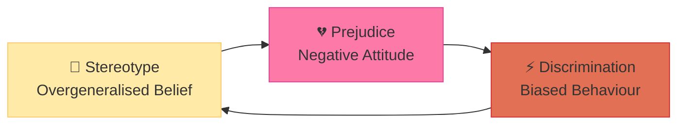
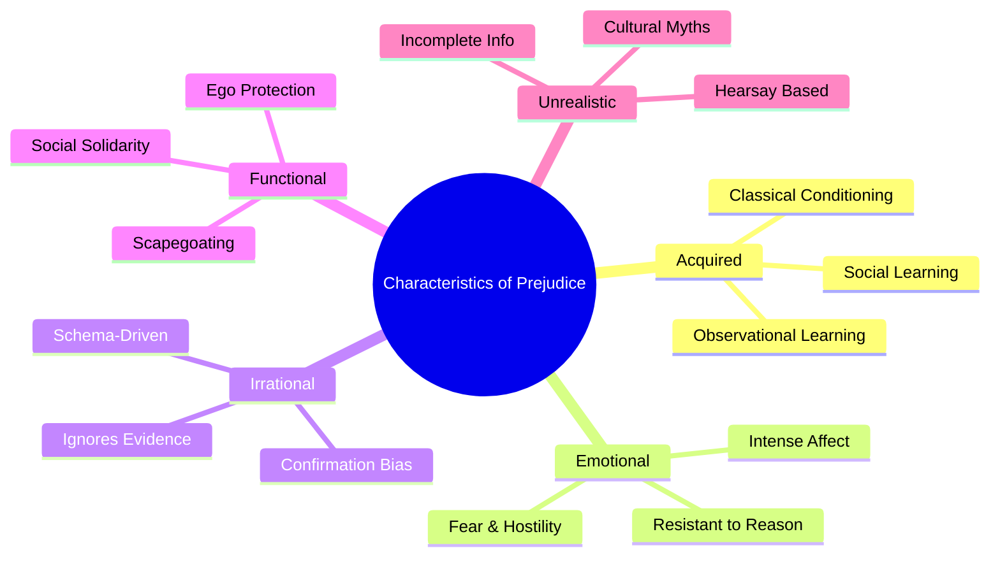

import Tabs from '@theme/Tabs';
import TabItem from '@theme/TabItem';

# Characteristics and Types of Prejudice

## Introduction

Prejudice is one of the most pervasive and damaging social phenomena that humanity grapples with. Social psychologists have long sought to understand its roots, manifestations, and remedies. While we often think of prejudice as simple bias, it is in fact a complex attitudinal system with deep psychological, social, and historical roots.

The most widely accepted definition comes from **Secord and Backman**: *"Prejudice is an attitude that predisposes a person to think, perceive, feel and act in favourable and unfavourable ways towards a group or its individual members."*

**Baron & Byrne** further clarify: *"Prejudice is generally a negative attitude towards the members of some social, ethnic or religious [group]."*

Prejudice, whether positive or negative, is fundamentally an **attitude** with all three attitudinal components:
- **Cognitive component**: Beliefs and stereotypes about the group
- **Affective component**: Emotional feelings (hatred, fear, admiration)
- **Behavioural component**: Predisposition to act in biased ways

:::info 📄 Source PDF
[MPC-004 Block-3/Unit-3.pdf — Pages 25–27](/pdfs/MPC-004%20Advanced%20Social%20Psychology/Block-3/Unit-3.pdf) | MPC-004 Advanced Social Psychology
:::

---

## Learning Objectives

After studying this section, you will be able to:
- Define prejudice and distinguish it from related concepts
- Describe the five key characteristics of prejudice
- Identify and explain the major types of prejudice
- Apply knowledge of prejudice to Indian social contexts
- Analyse how prejudice connects to attitude theory

---

## 1. Understanding Prejudice: Conceptual Clarity

### Prejudice vs. Stereotype vs. Discrimination

Before diving into characteristics, it's crucial to distinguish these related concepts:

| Concept | Definition | Component |
|---------|-----------|-----------|
| **Stereotype** | Overgeneralised belief about a group | Cognitive |
| **Prejudice** | Negative attitude/feeling toward a group | Affective + Cognitive |
| **Discrimination** | Biased behaviour against a group | Behavioural |

These three form a **cycle**: stereotypes fuel prejudice, which enables discrimination, which reinforces stereotypes.

### Key Theorists on Prejudice

- **Gordon Allport** (1954): *The Nature of Prejudice* — foundational text defining prejudice as "antipathy based upon a faulty and inflexible generalisation"
- **Pettigrew & Tropp** (2006): Meta-analysis of intergroup contact showing it reduces prejudice
- **Dovidio & Gaertner** (2004): Identified "aversive racism" — prejudice among people who consciously reject prejudiced views
- **Fiske** (1998): Stereotype Content Model — groups perceived on warmth/competence dimensions

**🔗 Learn more:**
- [Wikipedia: Prejudice](https://en.wikipedia.org/wiki/Prejudice)
- [Wikipedia: Attitude (Psychology)](https://en.wikipedia.org/wiki/Attitude_(psychology))
- [APA Dictionary: Prejudice](https://dictionary.apa.org/prejudice)

---

## 2. Characteristics of Prejudice

Psychologists have identified five fundamental characteristics that define prejudice:

### 2.1 Prejudice is Acquired

Unlike innate fears or reflexes, prejudice is **learned** through socialisation. Children are born without prejudice — they acquire it through:

- **Classical conditioning**: Associating a group with negative stimuli
- **Instrumental learning**: Being rewarded for expressing group-consistent attitudes
- **Observational learning**: Imitating parents, peers, and media portrayals

**Example from IGNOU text**: A child learns to hate Pakistanis because they observe significant others in their society expressing hostility toward Pakistanis.

**Research Support**: 
- Aboud's (1988) research on children found racial attitudes begin forming around age 3-4, largely through social learning
- Bigler & Liben (2006) showed that even arbitrary group distinctions become bases for prejudice when adults treat categories as meaningful

:::note 🇮🇳 Indian Context
In India, caste prejudice is transmitted through family socialisation — children learn which castes are "touchable" and "untouchable" before they understand why. Religious prejudice is similarly transmitted across generations.
:::

### 2.2 Emotional Overtones

Prejudice is **charged with emotion**. Unlike simple opinions, prejudiced attitudes are:
- Deeply felt rather than rationally held
- Either intensely positive (in-group love) or negative (out-group hostility)
- Resistant to change precisely because they are emotional, not rational

Positive prejudice shows: affection, care, sympathy, protectiveness  
Negative prejudice shows: hatred, dislike, hostility, fear, contempt

**Neuropsychological basis**: Brain imaging studies show that viewing out-group faces activates the amygdala (fear/threat centre) more than in-group faces, explaining the emotional intensity of prejudice (Phelps et al., 2000; Hart et al., 2000).

**🔗 Resources:**
- [Implicit Association Test (IAT)](https://implicit.harvard.edu/implicit/) — measure unconscious emotional bias
- [Wikipedia: Implicit bias](https://en.wikipedia.org/wiki/Implicit_bias)

### 2.3 Prejudice is Irrational

A defining feature of prejudice is its **resistance to contrary evidence**. The prejudiced person:
- Does not change their views when presented with facts
- Discounts individual exceptions ("You're one of the good ones")
- Uses confirmation bias to seek information that confirms their prejudice
- Employs motivated reasoning to explain away disconfirming evidence

This irrationality distinguishes prejudice from reasoned disagreement or cultural misunderstanding.

**Cognitive explanation**: Prejudice is supported by **schema-driven processing** — people process information about out-groups through pre-existing negative schemas, distorting new information to fit old beliefs.

### 2.4 Prejudice is Functional

Counterintuitively, prejudice **serves psychological needs** for the individual:

| Function | How Prejudice Serves It |
|----------|------------------------|
| **Self-esteem maintenance** | Feeling superior to a stigmatised group boosts self-worth |
| **Justification of exploitation** | Believing a group is inferior justifies treating them badly |
| **In-group solidarity** | Shared hostility to out-group strengthens in-group bonds |
| **Scapegoating** | Blaming out-group for one's frustrations provides emotional release |
| **Simplification** | Reduces complex social world to simple "us vs. them" categories |

**Classic Example (IGNOU text)**: In Indian society, upper-caste Hindus justified exploitation of lower castes by claiming "they are like that only and deserve to be exploited" — prejudice functioned to legitimise economic and social exploitation.

**🔗 Learn more:**
- [Wikipedia: Functional theories of attitude](https://en.wikipedia.org/wiki/Functional_theories_of_attitude)
- [Katz's Functional Theory of Attitudes](https://en.wikipedia.org/wiki/Katz%27s_functional_theory_of_attitudes)

### 2.5 Prejudice Has No Connection with Reality

Prejudice is built on:
- **Hearsay** rather than direct experience
- **Incomplete or distorted information**
- **Cultural traditions** passed down without critical examination
- **Stereotypes** that overgeneralise from limited examples

It cannot withstand logical scrutiny. When challenged with evidence, the prejudiced person typically responds with "exceptions prove the rule" reasoning rather than updating their beliefs.

---

## 3. Types of Prejudice

### 3.1 Racial Prejudice

Racial prejudice targets individuals based on their perceived racial group membership. It is perhaps the most extensively studied form of prejudice.

**Historical examples**:
- **Anti-Black racism in America**: Centuries of slavery, Jim Crow laws, and ongoing systemic discrimination
- **Nazi Germany**: Jews, Roma, and others targeted for extermination based on racial ideology
- **Apartheid South Africa**: Legal segregation based on racial classification

**Modern manifestations**:
- **Aversive racism**: Covert prejudice among people who consciously reject racist views but show bias in ambiguous situations
- **Microaggressions**: Subtle, everyday slights that communicate racial bias
- **Structural racism**: Biases embedded in institutions (housing, employment, criminal justice)

**🔗 Resources:**
- [Wikipedia: Racism](https://en.wikipedia.org/wiki/Racism)
- [Wikipedia: Aversive racism](https://en.wikipedia.org/wiki/Aversive_racism)
- [Research: Racial bias in hiring (Bertrand & Mullainathan, 2004)](https://www.nber.org/papers/w9873)

### 3.2 Sex Prejudice (Gender Prejudice)

Sex prejudice has historically disadvantaged women, portraying them as:
- Intellectually inferior to men
- Emotionally unstable and unfit for leadership
- Suited only for domestic roles
- Dependent and weak

**Sexism types** (Glick & Fiske's Ambivalent Sexism Theory):
- **Hostile sexism**: Overtly negative attitudes toward women who challenge traditional roles
- **Benevolent sexism**: Seemingly positive but patronising attitudes that restrict women's roles

**Contemporary data**:
- Gender pay gap persists globally — women earn ~84% of men's wages in comparable roles
- Women remain underrepresented in politics, corporate leadership, and STEM fields
- "Glass ceiling" effects documented across industries

**🔗 Resources:**
- [Wikipedia: Sexism](https://en.wikipedia.org/wiki/Sexism)
- [Wikipedia: Ambivalent sexism](https://en.wikipedia.org/wiki/Ambivalent_sexism)

### 3.3 Caste Prejudice (India-Specific)

India's caste system represents one of the world's most entrenched institutionalised prejudice systems:

**Structure of caste prejudice**:
- Brahmins (highest): Attributed wisdom, spirituality, leadership
- Kshatriyas: Attributed courage and warrior qualities
- Vaishyas: Attributed business acumen
- Shudras: Attributed as fit only for service roles
- **Dalits ("Untouchables")**: Attributed pollution, impurity, inferiority

**Mechanisms of caste prejudice**:
- Religious justification through karma and dharma
- Occupational segregation (certain castes "destined" for certain work)
- Restrictions on inter-dining, intermarriage, temple entry, water access

**Contemporary issues**:
- Despite constitutional abolition, caste discrimination persists
- Caste-based violence remains a serious problem
- Reservation policies (affirmative action) as remedy remain controversial
- Urban migration has reduced but not eliminated caste barriers

:::note Research
A 2022 study by Gaikwad et al. found that Dalit job applicants with identical qualifications to upper-caste applicants receive significantly fewer callbacks in Indian cities, demonstrating persistent caste discrimination.
:::

**🔗 Resources:**
- [Wikipedia: Caste system in India](https://en.wikipedia.org/wiki/Caste_system_in_India)
- [Wikipedia: Discrimination against Dalits](https://en.wikipedia.org/wiki/Discrimination_against_Dalits)

### 3.4 Language Prejudice (Linguistic Prejudice)

Language prejudice involves negative attitudes toward speakers of particular languages or dialects:

**Indian context** (from IGNOU text):
- Hindi-speaking populations face prejudice in South India
- People in South India prefer English over Hindi as a "neutral" national language
- Organisation of states along linguistic lines has institutionalised language identity
- Hindi imposition perceived as Northern cultural dominance

**Broader linguistic prejudice**:
- **Accent discrimination**: Speakers of non-standard accents face employment discrimination
- **Dialect prejudice**: Non-standard dialects associated with lower intelligence/education
- **Language vitality**: Minority language speakers face pressure to assimilate

**Research**: Experiments using "matched guise" technique consistently show that identical content is rated differently when delivered in "standard" vs. "accented" speech, demonstrating linguistic prejudice.

**🔗 Resources:**
- [Wikipedia: Linguistic discrimination](https://en.wikipedia.org/wiki/Linguistic_discrimination)
- [Wikipedia: Language conflict in India](https://en.wikipedia.org/wiki/Language_conflict_in_India)

### 3.5 Religious Prejudice

Religious prejudice involves hostility or discrimination based on religious affiliation:

**India's experience** (from IGNOU text):
- Religious differences led to India-Pakistan partition in 1947
- Hindu-Muslim tensions have historical and contemporary dimensions
- Religious prejudice involves "ingroup love" paired with "outgroup hate"
- Misconceptions and misunderstandings develop when groups don't interact

**Global manifestations**:
- **Antisemitism**: Prejudice against Jewish people — Europe's oldest continuous prejudice
- **Islamophobia**: Anti-Muslim prejudice, intensified post-9/11
- **Anti-Christian persecution**: In several Asian and Middle Eastern countries
- **Sectarian prejudice**: Sunni-Shia, Catholic-Protestant conflicts

**Psychological basis**:
- Religious identity is particularly central to self-concept (Terror Management Theory)
- Threats to one's religious worldview trigger defence mechanisms including prejudice
- Religious out-groups seen as symbolic threats to one's mortality worldview

**🔗 Resources:**
- [Wikipedia: Religious persecution](https://en.wikipedia.org/wiki/Religious_persecution)
- [Wikipedia: Antisemitism](https://en.wikipedia.org/wiki/Antisemitism)

### 3.6 Other Types of Prejudice

- **Political prejudice**: Hostility toward members of opposing political parties
- **Communal prejudice**: Based on regional/community identity
- **Age prejudice (Ageism)**: Negative attitudes toward elderly or young people
- **Homophobia**: Prejudice against LGBTQ+ individuals
- **Xenophobia**: Prejudice against foreigners/immigrants
- **Classism**: Prejudice based on socioeconomic class

---

## 4. Recent Research on Prejudice (2020–2024)

### The "Prejudice Habit-Breaking" Approach
Forscher et al. (2019, replicated 2021) found that interventions targeting automatic associations can reduce implicit prejudice over time through deliberate practice — suggesting prejudice can be "unlearned."

### COVID-19 and Prejudice
The pandemic triggered significant increases in anti-Asian prejudice globally. Studies show a 70-80% increase in anti-Asian hate incidents in Western countries (Tessler et al., 2020), demonstrating how crisis situations activate pre-existing prejudice.

### Intersectionality and Prejudice
Research increasingly shows that prejudice operates differently based on intersecting identities. Women of colour, for example, face both racial AND gendered prejudice simultaneously — not simply the sum of each (Purdie-Vaughns & Eibach, 2008; extended by Ghavami & Peplau, 2020).

**🔗 Recent Research:**
- [Forscher et al. (2019): Prejudice habit breaking - PNAS](https://www.pnas.org/doi/10.1073/pnas.1818435116)
- [Tessler et al. (2020): COVID and anti-Asian prejudice](https://www.ncbi.nlm.nih.gov/pmc/articles/PMC7334950/)

---

## 5. Measuring Prejudice

### Explicit Measures
- **Likert scale attitude surveys**: Direct self-report of prejudiced attitudes
- **Bogardus Social Distance Scale**: Measures willingness to associate with out-groups
- **Modern Racism Scale**: Detects subtle/covert forms of racial prejudice

### Implicit Measures
- **Implicit Association Test (IAT)**: Measures automatic associations between groups and concepts
- **Affect Misattribution Procedure (AMP)**: Measures unconscious evaluative reactions
- **Eye-tracking studies**: Measures attention allocation to in/out-group members

**Challenge**: People underreport explicit prejudice due to social desirability, making implicit measures increasingly important.

---

## 6. Educational Video Resources

- 📹 [Crash Course Psychology #39: Prejudice and Discrimination](https://www.youtube.com/watch?v=7P0iP2Zm6a4) — Excellent overview for exam prep
- 📹 [TED: How to overcome our biases? Walk boldly toward them (Verna Myers)](https://www.ted.com/talks/verna_myers_how_to_overcome_our_biases_walk_boldly_toward_them)
- 📹 [BBC Documentary: The Science of Prejudice](https://www.youtube.com/watch?v=C0S7M1T-4as)

---

## 🧪 Self-Assessment Questions

<Tabs>
  <TabItem value="basic" label="Basic (2 marks)" default>

1. Define prejudice according to Secord and Backman.
2. List the three components of prejudice as an attitude.
3. What does "prejudice is acquired" mean? Give one example.
4. Name five types of prejudice discussed in MPC-004.

  </TabItem>
  <TabItem value="intermediate" label="Intermediate (5 marks)">

1. Explain any three characteristics of prejudice with suitable examples from Indian society.
2. Distinguish between prejudice, stereotype, and discrimination with examples.
3. Describe the functional aspects of prejudice — how does prejudice serve psychological needs?
4. Explain caste prejudice in India with reference to its historical development and current status.

  </TabItem>
  <TabItem value="exam" label="Exam-Style (10 marks)">

1. **Define prejudice and describe its main characteristics.** Illustrate each characteristic with appropriate examples from the Indian social context. (10 marks)
2. **"Prejudice is functional."** Critically examine this statement with reference to psychological theories and empirical research. (10 marks)
3. **Discuss the various types of prejudice prevalent in Indian society.** How have constitutional and legal measures attempted to address these? (10 marks)

  </TabItem>
</Tabs>

---

## 🧠 Memory Aids

### The "AFRAID" Mnemonic for Characteristics of Prejudice
- **A** — **Acquired** (learned through socialisation, not innate)
- **F** — **Functional** (serves psychological needs — ego, solidarity)
- **R** — **Resistant** to change (irrational, ignores contrary evidence)
- **A** — **Affective** (emotionally charged, not purely cognitive)
- **I** — **Inaccurate** (no connection with reality, based on hearsay)
- **D** — **Directed** at groups (group-level attitude, not individual assessment)

### Types Mnemonic: "RSCRLP"
- **R**acial — targeting race/ethnicity
- **S**ex/Gender — targeting women (historically)
- **C**aste — Indian social hierarchy
- **R**eligious — based on faith/belief
- **L**anguage — based on language/dialect
- **P**olitical/Other — various other forms

---

## 📚 Further Reading

- Allport, G. W. (1954). *The Nature of Prejudice*. Addison-Wesley — the foundational text
- [Wikipedia: Prejudice](https://en.wikipedia.org/wiki/Prejudice)
- [Wikipedia: Racism](https://en.wikipedia.org/wiki/Racism)
- [Wikipedia: Caste system in India](https://en.wikipedia.org/wiki/Caste_system_in_India)
- [Wikipedia: Ambivalent sexism](https://en.wikipedia.org/wiki/Ambivalent_sexism)
- Aronson, E., Wilson, T. D., & Akert, R. M. (2010). *Social Psychology* (7th ed.). Prentice Hall.
- Crisp, R. J., & Turner, R. N. (2010). *Essential Social Psychology* (2nd ed.). Sage.

---

**Next:** [Discrimination, Development & Maintenance of Prejudice →](/mpc-004/block-3/discrimination-development-maintenance-prejudice)
