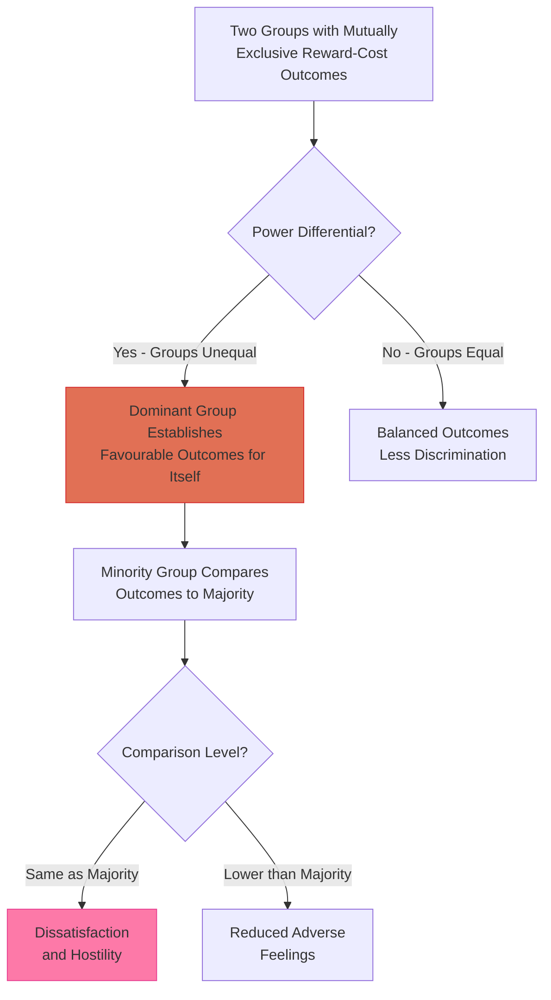
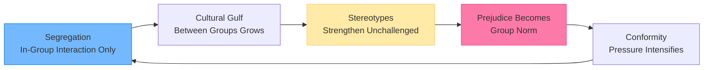
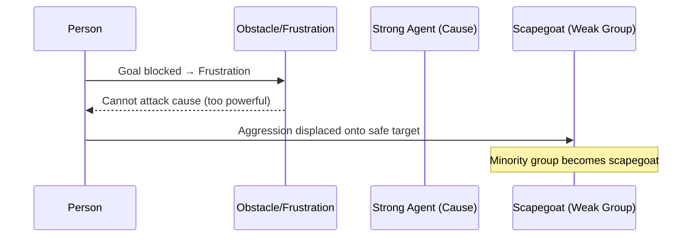
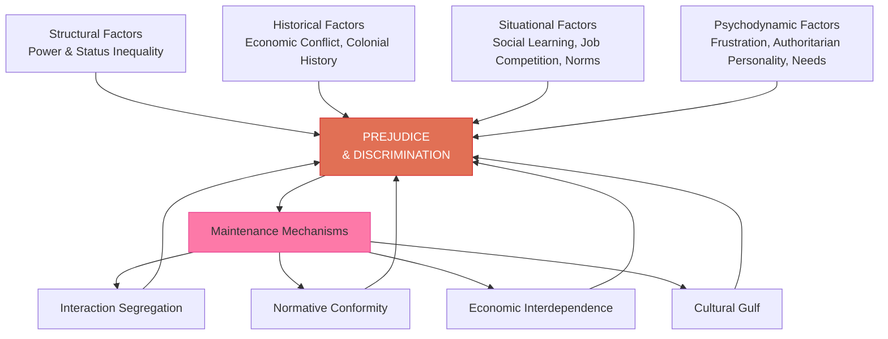

import Tabs from '@theme/Tabs';
import TabItem from '@theme/TabItem';

# Discrimination and the Development & Maintenance of Prejudice

## Introduction

Understanding why prejudice and discrimination emerge and persist is one of social psychology's most important questions. If we can identify the roots of these phenomena, we have a better chance of eradicating them.

This unit examines:
1. **Discrimination** — what it is, how it operates, and its social consequences
2. **Development of prejudice** — the causal factors that give rise to prejudice
3. **Maintenance of prejudice** — why prejudice persists once established

:::info 📄 Source PDF
[MPC-004 Block-3/Unit-3.pdf — Pages 27–31](/pdfs/MPC-004%20Advanced%20Social%20Psychology/Block-3/Unit-3.pdf) | MPC-004 Advanced Social Psychology
:::

---

## Learning Objectives

After studying this section, you will be able to:
- Define discrimination and distinguish it from prejudice
- Explain Exchange Theory's account of discrimination
- Identify and analyse structural, historical, situational, and psychodynamic causes of prejudice
- Describe the role of authoritarian personality in prejudice
- Explain how interaction patterns maintain prejudice

---

## 1. Understanding Discrimination

### Definition

**Discrimination** is the **differential treatment** of individuals based on their membership in a particular social group. It is typically the **overt behavioural expression** of prejudice.

Key features of discrimination:
- It involves **action**, not just attitude
- It denies minority group members privileges/rights accorded to majority members
- It can occur **with or without** accompanying prejudice
- It maintains and reinforces social inequality

**Example from IGNOU text**: In Indian society, lower-caste people were historically denied access to wells used by upper castes, prohibited from sitting before upper-caste people, and subjected to numerous restrictions — not because of individual choice but because of their birth into a particular caste.

### Discrimination Without Prejudice

Importantly, discrimination can occur without personal prejudice:

**Example**: A business proprietor may refuse to serve minority group members **not** because they personally hate that group, but because they fear losing majority customers. The discrimination is driven by **economic calculation** rather than personal hostility.

This distinction has important implications:
- Anti-discrimination laws can change **behaviour** even when they cannot change **attitudes**
- Institutional discrimination can perpetuate without requiring individual prejudice
- "Aversive racism" — people who reject prejudice but discriminate in ambiguous situations

### Exchange Theory Explanation of Discrimination

The **Exchange Theory** (Thibaut & Kelley) provides an economic analysis of discrimination:

**Key insight**: When group rewards are **zero-sum** (one group's gain is another's loss), discrimination becomes a rational strategy for the dominant group to maintain advantages. Minority group reactions depend on their **comparison level** relative to the dominant group.

**Determinants of minority comparison level**:
- Past experiences of the group
- Outcomes available in alternative relationships
- Structural and cultural factors specific to that society

---

## 2. Development of Prejudice: Causal Factors

Psychologists have identified several categories of factors that cause prejudice to develop:

### 2.1 Status and Power Structures

The **structure of intergroup relations** in terms of power differentials can generate prejudice:

**Mechanism**: When one group holds another in a condition of subjugation (e.g., slavery), the subjugated group **behaves in ways that confirm stereotypes** — not because of inherent traits, but because the power structure **forces** that behaviour.

**Classic example**: Slaves appear "lazy and irresponsible" because:
- They act upon masters' orders rather than showing initiative
- They are given no opportunity to demonstrate responsibility
- Their behaviour is controlled by the power structure, not their character

This creates a self-fulfilling prophecy where the dominant group's beliefs are "confirmed" by behaviour that their own oppression produces.

**🔗 Related concept**: [Wikipedia: Self-fulfilling prophecy](https://en.wikipedia.org/wiki/Self-fulfilling_prophecy)

:::note 🇮🇳 Indian Caste Example
Dalits who historically performed "unclean" occupations (leather working, sweeping) were stereotyped as "impure" — ignoring that the power structure **assigned** them these roles, then used those roles to justify discrimination.
:::

### 2.2 Historical Factors

Prejudice develops from **historical patterns** of economic conflict and power distribution:

**Historical mechanisms**:

| Historical Pattern | Resulting Prejudice |
|-------------------|---------------------|
| Economic competition between groups | Ethnic/national prejudice |
| Gender-based division of labour | Sex prejudice against women |
| Occupational roles assigned to ethnic groups | Ethnic stereotypes tied to occupation |
| Colonial relationships | Racial prejudice |

**Case Study: Anti-Jewish Prejudice** (from IGNOU text):
- The Christian Church prohibited Christians from lending money at interest
- Jews were permitted to serve as moneylenders
- Jews became prosperous bankers when this profession was highly profitable
- The stereotype of Jews as "rich, grasping, and shrewd" emerged from this historical-occupational role
- Competitive resentment then turned this occupational stereotype into prejudice

**Indian example**: Women have historically been subjected to atrocities, which they tolerated as "duty." This created and reinforced sex prejudice portraying women as weak, dependent, and fit only for certain roles.

**🔗 Resources:**
- [Wikipedia: Historical sociology of prejudice](https://en.wikipedia.org/wiki/Prejudice#History)
- [Wikipedia: History of antisemitism](https://en.wikipedia.org/wiki/History_of_antisemitism)

### 2.3 Situational Factors

Several situational factors in the immediate environment lead to prejudice development:

#### Social Learning

Children acquire prejudices through **agents of socialisation**:
- **Parents**: Model prejudiced attitudes and behaviour
- **Schools**: Curriculum may include biased content or teacher expectations
- **Peer groups**: Social acceptance tied to conformity to group prejudices  
- **Religious institutions**: May promote "in-group superiority" narratives
- **Media**: Stereotyped portrayals normalise prejudice

**Childrearing practices**: Authoritarian parenting (high control, low warmth) has been shown to produce more prejudiced children — a finding replicated across cultures.

#### Job Competition (Economic Threat)

Economic competition is a powerful trigger for inter-group prejudice. When resources are scarce:
- Outgroups are perceived as competitors threatening in-group economic security
- **Realistic Group Conflict Theory** (Sherif, 1966): Actual competition over resources produces inter-group hostility
- **Economic threat perception** can generate prejudice even without actual competition

**Indian example from IGNOU text**: The **Marathi movement against North Indians in Mumbai** illustrates economic-based prejudice:
- North Indians work longer hours at cheaper wages
- They gradually displaced local Marathi workers from traditional jobs
- This created the belief that "North Indians are responsible for our plight"
- Leading to prejudice and violence against North Indian migrants

**🔗 Resources:**
- [Wikipedia: Realistic group conflict theory](https://en.wikipedia.org/wiki/Realistic_group_conflict_theory)
- [Wikipedia: Sons of the soil movement](https://en.wikipedia.org/wiki/Sons_of_the_soil_movement)

#### Conformity to Norms

Once prejudice becomes **normative** within a group:
1. Members expect each other to hold prejudiced views
2. Expression of prejudice receives social approval
3. Non-conformity (rejecting prejudice) receives social punishment
4. Prejudice becomes a requirement for group membership

This creates a **social maintenance mechanism** where prejudice survives even if individual members privately reject it, because the social cost of non-conformity is too high.

#### Interaction Patterns

Patterns of social interaction **maintain* the conditions that produce prejudice:
- Segregation prevents corrective intergroup contact
- In-group interaction strengthens cultural distinctiveness
- Economic interdependence within groups increases cohesion
- Group cohesion increases pressure for conformity to prejudiced norms

---

## 3. Psychodynamic Factors in Prejudice

Beyond social and structural factors, individual psychology plays a crucial role in predisposing people to prejudice.

### 3.1 Frustration-Aggression Theory (Scapegoating)

**Dollard et al.'s (1939) Frustration-Aggression Hypothesis** explains prejudice through:

1. **Frustration** arises when an obstacle blocks goal achievement
2. **Aggression** is generated toward the source of frustration
3. If the frustrating agent is **too powerful** to be attacked directly, aggression is **displaced**
4. Displacement targets a **weaker, safer** target — the **scapegoat**

**Classic research**: During economic downturns, when people experience more frustration, rates of intergroup violence historically increase (Hovland & Sears, 1940 — though later research has complicated this finding).

**Modern application**: High-stress periods (economic recession, social disruption, pandemics) tend to increase scapegoating of minority groups.

**🔗 Resources:**
- [Wikipedia: Scapegoating](https://en.wikipedia.org/wiki/Scapegoating)
- [Wikipedia: Frustration-aggression hypothesis](https://en.wikipedia.org/wiki/Frustration%E2%80%93aggression_hypothesis)

### 3.2 Authoritarian Personality

**Adorno et al.'s (1950) research** on the authoritarian personality remains one of psychology's most influential — and most debated — theories of prejudice.

**Key characteristics of authoritarian personality**:

| Trait | Description |
|-------|-------------|
| **Rigid thinking** | Black-and-white worldview, intolerance of ambiguity |
| **Punitive tendency** | Strong belief in punishment for rule-breaking |
| **Power orientation** | Values people according to their power/status |
| **In-group submission** | Submissive to authority figures above oneself |
| **Out-group aggression** | Hostile and contemptuous toward those below |
| **Ethnocentrism** | Belief in the inherent superiority of one's own group |

**The F-Scale (Fascism Scale)**: Adorno et al. developed this measure to assess authoritarian tendencies. High scorers on the F-Scale showed higher prejudice toward ethnic minorities, women, and other marginalised groups.

**Criticism**: The concept has been criticised for:
- Political bias (measured only "right-wing authoritarianism" initially)
- Methodological limitations in original research
- Altemeyer later developed more rigorous "Right-Wing Authoritarianism" (RWA) scale

**Modern relevance**: Altemeyer's (1981) RWA scale continues to be one of the strongest predictors of prejudiced attitudes across cultures.

**🔗 Resources:**
- [Wikipedia: Authoritarian personality](https://en.wikipedia.org/wiki/Authoritarian_personality)
- [Wikipedia: F-scale (personality test)](https://en.wikipedia.org/wiki/F-scale_(personality_test))
- [Wikipedia: Right-wing authoritarianism](https://en.wikipedia.org/wiki/Right-wing_authoritarianism)

### 3.3 Personality Needs

Various personality needs can support prejudice development:

#### Intolerance for Ambiguity

- Some individuals are deeply uncomfortable with uncertainty and complexity
- They prefer clear, unambiguous categories: things are either "good" or "bad"
- Prejudice **reduces ambiguity** by providing clear categorisations of people
- Research consistently shows that intolerance for ambiguity predicts prejudice

**Example**: A person who is anxious about social interactions may categorise entire groups as "friendly" (in-group) or "hostile" (out-group), reducing the anxiety of evaluating each individual separately.

#### Need for Superior Status

- Some individuals need to feel superior to maintain self-esteem
- Prejudice provides a **ready-made inferior group** to feel superior to
- This explains why people with fragile self-esteem may show more prejudice
- **System Justification Theory** (Jost et al., 2004): People are motivated to see the existing hierarchy as fair and legitimate

#### Need for Security

- Insecure individuals may use rejection of out-groups to strengthen in-group belonging
- Terror Management Theory: Reminders of mortality increase in-group favoritism and out-group derogation
- Belonging to a clearly defined group provides psychological security

**🔗 Resources:**
- [Wikipedia: Terror management theory](https://en.wikipedia.org/wiki/Terror_management_theory)
- [Wikipedia: System justification](https://en.wikipedia.org/wiki/System_justification)

---

## 4. Integrated Model of Prejudice Development

---

## 5. Recent Research on Discrimination (2020–2024)

### Algorithmic Discrimination
Recent research documents how AI systems can perpetuate and amplify discrimination. Hiring algorithms trained on historical data reproduce existing biases. Facial recognition systems show higher error rates for darker-skinned individuals (Buolamwini & Gebru, 2018; updated analyses 2021-2022).

### Intersectional Discrimination
Studies show that individuals with multiple minority identities (e.g., Black women) face unique forms of discrimination not captured by adding racial + gender discrimination separately. This intersectional discrimination has been documented in hiring, healthcare, and legal contexts.

### COVID-19 as a Natural Experiment
The pandemic provided a test of frustration-aggression theory: research showed increased hate crimes against Asian Americans correlated with COVID-19 case surges — consistent with scapegoating predictions (Tessler et al., 2020; Zhang & Larimer, 2021).

**🔗 Recent Research:**
- [Buolamwini & Gebru (2018): Gender Shades — AI bias](https://proceedings.mlr.press/v81/buolamwini18a.html)
- [Pew Research: Discrimination in America](https://www.pewresearch.org/social-trends/2021/03/25/in-their-own-words-perceptions-of-discrimination/)
- [WHO: Social determinants and discrimination in health](https://www.who.int/health-topics/social-determinants-of-health)

---

## 6. Educational Resources

- 📹 [Crash Course Psychology: Discrimination](https://www.youtube.com/watch?v=qsFgJZWS8fA)
- 📹 [Jane Elliott's Blue Eyes/Brown Eyes experiment](https://www.youtube.com/watch?v=jPZEJHJPwIw) — Classic demonstration of discrimination effects
- 📹 [TED: The danger of a single story (Chimamanda Ngozi Adichie)](https://www.ted.com/talks/chimamanda_ngozi_adichie_the_danger_of_a_single_story)

---

## 🧪 Self-Assessment Questions

<Tabs>
  <TabItem value="basic" label="Basic (2 marks)" default>

1. What is discrimination? How does it differ from prejudice?
2. According to Exchange Theory, when does discrimination arise between groups?
3. What is scapegoating? Give one historical example.
4. Name three situational factors that contribute to the development of prejudice.

  </TabItem>
  <TabItem value="intermediate" label="Intermediate (5 marks)">

1. Explain Exchange Theory's account of how discrimination develops between unequal groups.
2. Using the Frustration-Aggression hypothesis, explain why minority groups often become scapegoats during economic crises.
3. Describe the authoritarian personality and explain how it contributes to prejudice. What are its limitations as a theory?
4. Explain how social learning and job competition as situational factors contribute to the development of prejudice. Illustrate with Indian examples.

  </TabItem>
  <TabItem value="exam" label="Exam-Style (10 marks)">

1. **Discuss in detail the factors responsible for the development and maintenance of prejudice and discrimination.** Organise your answer under structural, historical, situational, and psychodynamic categories. (10 marks)
2. **Critically examine the role of personality factors in prejudice, with special reference to authoritarian personality and intolerance for ambiguity.** (10 marks)
3. **"Discrimination can occur without prejudice."** Examine this statement with the help of Exchange Theory and give examples from contemporary society. (10 marks)

  </TabItem>
</Tabs>

---

## 🧠 Memory Aids

### "SHIPS" for Development of Prejudice
- **S** — **Status and Power structures** (structural inequality creates prejudice)
- **H** — **Historical factors** (past conflicts, economic competition)
- **I** — **Interaction patterns** (segregation maintains prejudice)
- **P** — **Psychodynamic factors** (frustration, authoritarian personality)
- **S** — **Situational factors** (social learning, job competition, norms)

### Frustration-Aggression Sequence
**Goal → Block → Frustration → Aggression → Displacement → Scapegoat**

"When you can't hit the boss, you kick the dog."

### Authoritarian Personality Features: "ROPES"
- **R**igid thinking (black and white)
- **O**bedience to authority (submissive to power above)
- **P**unitive tendency (harsh punishment for deviance)
- **E**thnocentrism (in-group superiority)
- **S**tatus consciousness (values people by power)

---

## 📚 Further Reading

- Adorno, T. W., Frenkel-Brunswik, E., Levinson, D. J., & Sanford, R. N. (1950). *The Authoritarian Personality*. Harper & Row
- [Wikipedia: Authoritarian personality](https://en.wikipedia.org/wiki/Authoritarian_personality)
- [Wikipedia: Realistic group conflict theory](https://en.wikipedia.org/wiki/Realistic_group_conflict_theory)
- [Wikipedia: Scapegoating](https://en.wikipedia.org/wiki/Scapegoating)
- [Wikipedia: Frustration-aggression hypothesis](https://en.wikipedia.org/wiki/Frustration%E2%80%93aggression_hypothesis)
- Sherif, M. (1966). *In Common Predicament: Social Psychology of Intergroup Conflict and Cooperation*. Houghton Mifflin
- Altemeyer, B. (1981). *Right-wing Authoritarianism*. University of Manitoba Press

---

**Previous:** [Characteristics and Types of Prejudice ←](/mpc-004/block-3/characteristics-types-prejudice)  
**Next:** [Manifestation & Methods of Reducing Prejudice →](/mpc-004/block-3/manifestation-reducing-prejudice-discrimination)
