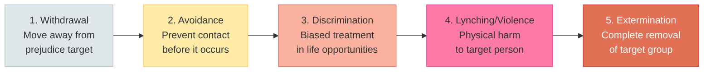
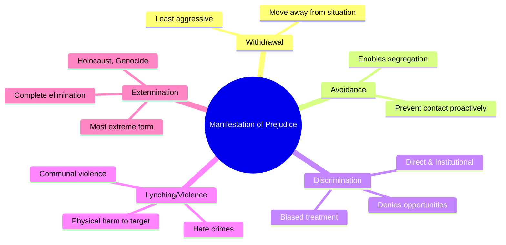
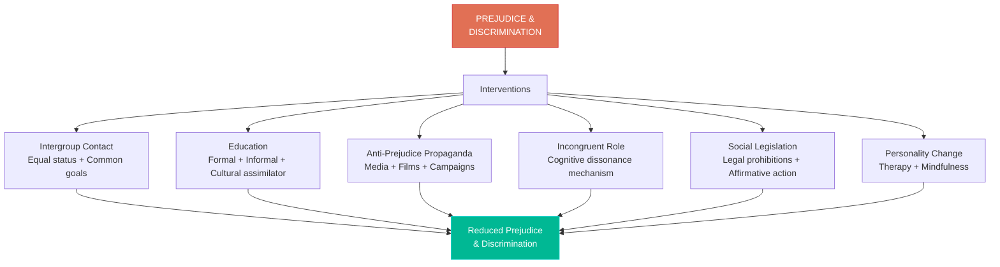

import Tabs from '@theme/Tabs';
import TabItem from '@theme/TabItem';

# Manifestation of Prejudice and Methods of Reducing Prejudice & Discrimination

## Introduction

Prejudice does not exist only as an internal attitude — it expresses itself outwardly through behaviour. Understanding how prejudice **manifests** helps us recognise it in everyday life. Equally important is knowing how to **reduce** prejudice and discrimination, which is among social psychology's most practically important applications.

This unit covers:
1. **Manifestation of prejudice** — the behavioural spectrum from withdrawal to extermination
2. **Methods of reducing prejudice** — seven evidence-based approaches

:::info 📄 Source PDF
[MPC-004 Block-3/Unit-3.pdf — Pages 31–34](/pdfs/MPC-004%20Advanced%20Social%20Psychology/Block-3/Unit-3.pdf) | MPC-004 Advanced Social Psychology
:::

---

## Learning Objectives

After studying this section, you will be able to:
- Explain Allport's five-stage scale of prejudice manifestation
- Describe withdrawal, avoidance, discrimination, lynching, and extermination
- Identify and evaluate at least six methods of reducing prejudice
- Explain the conditions under which intergroup contact reduces prejudice
- Apply knowledge of prejudice reduction to Indian social policy

---

## 1. Manifestation of Prejudice: The Behavioural Spectrum

Prejudice, as an attitude, is observable only through behaviour. A prejudiced person may express their attitude through a **range of behaviours** of increasing severity.

**Allport's Scale of Prejudice** (from the IGNOU text) describes five modes of prejudice manifestation:

### 1.1 Withdrawal

**Definition**: Moving away from situations involving the target of prejudice.

**Characteristic**: The person does **not try to remove the target** — they simply leave the situation themselves.

**Example from IGNOU text**: A person prejudiced against Jews arrives at a party and discovers Jews have been invited. Instead of making the Jews leave, they themselves decide to leave the party.

**Psychological features**:
- Least aggressive manifestation
- Maintains physical and emotional distance without direct confrontation
- May reflect discomfort rather than active hostility
- Common in societies where overt discrimination is socially sanctioned against

### 1.2 Avoidance

**Definition**: Proactively preventing contact with the target of prejudice before the situation arises.

**Distinction from withdrawal**: Avoidance is **preventive** (before contact); withdrawal is **reactive** (after encountering the target).

**Example from IGNOU text**: The person who dislikes Jews learns in advance that Jews will be at a party, and therefore decides not to attend at all — avoiding the situation entirely.

**Psychological features**:
- Requires more active planning than withdrawal
- Reflects stronger motivation to maintain separation
- Enables the prejudiced person to preserve their worldview by avoiding disconfirming evidence
- Common in residential segregation, school choice, workplace preferences

:::note
Avoidance is particularly insidious because it **prevents** the corrective intergroup contact that could reduce prejudice. Segregated housing, schools, and social spaces perpetuate prejudice precisely by enabling avoidance.
:::

### 1.3 Discrimination

**Definition**: **Biased behaviour** against the target of prejudice that denies them opportunities, rights, or fair treatment.

**This is where prejudice crosses into social harm** — denying people life opportunities based on group membership rather than individual merit.

**Example from IGNOU text**: A teacher prejudiced against a particular community:
- Fails students from that community despite their merit
- Does not select qualified students from that community for school teams
- Applies different standards based on group membership

**Types of discrimination**:

| Type | Examples |
|------|---------|
| **Direct/Overt** | Refusing to hire someone because of their caste/religion/race |
| **Indirect/Covert** | Applying requirements that disproportionately exclude minority groups |
| **Institutional** | Policies and practices embedded in organisations that disadvantage minorities |
| **Interpersonal** | Individual acts of unfair treatment in daily interactions |
| **Structural** | System-wide patterns of disadvantage (wealth gaps, educational access, health disparities) |

**🔗 Resources:**
- [Wikipedia: Discrimination](https://en.wikipedia.org/wiki/Discrimination)
- [Wikipedia: Institutional racism](https://en.wikipedia.org/wiki/Institutional_racism)

### 1.4 Lynching (Physical Violence)

**Definition**: Behaviour aimed at causing **physical harm** to the target of prejudice.

**Example from IGNOU text**: The prejudiced teacher in the earlier example goes to the extreme of physically punishing students from the discriminated-against community without reasonable grounds.

**Broader manifestations**:
- Hate crimes against racial, religious, or sexual minority groups
- Communal violence in India (Hindu-Muslim riots, caste violence)
- Anti-LGBTQ+ violence
- Mob violence against scapegoated groups

**Social psychology of violence**: Violence against out-groups is typically preceded by:
1. **Dehumanisation** — portraying the out-group as less than human
2. **Moral exclusion** — placing the out-group outside one's scope of moral concern
3. **Normative support** — group norms that endorse or excuse violence

**🔗 Resources:**
- [Wikipedia: Hate crime](https://en.wikipedia.org/wiki/Hate_crime)
- [Wikipedia: Communal violence in India](https://en.wikipedia.org/wiki/Communal_violence_in_India)

### 1.5 Extermination

**Definition**: The most extreme manifestation — aimed at **completely eliminating** the target group.

**Example from IGNOU text**: Hitler's Holocaust — the systematic extermination of 6 million Jews and millions of others. Hitler's Aryan ideology motivated the attempted elimination of groups he deemed racially "impure."

**Historical instances of extermination**:
- **Holocaust**: 6 million Jews, plus Roma, disabled people, homosexuals, political prisoners
- **Rwandan Genocide (1994)**: ~800,000 Tutsi killed in 100 days
- **Armenian Genocide**: ~1.5 million Armenians killed 1915-1923
- **Cambodian Genocide**: 1.5–2 million killed under Khmer Rouge

**Psychological prerequisites for genocide** (Zimbardo, 2007; Staub, 2011):
- Complete dehumanisation of target group
- Authoritarian government that legitimises killing
- Gradual escalation from discrimination to violence
- Bystander inaction normalising violence
- Perpetrator diffusion of responsibility through bureaucratic structures

---

## 2. Methods of Reducing Prejudice and Discrimination

Social psychologists have developed and tested multiple approaches to reducing prejudice. None works in isolation; the most effective interventions typically combine several approaches.

### 2.1 Intergroup Contact Theory

**Allport's Contact Hypothesis (1954)** was the first systematic psychological approach to prejudice reduction.

**Core principle**: Contact between members of prejudiced and target groups can reduce prejudice — but only under specific conditions.

**Allport's four conditions for effective contact**:

| Condition | Description | Example |
|-----------|-------------|---------|
| **Equal Status** | Both groups must have equal status in the contact situation | Not master-servant, but colleague-colleague |
| **Intimate Contact** | Interaction must be genuine, not superficial | Working closely together, not just being in the same space |
| **Common Goals** | Success of both groups must be interdependent | Both need each other to succeed at a shared task |
| **Institutional Support** | Contact must be endorsed by authority figures | Teacher/government explicitly supports positive contact |

**Why equal status matters**: Superficial contact (e.g., a white employer and their Black employee) may **reinforce** stereotypes if the status differential is replicated in the contact situation.

**Research support**: Meta-analysis by Pettigrew & Tropp (2006) of 515 studies found that intergroup contact consistently reduces prejudice. The effect size is larger when Allport's conditions are met.

**🔗 Resources:**
- [Wikipedia: Contact hypothesis](https://en.wikipedia.org/wiki/Contact_hypothesis)
- [Pettigrew & Tropp (2006): Meta-analysis — 515 studies](https://psycnet.apa.org/record/2006-07099-001)

:::note 🇮🇳 Indian Application
Mixed-caste and mixed-religion residential communities, intermarriage, and integrated workplaces can reduce caste and religious prejudice — but only when the four conditions are met. Forced integration without equal status (e.g., putting a Dalit in a subordinate role) may not reduce prejudice.
:::

### 2.2 Education

Education is a multi-dimensional tool for prejudice reduction:

**Informal education** (family and community):
- Parents must be encouraged not to model prejudiced attitudes
- Community leaders should actively counter prejudiced narratives
- Media literacy programs help children critically evaluate stereotyped portrayals

**Formal education** (schools and universities):
- Curriculum should promote harmony across different social sections
- History should be taught accurately, including the perspective of historically marginalised groups
- Higher education is consistently associated with **lower** prejudice and greater social liberalism
- Anti-bias training programs in schools

**Cultural Assimilator** (recent innovation):
- A group of prejudiced persons is educated about the traditions, norms, beliefs, and values of target communities
- Helps them appreciate those communities through accurate information
- Has been successfully used by social psychologists to reduce cross-cultural prejudice

**🔗 Resources:**
- [Wikipedia: Multicultural education](https://en.wikipedia.org/wiki/Multicultural_education)
- [Wikipedia: Anti-bias curriculum](https://en.wikipedia.org/wiki/Anti-bias_curriculum)

### 2.3 Anti-Prejudice Propaganda

Mass media campaigns have shown effectiveness in reducing prejudice:

**Research evidence** (from IGNOU text):
- Films and documentaries aimed at reducing prejudice reduced prejudice by **up to 60%** in some studies
- Some research reports anti-prejudice propaganda as **more effective** than formal education alone
- Emotional narratives (films, stories) are particularly powerful in changing attitudes

**Modern forms**:
- **Positive representation** of minority groups in mainstream media
- **Counter-narrative campaigns**: Challenging stereotypes with accurate portrayals
- **Social media campaigns**: #BlackLivesMatter, #MeToo created rapid shifts in public discourse
- **Documentaries**: Films exposing prejudice (e.g., *13th*, *Selma*) have been shown to shift attitudes

**Limitations**:
- Effects may be short-lived without reinforcement
- "Preaching to the choir" — may reach already-open audiences while not penetrating prejudiced circles
- Backlash effects: Perceived coercion can entrench prejudice

**🔗 Resources:**
- [Wikipedia: Media representation of minority groups](https://en.wikipedia.org/wiki/Media_representation_of_minority_groups)

### 2.4 Incongruent Role Assignment

**Mechanism**: Assigning a prejudiced person a role that is **inconsistent** with their prejudiced attitudes creates cognitive dissonance, which motivates attitude change.

**Process**:
1. Person holds prejudice against Group X
2. Person is publicly assigned a role that requires helping/working for Group X
3. The public role cannot be changed (too costly socially)
4. The person's private attitude can be changed (privately, less costly)
5. To reduce dissonance: **the prejudice changes to align with the behaviour**

**Example from IGNOU text**: A person prejudiced against a particular community is entrusted with the welfare of that community. They cannot abandon their assigned role (public commitment), so they gradually reduce their prejudice to align with their behaviour.

**Cognitive Dissonance Theory** (Festinger, 1957): When behaviour and attitudes are inconsistent, people experience dissonance (psychological discomfort), motivating attitude change.

**Research applications**:
- Role-playing exercises in diversity training
- Assigning mixed-race/religion teams in workplaces
- Perspective-taking interventions (asking people to write from the perspective of a discriminated-against person)

**🔗 Resources:**
- [Wikipedia: Cognitive dissonance](https://en.wikipedia.org/wiki/Cognitive_dissonance)

### 2.5 Social Legislation

Law cannot directly change attitudes, but it can **change behaviour**, which then changes attitudes over time (via the incongruent role mechanism):

**Indian constitutional framework**:
- Article 15: Prohibits discrimination on grounds of religion, race, caste, sex, or place of birth
- Article 17: Abolishes untouchability — its practice is a punishable offence
- Scheduled Castes and Scheduled Tribes (Prevention of Atrocities) Act, 1989: Criminal penalties for caste-based discrimination and violence
- Reservation policies: Affirmative action in education and employment for SC/ST/OBC

**International legislation**:
- US Civil Rights Act (1964): Banned racial discrimination in employment, education, public accommodation
- UN Convention on Elimination of Racial Discrimination (CERD)
- Equal Pay Act: Addresses gender wage discrimination

**How legislation reduces prejudice**:
1. Makes discrimination **costly** (legal penalties)
2. Creates new norms ("it's illegal, so it must be wrong")
3. Changes behaviour → exposure to positive examples → attitude change
4. Signals societal values and sets social norms

**Limitations**:
- Law alone cannot change hearts and minds
- Enforcement varies enormously
- Informal discrimination continues despite legal prohibitions
- May generate backlash (resentment of "political correctness")

:::note 🇮🇳 India Example
Despite legal abolition of untouchability in 1950, caste discrimination persists. This illustrates that legislation is necessary but not sufficient — cultural and psychological change must accompany legal change.
:::

**🔗 Resources:**
- [Wikipedia: Anti-discrimination law](https://en.wikipedia.org/wiki/Anti-discrimination_law)
- [Wikipedia: Reservation in India](https://en.wikipedia.org/wiki/Reservation_in_India)

### 2.6 Personality Change Techniques

For individuals where prejudice is deeply integrated into personality structure, therapeutic interventions may be necessary:

**Types of intervention**:

| Technique | Application |
|-----------|-------------|
| **Play therapy** | For children — detecting prejudice early and modifying through therapeutic play |
| **Psychotherapy** | For adults with deep-seated, personality-based prejudice |
| **Mindfulness-based interventions** | Reduce automatic prejudiced responses by increasing awareness |
| **Cognitive-behavioural therapy** | Challenging and restructuring prejudiced thought patterns |
| **Empathy training** | Increasing perspective-taking capacity reduces prejudice |

**Research**: Mindfulness meditation training has been shown to reduce implicit racial bias by increasing awareness of automatic responses and providing a pause before acting on them (Stell & Farsides, 2016).

**🔗 Resources:**
- [Wikipedia: Play therapy](https://en.wikipedia.org/wiki/Play_therapy)
- [Research: Mindfulness and implicit bias reduction](https://www.ncbi.nlm.nih.gov/pmc/articles/PMC4749615/)

### 2.7 Modern Approaches (Beyond IGNOU Syllabus)

**Extended Contact Effect** (Wright et al., 1997): Even knowing that someone from your group has a close friend in the out-group reduces your own prejudice — you don't need direct contact.

**Imagined Contact** (Crisp & Turner, 2009): Mentally imagining a positive interaction with an out-group member reduces prejudice in some contexts — useful when direct contact is difficult.

**Common In-Group Identity Model** (Gaertner & Dovidio): Re-categorising people from different groups into a single superordinate group reduces in-group bias.

**Prejudice habit breaking** (Devine et al., 2012): A multi-week training program that combines:
- Raising awareness of automatic prejudice
- Teaching specific strategies to counter bias
- Building motivation to respond without prejudice

---

## 3. Integrative Summary: Reducing Prejudice

---

## 4. Recent Research on Prejudice Reduction (2020–2024)

### Meta-Analytic Evidence
Forscher et al. (2019) conducted a meta-analysis of 418 studies testing interventions to reduce implicit bias. Key findings:
- Most interventions had small but significant effects
- Effects on implicit bias did not reliably translate to changed behaviour
- Motivational interventions were more durable

### Digital-Age Approaches
Research on online contact, virtual reality (VR) empathy simulations, and social media-based interventions:
- VR simulations (e.g., "experiencing" discrimination) show promise for brief attitude change
- Online cross-group friendships can trigger extended contact effects
- But social media algorithms may reinforce in-group echo chambers, increasing polarisation

### Structural Approaches
Increasing research emphasis on **structural** rather than individual-level interventions:
- Changing systems (hiring processes, school composition policies) may be more effective than changing individual minds
- "Prejudice reduction vs. discrimination reduction" debate: may be more effective to prevent discriminatory outcomes than to change underlying attitudes

**🔗 Recent Research:**
- [Forscher et al. (2019): Meta-analysis of bias interventions](https://psycnet.apa.org/record/2019-16346-001)
- [Murrar & Brauer (2018): Entertainment-education to reduce prejudice](https://www.nature.com/articles/s41562-018-0506-2)

---

## 5. Educational Video Resources

- 📹 [Jane Elliott's "A Class Divided" (full documentary)](https://www.youtube.com/watch?v=1mcCLm_LwpE) — Classic experiment on discrimination effects
- 📹 [TED: Color blind or color brave? (Mellody Hobson)](https://www.ted.com/talks/mellody_hobson_color_blind_or_color_brave)
- 📹 [Crash Course: Prejudice and Discrimination - full unit](https://www.youtube.com/watch?v=qsFgJZWS8fA)

---

## 🧪 Self-Assessment Questions

<Tabs>
  <TabItem value="basic" label="Basic (2 marks)" default>

1. What is withdrawal? How does it differ from avoidance?
2. Give an example of extermination as a manifestation of prejudice.
3. What are Allport's four conditions for effective intergroup contact?
4. How does social legislation reduce prejudice and discrimination?

  </TabItem>
  <TabItem value="intermediate" label="Intermediate (5 marks)">

1. Arrange the five forms of prejudice manifestation from least to most severe. Describe each with an example from Indian society.
2. Explain the Cultural Assimilator method of reducing prejudice. How does it work, and for what kind of prejudice might it be particularly effective?
3. Using cognitive dissonance theory, explain how incongruent role assignment can reduce prejudice. Give a concrete example.
4. Evaluate social legislation as a method of reducing prejudice. What are its strengths and limitations?

  </TabItem>
  <TabItem value="exam" label="Exam-Style (10 marks)">

1. **Discuss the various modes through which prejudice manifests itself behaviourally.** Using Allport's scale, describe each mode with appropriate examples. (10 marks)
2. **Critically evaluate the major methods suggested for reducing prejudice and discrimination.** Include intergroup contact, education, and legislation in your answer. (10 marks)
3. **"Intergroup contact alone is not sufficient to reduce prejudice."** Examine this statement with reference to Allport's conditions for effective contact and empirical evidence. (10 marks)

  </TabItem>
</Tabs>

---

## 🧠 Memory Aids

### "WADE + E" for Manifestation of Prejudice
- **W**ithdrawal — move away from the situation
- **A**voidance — prevent encounter before it happens
- **D**iscrimination — biased differential treatment
- **E (extra)**: Lynching/Violence — physical harm
- **E**xtermination — complete elimination

*Mnemonic story*: "When someone's prejudiced, they first Withdraw, then Avoid you, then Discriminate against you. At worst, they become violent (Lynch), or extreme extermination occurs."

### "PIECES" for Methods of Reducing Prejudice
- **P**ropaganda (anti-prejudice media campaigns)
- **I**ncongruent role (dissonance-based change)
- **E**ducation (formal, informal, cultural assimilator)
- **C**ontact (intergroup contact under right conditions)
- **E**nforcement (social legislation)
- **S**elf/Personality change (therapy, mindfulness)

---

## 📚 Further Reading

- Allport, G. W. (1954). *The Nature of Prejudice*. Addison-Wesley — Chapter 14: Prejudice and the Individual
- [Wikipedia: Contact hypothesis](https://en.wikipedia.org/wiki/Contact_hypothesis)
- [Wikipedia: Cognitive dissonance](https://en.wikipedia.org/wiki/Cognitive_dissonance)
- [Wikipedia: Anti-discrimination law in India](https://en.wikipedia.org/wiki/Anti-discrimination_law_in_India)
- Pettigrew, T. F., & Tropp, L. R. (2006). A meta-analytic test of intergroup contact theory. *Journal of Personality and Social Psychology, 90*(5), 751–783
- Aronson, E., Wilson, T. D., & Akert, R. M. (2010). *Social Psychology* (7th ed.). Prentice Hall
- [Wikipedia: Prejudice reduction](https://en.wikipedia.org/wiki/Prejudice_reduction)

---

**Previous:** [Discrimination & Development of Prejudice ←](/mpc-004/block-3/discrimination-development-maintenance-prejudice)
