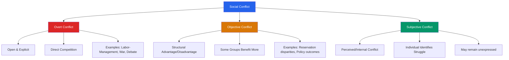

import Tabs from '@theme/Tabs';
import TabItem from '@theme/TabItem';

# Nature and Forms of Social Conflict

> *"Social conflict is a social relationship wherein the action is oriented intentionally for carrying out the actor's own will against the resistance of other party or parties."* — Sociological definition

---

**Source PDFs**:
- 📄 [Block-3/Unit-4.pdf - Pages 35-38](/pdfs/MPC-004%20Advanced%20Social%20Psychology/Block-3/Unit-4.pdf)
- 📚 MPC-004 Advanced Social Psychology

---

## 🎯 Learning Objectives

After studying this section, you will be able to:
- Define social conflict and identify its key elements
- Distinguish between overt, objective, and subjective forms of conflict
- Analyse the role of social power in conflict dynamics
- Apply conflict concepts to real-world Indian social situations
- Understand incompatibility and its role in sustained social tensions

---

## 🌐 What is Social Conflict?

Social conflict is one of the most pervasive phenomena in human society. Every society — whether Indian, American, British, or Japanese — is composed of diverse groups, each with its own distinct identity, goals, and agenda. Since no society has unlimited resources to satisfy all groups simultaneously, competition for scarce resources inevitably creates social conflict.

**Core Definition**: Social conflict or group conflict occurs when **two or more actors oppose each other in social interaction**, reciprocally exerting social power in an effort to attain scarce or incompatible goals, while preventing the opponent from attaining them.

### 📚 External Resources

- 🔗 [Wikipedia: Social conflict](https://en.wikipedia.org/wiki/Social_conflict) — Overview of definitions and theoretical frameworks
- 🔗 [Wikipedia: Group conflict](https://en.wikipedia.org/wiki/Group_conflict) — Types and dynamics of group-level conflicts
- 🔗 [Wikipedia: Realistic conflict theory](https://en.wikipedia.org/wiki/Realistic_conflict_theory) — Sherif's foundational research on group conflict
- 🔗 [APA: Understanding and managing conflict](https://www.apa.org/topics/stress/conflict) — Psychological perspectives on conflict
- 🔗 [Research Paper: Intergroup conflict and cooperation (2022)](https://www.annualreviews.org/doi/10.1146/annurev-psych-010421-051506) — Annual Review of Psychology

---

## 🔑 Key Elements of Social Conflict

### 1. Social Power is Central

In almost every form of social conflict, the struggle to gain or maintain power is at the core. Access to power ensures a group's success in attaining its goals. The powerful group typically wins, while the weaker one loses.

**Indian Example**: The Gurjar movement in Rajasthan sought inclusion in the Scheduled Tribes category. The Meenas, who had proliferated in high government services and possessed substantial political, bureaucratic, and economic clout, successfully thwarted this attempt. Their access to power made them formidable opponents.

### 2. Incompatibility

Social conflict involves a fundamental incompatibility — some people attain what they want while others do not. This unmet desire creates a cycle of discontent that can persist across generations unless a significant social reform movement breaks the pattern.

**Historical Indian Example**: For centuries, people belonging to the Harijan (Dalit) community were marginalized by upper-caste Hindus. Sustained resistance became possible only when reformers like Mahatma Gandhi, Raja Ram Mohan Roy, and Jyotiba Phule transformed individual grievances into a movement for self-respect and equal rights.

### 3. Competition with Cooperation

In most social conflicts, pure opposition is rare. Most situations involve a mixture of competition AND cooperation. Unlike a sporting contest between two teams, real-world social conflicts almost always contain cooperative elements intertwined with competitive ones.

### 4. Goal Incompatibility

Every participant in social interaction tries to maximise their gain, which invariably leads to a struggle to win while preventing others from achieving their goals.

---

## 🗂️ Forms of Social Conflict

Psychologists have identified three primary forms of social conflict:

### 🔴 Form 1: Overt Conflict

**Definition**: In overt conflict, the social conflict is **open and explicit**. Competition between parties is fierce and direct.

**Characteristics**:
- Both parties openly acknowledge the conflict
- Competition is direct and visible
- The explicit aim is to defeat the opponent
- Often involves formal confrontation mechanisms

**Examples**:
- Negotiation between management representatives and labour unions
- Wars between nations
- Formal debates where one speaker explicitly attempts to refute the other
- Strikes and lockouts
- Communal riots

**Contemporary Indian Context**: The caste-based reservations debate often erupts into overt conflict, with different caste groups openly mobilising, protesting, and confronting each other and the government.

---

### 🟡 Form 2: Objective Conflict

**Definition**: Objective conflict occurs when **one group tries to gain advantage over another group**, creating a social situation that inherently benefits some while causing losses to others — irrespective of anyone's subjective perception.

**Key Characteristic**: The conflict is embedded in the structure of the social situation itself.

**The OBC Reservation Example (from PDF)**:
When the government allocated 27% reservation in government jobs to OBCs, the policy theoretically benefited all OBC communities. However, in practice:
- Dominant OBC castes (Jats, Ahirs, Kurmis, Kumawats) captured the majority of reserved positions
- Smaller OBC communities (Gurjars, Luhars) received minimal benefit
- This structural disparity created objective conflict — not because anyone "intended" to harm the Gurjars, but because the social structure itself produced unequal outcomes

**Other Objective Conflict Situations**:
- Urban development projects that displace slum communities while benefiting real estate developers
- Climate change disproportionately affecting poorer agricultural communities
- Trade liberalization that benefits urban consumers but harms rural farmers
- Digital economy creating opportunity gaps between internet-connected and disconnected communities

---

### 🟢 Form 3: Subjective Conflict

**Definition**: Subjective conflict occurs when a **person identifies or perceives** a situation as involving struggle, even if the conflict hasn't erupted into overt action.

**Key Features**:
- Exists primarily in the individual's perception
- May remain at an internal psychological level
- Person remains in a state of subjective struggle without bringing it to overt level
- Often a precursor to overt conflict
- Can influence attitudes, prejudice, and discrimination without visible manifestation

**Psychological Significance**: Subjective conflict is crucial for understanding:
- Why people from certain groups feel constantly "on guard" or threatened
- The psychological burden of perceived discrimination
- Inter-group anxiety and avoidance
- The development of in-group solidarity against perceived out-group threats

**Research Insight**: Psychological research shows that perceived discrimination (subjective conflict) has significant mental health consequences, even when no overt discriminatory act occurred. A 2021 study in the *Journal of Social Issues* found that subjective conflict perceptions predict stress levels, health outcomes, and political participation.

---

## 📊 Comparison of Conflict Forms

| Dimension | Overt Conflict | Objective Conflict | Subjective Conflict |
|-----------|---------------|-------------------|-------------------|
| **Visibility** | Highly visible | Structurally embedded | Internal/hidden |
| **Intentionality** | Deliberate opposition | Often unintended | Perceived intention |
| **Example** | Labor strike | Unequal policy outcomes | Feeling discriminated against |
| **Resolution approach** | Negotiation, compromise | Structural reform | Awareness, dialogue |
| **Temporal character** | Often episodic | Chronic/persistent | Variable |
| **Measurement** | Observable behaviors | Outcome statistics | Self-report, perceptions |

---

## 🧠 Theoretical Frameworks for Understanding Social Conflict

### Realistic Conflict Theory (Sherif, 1954)
The Robbers Cave experiment demonstrated that **competition over scarce resources** creates intergroup hostility. Two groups of boys at summer camp developed intense conflict when competing for prizes, but cooperation reduced when they faced shared problems requiring joint effort.

**Implications**: Many Indian social conflicts (caste, communal, regional) can be traced to competition over limited resources — government jobs, land, water, political representation.

### 🔗 [Wikipedia: Robbers Cave experiment](https://en.wikipedia.org/wiki/Robbers_Cave_experiment)

### Social Identity Theory (Tajfel & Turner, 1979)
People derive self-esteem from group membership. When group status is threatened, intergroup conflict can arise even without direct resource competition — purely from identity and status concerns.

### 🔗 [Wikipedia: Social identity theory](https://en.wikipedia.org/wiki/Social_identity_theory)

### Relative Deprivation Theory
Groups feel deprived not in absolute terms but **relative to** what comparable groups have. This explains why objectively improving conditions can paradoxically increase conflict — when people see others improving faster.

### 🔗 [Wikipedia: Relative deprivation](https://en.wikipedia.org/wiki/Relative_deprivation)

---

## 🎥 Educational Resources

- 📺 [Crash Course Sociology: Conflict Theory](https://www.youtube.com/watch?v=9eSFzHXkGrA) — Clear introduction to conflict frameworks
- 📺 [TED Talk: The psychology of conflict and conflict resolution](https://www.ted.com/talks) — Practical insights from social psychology
- 📺 [Khan Academy: Conflict Theory](https://www.khanacademy.org/test-prep/mcat/society-and-culture/social-structures/a/conflict-theory) — Concise explanation

---

## 🔬 Recent Research (2020-2024)

**Key Finding 1**: A 2023 meta-analysis in *Psychological Bulletin* found that intergroup conflict is more likely when groups perceive their status as **unstable and illegitimate** — consistent with both Indian caste conflicts and international research.

**Key Finding 2**: Research on India's caste system (Deshpande, 2022, *Economic and Political Weekly*) demonstrates how objective conflict (structural inequality) and subjective conflict (perceived discrimination) interact to create cycles of persistent group tension.

**Key Finding 3**: A 2021 study in *Journal of Experimental Social Psychology* showed that **exposure to objective inequality activates subjective conflict perceptions**, even in groups not directly disadvantaged — suggesting "third-party" conflict dynamics.

---

## 🇮🇳 Social Conflict in Indian Context

India's extraordinary diversity makes it a rich case study for understanding social conflict in all three forms:

### Caste-Based Conflict
- **Overt**: Caste violence, reservation protests, untouchability incidents
- **Objective**: Structural gaps in educational attainment, employment, land ownership between caste groups
- **Subjective**: Everyday experiences of discrimination, microaggressions, caste pride/shame

### Religious Conflict
- **Overt**: Communal riots, temple/mosque disputes
- **Objective**: Differential access to state institutions, economic marginalization of minorities
- **Subjective**: Perceptions of threat to religious identity, fears about community status

### Regional/Linguistic Conflict
- **Overt**: Border disputes between states, protests over linguistic policies
- **Objective**: Uneven development between regions, urban-rural resource disparities
- **Subjective**: Feelings of cultural domination, linguistic discrimination

---

## 🧩 Memory Aid: THREE FORMS OF CONFLICT

**OOS** — Remember with: **"Out, Objective, Or Subjective"**

- **O**vert → **Out** in the open — everyone can see it
- **O**bjective → **Objective** facts of structural inequality
- **S**ubjective → **S**een through the perceiver's eyes

---

## ✍️ Self-Assessment Questions

<Tabs>
<TabItem value="basic" label="🟢 Basic">

**Q1**: Define social conflict. What are its two essential elements?

**Q2**: Give one example each of overt, objective, and subjective conflict from your own observation.

**Q3**: Why is social power central to understanding social conflict?

</TabItem>
<TabItem value="intermediate" label="🟡 Intermediate">

**Q4**: The Gurjar-Meena conflict in Rajasthan is described in the PDF. Which form(s) of conflict does it represent? Justify your answer with reference to all three forms.

**Q5**: How does subjective conflict differ from overt conflict? Can subjective conflict exist without any objective inequalities? Discuss.

**Q6**: Explain Realistic Conflict Theory using the Robbers Cave experiment. How does it apply to caste conflicts in India?

</TabItem>
<TabItem value="advanced" label="🔴 Advanced (Exam Level)">

**Q7**: "Social conflict is rarely pure competition; it always contains elements of cooperation." Discuss this statement with reference to Indian social reality.

**Q8**: Compare and contrast the three forms of social conflict (overt, objective, subjective) with examples from contemporary Indian society. How might each form require different resolution strategies?

**Q9**: How do Social Identity Theory and Relative Deprivation Theory together explain the persistence of caste-based conflict in India even after decades of affirmative action policies?

</TabItem>
</Tabs>

---

## 🔗 Related Topics

- [Methods of Conflict Resolution](/mpc-004/block-3/methods-conflict-resolution) — How to address conflicts once they arise
- [Blake and Mouton Strategies](/mpc-004/block-3/blake-mouton-two-dimensional-conflict-model) — Strategic frameworks for conflict handling
- [Prejudice and Discrimination](/mpc-004/block-3/manifestation-reducing-prejudice-discrimination) — Link between conflict and discrimination
- [Pro-social Behaviour](/mpc-004/block-2/prosocial-behaviour-altruism-foundations) — Role of helping in conflict reduction

---

## 📝 Key Takeaways

Social conflict arises when groups compete for scarce resources or incompatible goals, with social power playing a central role. The three forms — overt (visible, direct), objective (structural, embedded in social arrangements), and subjective (perceived, psychological) — often co-exist and reinforce each other. Understanding all three forms is essential for developing effective conflict resolution strategies, particularly in diverse societies like India where multiple social cleavages (caste, religion, region, class) intersect simultaneously.
