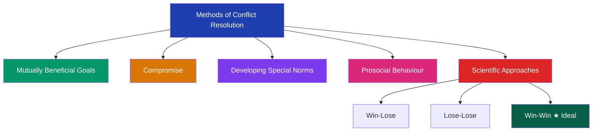
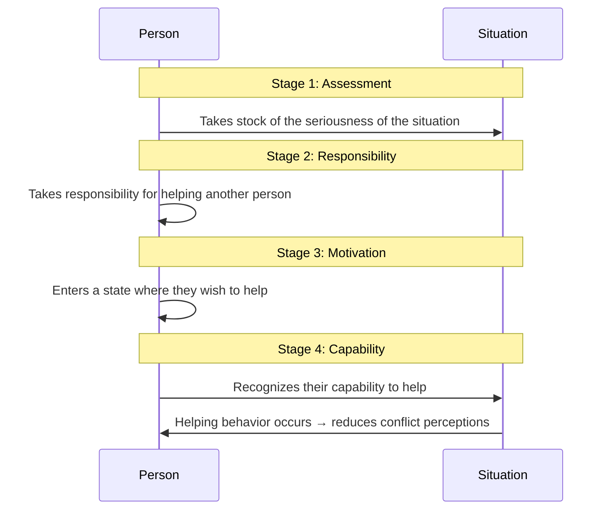

import Tabs from '@theme/Tabs';
import TabItem from '@theme/TabItem';

# Methods of Conflict Resolution

> *"In conflict resolution, the goal is not to prove who is right, but to find a solution that works for everyone involved."*

---

**Source PDFs**:
- 📄 [Block-3/Unit-4.pdf - Pages 38-41](/pdfs/MPC-004%20Advanced%20Social%20Psychology/Block-3/Unit-4.pdf)
- 📚 MPC-004 Advanced Social Psychology

---

## 🎯 Learning Objectives

After studying this section, you will be able to:
- Explain five major methods of conflict resolution
- Distinguish between win-lose, lose-lose, and win-win approaches
- Apply Sherif's superordinate goals concept to real scenarios
- Describe the role of prosocial behaviour in reducing conflict
- Evaluate which conflict resolution method is most appropriate for different situations

---

## 🌐 Introduction: Why Conflict Resolution Matters

Social conflicts, if left unresolved, can escalate into violence, destabilize communities, and consume enormous social resources. Social psychologists have developed a variety of scientifically informed approaches to managing and resolving conflicts. Understanding these methods is essential not just academically, but for practical application in workplaces, communities, and governance.

### 📚 External Resources

- 🔗 [Wikipedia: Conflict resolution](https://en.wikipedia.org/wiki/Conflict_resolution) — Comprehensive overview of approaches
- 🔗 [Wikipedia: Superordinate goals](https://en.wikipedia.org/wiki/Superordinate_goals) — Sherif's key concept explained
- 🔗 [Wikipedia: Negotiation](https://en.wikipedia.org/wiki/Negotiation) — Core skill in conflict resolution
- 🔗 [APA: Conflict resolution resources](https://www.apa.org/topics/stress/conflict) — Psychological perspectives
- 🔗 [Research: Conflict resolution in diverse societies (2023)](https://www.researchgate.net/publication/conflict-resolution-diverse-societies) — Contemporary research

---

## 🔑 Major Methods of Conflict Resolution

---

## 🤝 Method 1: Mutually Beneficial Goals (Superordinate Goals)

**Definition**: Establishing goals that can only be achieved through the **joint cooperation of both conflicting parties**. These goals transcend the interests of either group and require collaboration.

### The Robbers Cave Experiment (Sherif & Sherif)

This is one of the most famous experiments in social psychology:

**Phase 1 — Introducing Competition**:
- Two groups of boys at a summer camp were put in competitive situations
- Very quickly, intense animosity and hostility developed
- Groups raided each other's camps and sabotaged each other's activities

**Phase 2 — Introducing Superordinate Goals**:
- Both groups were placed in situations requiring **joint effort** to solve problems (e.g., fixing a broken water supply that affected both groups)
- Neither group had sufficient resources to solve the problem alone
- Result: Members began understanding each other's concerns, interaction increased, and conflict markedly reduced

**Key Mechanism**: When groups share a common "enemy" (a shared problem), they transform from competitors into partners.

### 🔗 [Wikipedia: Robbers Cave experiment](https://en.wikipedia.org/wiki/Robbers_Cave_experiment)

### Applications in Indian Context

- **Communal harmony initiatives**: When Hindu-Muslim communities jointly work on flood relief, disaster response, or community development, conflict reduces
- **Inter-state river disputes**: When states focus on joint water management infrastructure rather than allocation disputes, cooperation becomes possible
- **Labour-management**: When both parties face an external competitive threat (foreign competition, industry decline), they often find common ground

### Research Support

A 2022 meta-analysis in *Journal of Personality and Social Psychology* confirmed that superordinate goals remain one of the most effective strategies for reducing intergroup conflict, particularly when groups have **approximately equal status** and **institutional support** for cooperation.

---

## ⚖️ Method 2: Compromise

**Definition**: A resolution method where **no party stands to gain or lose excessively** — each party gives something up and gets something in return, leading to a mutually acceptable middle ground.

**Key Principle**: Compromise reduces conflict by eliminating the "winner takes all" dynamic.

### The Gurjar-Meena Compromise (from PDF)

When the Gurjar agitation for Scheduled Tribe status created violent conflict with the Meenas:
- **Phase 1**: Both communities engaged in open confrontation, resulting in casualties
- **Phase 2**: Geographic reality (both communities living side by side across Rajasthan) made sustained conflict mutually harmful
- **Compromise**: Gurjars dropped their demand for ST status; instead sought a **separate OBC quota** for themselves. Meenas agreed to support this demand.
- **Outcome**: Neither community gained at the other's direct expense; the conflict de-escalated

### When Compromise Works Best

- When both parties have roughly equal power
- When relationships between parties must continue long-term
- When neither party can achieve a complete victory
- When time pressure exists for resolution

### Limitations of Compromise

- May leave core issues unresolved (underlying structural inequality remains)
- Can be seen as "losing" by hardliners on both sides
- Agreements may break down if circumstances change
- May not address root causes of conflict

### 🔗 [Wikipedia: Compromise](https://en.wikipedia.org/wiki/Compromise)

---

## 📋 Method 3: Developing Special Norms

**Definition**: Creating agreed-upon **rules, procedures, or norms** that remove the "bone of contention" and establish neutral, fair processes for making decisions.

### Core Idea

Instead of letting conflicting parties fight over who gets what, **external norms** (rules, procedures, third-party arbitration) determine outcomes. This removes the personal and emotional dimensions of the conflict.

**Simple Example**: In a sports game, the question of who goes first is decided by a coin toss (a neutral norm), removing a potential source of conflict.

### Conditions for Effectiveness

Social psychologists identify that norm-based resolution works best when:
1. Both parties have the **ability AND will** to influence each other
2. Both parties recognize the legitimacy of the agreed-upon norms
3. There is trust in the norm-enforcing authority

### Applications

- **Legal systems**: Courts apply established laws rather than allowing parties to fight physically
- **Labour arbitration boards**: Neutral bodies apply established procedures to resolve disputes
- **International law**: Treaties and conventions establish norms for conflict between nations
- **Caste mediation (Panchayat system)**: Traditional community norms for resolving local disputes

### Research: Procedural Justice

Research by Thibaut and Walker (1975), later extended by Tyler and Blader (2000), shows that people accept unfavorable outcomes when they perceive the **process** as fair. This is why developing transparent, consensually agreed norms is so powerful — acceptance of the process leads to acceptance of the outcome.

### 🔗 [Wikipedia: Procedural justice](https://en.wikipedia.org/wiki/Procedural_justice)

---

## 💚 Method 4: Prosocial Behaviour

**Definition**: Behaviour that creates **positive social influence** — giving charity, volunteering, helping others in distress — that reduces perceptions of conflict by building positive associations with out-group members.

### How Prosocial Behaviour Reduces Conflict

When members of one community engage in prosocial behaviour toward members of another community:
- It creates positive personal experiences that counter negative group stereotypes
- It shifts focus from competition to cooperation
- It builds trust and positive affect

### The Four Stages of Prosocial Behaviour (as detailed in the PDF)

### Research on Prosocial Conflict Reduction

A 2021 study in *Psychological Science* found that **cross-group helping behaviours** (helping someone from a different group) significantly reduced intergroup threat perceptions, even when the help was relatively minor. The key mechanism is **personalization** — interacting with an out-group member as an individual breaks down categorical thinking that sustains conflict.

### 🔗 [Wikipedia: Prosocial behavior](https://en.wikipedia.org/wiki/Prosocial_behavior)
### 🔗 [Wikipedia: Contact hypothesis](https://en.wikipedia.org/wiki/Contact_hypothesis) — Related framework

### Indian Applications

- **Communal harmony programs**: Initiatives that bring Hindu and Muslim youth together for community service
- **Disaster relief across caste lines**: Natural disasters sometimes create opportunities for cross-caste helping that challenge traditional hierarchies
- **Corporate CSR programs** in conflict-affected regions that involve hiring across community lines

---

## 🔬 Method 5: Scientific Approaches to Conflict Resolution

Social psychologists have identified three fundamental **strategic orientations** toward conflict:

### 🔴 Win-Lose Approach

**Core Assumption**: Conflict is inevitable; unanimity is impossible; and the gain of one party necessarily means the loss of another.

**Underlying Logic**:
- Only one party can win; the other is bound to fail
- Therefore, the rational strategy is to **ensure your opponent's defeat**
- "The end justifies the means" — any method (fair or otherwise) is acceptable

**Tactics Used**:
- Democratic channels (elections, legal challenges)
- Building coalitions against the opponent
- Economic pressure or sanctions
- Threatening opponents with consequences
- Subversive methods (in extreme cases)

**When It Occurs**: 
- Zero-sum situations (fixed resource, like a government contract)
- When parties see no possibility of creative solution
- When historical grievances make compromise seem like betrayal

**Problems with Win-Lose**:
- Creates long-term resentment in the losing party
- Often escalates to destructive conflict
- Solutions are unstable — the losing party continues to seek reversal

---

### 🟡 Lose-Lose Approach

**Core Assumption**: Something is better than nothing; it is better to avoid destructive struggle than to engage in it and waste resources.

**Characteristics**:
- Neither party achieves their maximum goal
- Both parties accept something less than their ideal
- Quick resolution is prioritized over optimal outcomes
- Individual values and motives receive less attention

**Examples**:
- Stalemates where both sides recognize that continued conflict is more costly than settling
- Cease-fires that preserve neither side's war aims but prevent further casualties
- Agreements that paper over fundamental differences to maintain a relationship

**Variants**:
- **Withdrawing**: Simply stepping back from the conflict
- **Smoothing**: Emphasizing common interests while avoiding divisive issues
- **Compromising**: Reducing differences through discussion (middle ground)

---

### 🟢 Win-Win Approach (Ideal)

**Core Assumption**: Conflict is a mutual problem that **can be solved cooperatively**; creative solutions exist that satisfy all parties.

**Principles**:
- Focuses on **problems and needs** of both parties, not on winning
- Both parties sit together and collaborate on solutions
- The solution found is acceptable to all
- Emphasizes creative problem-solving over positional bargaining

**Process**:
1. Both parties agree to view the conflict as a shared problem
2. Each party articulates their **underlying needs** (not just stated positions)
3. Creative solutions are generated that address both sets of needs
4. Solution is tested and refined through dialogue

**Requirement**: Skill in human relations — this approach requires trust, communication skills, and genuine willingness to find mutual benefit.

**Research Support**: Harvard Negotiation Project (Fisher & Ury, "Getting to Yes") demonstrated that **interest-based negotiation** (identifying underlying needs rather than arguing over positions) consistently produces better, more durable outcomes than positional bargaining.

### 🔗 [Wikipedia: Getting to Yes](https://en.wikipedia.org/wiki/Getting_to_Yes)
### 🔗 [Wikipedia: Interest-based bargaining](https://en.wikipedia.org/wiki/Interest-based_bargaining)

---

## 📊 Comparison: Scientific Approaches

| Dimension | Win-Lose | Lose-Lose | Win-Win |
|-----------|----------|-----------|---------|
| **Goal** | Defeat opponent | Avoid destructive conflict | Mutual satisfaction |
| **Assumption** | Zero-sum | Sub-optimal but stable | Positive-sum possible |
| **Tactics** | Competition, coercion | Withdrawal, compromise | Collaboration, creativity |
| **Durability** | Low (resentment builds) | Medium (issues unresolved) | High (genuine satisfaction) |
| **Speed** | Potentially fast or very slow | Relatively fast | Slower (requires dialogue) |
| **Required skills** | Power, strategy | Patience, pragmatism | Communication, empathy |
| **Best for** | Unavoidable zero-sum situations | Preventing escalation | Long-term relationships |

---

## 🎥 Educational Resources

- 📺 [Harvard Negotiation Program: Getting to Yes](https://www.youtube.com/watch?v=vwkR5BFLaWg) — Interest-based negotiation explained
- 📺 [TED: William Ury - The walk from "no" to "yes"](https://www.ted.com/talks/william_ury_the_walk_from_no_to_yes) — Master negotiator's insights
- 📺 [Crash Course Psychology: Cooperation and conflict](https://www.youtube.com/watch?v=0_gFKFfHNKg) — Accessible overview

---

## 🔬 Recent Research (2020-2024)

**Finding 1**: A 2023 study in *Conflict Resolution Quarterly* found that **win-win negotiation training** significantly improved outcomes in Indian panchayat-level disputes, suggesting cultural adaptability of Western conflict resolution frameworks.

**Finding 2**: Research on India's post-riot reconciliation (Varshney, 2022) found that cities with pre-existing **civic networks** spanning religious communities (prosocial infrastructure) recovered from communal violence faster and with less recurrence — consistent with the prosocial behaviour approach.

**Finding 3**: A 2021 meta-analysis in *Psychological Bulletin* (De Dreu et al.) found that **superordinate goals** remain the most reliable single intervention for intergroup conflict reduction, with effects persisting over time — validating Sherif's classic findings.

---

## 🧩 Memory Aid: CONFLICT RESOLUTION METHODS

**"Make Choices, Develop Peace, Succeed"**

- **M**utually beneficial goals → Make shared goals
- **C**ompromise → Choose middle ground
- **D**eveloping special norms → Define fair rules
- **P**rosocial behaviour → Practice kindness
- **S**cientific approaches (Win-Win, Lose-Lose, Win-Lose) → Strategy selection

---

## ✍️ Self-Assessment Questions

<Tabs>
<TabItem value="basic" label="🟢 Basic">

**Q1**: What is a superordinate goal? How does it reduce conflict?

**Q2**: List the four stages a person passes through when engaging in prosocial behaviour.

**Q3**: What is the key difference between the Win-Win and Win-Lose approaches to conflict resolution?

</TabItem>
<TabItem value="intermediate" label="🟡 Intermediate">

**Q4**: The Sherif & Sherif Robbers Cave experiment is a landmark study in conflict resolution. Describe the experimental phases and explain what they reveal about the role of superordinate goals.

**Q5**: When would you recommend a "lose-lose" approach over a "win-win" approach? Discuss with examples from Indian social conflict.

**Q6**: How does prosocial behaviour reduce conflict? What psychological mechanisms explain this effect?

</TabItem>
<TabItem value="advanced" label="🔴 Advanced (Exam Level)">

**Q7**: Critically evaluate the five methods of conflict resolution (superordinate goals, compromise, special norms, prosocial behaviour, scientific approaches) in terms of their effectiveness for resolving **caste-based conflict** in contemporary India.

**Q8**: "The Win-Win approach to conflict resolution is ideal but often impractical in deeply divided societies." Discuss this statement drawing on psychological research and Indian examples.

**Q9**: Design a conflict resolution strategy for a religious communal conflict between two communities in an Indian city. Which methods would you combine, why, and in what sequence?

</TabItem>
</Tabs>

---

## 🔗 Related Topics

- [Blake & Mouton Strategies and Two-Dimensional Model](/mpc-004/block-3/blake-mouton-two-dimensional-conflict-model) — Advanced frameworks for conflict handling
- [Nature and Forms of Social Conflict](/mpc-004/block-3/nature-forms-social-conflict) — Understanding what you're resolving
- [Prejudice Reduction Methods](/mpc-004/block-3/manifestation-reducing-prejudice-discrimination) — Parallel approaches for prejudice
- [Pro-social Behaviour](/mpc-004/block-2/prosocial-behaviour-altruism-foundations) — Detailed coverage of helping behaviour

---

## 📝 Key Takeaways

Social psychologists have developed multiple evidence-based approaches to conflict resolution. **Superordinate goals** (creating shared purposes) represent perhaps the most powerful technique for fundamentally transforming intergroup relations. **Compromise** and **special norms** provide practical tools for managing ongoing conflicts. **Prosocial behaviour** builds positive inter-group associations that counter conflict perceptions. The three scientific approaches — win-lose, lose-lose, and win-win — represent fundamentally different philosophies, with the win-win approach being ideal for long-term, sustainable conflict resolution when parties are willing to engage cooperatively.
