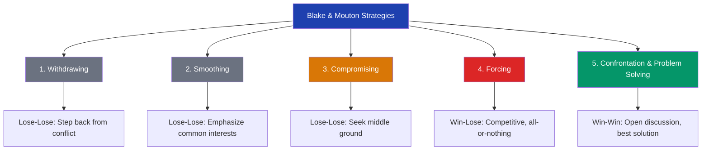

import Tabs from '@theme/Tabs';
import TabItem from '@theme/TabItem';

# Blake-Mouton Strategies, Two-Dimensional Conflict Model & Group Conflict in India

> *"Conflict is inevitable, but combat is optional."* — Max Lucado

---

**Source PDFs**:
- 📄 [Block-3/Unit-4.pdf - Pages 41-44](/pdfs/MPC-004%20Advanced%20Social%20Psychology/Block-3/Unit-4.pdf)
- 📚 MPC-004 Advanced Social Psychology

---

## 🎯 Learning Objectives

After studying this section, you will be able to:
- Describe Blake and Mouton's five conflict-handling strategies with examples
- Explain the Two-Dimensional Model using assertiveness and cooperativeness dimensions
- Distinguish between the five conflict modes: competing, accommodating, avoiding, collaborating, compromising
- Explain the role and limitations of third-party intervention
- Analyse major forms of group conflict in Indian society
- Apply conflict models to real-world Indian social conflicts

---

## 🧭 Blake and Mouton's Five Conflict Strategies

Robert Blake and Jane Mouton (1964), based on their organizational research, identified that people adopt one of **five fundamental strategies** when responding to conflict. These strategies have become foundational in conflict management theory.

### 📚 External Resources

- 🔗 [Wikipedia: Conflict management](https://en.wikipedia.org/wiki/Conflict_management) — Overview of Blake-Mouton framework
- 🔗 [Wikipedia: Thomas-Kilmann Conflict Mode Instrument](https://en.wikipedia.org/wiki/Thomas%E2%80%93Kilmann_Conflict_Mode_Instrument) — Modern refinement of Blake-Mouton
- 🔗 [Wikipedia: Organizational conflict](https://en.wikipedia.org/wiki/Organizational_conflict) — Applications in workplace settings
- 🔗 [APA: Conflict and conflict resolution](https://www.apa.org/topics/stress/conflict) — Psychological perspectives
- 🔗 [Research: Conflict management styles across cultures (2022)](https://journals.sagepub.com/doi/10.1177/10464964211054897) — Cross-cultural applications

---

## 📋 The Five Blake-Mouton Strategies



### Strategy 1: Withdrawing (Lose-Lose)

**Definition**: Resolving conflict by **stepping back from the situation** — avoiding engagement altogether.

**Characteristics**:
- Person physically or psychologically retreats from the conflict
- Neither party's concerns are addressed
- Conflict remains unresolved but temporarily dormant
- Represents the lose-lose orientation (no one wins, but no immediate damage either)

**When Used**:
- When the issue is trivial and not worth the energy
- When potential damage from confrontation outweighs potential gain
- When both parties need time to cool down
- When one party has no power to influence the outcome

**Risks**:
- Unresolved conflicts tend to resurface more intensely
- Continuous withdrawal can signal weakness and invite exploitation
- Important issues may be permanently ignored

**Example**: A caste panchayat that refuses to hear a complaint about land encroachment — withdrawing from the conflict leaves the aggrieved party without recourse.

---

### Strategy 2: Smoothing (Lose-Lose)

**Definition**: Reducing conflict by **emphasizing areas of common interest and avoiding discussion of divisive or controversial matters**.

**Characteristics**:
- Differences are minimized or glossed over
- Focus is on what unites rather than what divides
- Good feelings are preserved short-term
- Underlying issues remain unaddressed

**The "Smoothing" Dynamic**:
- "Let's focus on what we agree on..."
- "This issue isn't as important as our friendship/relationship..."
- "Let's not create division where none needs to exist..."

**Effectiveness**: Works when:
- The relationship is more important than the issue
- The issue is likely to resolve itself
- Emotions need to cool before substantive discussion

**Limitations**:
- Creates a false peace; underlying tensions build
- Can be experienced as dismissive by the aggrieved party
- Does not change the structural conditions that created conflict

---

### Strategy 3: Compromising (Lose-Lose / Middle Ground)

**Definition**: **Reducing differences through negotiated discussion** — each party gives up something to reach a middle position.

**Position in the Framework**:
- Classified as "lose-lose" in Blake-Mouton's framework (neither party achieves their full goal)
- However, often produces the best available outcome in many real-world situations

**Process**:
1. Both parties acknowledge the conflict and agree to negotiate
2. Each party states their maximum demand
3. Through discussion, both parties concede incrementally
4. Agreement is reached at a middle point

**Strengths**: Practical, time-efficient, preserves relationships

**Limitations**: "Splitting the difference" may not address root causes; both parties may feel somewhat dissatisfied

---

### Strategy 4: Forcing (Win-Lose)

**Definition**: An **all-or-nothing, competitive approach** that takes a definitive win-lose stance — "it's this way or that way."

**Characteristics**:
- One party uses power (positional authority, economic leverage, numbers) to impose their preferred solution
- No genuine negotiation or consideration of the other party's interests
- Relationship damage is accepted as a cost of achieving the goal

**When Appropriate**:
- Emergency situations requiring immediate action
- When important values or ethical principles are at stake
- When you know you are right and the issue is too important to compromise
- Implementing unpopular but necessary decisions

**Examples**:
- A government imposing curfew during communal violence
- Management implementing non-negotiable safety regulations
- Courts issuing binding orders in property disputes

**Dangers**:
- Creates lasting resentment and damaged relationships
- Losing party often seeks reversal at the first opportunity
- Fosters future conflict

---

### Strategy 5: Confrontation and Problem Solving (Win-Win) ⭐

**Definition**: Both parties **openly discuss all matters** concerning the conflict, and the **best mutually acceptable solution** is sought and implemented.

**This is the ideal strategy** in Blake-Mouton's framework.

**Process**:
1. Both parties agree to engage openly and honestly
2. All concerns, grievances, and underlying needs are surfaced
3. Creative solutions are generated that address both parties' core needs
4. The solution with maximum mutual benefit is selected
5. Implementation is jointly managed

**Requirements**:
- High trust between parties
- Good communication skills
- Willingness to be influenced by the other party's concerns
- Sufficient time for thorough dialogue

---

## 📊 Summary Comparison of Blake-Mouton Strategies

| Strategy | Approach | Orientation | Best When... |
|----------|----------|-------------|--------------|
| Withdrawing | Step back | Lose-Lose | Issue is trivial; immediate confrontation harmful |
| Smoothing | Emphasize commonalities | Lose-Lose | Relationship preservation paramount |
| Compromising | Split the difference | Middle ground | Equal power, need for quick solution |
| Forcing | Impose solution | Win-Lose | Non-negotiable principles; emergency |
| Confrontation & Problem Solving | Open dialogue | Win-Win | Long-term relationship; complex issue |

---

## 🗺️ The Two-Dimensional Model of Conflict

Building on their five strategies, conflict researchers developed a **Two-Dimensional Model** that places conflict-handling behaviour along two axes:

1. **Assertiveness**: The degree to which an individual pursues their own concerns
2. **Cooperativeness**: The degree to which an individual tries to satisfy the other party's concerns

```mermaid
quadrantChart
    title Two-Dimensional Model of Conflict Handling
    x-axis Low Cooperativeness --> High Cooperativeness
    y-axis Low Assertiveness --> High Assertiveness
    quadrant-1 Collaborating (Assertive + Cooperative)
    quadrant-2 Competing (Assertive + Uncooperative)
    quadrant-3 Avoiding (Unassertive + Uncooperative)
    quadrant-4 Accommodating (Unassertive + Cooperative)
    Collaborating: [0.85, 0.85]
    Competing: [0.15, 0.85]
    Compromising: [0.5, 0.5]
    Avoiding: [0.15, 0.15]
    Accommodating: [0.85, 0.15]
```

### 🔗 [Wikipedia: Thomas-Kilmann Conflict Mode Instrument](https://en.wikipedia.org/wiki/Thomas%E2%80%93Kilmann_Conflict_Mode_Instrument) — The modern version of this model

---

## 🔍 The Five Modes in Detail

### Mode 1: COMPETING (Assertive + Uncooperative)

**Description**: "Power-oriented" — pursues own concerns at the other person's expense.

**Behaviour Pattern**:
- Uses whatever power is available (rank, ability to argue, economic sanctions)
- "Standing up for your rights"
- Defending a position believed to be correct
- Simply trying to win

**When Appropriate**:
- Quick, decisive action needed in an emergency
- Important issues where unpopular action must be implemented
- Protecting yourself against someone who takes advantage of non-competitive behaviour

**Indian Context**: A union leader who refuses to back down on a wage demand regardless of management's concerns. A caste group that mobilizes politically to block reservation changes.

---

### Mode 2: ACCOMMODATING (Unassertive + Cooperative)

**Description**: The **complete opposite of Competing** — individual neglects own concerns to satisfy the other party.

**Behaviour Pattern**:
- Self-sacrifice to preserve the relationship
- Following another person's order when you'd prefer not to
- Yielding to another's point of view
- Selfless generosity

**When Appropriate**:
- When you realize you are wrong (shows reasonableness)
- When the issue is more important to the other party
- To build good will for a later conflict where you need support
- When continued competition would cause significant damage

**Risks**: Consistent accommodating can signal weakness; your concerns remain permanently unaddressed.

---

### Mode 3: AVOIDING (Unassertive + Uncooperative)

**Description**: The person pursues **neither their own concerns nor those of the other party** — the conflict is not addressed at all.

**Behaviour Pattern**:
- Diplomatically sidestepping an issue
- Postponing the issue "until a better time"
- Withdrawing from threatening situations

**When Appropriate**:
- Issue is trivial
- No chance of satisfying your concerns
- More important issues need immediate attention
- Potential damage outweighs benefits of resolution
- Both parties need time to cool down

**Risk**: Chronic avoidance leaves important issues permanently unresolved.

---

### Mode 4: COLLABORATING (Assertive + Cooperative)

**Description**: The **complete opposite of Avoiding** — works with others to find a solution that **fully satisfies all parties' concerns**.

**Behaviour Pattern**:
- Digs into the issue to identify underlying needs and wants
- Explores disagreements to learn from each other's insights
- Attempts to find creative, win-win solutions

**When Appropriate**:
- When both sets of concerns are too important to be compromised
- To merge insights from people with different perspectives
- To build commitment through consensus
- To work through feelings that have been interfering with a relationship

**Requirement**: Time, trust, and communication skills — the most demanding mode.

---

### Mode 5: COMPROMISING (Moderate Assertiveness + Moderate Cooperativeness)

**Description**: Finds an **expedient, mutually acceptable solution** that partially satisfies both parties — the "middle ground."

**Position in Model**:
- More assertive than Accommodating, less than Competing
- More cooperative than Competing, less than Accommodating
- More direct than Avoiding, less exploratory than Collaborating

**Behaviour Pattern**:
- Splitting the difference
- Exchanging concessions
- Seeking quick middle-ground solutions

**When Appropriate**:
- Goals are moderately important but not worth the effort of Collaborating
- Parties have equal power and mutually exclusive goals
- Complex issues need temporary settlement while permanent solutions are developed

---

## 👥 Third-Party Intervention

When parties cannot resolve conflict through bilateral methods, **third-party intervention** offers an alternative pathway.

### Definition and Process

A **neutral third party** (arbitrator, mediator, judge) intervenes to help parties reach resolution:
- The third party analyzes the characteristics and interests of both conflicting groups
- Solution is generated through open discussion and negotiation
- The solution is binding on all parties

### Key Features

- Third party does **not impose** a decision unilaterally; the decision emerges through facilitated dialogue
- The process requires the third party to be **very mature and skilled in human relations**
- Success depends on both parties' acceptance of the third party's neutrality and legitimacy

### Types of Third-Party Intervention

| Type | Role | Binding? |
|------|------|---------|
| Mediation | Facilitates dialogue between parties | No — parties choose solution |
| Arbitration | Hears both sides, makes decision | Yes — enforced on both parties |
| Conciliation | Builds rapport, seeks informal agreement | Usually no |
| Judicial intervention | Applies law to the dispute | Yes — court order |
| Political mediation | High-level diplomatic engagement | Depends on agreement |

### 🔗 [Wikipedia: Mediation](https://en.wikipedia.org/wiki/Mediation)
### 🔗 [Wikipedia: Arbitration](https://en.wikipedia.org/wiki/Arbitration)

### Indian Examples

- **Lok Adalats**: Fast-track alternative dispute resolution tribunals that mediate between parties in civil disputes
- **Inter-state water tribunal**: Third-party arbitration for river water disputes between Indian states (e.g., Kaveri Water Disputes Tribunal)
- **NHRC and minority commissions**: Quasi-judicial bodies addressing communal and caste conflict complaints

---

## 🇮🇳 Group Conflict in Indian Society

India's extraordinary diversity — of castes, religions, languages, tribes, and classes — creates a complex landscape of social conflicts. The PDF identifies several major categories:

### 🏔️ Tribal Problems

India's **tribal communities** (Adivasis) represent approximately 8.6% of the population. They face a fundamental tension: preservation of distinct identity versus assimilation into mainstream Indian society.

**Core Conflict**:
- Tribal groups fear assimilation threatens their language, culture, land rights, and separate identity
- Mainstream society (and development projects) often encroach on tribal territories
- Formation of **Jharkhand** (2000) from Bihar exemplifies successful tribal mobilization for separate statehood

**Current Tribal Conflicts**:
- Displacement by large infrastructure projects (dams, mines, highways) in tribal heartlands
- Forest rights and land alienation in Chhattisgarh, Jharkhand, Odisha
- Left-wing extremism as a manifestation of tribal grievances (Naxalism)
- Language and education rights for tribal communities

### 🔗 [Wikipedia: Scheduled Tribes in India](https://en.wikipedia.org/wiki/Scheduled_Tribes_in_India)

---

### 🧱 Caste Conflict

India's caste system divides society into **forward castes, backward castes (OBCs), and scheduled castes and tribes (SCs/STs)**, with constant competition for political power, economic resources, and social status.

**Major Manifestations**:

1. **Reservation conflicts**: Competing demands for reservation categories (Jat, Patel, Maratha agitations for OBC inclusion; Gurjar agitation for ST status)
2. **Caste violence**: Atrocities against Dalits, honour killings for inter-caste marriages
3. **Land disputes**: Historical land inequality between castes, tensions over land reform
4. **Political mobilization**: Caste-based voting, caste arithmetic in elections

**Structural vs. Overt Dimension**: Caste conflict exists at both objective levels (data shows persistent economic disparities between caste groups) and overt levels (periodic violent eruptions).

### 🔗 [Wikipedia: Caste system in India](https://en.wikipedia.org/wiki/Caste_system_in_India)

---

### 🕌 Communal Problems

**Hindu-Muslim tensions** have been a persistent fault line since Partition (1947), costing thousands of lives and causing enormous property destruction.

**Key Incidents (Historical)**:
- Partition (1947): Unprecedented violence during division of British India
- Babri Masjid demolition (1992): Catalyzed nationwide communal riots
- Gujarat riots (2002)
- Numerous local riots over cow slaughter, religious processions, conversions

**Sociological Analysis**:
- Ashutosh Varshney's research shows that cities with **cross-cutting civic associations** (business associations, trade unions) have significantly lower communal violence than cities where communities are organizationally segregated
- This supports the prosocial behaviour and superordinate goals approaches to conflict reduction

### 🔗 [Wikipedia: Communalism in India](https://en.wikipedia.org/wiki/Communalism_(South_Asia))

---

### 🏭 Labour-Management Conflict

Industrial relations represent classic overt conflict between workers and employers over wages, working conditions, job security, and unionization rights.

**Historical Context**: India's labour movement has roots in the colonial period; major conflicts include:
- Mumbai textile strikes (1982-83)
- Maruti Suzuki Manesar plant violence (2012)
- Contemporary gig worker strikes and platform worker disputes

---

### 📚 Other Forms of Social Conflict in India

- **Student conflicts**: University agitations over fees, reservations, political issues
- **Landlord-tenant disputes**: Rent disputes, eviction conflicts
- **Advantaged-disadvantaged class confrontations**: Economic inequality creating class tensions
- **Language problems**: Hindi imposition controversies, regional language rights (e.g., Tamil Nadu's resistance to Hindi)
- **Job competition problems**: Competition for limited government jobs creating caste and community tensions

---

## 🎥 Educational Resources

- 📺 [MIT OpenCourseWare: Conflict resolution in diverse societies](https://ocw.mit.edu) — Academic perspective
- 📺 [TED: Dan Ariely on irrational decision-making in conflict](https://www.ted.com/talks) — Behavioural economics perspective
- 📺 [Crash Course Sociology: Conflict theory in Indian context](https://www.youtube.com/crashcourse) — Accessible overview

---

## 🔬 Recent Research (2020-2024)

**Finding 1**: A 2023 study in *Conflict Resolution Quarterly* tested Blake-Mouton strategies in Indian organizational contexts and found that **Collaborating** was the most effective strategy for long-term conflict resolution, but **Compromising** was more frequently used due to time and power constraints.

**Finding 2**: Research on India's communal violence (Bhatt, 2022, *Journal of Peace Research*) confirmed Varshney's hypothesis: cross-community civic networks remain the strongest predictor of communal peace at the local level.

**Finding 3**: A 2021 comparative study found that India's caste conflicts increasingly manifest through **social media**, with subjective conflict perceptions amplified through online echo chambers — creating new challenges for traditional conflict resolution methods.

---

## 🧩 Memory Aid: TWO-DIMENSIONAL MODEL

**"CACCA"** — The five modes in the Two-Dimensional Model:

- **C**ompeting → High Assertive, Low Cooperative
- **A**ccommodating → Low Assertive, High Cooperative
- **C**ollaborating → High Assertive, High Cooperative
- **C**ompromising → Middle, Middle
- **A**voiding → Low Assertive, Low Cooperative

**Position them on the grid**: Remember Collaborating is the ideal (top-right corner), Avoiding is least effective (bottom-left).

---

## ✍️ Self-Assessment Questions

<Tabs>
<TabItem value="basic" label="🟢 Basic">

**Q1**: Name the five strategies identified by Blake and Mouton for conflict resolution. What are the two fundamental assumptions of the "Forcing" strategy?

**Q2**: What are the two dimensions of the Two-Dimensional Model of conflict handling? Draw a simple diagram showing how the five modes map onto these dimensions.

**Q3**: Define "third-party intervention" in conflict resolution. What qualities must a third party possess?

</TabItem>
<TabItem value="intermediate" label="🟡 Intermediate">

**Q4**: Compare and contrast the "Collaborating" and "Compromising" modes in the Two-Dimensional Model. When would you choose each approach?

**Q5**: How does "Accommodating" differ from "Smoothing" in Blake and Mouton's framework? Use examples from workplace or community situations.

**Q6**: Select any two forms of group conflict in Indian society from the unit. For each, identify which form of conflict it primarily represents (overt, objective, or subjective) and suggest the most appropriate resolution method.

</TabItem>
<TabItem value="advanced" label="🔴 Advanced (Exam Level)">

**Q7**: "The Two-Dimensional Model suggests that optimal conflict resolution (Collaborating) requires both high assertiveness and high cooperativeness — but these qualities are often in tension with each other in real social conflicts." Discuss this paradox with examples.

**Q8**: Critically analyse the causes and consequences of caste conflict in India. Apply Blake-Mouton's strategies to suggest a comprehensive conflict management approach.

**Q9**: Varshney's research on communal violence in India emphasizes cross-community civic associations as the key to peace. How does this finding relate to Sherif's superordinate goals concept and the methods of conflict resolution discussed in this unit?

</TabItem>
</Tabs>

---

## 🔗 Related Topics

- [Nature and Forms of Social Conflict](/mpc-004/block-3/nature-forms-social-conflict) — Foundation concepts
- [Methods of Conflict Resolution](/mpc-004/block-3/methods-conflict-resolution) — Approaches including superordinate goals
- [Prejudice and Discrimination](/mpc-004/block-3/characteristics-types-prejudice) — Connected topics in social psychology
- [Social Influence](/mpc-004/block-2/concept-social-influence-theories) — Power dynamics in conflict

---

## 📝 Key Takeaways

Blake and Mouton's five strategies — Withdrawing, Smoothing, Compromising, Forcing, and Confrontation & Problem Solving — provide a practical typology for understanding how people respond to conflict. The Two-Dimensional Model refines this into five modes positioned along assertiveness and cooperativeness axes, with Collaborating as the ideal approach that maximally satisfies both parties' concerns. Third-party intervention offers a valuable alternative when bilateral resolution fails. In India's social context, multiple conflict forms — tribal, caste, communal, labour, language — demonstrate how these theoretical frameworks apply to real-world situations. Effective conflict resolution requires diagnosis of both the type of conflict and the appropriate strategy given the specific context.
