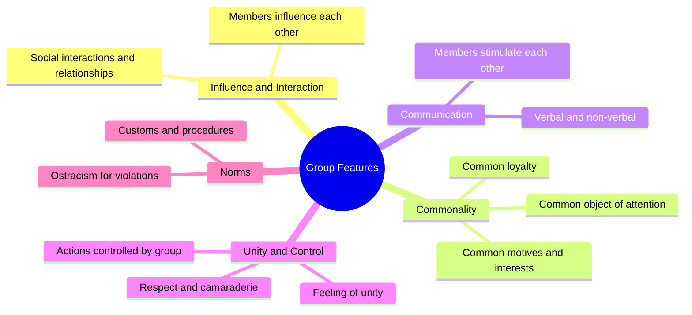

import Tabs from '@theme/Tabs';
import TabItem from '@theme/TabItem';

# Definition, Meaning, and Features of Groups

## Overview

Groups are among the most fundamental units of human social life. From the family we are born into to the professional teams we join, groups shape our identity, behaviour, and wellbeing. Understanding what constitutes a "group" — and why the concept is more complex than it first appears — is the foundation of group dynamics in social psychology.

---

**Source PDFs**:
- 📄 [Block-4/Unit-1.pdf - Pages 5–10](/pdfs/MPC-004%20Advanced%20Social%20Psychology/Block-4/Unit-1.pdf)
- 📚 MPC-004 Advanced Social Psychology

---

## What Is a Group?

### Everyday vs Psychological Definitions

In everyday language, we use "group" loosely — a crowd waiting at a bus stop, a category of people sharing an attribute (e.g., left-handed people), or an organised team. In social psychology, however, the term carries specific meaning.

The word "group" has three primary everyday uses:

1. **Physical proximity**: A number of persons sitting or working together at a given time — with or without a common purpose.
2. **Classification**: Persons sharing common characteristics, even if they have no direct relationship (e.g., "middle-income earners").
3. **Organisation membership**: Persons belonging to a structured entity with a sense of belongingness.

For psychological purposes, a group requires more than physical presence or shared labels.

### Key Definitions from Theorists

| Theorist | Year | Core Emphasis |
|----------|------|---------------|
| R.M. Williams | 1951 | Inter-related roles, recognised as a unit of interaction |
| R.M. MacIver | 1953 | Distinctive social relationships among members |
| David | 1968 | Organised system with role relationships and norms |
| Kretch, Crutchfield & Ballachy | 1962 | Interdependence and shared ideology (beliefs, values, norms) |
| Paulus | 1989 | Interaction, shared goals, stable relationship, mutual recognition |

**Paulus's (1989) definition is considered most comprehensive** for contemporary social psychology:

> "A group consists of two or more interacting persons who share common goals, have a stable relationship, are somehow interdependent and perceive that they are in fact part of a group."

This definition highlights five critical elements:
- **Interaction** (direct or indirect)
- **Common goals**
- **Stable relationships**
- **Interdependence** (what happens to one affects others)
- **Self-recognition** as group members

---

## Why People Join Groups

Human beings are inherently social animals. Four primary motivations for joining groups:

1. **Psychological and social needs** — receiving affection, attention, and a sense of belonging.
2. **Goal achievement** — tasks accomplished collectively are often performed better than alone.
3. **Information and knowledge** — access to diverse perspectives not available individually.
4. **Safety and security** — protection from threats, both physical and psychological.

This aligns with Maslow's Hierarchy of Needs, where belonging occupies the third tier, reinforcing that group membership is fundamentally tied to wellbeing.

---

## Important Features of Groups

Nine key features distinguish a psychological group:

### 1. Mutual Influence
Members **influence each other**. This bidirectionality distinguishes a group from an audience.

### 2. Social Interactions and Relationships
Structured **social interactions** exist among members. Groups are relational systems, not mere aggregates.

### 3. Common Motives, Drives, Interests
Members share **common purpose or interest** — giving the group direction and cohesion.

### 4. Communication
Both **verbal and non-verbal communication** occurs. The quality of communication largely determines group effectiveness.

### 5. Common Object of Attention
Group members share a common focus — attending to the same goals, problems, or activities. This enables coordination.

### 6. Common Loyalty and Similar Activities
Members participate in **similar activities** and demonstrate loyalty to the group and its goals.

### 7. Feeling of Unity
A sense of camaraderie (the feeling of "we-ness") develops among members, who treat each other with respect and regard.

### 8. Group Control of Action
The **group regulates members' behaviour** through norms and expectations.

### 9. Customs, Norms, and Procedures
Every group maintains **norms** — accepted rules of behaviour. Members who violate these norms may face social sanctions, including ostracism.

---

## Group Membership and Child Development

Children progressively develop their group identity as they age:

- Initially: feelings of **"I" and "Mine"** — a purely individualistic orientation.
- Gradually: feelings of **"You" and "Yours"** emerge, enabling sharing and cooperation.
- Through play groups, school groups, and peer interactions: children learn sentiments, interests, habits, and cooperative norms — the foundations of adult group membership.

This developmental trajectory underscores that **group competence is learned**, not innate.

---

## Comparison: Aggregates vs Groups vs Teams

| Feature | Aggregate | Group | Team |
|---------|-----------|-------|------|
| Physical proximity | Often | Sometimes | Not necessary |
| Interaction | Minimal | Yes | Intensive |
| Common goal | No | Sometimes | Always |
| Interdependence | No | Moderate | High |
| Stable structure | No | Moderate | Yes |
| Shared identity | No | Yes | Strong |
| Accountability | None | Moderate | Mutual |

---

## Indian Context: Groups in Indian Society

India's social fabric is woven with multiple overlapping group memberships — family (parivar), caste (jati), village community (gram), religious community, and linguistic groups. These groups provide:

- **Identity**: Group membership often precedes individual introductions.
- **Support networks**: Joint families as resource-sharing units.
- **Social control**: Community norms regulating marriage, occupation, and behaviour.

Contemporary urban India witnesses newer groups: professional associations, hobby clubs, online communities, and neighbourhood resident welfare associations (RWAs) — illustrating the dynamic evolution of group life.

---

## External Learning Resources

### Foundational Sources
- 📖 [Wikipedia: Social Group](https://en.wikipedia.org/wiki/Social_group)
- 📖 [Wikipedia: Group Cohesiveness](https://en.wikipedia.org/wiki/Group_cohesiveness)
- 📖 [Wikipedia: Collective Identity](https://en.wikipedia.org/wiki/Collective_identity)

### Educational Videos
- 🎬 [Crash Course Psychology: Social Thinking](https://www.youtube.com/watch?v=3R0JyUUI-Ug) — Introduction to social cognition and group behaviour
- 🎬 [TED-Ed: The Psychology of Groups](https://www.youtube.com/watch?v=k2s_Vn1DKPM) — The evolutionary basis of group membership

### Research Papers (2020–2024)
- 📄 Forsyth, D. R. (2021). The psychology of groups. In R. Biswas-Diener & E. Diener (Eds.), *Noba Textbook Series: Psychology*. Comprehensive modern overview.
- 📄 Greenaway, K. H., et al. (2022). Groups and social influence in health contexts. *Social Issues and Policy Review*, 16(1), 8–47.
- 📄 Turner, J. C., & Reynolds, K. J. (2020). Self-categorization theory. *Handbook of Theories of Social Psychology*, 399–417.

---

## Memory Aid: GRISNA Framework

Use **GRISNA** to remember the core elements of a psychological group:

| Letter | Element |
|--------|---------|
| **G** | **Goals** — shared common goals |
| **R** | **Relationships** — stable relationships exist |
| **I** | **Interaction** — members interact with each other |
| **S** | **Self-recognition** — members recognise themselves as a group |
| **N** | **Norms** — group has customs, norms, and procedures |
| **A** | **Affect** — mutual feelings of loyalty, we-ness, and camaraderie |

---

## Self-Assessment Questions

<Tabs>
<TabItem value="basic" label="Basic (Knowledge)">

**1.** According to Paulus (1989), what five conditions must be met for a collection of people to be called a group?

**2.** List any four important features of a group.

**3.** Why do people join groups? Identify the four main reasons.

</TabItem>
<TabItem value="intermediate" label="Intermediate (Application)">

**4.** A group of strangers waiting at a bus stop all share the experience of waiting. Is this a psychological group? Apply Paulus's definition to justify your answer.

**5.** How does MacIver's definition differ from Kretch, Crutchfield and Ballachy's definition? What does each emphasis reveal about different theoretical concerns in group psychology?

**6.** Consider your own family. Using the GRISNA framework, analyse whether it qualifies as a psychological group. Which element do you find most and least prominent?

</TabItem>
<TabItem value="advanced" label="Advanced (Analysis)">

**7.** The text distinguishes between everyday uses of "group" and the psychological definition. Why is this distinction important for social psychological research?

**8.** Critics argue that "interdependence" is the most essential criterion for a group. Evaluate this claim in light of the multiple definitions provided.

**9.** How might motivations for joining groups differ between individualistic cultures (e.g., USA, Germany) and collectivistic cultures (e.g., India, Japan)?

</TabItem>
</Tabs>

---

## Exam Tips

:::tip High Exam Importance
- **Definition questions** are frequent: memorise at least 2–3 theorist definitions (Williams, Paulus, Kretch et al.)
- **Feature-based questions**: Be able to list and briefly explain all 9 features
- **"Why join groups?"**: Standard 4–6 mark question; give psychological + social reasons
- Link group concepts to **real-world examples** (family, classroom, sports team)
:::

:::caution Common Misconception
Students often confuse **aggregates** (people in the same place) with **groups**. A crowd is NOT a group unless members interact, share goals, and recognise themselves as a unit.
:::

---

## Cross-References

- 🔗 [Group Characteristics](/mpc-004/block-4/group-characteristics-formation)
- 🔗 [Group Formation Theories](/mpc-004/block-4/group-formation-theories-rules)
- 🔗 [Types of Groups](/mpc-004/block-4/types-groups-structure)
- 🔗 [Conformity and Asch Experiment](/mpc-004/block-2/conformity-asch-experiment)
- 🔗 [Social Identity Theory](/mpc-004/block-2/concept-social-influence-theories)
