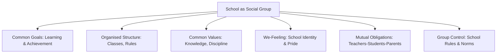

import Tabs from '@theme/Tabs';
import TabItem from '@theme/TabItem';

# Characteristics of Groups and Group Formation

## Overview

Understanding what makes a group cohesive and functional requires examining both the stable characteristics that define groups and the dynamic processes through which they form and develop. This file covers the nine defining characteristics of groups, Tuckman's five-stage model of group development, and the foundational theories explaining how groups come into existence.

---

**Source PDFs**:
- 📄 [Block-4/Unit-1.pdf - Pages 9–13](/pdfs/MPC-004%20Advanced%20Social%20Psychology/Block-4/Unit-1.pdf)
- 📚 MPC-004 Advanced Social Psychology

---

## Characteristics of a Group

The characteristics of a group are the distinguishing features that separate it from a mere collection of individuals. Nine core characteristics have been identified:

### 1. We-Feeling (Sense of Belongingness)
There is a feeling of **belongingness** among the members. Members help each other in performing duties, work collectively against harmful powers, and treat non-members as outsiders. The group strives to be self-sufficient.

*Example*: In a college friend group, members may stay loyal to each other even when new acquaintances try to create rifts — the "us vs them" mentality is a clear expression of we-feeling.

### 2. Common Interest
Each member has **common interest** — the similarity in interest promotes unity. A group includes persons who are related in such a way that they should be treated as one.

### 3. Feeling of Unity
**Unity** is essential for every group. Each member treats others as their own; differences of opinion do not destroy the underlying camaraderie.

### 4. Mutual Relatedness
Group members are **inter-related** — reciprocal communication and social relationships are the fundamentals of group life.

### 5. Affected by Group Characteristics
Every group has social characteristics that separate it from similar or dissimilar groups. These characteristics **affect all members**, even if in different ways.

### 6. Common Values
Certain values are shared among members, traditionally respected, and communicated to successive generations. These common values **bind the group together** and are manifested in mutual behaviours.

### 7. Control of Group
Every group has customs, norms, and procedures acceptable to everyone. Without norms, group life is impossible. The **similarity of behaviours** in group life exists precisely because group norms control individual actions.

### 8. Obligation
In a group, all members have **complementary obligations** to each other. Relationships are strengthened through mutual obligation and common social values.

### 9. Expectations
Members **expect** love, compassion, empathy, and cooperation from one another. When mutual expectations are fulfilled, group integrity is maintained. A group can sustain itself only if members satisfy each other's desires.

---

## The School as a Social Group: An Illustration

The IGNOU text uses the school as a vivid illustration of a social group. Notice how a school fulfils all nine characteristics:

- All children have a **common goal** (learning, examinations)
- Students and teachers are **motivated** toward a common purpose
- School has an **organised structure** (classes, departments, schedules)
- School offers **excellent opportunities** for groups to realise their needs

---

## Group Formation and Development

### The Five Stages of Group Development (Tuckman, 1965)

One of the most widely cited models in group psychology is Bruce Tuckman's stage model of group development. The IGNOU text presents five stages:

#### Stage 1: Forming
- **Characterised by**: Confusion and uncertainty
- **What happens**: Members get to know one another and share expectations about the group
- **Psychological state**: Anxiety mixed with excitement; politeness and superficiality dominate
- *Example*: The first week of a new college batch — students are careful, formal, and cautiously friendly.

#### Stage 2: Storming
- **Characterised by**: Highest level of disagreement and conflict
- **What happens**: Members voice concerns; interpersonal conflicts arise; differences of opinion about goals emerge
- **Psychological state**: Frustration, resistance, competition for roles
- *Example*: When a student project group begins — arguments over who should lead, whose ideas to use, and how to divide work.

#### Stage 3: Norming
- **Characterised by**: Recognition of individual differences and shared expectations
- **What happens**: Responsibilities are divided; the group decides how to evaluate progress; patterns of work are established
- **Psychological state**: Acceptance, cohesion, sense of "we can do this together"
- *Example*: The project group settles into clear roles — one researches, one writes, one designs.

#### Stage 4: Performing
- **Characterised by**: Maturity and cohesiveness
- **What happens**: Decisions are made rationally, focused on goals rather than emotional issues; role and norm conflicts are resolved
- **Psychological state**: Confidence, mutual support, high productivity
- *Example*: The project group produces excellent work efficiently, supporting each other.

#### Stage 5: Adjourning
- **Characterised by**: Feelings of closure and sadness
- **What happens**: The group, having achieved its objectives, gradually dissolves itself
- **Psychological state**: Nostalgia, pride in accomplishments, grief at separation
- *Example*: The last day of a final-year college group — celebrations mixed with sadness at parting.

:::tip Tuckman's Model in Context
Tuckman (1965) originally proposed four stages; "Adjourning" was added in 1977. This model is sometimes called **"Forming-Storming-Norming-Performing"** (FSNP). Not all groups proceed linearly — some may cycle back to earlier stages when membership changes or goals shift.
:::

---

## Theories of Group Formation

Three principal theories explain how and why groups form:

### 1. Classic Theory (George Homans)
Homans proposed that groups develop on the basis of three interdependent elements:

- **Activities**: Tasks people perform together
- **Interactions**: Exchanges that occur while performing activities
- **Sentiments**: Feelings (positive or negative) that develop toward one another

The key insight: **shared activities → more interaction → development of attitudes toward each other**. The theory predicts that proximity (physical or functional) increases the likelihood of group formation.

### 2. Social Exchange Theory
This theory proposes that individuals form groups when they perceive the relationship as offering **mutually beneficial exchanges** based on:

- **Trust**: Confidence that others will reciprocate fairly
- **Felt obligation**: Sense of duty to contribute and receive

Groups form and persist when members perceive a **positive exchange ratio** — when the benefits of membership (support, resources, information, belonging) outweigh the costs (time, effort, conformity pressures).

### 3. Social Identity Theory (Tajfel & Turner)
Individuals derive part of their **identity and self-esteem** from their group memberships. The theory suggests that:

- People categorise themselves and others into social groups
- Group membership contributes to a valued social identity
- Individuals are motivated to maintain or enhance the positive distinctiveness of their ingroups

This theory explains why people join groups even when material benefits are absent — the mere psychological benefit of belonging to a positively valued group is sufficient motivation.

| Theory | Core Mechanism | Key Theorist |
|--------|---------------|-------------|
| Classic Theory | Shared activities generate interaction and sentiment | George Homans |
| Social Exchange Theory | Cost-benefit analysis of membership rewards | Thibaut & Kelley |
| Social Identity Theory | Group membership provides identity and self-esteem | Tajfel & Turner |

---

## Group Decision-Making

The IGNOU text notes that **decision-making is one of the most important activities that groups perform**. Groups are often assumed to make better decisions than individuals because they:

- Utilise the expertise and knowledge of multiple members
- Avoid extreme courses of action (through discussion and moderation)

Group decision-making typically occurs in two phases:

1. **Discussion phase**: Confirms or strengthens the most popular view (rarely reverses it)
2. **Decision phase**: The correct or consensual decision ultimately emerges

However, social psychology has also documented failures of group decision-making, including **groupthink** (where cohesion overrides critical evaluation) and **risky shift** (where groups sometimes make riskier decisions than individuals).

---

## External Learning Resources

### Foundational Texts
- 📖 [Wikipedia: Tuckman's Stages of Group Development](https://en.wikipedia.org/wiki/Tuckman%27s_stages_of_group_development)
- 📖 [Wikipedia: Social Identity Theory](https://en.wikipedia.org/wiki/Social_identity_theory)
- 📖 [Wikipedia: Social Exchange Theory](https://en.wikipedia.org/wiki/Social_exchange_theory)

### Educational Videos
- 🎬 [Crash Course: Group Dynamics](https://www.youtube.com/watch?v=NNjlF-4bato) — Overview of group behaviour
- 🎬 [MIT OpenCourseWare: Social Psychology Lecture](https://ocw.mit.edu/courses/9-916-a-social-psychology-fall-2012/) — Academic overview

### Research Papers (2020–2024)
- 📄 Kozlowski, S. W. J., & Ilgen, D. R. (2022). Enhancing the effectiveness of work groups and teams. *Psychological Science in the Public Interest*, 7(3), 77–124.
- 📄 van Knippenberg, D. (2020). Embodying who we are: Leader group prototypicality and leadership effectiveness. *Leadership Quarterly*, 22(6), 1078–1091.
- 📄 Tajfel, H. (2021). Social identity and intergroup relations. *Annual Review of Psychology*, reprinted with commentary.

---

## Memory Aid: FORMING Acronym

Remember Tuckman's stages using this story-based mnemonic:

**F**riends **S**tart **N**egotiating **P**roductive **A**greements

- **F**orming → Friends (getting to know each other)
- **S**torming → Start (conflict starts)
- **N**orming → Negotiating (working out norms)
- **P**erforming → Productive (achieving goals)
- **A**djourning → Agreements end (group dissolves)

---

## Self-Assessment Questions

<Tabs>
<TabItem value="basic" label="Basic (Knowledge)">

**1.** What are the five stages of group development according to Tuckman? Briefly describe each stage.

**2.** Define "common interest" and "common values" as characteristics of a group and explain how they differ.

**3.** What is Social Identity Theory and how does it explain why people join groups?

</TabItem>
<TabItem value="intermediate" label="Intermediate (Application)">

**4.** A newly formed workplace team is experiencing high conflict, with members disagreeing about roles and goals. Which stage of Tuckman's model are they in? What should the team leader do?

**5.** Apply Social Exchange Theory to explain why people might leave a group they have belonged to for several years.

**6.** Using Homans' Classic Theory, explain why roommates in a college hostel are more likely to become close friends than students who live in different buildings.

</TabItem>
<TabItem value="advanced" label="Advanced (Analysis)">

**7.** Tuckman's model has been criticised for being too linear and Western-centric. Evaluate these criticisms. Does the model adequately describe group development in collectivistic cultures like India?

**8.** Compare and contrast Social Exchange Theory and Social Identity Theory as explanations for group formation. Under what conditions might each theory have more explanatory power?

**9.** Groupthink represents a failure of group decision-making. Using your knowledge of group characteristics (especially we-feeling, common values, and group control), explain why well-cohesive groups are paradoxically vulnerable to groupthink.

</TabItem>
</Tabs>

---

## Exam Tips

:::tip High Exam Importance
- **Tuckman's stages** are a frequent 10–15 mark question. Know all five stages with descriptions and examples.
- **Characteristics of groups** (9 characteristics): likely to appear as a short answer or fill-in-the-blank question.
- **Theories of group formation**: Compare all three theories in a table for quick revision.
:::

---

## Cross-References

- 🔗 [Group Definition and Features](/mpc-004/block-4/group-definition-meaning-features)
- 🔗 [Types of Groups and Structure](/mpc-004/block-4/types-groups-structure)
- 🔗 [Conformity and Asch Experiment](/mpc-004/block-2/conformity-asch-experiment) — group norms in action
- 🔗 [Social Identity Theory in Social Influence](/mpc-004/block-2/concept-social-influence-theories)
