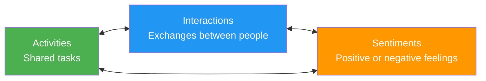
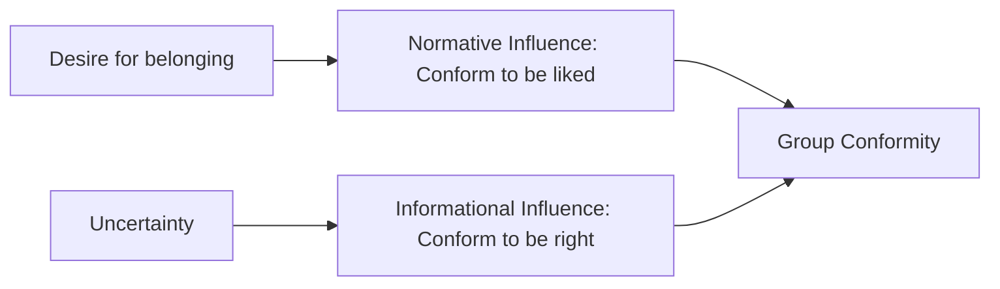

import Tabs from '@theme/Tabs';
import TabItem from '@theme/TabItem';

# Group Formation Theories and the 10 Rules That Govern Groups

## Overview

This file examines the foundational theories explaining how groups form and the empirically discovered psychological rules that govern group behaviour. Drawing on landmark experiments from social psychology — Tajfel's minimal groups paradigm, Asch's conformity study, Zimbardo's Stanford Prison Experiment, and Triplett's social facilitation research — we explore the powerful and sometimes surprising ways that group membership shapes human behaviour.

---

**Source PDFs**:
- 📄 [Block-4/Unit-1.pdf - Pages 11–15](/pdfs/MPC-004%20Advanced%20Social%20Psychology/Block-4/Unit-1.pdf)
- 📚 MPC-004 Advanced Social Psychology

---

## Theories of Group Formation: A Deep Dive

### 1. Classic Theory (George Homans, 1950)

Homans proposed that group formation emerges from the interaction of three interdependent elements:

The theory's central proposition: **the more people share activities → the more they interact → the stronger the sentiments that develop** (whether positive or negative).

**Practical implication**: This explains why people who work in the same office, study in the same classroom, or live in the same neighbourhood are more likely to form groups. Proximity and shared activities are the seeds of group formation.

**Limitations**: The theory does not explain why some interactions remain neutral or negative, or how groups persist even when members rarely interact directly (e.g., online communities, diaspora groups).

---

### 2. Social Exchange Theory (Thibaut & Kelley, 1959)

Social Exchange Theory frames group membership as an **implicit economic transaction**:

- Individuals join and remain in groups when the **rewards** (support, information, belonging, resources) outweigh the **costs** (time, conformity demands, effort)
- Membership is sustained by **trust** and **felt obligation** — expectations that exchanges will be reciprocal and fair
- People compare their current group against alternatives using the **Comparison Level for Alternatives (CLalt)** — if a better group is available, they may leave

**Key concepts**:

| Concept | Meaning |
|---------|---------|
| Comparison Level (CL) | What a person expects from a relationship |
| CLalt | Best available alternative |
| Outcome = Reward - Cost | If positive: stay; if negative: leave |
| Reciprocity | Expectation that giving leads to receiving |

**Indian application**: In Indian joint family systems, family members continue to live together even under conflict because the social exchange (emotional support, financial sharing, childcare) often exceeds the costs of separation. The CLalt (independent nuclear family) may seem less rewarding given the cultural value placed on family bonds.

---

### 3. Social Identity Theory (Tajfel & Turner, 1979)

Social Identity Theory argues that people join groups partly to enhance their **social identity** — the portion of self-concept derived from group memberships.

The theory proposes three cognitive processes:

1. **Social categorisation**: People classify themselves and others into social categories (student, Indian, woman, etc.)
2. **Social identification**: People adopt the identity of the group they belong to, internalising its norms and values
3. **Social comparison**: People compare their group favourably against outgroups to maintain positive distinctiveness

**Landmark Research: Tajfel's Minimal Groups Paradigm (1971)**

In one of social psychology's most famous experiments, boys who were strangers were split into arbitrary groups (supposedly based on preference for one painter vs another). Despite never meeting their fellow group members, they **favoured members of their own group over the other group** in resource allocation tasks.

This finding demonstrates that **group membership alone — even without interaction, history, or shared goals — is sufficient to trigger ingroup favouritism**. The mere fact of categorisation ("I am in Group A") creates a sense of identity and loyalty.

:::tip Exam Relevance
The minimal groups paradigm is extremely important for IGNOU exams. Know: (a) the method, (b) the finding, and (c) what it tells us about group identity.
:::

---

## The 10 Rules That Govern Groups

The IGNOU material presents 10 empirically derived rules about group psychology, each supported by classic research:

### Rule 1: Groups Can Arise from Almost Nothing

The **Minimal Groups Paradigm** (Tajfel et al., 1971) demonstrates that the desire to form groups is extremely powerful and built into human nature. Even the slightest hint of being classified into a group triggers ingroup favouritism.

*Implication*: Group identity does not require long history or shared experiences — it can emerge almost instantly from any basis of categorisation.

### Rule 2: Initiation Rites Improve Group Evaluations

**Aronson and Mills (1959)** found that women who underwent a humiliating initiation (reading explicit passages) rated the group they joined more positively than those without initiation.

*Mechanism*: **Cognitive dissonance** — having suffered to join a group, members convince themselves the group must be worthwhile to justify their suffering.

*Real-world examples*: Ragging in colleges, hazing in fraternities, military boot camps — all create stronger group loyalty, though at significant ethical cost.

### Rule 3: Groups Breed Conformity

**Asch's Conformity Experiment (1951)**: Participants judging the length of a line conformed to the obviously wrong majority answer in 76% of cases at least once.

*Why?* Two mechanisms:
- **Normative social influence**: Desire to be liked and accepted
- **Informational social influence**: Uncertainty leads people to trust the group's judgment

*Psychological insight*: People will deny the evidence of their own senses to conform with a group — a finding with profound implications for understanding phenomena like mob behaviour, cult membership, and workplace groupthink.

### Rule 4: Learn the Ropes or Be Ostracised

**Garfinkel's Breaching Experiments (1967)**: Adolescents who deliberately broke family norms (being overly polite, speaking only when spoken to) provoked anger and accusations of rudeness — even within 15 minutes.

*Implication*: Group norms are powerful, taken-for-granted, and their violation brings swift social sanctions. Breaking norms makes invisible rules suddenly visible.

### Rule 5: You Become Your Job (Role Effects)

**Stanford Prison Experiment (Zimbardo, 1972)**: Young men assigned as "prisoners" or "guards" in a simulated prison so thoroughly internalised their roles that the experiment had to be stopped after 6 days (planned for 14). Guards became abusive; prisoners became traumatised.

*Implication*: Roles are not just performed — they shape identity and behaviour at a deep level. This has implications for institutional design, workplace culture, and understanding how "ordinary people" can commit atrocities.

:::caution Ethical Issues
Zimbardo's Stanford Prison Experiment is now considered ethically problematic due to the harm caused to participants. Modern ethical guidelines would not permit such a study. However, its findings remain highly influential in understanding role-based behaviour.
:::

### Rule 6: Leaders Gain Trust by Conforming

**Merei's Study (1949)**: In a Hungarian nursery, children did not follow leaders who immediately proposed new ideas. Successful leaders were those who **first conformed to the group's existing norms**, then gradually suggested modifications. Trust must be earned through conformity before it can be leveraged through innovation.

*Modern application*: New managers in organisations are more effective when they first learn and respect existing culture before attempting change — a principle confirmed in contemporary leadership research.

### Rule 7: Groups Can Improve Performance

**Triplett's Social Facilitation Research (1898)**: Racing cyclists with a pacemaker cycled significantly faster than those without. The **mere presence of others** can improve performance on well-practiced, simple tasks.

*Theoretical explanation* (Zajonc, 1965): The presence of others increases physiological arousal, which improves performance on **simple/well-learned** tasks but impairs performance on **complex/novel** tasks.

| Task Type | With Audience | Alone |
|-----------|--------------|-------|
| Simple, well-learned | Better | Baseline |
| Complex, novel | Worse | Baseline |

### Rule 8: People Will Loaf

**Social Loafing (Ringelmann, 1890s)**: Participants in a tug-of-war put in only half as much effort when in a group of 8 compared to working alone. People hide in the group when individual contributions are difficult to measure.

*Conditions that increase social loafing*:
- Large group size
- Tasks where individual contributions are not identifiable
- Low task importance or interest
- Lack of group cohesion

*Reducing social loafing*: Make individual contributions identifiable, increase task meaningfulness, build group cohesion.

### Rule 9: The Grapevine is 80% Accurate

**Simmons (1985)**: Analysis of workplace communication found that about 80% of the time people communicate about work, and 80% of the information in the grapevine is accurate — contrary to the popular belief that rumours are mostly distorted.

*Implication*: Informal communication channels (gossip, grapevine) serve important functions in organisations and are more reliable than often assumed. Smart leaders pay attention to what the grapevine is saying.

### Rule 10: Groups Breed Competition

Even individually cooperative people become remarkably competitive once placed in an "us vs them" situation. **Intergroup competition** is one of the most robust findings in social psychology.

*Classical demonstration*: Sherif's Robbers Cave Experiment (1954) — two groups of boys at a summer camp quickly developed intense rivalry and hostility after being put in competition. The hostility only reduced when groups were given **superordinate goals** requiring cooperation.

---

## Comparing the 10 Rules: Positive vs Negative Group Dynamics

| Rule | Direction | Key Mechanism |
|------|-----------|--------------|
| Rule 1: Groups arise easily | Neutral | Social categorisation |
| Rule 2: Initiation rites strengthen loyalty | Positive/Negative | Cognitive dissonance |
| Rule 3: Groups breed conformity | Negative risk | Normative/informational influence |
| Rule 4: Ostracism for norm violation | Negative | Social sanctions |
| Rule 5: You become your role | Positive/Negative | Role internalisation |
| Rule 6: Leaders must conform first | Positive | Trust building |
| Rule 7: Groups improve performance | Positive | Social facilitation |
| Rule 8: People loaf in groups | Negative | Diffusion of responsibility |
| Rule 9: Grapevine is accurate | Positive | Informal communication |
| Rule 10: Groups breed competition | Negative | Intergroup dynamics |

---

## External Learning Resources

### Foundational Sources
- 📖 [Wikipedia: Asch Conformity Experiments](https://en.wikipedia.org/wiki/Asch_conformity_experiments)
- 📖 [Wikipedia: Stanford Prison Experiment](https://en.wikipedia.org/wiki/Stanford_prison_experiment)
- 📖 [Wikipedia: Social Facilitation](https://en.wikipedia.org/wiki/Social_facilitation)
- 📖 [Wikipedia: Social Loafing](https://en.wikipedia.org/wiki/Social_loafing)

### Educational Videos
- 🎬 [Crash Course: Social Psychology - Conformity](https://www.youtube.com/watch?v=UGxGDdQnC1Y)
- 🎬 [BBC Documentary: Stanford Prison Experiment](https://www.youtube.com/watch?v=760lwYmpXbc)
- 🎬 [TED: How Groups Affect Individual Behaviour](https://www.youtube.com/watch?v=5eKiaabFMFU)

### Research Papers (2020–2024)
- 📄 Hornsey, M. J. (2022). Social identity theory and self-categorization theory. *Social and Personality Psychology Compass*, 2(1), 204–222.
- 📄 Haslam, S. A., Reicher, S. D., & Van Bavel, J. J. (2022). Rethinking the nature of cruelty: The role of identity leadership in the Stanford Prison Experiment. *American Psychologist*, 74(7), 809–822.
- 📄 Karau, S. J., & Williams, K. D. (2021). Social loafing: Research findings, implications, and future directions. *Current Directions in Psychological Science*, 4(5), 134–140.

---

## Memory Aid: The 10 Rules Story

Imagine joining a **new sports team**:

1. You feel instant **team identity** (groups arise easily)
2. You go through **tryouts** (initiation rites)
3. You start **dressing like teammates** (conformity)
4. You quickly learn the **unwritten rules** (ostracism for violations)
5. You start playing your **assigned position** (you become your role)
6. As the **new player, you follow first** (leaders conform before leading)
7. The **crowd cheers and you play better** (groups improve performance)
8. In **team drills, you ease up** (social loafing)
9. **Rumours about the coach** are usually **mostly true** (grapevine accuracy)
10. Against the rival team, **you compete fiercely** (groups breed competition)

---

## Self-Assessment Questions

<Tabs>
<TabItem value="basic" label="Basic (Knowledge)">

**1.** What did Tajfel's minimal groups paradigm demonstrate about group formation?

**2.** Explain the difference between normative social influence and informational social influence in explaining conformity.

**3.** What is social loafing? What conditions make it more likely to occur?

</TabItem>
<TabItem value="intermediate" label="Intermediate (Application)">

**4.** Using Rule 2 (initiation rites), explain why students who have gone through a difficult entrance examination may feel stronger loyalty toward their institution than those who gained admission easily.

**5.** Rule 7 says groups improve performance, while Rule 8 says groups promote loafing. How can both be true? Under what conditions does each effect dominate?

**6.** Apply the Social Exchange Theory to explain why someone might stay in a group that they find personally unsatisfying.

</TabItem>
<TabItem value="advanced" label="Advanced (Analysis)">

**7.** The Stanford Prison Experiment has been criticised for methodological flaws and even fabrication of results (Le Texier, 2019). How does this affect the validity of Rule 5 ("you become your job")? Are there alternative experiments that support this rule?

**8.** Given the 10 rules, design a strategy for a new manager entering an existing team to maximise group performance and minimise loafing and conformity pressures.

**9.** Social Identity Theory predicts that group membership enhances self-esteem. However, members of stigmatised groups (e.g., based on caste, religion, race) often have lower self-esteem. How does this challenge or complicate Social Identity Theory?

</TabItem>
</Tabs>

---

## Exam Tips

:::tip High Exam Importance
- **The 10 rules**: This is a 15–20 mark question. Write each rule with its supporting experiment.
- **Social Identity Theory + Minimal Groups Paradigm**: Frequently tested together.
- **Conformity (Asch) + Social loafing (Ringelmann)**: Classic opposing examples of group effects.
:::

---

## Cross-References

- 🔗 [Group Definition and Features](/mpc-004/block-4/group-definition-meaning-features)
- 🔗 [Group Characteristics and Formation Stages](/mpc-004/block-4/group-characteristics-formation)
- 🔗 [Types of Groups and Structure](/mpc-004/block-4/types-groups-structure)
- 🔗 [Conformity — Asch Line Experiment](/mpc-004/block-2/conformity-asch-experiment)
- 🔗 [Social Influence Theories](/mpc-004/block-2/concept-social-influence-theories)
