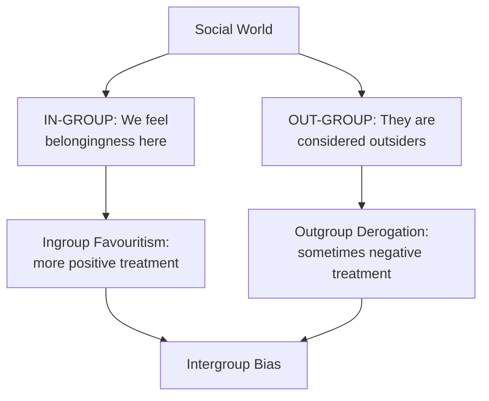
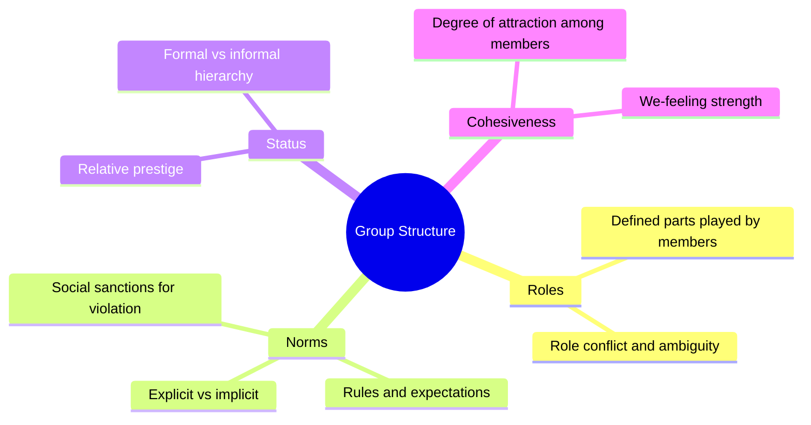
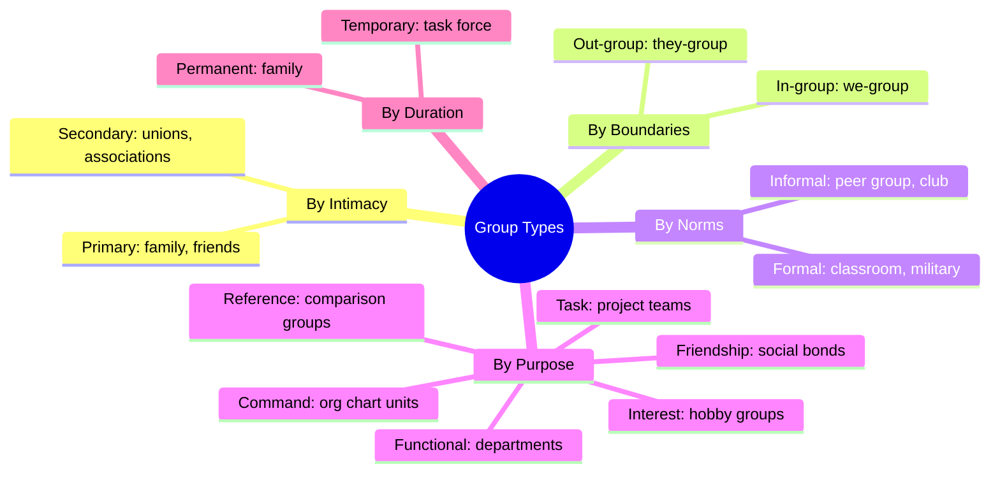

import Tabs from '@theme/Tabs';
import TabItem from '@theme/TabItem';

# Types of Groups, Group Structure, Conflict, and Behaviour

## Overview

This file provides comprehensive coverage of how social psychologists classify the many types of human groups, the structural elements that give groups their organisation, the nature and functions of group conflict, and how groups collectively behave and act. This is one of the most content-rich topics in MPC-004 Block-4.

---

**Source PDFs**:
- 📄 [Block-4/Unit-1.pdf - Pages 15–21](/pdfs/MPC-004%20Advanced%20Social%20Psychology/Block-4/Unit-1.pdf)
- 📚 MPC-004 Advanced Social Psychology

---

## Types of Groups: Classification Systems

Groups can be classified along multiple dimensions. The IGNOU material presents several overlapping classification systems:

### Classification 1: By Degree of Intimacy

#### Primary Groups (Cooley, 1909)
- **Characteristics**: Intimate, face-to-face relationships; maximum "we-feeling"; small size; long-term
- **Examples**: Family, close friend groups, village community, play groups
- **Psychological function**: Primary locus of emotional attachment, moral socialisation, and identity formation

#### Secondary Groups
- **Characteristics**: Relationships are more formal and impersonal; larger size; interaction is means to an end; common interest as the bond
- **Examples**: Trade unions, professional associations, religious organisations, university departments
- **Psychological function**: Instrumental goal achievement; broader social networks

| Dimension | Primary Group | Secondary Group |
|-----------|--------------|-----------------|
| Relationship quality | Intimate, personal | Formal, impersonal |
| Size | Small | Large |
| Interaction | Face-to-face, frequent | Indirect, infrequent |
| Bond | Emotional | Common interest |
| Duration | Long-lasting | Task-duration |
| Example | Family | Trade union |

### Classification 2: By Social Boundaries

#### In-Group (We-Group)
- Groups with which **we identify ourselves** — sharing common object, interest, and "we-feeling"
- Members treat outsiders as "others"
- Can be formed on the basis of relationship, nationality, political interests, economic interests
- **Psychological significance**: Ingroup members receive preferential treatment (ingroup favouritism); even minimal group conditions trigger this

#### Out-Group
- Groups whose members are considered **outsiders** by the ingroup
- "Them" as opposed to "us"
- Intergroup conflict typically involves ingroup-outgroup dynamics

### Classification 3: By Norms and Rules

#### Formal Groups
- Formed on the basis of **specific norms, rules, and values**
- Have clear structure, defined roles, explicit rules
- **Examples**: Classroom, military unit, legal court, a registered NGO

#### Informal Groups
- Nature is **unstructured**; rules are flexible
- Form spontaneously based on common interests, proximity, or affinity
- **Examples**: Play groups, peer groups, social clubs, WhatsApp friend groups

### Classification 4: By Purpose and Structure

| Group Type | Definition | Example |
|------------|-----------|---------|
| **Organised** | Formed for specific purpose, carefully planned | Family, school |
| **Spontaneous** | Form without planning | Audience at a public speech |
| **Command** | Specified by organisational chart | Supervisor + direct reports |
| **Task** | Work together to achieve a specific task | Project team |
| **Functional** | Created to accomplish goals within open timeframe | Marketing department |
| **Interest** | Bound by common interest; may cross departments | Book club, sports group |
| **Friendship** | Based on shared social activities, beliefs, bonds | College friend group |
| **Reference** | Group against which people evaluate themselves | Peer group used for social comparison |

### Classification 5: Temporary Groups
Temporary groups have distinctive sequencing:

1. First meeting **sets the group's direction**
2. First phase is one of **inertia**
3. A **transition** occurs at the midpoint (exactly half of allotted time)
4. The transition initiates **major changes** in activity
5. A **second phase of inertia** follows
6. The **last meeting** shows markedly accelerated activity

This "punctuated equilibrium" model (Gersick, 1988) explains why project groups often produce most of their work in a rush near the deadline — a familiar pattern for any student!

### Other Informal Group Types

- **Clique**: Informal, tight-knit group (common in schools/colleges) with shared interests and an established power structure
- **Community**: People with overlapping commonalities, often in proximity, with some degree of continuity
- **Gang**: Informal urban group gathering in a particular area; less structured than a club
- **Team**: Group working toward a common goal with high coordination; mutual accountability
- **Squad**: Small team (3–8 people) working toward a specific goal

---

## Group Structure

Group structure refers to the **pattern of interrelationships among group members** that makes the group's functioning orderly and predictable.

Four key aspects of group structure:

### 1. Role
The **typical part played by an individual group member** in accordance with the expectations of other members.

- Roles assign responsibilities and behaviours to specific positions within the group
- Role conflict occurs when a person occupies multiple roles with incompatible demands
- Role ambiguity occurs when expectations are unclear

*Example*: In a student project group, one member takes the "coordinator" role (scheduling, reminders), another takes the "creative" role (generating ideas), and another takes the "critic" role (quality checking).

### 2. Norms
**Rules and mutual expectations** that develop within the group to regulate behaviour.

- Norms ensure conformity and predictability
- Can be explicit (written rules) or implicit (unspoken expectations)
- Violation of group norms leads to social pressure and potential ostracism

*Example*: In an Indian family, norms about respecting elders (touching feet, not arguing publicly) are rarely written down but powerfully enforced.

### 3. Status
The **relative prestige or social position** given to groups or individuals by others.

- Higher-status members have more influence over group decisions
- Status hierarchies emerge in both formal groups (job titles) and informal groups (popularity, expertise)
- Status inconsistency (e.g., high education but low income) can create psychological strain

### 4. Group Cohesiveness
The **degree of attraction among group members** and the strength of "we-feeling."

- High cohesiveness = members stay in the group, work together, support each other
- Highly cohesive groups can be more productive but also more vulnerable to groupthink
- Cohesiveness is built through shared experiences, successful goal achievement, and perceived similarity

---

## Group Conflict

**Group conflict (or group intrigue)** occurs when social behaviour causes groups of individuals to conflict with each other, or when conflict occurs within a group.

Common causes of group conflict include:
- Differences in social norms
- Differences in values
- Differences in religion, caste, or political beliefs
- Competition for resources

### Constructive vs Destructive Conflict

| Type | Nature | Effect |
|------|--------|--------|
| **Constructive conflict** | Problems raised, alternative solutions offered, while valuing others | Like nourishing the goose: group can produce even better outcomes |
| **Destructive conflict** | Creates hostility, poisons group synergy | Like poisoning the goose: production ceases or quality falls |

The IGNOU text uses a powerful metaphor: destructive conflict is "like poisoning the goose that lays the golden eggs" — it destroys the very source of group productivity.

**Key principle**: Conflict is inevitable in groups. The goal is not to eliminate conflict but to channel it **constructively** — using disagreement to surface better ideas and solutions.

### Group Conflict in India
Indian society provides vivid examples of intergroup conflict along multiple fault lines:
- **Caste conflicts**: Disputes between different caste groups over reservations, land, and social status
- **Communal conflicts**: Hindu-Muslim-Sikh-Christian intergroup tensions
- **Language conflicts**: Disputes between linguistic communities (e.g., Marathi-North Indian tensions in Mumbai)
- **Labour conflicts**: Management-worker conflicts in industrial settings

---

## Group Behaviour and Group Action

### What Is Group Behaviour?
Group behaviour refers to situations where **people interact in large or small groups**, creating behaviour that differs from individual behaviour.

**Herd behaviour** occurs in large groups: people in the same place act simultaneously to achieve a goal that differs from what individuals would do alone.

### Examples of Large-Group Behaviour
1. **Crowd "hysteria"**: Emotional contagion spreading through a crowd
2. **Spectator behaviour**: A stadium audience behaving uniformly (cheering, booing) in response to events
3. **Public behaviour**: People watching the same TV channel may react similarly even though physically separated — occupying the same "virtual" social space

### Group Action vs Group Behaviour

| Concept | Definition | Example |
|---------|-----------|---------|
| **Group behaviour** | Uncoordinated — people in one place behaving similarly | Crowd panic |
| **Mass action** | Similar behaviour on a global scale | Shopping behaviour trends |
| **Group action** | Coordinated behaviour by many agents toward a shared goal | Organised march, protest |
| **Swarm intelligence** | Group of agents interact to fulfil a task; relevant to AI algorithms | Ant colony, bird murmuration |

### When Group Action Occurs
Group action arises when:
1. Social agents realise they are **more likely to achieve goals acting together** than individually
2. Actions are **coordinated** — not just parallel individual actions
3. There is a **shared goal** that justifies collective effort

*Examples*: Strikes (industrial action), mass protests, emergency response teams, military operations.

---

## External Learning Resources

### Foundational Sources
- 📖 [Wikipedia: Primary and Secondary Groups](https://en.wikipedia.org/wiki/Primary_and_secondary_groups)
- 📖 [Wikipedia: Reference Group](https://en.wikipedia.org/wiki/Reference_group)
- 📖 [Wikipedia: Group Cohesiveness](https://en.wikipedia.org/wiki/Group_cohesiveness)
- 📖 [Wikipedia: Groupthink](https://en.wikipedia.org/wiki/Groupthink)
- 📖 [Wikipedia: Swarm Intelligence](https://en.wikipedia.org/wiki/Swarm_intelligence)

### Educational Videos
- 🎬 [Crash Course: Group Behaviour and Conformity](https://www.youtube.com/watch?v=NNjlF-4bato)
- 🎬 [TED Talk: The Surprising Science of Happiness in Groups](https://www.youtube.com/watch?v=GXy__kBVq1M)
- 🎬 [MIT OpenCourseWare: Social Identity and Intergroup Relations](https://ocw.mit.edu/courses/9-916-a-social-psychology-fall-2012/pages/lecture-notes/)

### Research Papers (2020–2024)
- 📄 Levine, J. M., & Moreland, R. L. (2023). Small groups. In *Handbook of Social Psychology* (5th ed.), Wiley. — Comprehensive modern overview
- 📄 Stacey, A. W., & Newcomb, M. D. (2023). Peer group influence on substance use behaviour: A 20-year longitudinal study. *Developmental Psychology*, 59(2), 245–263.
- 📄 Hasan, Y. et al. (2022). Group conflict, intergroup contact and prejudice reduction: A meta-analysis. *Psychological Bulletin*, 148(7–8), 413–441.

---

## Memory Aid: GROUP Structure

Remember the four elements of group structure with **G-R-O-U-P**:

- **G**roup cohesiveness — the glue that holds members together
- **R**oles — the parts each member plays
- **O**rganisation through norms — the rules that regulate behaviour
- **U**nderstanding of status — the hierarchy of prestige
- **P**attern of interaction — the overall structure of relationships

---

## Comparative Summary: All Group Types

---

## Self-Assessment Questions

<Tabs>
<TabItem value="basic" label="Basic (Knowledge)">

**1.** Distinguish between primary groups and secondary groups with two examples of each.

**2.** What is the difference between an in-group and an out-group? Why is this distinction important in social psychology?

**3.** List the four important aspects of group structure and briefly define each.

</TabItem>
<TabItem value="intermediate" label="Intermediate (Application)">

**4.** A team of software developers working together for 6 months would be classified as which type of group (formal/informal, primary/secondary, task/functional)? Justify your classification.

**5.** Using the concept of reference groups, explain why a first-generation college student from a rural area might feel more culture shock than one whose parents are professors.

**6.** The text distinguishes between constructive and destructive group conflict. Using a real-world example (e.g., student union elections, corporate board disputes), illustrate how the same conflict could become either constructive or destructive depending on how it is handled.

</TabItem>
<TabItem value="advanced" label="Advanced (Analysis)">

**7.** Cooley's distinction between primary and secondary groups was developed in the early 20th century. Does this distinction still hold in the age of social media, where people can form deep emotional bonds with people they have never met in person? Critically evaluate.

**8.** Group cohesiveness is generally seen as positive, but social psychology has documented "cohesiveness traps" (e.g., groupthink). Under what conditions does high cohesiveness become dysfunctional? What structural changes might prevent this?

**9.** Analyse the nature of caste-based groups in India using the framework of in-group/out-group dynamics, status, and group norms. How do these group dynamics contribute to both social cohesion and social inequality?

</TabItem>
</Tabs>

---

## Exam Tips

:::tip High Exam Importance
- **Types of groups**: This is a standard 10–15 mark question. Organise your answer using the classification systems (by intimacy, by norms, by purpose).
- **Group structure**: Short to medium answer (6–8 marks). Use the four elements: Role, Norms, Status, Cohesiveness.
- **Group conflict**: Often asked in 5–8 mark format. Distinguish constructive from destructive.
- **Group behaviour vs group action**: Include examples for each.
:::

:::caution Common Exam Mistake
Students confuse **Reference Groups** with **In-groups**. A reference group is used for **comparison** (e.g., evaluating whether you are rich or poor compared to your neighbours). You may or may not be a member of your reference group. In-groups are groups you actively belong to.
:::

---

## Cross-References

- 🔗 [Group Definition and Features](/mpc-004/block-4/group-definition-meaning-features)
- 🔗 [Group Characteristics and Formation](/mpc-004/block-4/group-characteristics-formation)
- 🔗 [Group Formation Theories and 10 Rules](/mpc-004/block-4/group-formation-theories-rules)
- 🔗 [Conformity and Social Influence](/mpc-004/block-2/conformity-asch-experiment)
- 🔗 [Prejudice and Discrimination](/mpc-004/block-3/characteristics-types-prejudice) — built on in-group/out-group dynamics
- 🔗 [Social Conflict and Resolution](/mpc-004/block-3/nature-forms-social-conflict)
