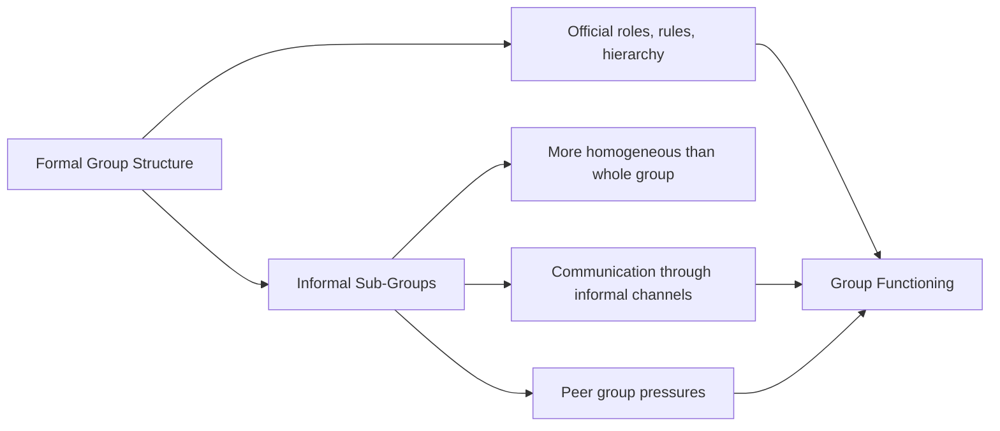
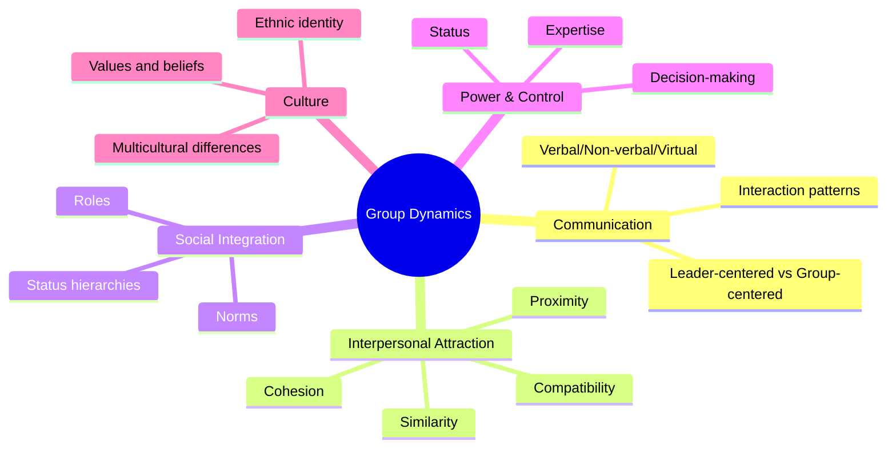

# Group Dynamics: Definition, Concept and Importance

## Overview

Group dynamics is one of the most foundational concepts in social psychology, first systematically studied by **Kurt Lewin** in 1944. It examines how psychological forces operate within groups, how groups change behaviour, and how membership shapes individuals. Understanding group dynamics is essential for effective work with any type of group — whether in therapy, education, organizations, or social movements.

:::info Source PDF
📄 [Block-4/Unit-2.pdf — Pages 22–26](/pdfs/MPC-004%20Advanced%20Social%20Psychology/Block-4/Unit-2.pdf)
📚 MPC-004 Advanced Social Psychology
:::

---

## 1. What Is Group Dynamics? — Definitions

The term **"group dynamics"** was coined by **Kurt Lewin**, who in 1944 established the **Research Centre for Group Dynamics** to create a scientific approach to understanding how groups function. The word "dynamics" means **force** — so group dynamics literally refers to the forces operating within groups.

### Core Definitions

| Theorist/Source | Definition |
|----------------|-----------|
| **Kurt Lewin (Field Theory)** | Group dynamics is related to field theory — man's behaviour is a function of the field existing at the time of occurrence of behaviour. |
| **Segal** | Group dynamics is a process by which one considers other individuals and a problem in a group simultaneously — increasing understanding and creating solutions that bring emotional balance. |
| **Cartwright & Zander (1968)** | A field of enquiry dedicated to advancing knowledge about the nature of groups, the laws of their development, and their interrelations with individuals, other groups and larger institutions. |
| **General Definition** | The way in which changes in behaviour of some members lead to changes in behaviour of other members — groups can mobilise powerful forces that may be constructive or destructive. |

### Breaking Down the Term

**Group** = A unit of two or more individuals who:
- Share a set of beliefs and values
- Have a common purpose, task or goals
- Have interdependent relations among members
- Feel a sense of **belongingness** (we-feeling)
- Prescribe norms of behaviour for themselves
- Have a **hierarchical structure** with distributed functions and powers

**Dynamics** = Force → Forces operating **within** groups

:::tip Exam Tip
In IGNOU exams, always mention Kurt Lewin and the year 1944 when defining group dynamics. Also remember the two key variables: **group cohesiveness** and **group locomotion**.
:::

---

## 2. The Concept of Group Dynamics

### Kurt Lewin's Field Theory Foundation

Lewin's **Field Theory** is the theoretical backbone of group dynamics. It states:

> *"Man's behaviour is a function of the field existing at the time of the occurrence of behaviour."*

This means behaviour cannot be understood in isolation — it must be understood in the **context** (field) in which it occurs. For groups, this means group behaviour emerges from the **totality of forces** acting on members at any given moment.

```mermaid
graph TD
    A[Kurt Lewin's Field Theory] --> B[Behaviour = f(Person × Environment)]
    B --> C[Group Context as Environment]
    C --> D[Group Cohesiveness]
    C --> E[Group Locomotion]
    D --> F[Forces binding members together]
    E --> G[Movement toward group goals]
    F --> H[Group Dynamics]
    G --> H
    H --> I[Changes in Individual & Group Behaviour]
```

### Two Key Variables in Group Dynamics

Social psychologists identify two critical variables:

1. **Group Cohesiveness** — The degree to which members stick together so that there is unity in the group. It is:
   - Determined by: **task direction**, **personal attraction**, and **group prestige**
   - The basis of attraction may lie in the **interaction itself** because of mutual satisfaction of needs
   - Applies to teen-age groups, political groups, religious groups

2. **Group Locomotion** — Movement towards the desired goal. It indicates whether the group is progressing toward its objectives.

### Cartwright and Zander's (1968) Basic Assumptions

Four foundational assumptions about groups in social psychology:

1. **Groups are inevitable** — Even hermits (Sanyasis) and hippies form groups; humans cannot escape group membership
2. **Groups mobilise powerful forces** — These forces produce effects of utmost importance to individuals
3. **Groups can be constructive OR destructive** — Both outcomes are possible depending on group dynamics
4. **Empirical understanding is key** — Correct understanding of group dynamics based on empirical studies helps enhance constructive aspects of group life

### Group Cohesiveness — Deeper Analysis

Group cohesiveness is the **sum of all forces** that keep members in the group. High cohesiveness involves:

- **Task direction**: Shared commitment to common goals
- **Personal attraction**: Members like and are drawn to each other
- **Group prestige**: Pride in group membership

**What cohesion does:**
- Indicates the degree of **sticking together** and unity
- The group takes decisions to change when it is ready for change
- Helps overcome resistance to social change
- Facilitates introduction of innovations

:::note Key Insight
Cohesiveness and social change are linked: "The change will occur when the group actually takes the decision to change." This is why group interventions are powerful — change at the group level produces change in individuals.
:::

### Mechanisms of Influence in Group Dynamics

Group dynamics is influenced by three psychological mechanisms:

| Mechanism | How It Works |
|-----------|-------------|
| **Sympathy** | Members perceive the psychological state of others; begin to feel as others feel |
| **Suggestion** | Suggestions from the group leader are readily accepted by members |
| **Imitation** | Members imitate the behaviour of the group leader |

### Group Techniques Used in Group Dynamics

| Technique | Description |
|-----------|------------|
| **Buzz Sessions** | 5–6 members discuss to stimulate broader discussion |
| **Role Playing** | Problems handled in ways beneficial to the group |
| **Brain Storming** | Group organized to stimulate creative discussion and generate ideas |
| **Recreational Experiences** | Opportunities for group members to participate in group activities |

---

## 3. Importance of Group Dynamics

Group dynamics has **11 key importances** (IGNOU framework):

| # | Importance |
|---|-----------|
| i | Essential for effective practice with **any type of task** |
| ii | Promotes elimination of **unproductive meetings** |
| iii | Individual members **and** the group as a whole benefit in many ways |
| iv | Underlying group dynamic is the **multicultural diversification** of society |
| v | Influences the **future functioning** of the group |
| vi | **Facilitates participation** of members |
| vii | Helps achieve goals in connection with **participation and satisfaction** |
| viii | Increases **interpersonal attraction** |
| ix | Increases **communication processes** and interaction patterns |
| x | Increases **power and control** of the group |
| xi | Creates impact on **racial, ethnic and cultural background** |

### Group Dynamics vs. Group Processes — Key Distinction

Both terms carry the implication that **groups are entities characterised by change and ongoing activity**:

- **Group Processes** = Formulations or explanations of tendencies within groups
- **Group Dynamics** = The specific forces (coined by Lewin) that drive those changes

---

## 4. Group Interaction as a Two-Way Process

Group interaction is fundamentally **reciprocal**:

> "Each individual or group stimulates the other and in varying degrees modifies the behaviour of participants."

### Key Points About Group Interaction

- The behaviour and **personality characteristics** of individual members affect others
- This makes a **significant impact** on the functioning of the group as a whole
- A person in a group **must act according to norms** — a few individuals may guide group behaviour
- School classrooms illustrate this: teachers and pupils interact continuously, pupils interact among themselves through codes, signs and shared stereotypes

### Formal vs. Informal Communication in Groups

Even within **formal group structures**, informal dynamics operate:



---

## 5. Five Dimensions of Group Dynamics (Summary Framework)

Group dynamics mainly depends on five interconnected dimensions:



---

## 6. Real-World Applications

### In Education (School as a Group)
The school is a **social institution** and primary example of a formal group:
- Teachers and pupils continuously interact in the classroom system
- Pupils interact among themselves through codes, signs and shared stereotypes
- Informal sub-groups form within the formal classroom structure
- **Group activities should be encouraged** to provide opportunities for participation

### In Therapy and Social Work
According to group work literature, understanding group dynamics distinguishes **group work** from other forms of social work practice. Group dynamics:
- Enables therapeutic change through the group's collective force
- Creates social change when the group decides to change
- Helps in multicultural contexts

### In Indian Context
India's rich tradition of **sanghas** (communities), **panchayats** (village councils), and **self-help groups (SHGs)** all exemplify group dynamics:
- Mahatma Gandhi's independence movement harnessed group cohesiveness and locomotion
- Village panchayats demonstrate how group norms govern behaviour
- SHGs in rural India show how cohesiveness enables economic empowerment

---

## 7. External Resources

### Wikipedia Articles
- 🌐 [Group Dynamics](https://en.wikipedia.org/wiki/Group_dynamics) — Comprehensive overview of the field
- 🌐 [Kurt Lewin](https://en.wikipedia.org/wiki/Kurt_Lewin) — Biography and field theory
- 🌐 [Group Cohesiveness](https://en.wikipedia.org/wiki/Group_cohesiveness) — Detailed exploration of cohesion
- 🌐 [Field Theory (Psychology)](https://en.wikipedia.org/wiki/Field_theory_(psychology)) — Lewin's theoretical framework

### Educational Videos
- 🎥 [Group Dynamics — CrashCourse Sociology](https://www.youtube.com/watch?v=NNi5UHiDXMY) — Overview of group behaviour
- 🎥 [Kurt Lewin and Change Management](https://www.youtube.com/watch?v=p4FVaCiG1UQ) — Field theory explained
- 🎥 [Group Cohesion and Group Dynamics](https://www.youtube.com/watch?v=CBVCxKFHXM0) — MIT OpenCourseWare lecture

### Recent Research Papers (2020–2024)
- 📄 **Forsyth, D.R. (2021).** "Recent advances in the study of group cohesion." *Group Dynamics: Theory, Research, and Practice*, 25(1), 1–14. DOI: 10.1037/gdn0000130
- 📄 **Hogg, M.A. (2022).** "Uncertain self in a changing world: A foundation for radicalisation, populism, and autocratic leadership." *European Review of Social Psychology*, 33(1), 235–268.
- 📄 **Rudolph, C.W., & Rauvola, R.S. (2020).** "Group dynamics and work team effectiveness." *Journal of Applied Psychology*, 105(8), 826–857.

---

## 8. Self-Assessment Questions

### Basic Level
1. **Who coined the term "group dynamics" and in what year?**
   - (a) Sigmund Freud, 1910 (b) Kurt Lewin, 1944 (c) Abraham Maslow, 1943 (d) Leon Festinger, 1957
   
2. **What are the two key variables in group dynamics according to social psychologists?**

3. **List any five importances of group dynamics.**

### Intermediate Level
4. **Explain Cartwright and Zander's (1968) four basic assumptions about groups.**

5. **Distinguish between "group processes" and "group dynamics." Why did Lewin prefer the term dynamics?**

6. **What is the relationship between group cohesiveness and social change? Give an example from Indian society.**

### Advanced Level
7. **Critically analyse Lewin's Field Theory as a foundation for understanding group dynamics. What are its strengths and limitations?**

8. **How do sympathy, suggestion, and imitation operate as mechanisms of group influence? Relate these to conformity research in social psychology.**

9. **"Group dynamics can be both constructive and destructive." Elaborate with contemporary examples from social movements and cult groups.**

---

## 9. Memory Aid

### The FIELD Framework for Group Dynamics
**F** — **Forces** operating within groups (the core meaning of "dynamics")  
**I** — **Interaction** as a two-way process modifying behaviour  
**E** — **Empirical** study — scientific analysis (Lewin's Research Centre)  
**L** — **Lewin** — field theory, man's behaviour = f(field)  
**D** — **Development** — groups change, locomotion toward goals  

### Key Equation to Remember
> **Group Dynamics = Group Cohesiveness + Group Locomotion**

(Cohesion holds the group together; Locomotion moves it toward goals)

---

## 10. Key Terms (Glossary)

| Term | Definition |
|------|-----------|
| **Group Dynamics** | The way changes in some members' behaviour lead to changes in others; forces mobilised within groups (constructive or destructive) |
| **Cohesiveness** | Social force keeping the group together; product of attractiveness of group interaction |
| **Group Locomotion** | Movement of the group toward its desired goals |
| **Field Theory** | Lewin's theory — behaviour is a function of the person and their psychological environment (field) |
| **Buzz Session** | A small-group discussion technique (5–6 members) to stimulate broader discussion |
| **Brainstorming** | Group technique to stimulate creative ideas and discussion |
| **Sympathy** | A mechanism by which group members perceive and begin to feel what others feel |
| **Suggestion** | Leader's suggestions readily accepted by group members |

---

## 11. Cross-References

- ➡️ [Group Definition, Meaning and Features](/mpc-004/block-4/group-definition-meaning-features) — Unit-1 coverage of what a group is
- ➡️ [Group Characteristics and Tuckman's Stages](/mpc-004/block-4/group-characteristics-formation) — Formation and development
- ➡️ [Communication in Group Dynamics](/mpc-004/block-4/communication-cohesion-group-dynamics) — Next section in this unit
- ➡️ [Conformity and Asch Experiment](/mpc-004/block-2/conformity-asch-experiment) — Related processes

---

*Last updated: February 2025 | Source: MPC-004 Block-4 Unit-2, Pages 22–26*
