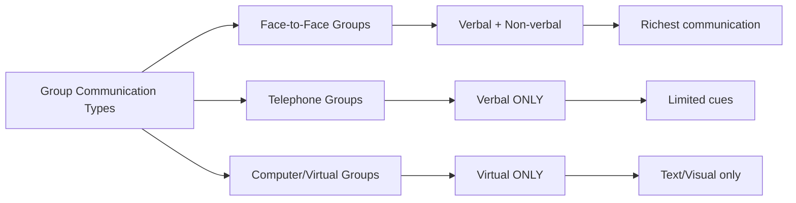
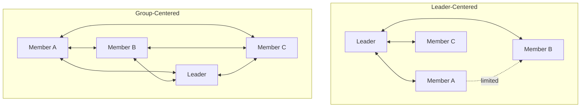
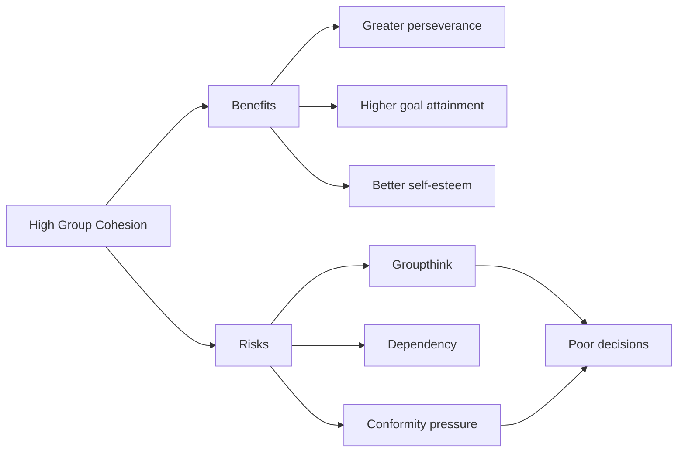

# Communication, Interpersonal Attraction and Cohesion in Group Dynamics

## Overview

Communication and cohesion are the two engines of group dynamics. How members communicate determines interaction patterns; how attracted members are to each other determines cohesion. Together, these forces shape whether a group thrives or fragments. This section covers the **Toseland and Rivas (2001)** framework for communication, **David's (1980)** interaction principles, and the relationship between **interpersonal attraction and group cohesion**.

:::info Source PDF
📄 [Block-4/Unit-2.pdf — Pages 26–29](/pdfs/MPC-004%20Advanced%20Social%20Psychology/Block-4/Unit-2.pdf)
📚 MPC-004 Advanced Social Psychology
:::

---

## 1. Role of Communication in Group Dynamics

### What Is Communication in a Group Context?

According to **Toseland and Rivas (2001)**, communication involves three essential processes:

| Process | Description |
|---------|------------|
| **Encoding** | Perception, thoughts and feelings are encoded into language and other symbols by a sender |
| **Transmission** | Language and symbols are transmitted verbally, non-verbally, or virtually |
| **Decoding** | The receiver decodes the message to understand meaning |

### Types of Communication by Group Format

Different group settings allow different modes of communication:

:::note Real-World Application (Post-COVID)
The COVID-19 pandemic shifted most group interactions to virtual formats. Research shows that virtual groups experience **reduced cohesion** due to the absence of non-verbal cues — demonstrating exactly why Toseland & Rivas' framework matters in contemporary psychology.
:::

---

## 2. Interaction Patterns in Groups — David's (1980) Principles

**David (1980)** identified **13 significant points** about interaction patterns in group dynamics:

### Communication Structure Patterns

| # | Principle |
|---|---------|
| i | **Leader is the central figure** — communication occurs from member→leader and leader→member |
| ii | **Group members take turns talking** — sequential communication |
| iii | **Extension between leader and member** — indicating relationship closeness |
| iv | **All members freely communicate** — full participation pattern |
| v | **Interaction pattern focuses on degree of centralisation** of communication |
| vi | **Group-centered interaction** is more valued than leader-centered |
| vii | Indication of **full participation** among members |
| viii | **Status and power relationships** affect interaction patterns |
| ix | **Interpersonal attraction and emotional bonds** influence interaction patterns |
| x | **Size of group** affects interaction — smaller groups allow more communication |
| xi | **Selective attention, cues and reinforcement** can change interaction patterns |
| xii | **Sub-group formation** indicated when members don't interact with equal valence |
| xiii | **Physical arrangement** may affect interaction patterns in some situations |

### Visualising Communication Patterns

**Key insight**: Group-centered patterns produce **more equal participation**, higher satisfaction, and stronger cohesion than leader-centered patterns.

### Impact of Group Size on Communication

Group size is one of the most powerful determinants of interaction quality:

| Group Size | Communication Quality | Cohesion | Risk |
|-----------|----------------------|---------|------|
| **Very small (2–5)** | Very high, intimate | Very high | Dependency |
| **Small (6–15)** | High, manageable | High | Sub-group formation |
| **Medium (15–30)** | Moderate, unequal | Moderate | Leader-centrism |
| **Large (30+)** | Low, fragmented | Low | Alienation |

---

## 3. Interpersonal Attraction and Cohesion in Group Dynamics

### Determinants of Interpersonal Attraction

Sub-group formation depends on interpersonal attraction, and cohesion depends on sub-group dynamics. Key factors that create interpersonal attraction:

| Factor | Mechanism |
|--------|----------|
| **Proximity** | Physical closeness increases interaction, which increases attraction |
| **Similarity** | Similar attitudes, values and backgrounds attract people to each other |
| **Acceptance and Approval** | Being valued by others creates attraction |
| **Meeting Expectations** | Members are attracted to those who fulfil their expectations in group interactions |
| **Compatibility** | Compatible personalities promote interpersonal attraction |

:::tip Memory Aid — PSAEC
**P**roximity → **S**imilarity → **A**cceptance → **E**xpectations → **C**ompatibility  
*"People Share A Genuine Compatibility"*
:::

### What Is Group Cohesion?

Group cohesion is **more than just interpersonal attraction** — it is the sum of ALL forces exerted on members to remain in the group:

> "Group cohesion is the sum of all the forces that are exerted on members to remain in a group." — Toseland & Rivas (2001)

**Three dimensions of cohesion:**
- **Affiliation** — satisfying members' need for belonging
- **Recognition** — satisfying members' need to be acknowledged
- **Security** — satisfying members' need for safety in the group

### Benefits of High Group Cohesion

According to **Toseland and Rivas (2001)**, high cohesion produces five beneficial behaviours:

1. **Greater perseverance** towards group goals
2. **Willingness to take responsibility** for group functioning
3. **Willingness to express feelings** openly
4. **Willingness to listen** to other members
5. **Ability to use feedback and evaluations** constructively

### Positive Outcomes of High Cohesion (Extended)

High group cohesion is generally associated with:
- ✅ **Greater satisfaction** with the group experience
- ✅ **Higher levels of goal attainment** by members and the group as a whole
- ✅ **Greater commitment** by group members
- ✅ **Increased feelings of self-confidence, self-esteem and personal adjustment**

### The Dark Side of Cohesion — Risks

High cohesion also carries risks:

| Risk | Description |
|------|------------|
| **Dependence on the group** | Members may become overly reliant on the group |
| **Silent members** | Some members remain silent rather than risk disapproval |
| **Groupthink** | Pressure for conformity can suppress critical thinking (Janis, 1972) |
| **Conformity costs** | Cohesion can lead to conformity that detracts from group work quality |

---

## 4. Interpersonal Attraction vs. Group Cohesion — Key Distinction

| Dimension | Interpersonal Attraction | Group Cohesion |
|-----------|------------------------|---------------|
| **Level** | Between individuals | Group-wide |
| **Basis** | Similarity, proximity, compatibility | All forces binding members together |
| **Scope** | Dyadic and sub-group | Entire group |
| **Role** | Building block of cohesion | Sum total of all binding forces |

> "Interpersonal attraction is just one of the building blocks of group cohesion." — Key distinction to remember for exams

---

## 5. Communication and Interaction in Indian Context

Indian group communication shows distinctive patterns worth understanding:

**Joint Family System**: Communication is often **leader-centered** around the eldest male/female, with clear status hierarchies determining who speaks when — an illustration of David's principles in everyday Indian life.

**Panchayat System**: Village councils demonstrate **group-centered communication** where decisions are made collectively, showing that horizontal communication patterns have deep cultural roots in India.

**Corporate India**: Post-liberalisation Indian organisations have shifted from formal hierarchical communication toward more group-centered patterns — a natural experiment in communication pattern change.

---

## 6. External Resources

### Wikipedia Articles
- 🌐 [Group Cohesiveness](https://en.wikipedia.org/wiki/Group_cohesiveness) — Comprehensive coverage of cohesion theory
- 🌐 [Interpersonal Attraction](https://en.wikipedia.org/wiki/Interpersonal_attraction) — Factors determining attraction
- 🌐 [Groupthink](https://en.wikipedia.org/wiki/Groupthink) — The dark side of high cohesion
- 🌐 [Communication](https://en.wikipedia.org/wiki/Communication) — General communication theory

### Educational Videos
- 🎥 [Group Cohesion — Crash Course Psychology](https://www.youtube.com/watch?v=UGtggdFQCOg) — Accessible introduction
- 🎥 [Interpersonal Attraction](https://www.youtube.com/watch?v=MRNMEbxXMnA) — MIT OpenCourseWare lecture
- 🎥 [Groupthink — Irving Janis](https://www.youtube.com/watch?v=VIEzfVKiqtA) — How cohesion can backfire

### Recent Research Papers (2020–2024)
- 📄 **Martínez-Moreno, E., et al. (2020).** "Group cohesion and team performance in virtual environments." *Small Group Research*, 51(4), 529–556.
- 📄 **Rink, F., & Ellemers, N. (2021).** "Group cohesiveness and team effectiveness: A meta-analysis." *Journal of Applied Psychology*, 106(8), 1108–1130.
- 📄 **Cohen, S., et al. (2022).** "Communication patterns and psychological safety in remote work groups." *Journal of Organizational Psychology*, 22(3), 45–68.

---

## 7. Self-Assessment Questions

### Basic Level
1. **According to Toseland and Rivas (2001), what are the three components of communication?**

2. **Which communication pattern is MORE valued: leader-centered or group-centered? Why?**

3. **List five factors that determine interpersonal attraction in a group.**

### Intermediate Level
4. **How does group size affect communication patterns? Use a table to compare small, medium and large groups.**

5. **Distinguish between interpersonal attraction and group cohesion. Why is this distinction important?**

6. **What are the five beneficial group member behaviours associated with high cohesion according to Toseland and Rivas?**

### Advanced Level
7. **"High group cohesion is generally positive, but it can also be destructive." Critically evaluate this statement with reference to the concept of groupthink.**

8. **Analyse how proximity, similarity and compatibility work together to build group cohesion. How can group leaders use this knowledge practically?**

9. **Compare face-to-face, telephone and computer-mediated group communication. What are the implications for modern virtual work teams?**

---

## 8. Memory Aid

### PACED Framework for Interpersonal Attraction
**P** — **Proximity** (physical closeness increases interaction)  
**A** — **Acceptance** and approval from others  
**C** — **Compatibility** of personalities  
**E** — **Expectations** met through group interaction  
**D** — **Diversity** of complementary skills and interests  

### Cohesion Formula
> **Cohesion = Affiliation Need + Recognition Need + Security Need**

### David's Communication Pattern — Key Rule
> *"Group-centered > Leader-centered"* — The more equal the communication, the better the group dynamics.

---

## 9. Cross-References

- ➡️ [Group Dynamics: Definition and Concept](/mpc-004/block-4/group-dynamics-definition-concept) — Foundation concepts
- ➡️ [Social Integration and Culture in Groups](/mpc-004/block-4/social-integration-culture-groups) — Next section
- ➡️ [Conformity and Asch Experiment](/mpc-004/block-2/conformity-asch-experiment) — Related MPC-004 content
- ➡️ [Group Definition and Features](/mpc-004/block-4/group-definition-meaning-features) — Unit-1 coverage

---

*Last updated: February 2025 | Source: MPC-004 Block-4 Unit-2, Pages 26–29*
