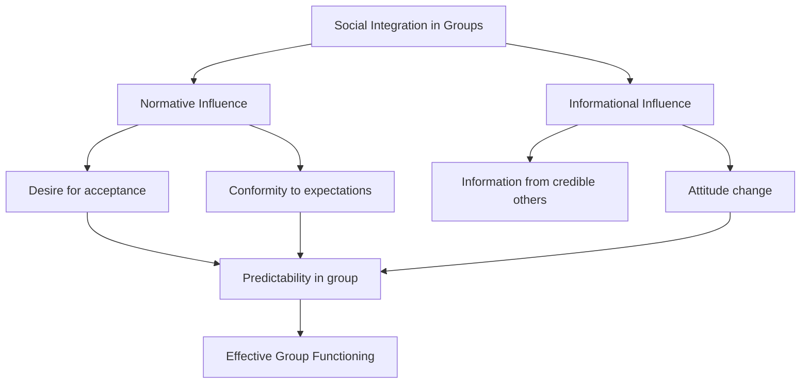
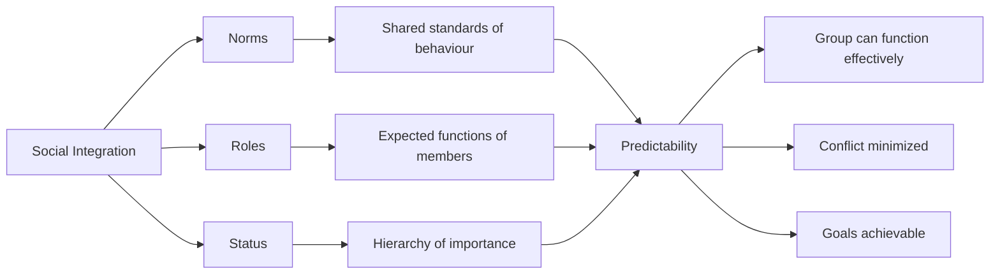
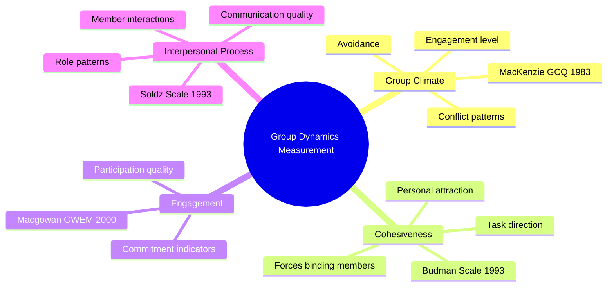

# Social Integration, Culture and Measurement in Group Dynamics

## Overview

Every group must solve two fundamental challenges: **how to hold itself together** (cohesion) and **how to coordinate members' actions** (social integration). Social integration refers to how group members fit together and are accepted — and it is governed by three essential structural forces: **norms, roles and status**. Beyond structure, every group is also shaped by **culture** — the values, beliefs and traditions members bring from their larger societies. This section also covers the key **measurement tools** used to study group dynamics scientifically.

:::info Source PDF
📄 [Block-4/Unit-2.pdf — Pages 28–30](/pdfs/MPC-004%20Advanced%20Social%20Psychology/Block-4/Unit-2.pdf)
📚 MPC-004 Advanced Social Psychology
:::

---

## 1. Social Integration in Groups

### What Is Social Integration?

Social integration means how group members **fit together and are accepted** in the group. It is the degree to which a group functions as a unified, coordinated whole rather than a collection of disconnected individuals.

Key principle: **"A group cannot function effectively without a fairly high level of social integration among group members."**

Social integration serves two critical functions:
1. **Builds unanimity** about purposes and goals
2. **Avoids conflict and unpredictability** that can create chaos

### Deutsch and Gerard's (1955) Two Forms of Social Influence

**Deutsch and Gerard (1955)** identified two fundamental mechanisms through which social integration operates:

| Form | Definition | Example |
|------|-----------|---------|
| **Normative Influence** | Desire to meet other people's expectations and to be accepted | Dressing in the group's style to be accepted |
| **Informational Influence** | Accepting and being persuaded by information provided by others | Changing one's medical beliefs based on a doctor's information |

### Why Conformity Is Necessary

A **certain amount of predictability, conformity and compliance** is necessary for group members to work together and achieve goals. This is not mere submission — it is the functional foundation of collective action.

**Norms develop slowly** in groups as members learn through interaction what is valued and what is preferred behaviour.

---

## 2. The Three Pillars of Social Integration

### 2.1 Norms — The Rules of the Group

**Norms** = Shared standards about how members should behave in the group

Key features of group norms:
- Develop **slowly** through interaction as members learn what is valued
- Are not always explicitly stated — many norms are **implicit**
- Govern both task-related and relational behaviour
- Violations typically result in social pressure to conform

### 2.2 Roles — Individual Functions in the Group

**Roles** = Shared expectations about the functioning of individual members

Key features:
- Members may take **different roles** within the same group
- Roles are **not fixed** — they emerge through interaction
- Some roles are formal (assigned), others are informal (emergent)

**Types of group roles (general categories):**

| Role Type | Examples |
|-----------|---------|
| **Task roles** | Initiator, Information seeker, Coordinator, Evaluator |
| **Maintenance roles** | Encourager, Harmoniser, Gatekeeper, Observer |
| **Blocking roles** | Aggressor, Dominator, Recognition-seeker, Withdrawer |

### 2.3 Status — The Hierarchy of Importance

**Status** = The ranking of importance of group members relative to each other

**Determinants of status:**
- **Prestige** — social reputation and esteem
- **Power** — ability to influence others
- **Position** — formal role or title
- **Expertise** — relevant knowledge or skills

:::note Dynamic Nature of Status
Status is relational and situational:
- It is measured **in relationship to other members**
- Status may **change when other members join or leave** the group
- Status also changes depending on the **situation** (a medical expert's status rises in health discussions)
:::

### The Three Pillars Together

---

## 3. Culture and Group

### What Is Culture in the Group Context?

Culture is a **combination of values, beliefs and traditions** of society. Every individual is born into a culture that influences their overall personality. When group members meet, they bring their cultural programming with them — and this profoundly shapes group dynamics.

When group members meet, they:
- Explore their **value systems** and interpersonal styles
- Search for **common ground** on which to relate
- Negotiate **whose cultural norms** will govern the group

### Levels of Cultural Influence on Groups

**Two levels of culture** influence group dynamics:
1. **Communality** — the immediate shared context of group members
2. **The larger society** — the broader cultural environment

### Western Dominance in Group Dynamics Research

An important critical point: Group dynamics research has historically reflected **European and American values**:
- **Individualism** — focus on individual rights and autonomy
- **Independence** — self-reliance as a virtue
- **Competitiveness** — achievement through competition
- **Achievement orientation** — goal-focused, task-driven

However, many cultures — including Indian culture — have different orientations:
- **Collectivism** — group harmony over individual assertion
- **Interdependence** — relationships and obligations
- **Cooperation** — collaborative rather than competitive
- **Relational orientation** — relationships valued as ends, not means

### Cultural Factors That Shape Group Dynamics

According to **Hopps and Pinderhughes (1991)** and **Matsukawa (2001)**:

> "Member's expectations and goals in a multicultural group vary widely. They significantly influence the dynamics of the group."

Cultural experiences that shape group dynamics include:
- **Group survival** experiences
- **Social hierarchy** — who is expected to lead
- **Inclusiveness vs. exclusiveness** — who belongs
- **Ethnic identification** — shared cultural identity

### Responsibilities of the Group Leader

According to **Davis et al. (1995)**, group leaders must:

1. Be **sensitive** to racial/ethnic and socio-economic differences
2. **Understand the effect** of these differences on group dynamics
3. **Translate this knowledge** into culturally sensitive modes of:
   - Programme development
   - Service delivery

:::tip Indian Context
India's group dynamics are profoundly shaped by:
- **Caste identity** — in-group/out-group boundaries based on caste
- **Language** — linguistic identity creates cohesion within but friction across groups
- **Religious identity** — communal groups with strong cohesiveness
- **Family structure** — joint family as the primary reference group
- **Regional identity** — state-based group loyalties

Understanding these cultural forces is essential for any psychologist working with Indian groups.
:::

---

## 4. Measurement of Group Dynamics

### Why Measure Group Dynamics?

Measurement is essential to **understand behaviour** of a group as a whole and the individuals who make it up. Task groups (committees, teams, boards of directors) are not merely collections of individuals — the **synergy** they create transcends individual contributions. Scientific measurement captures this synergy.

### Key Measurement Instruments

| Instrument | Developer | What It Measures |
|------------|----------|-----------------|
| **Group Climate Questionnaire (GCQ)** | MacKenzie (1983) | Overall group climate — engagement, avoidance, conflict |
| **Group Cohesiveness Scale** | Budman (1993) | Level of cohesion in therapeutic groups |
| **Group Work Engagement Measure (GWEM)** | Macgowan (2000) | Members' engagement in group work tasks |
| **Group Member Interpersonal Process Scale** | Soldz (1993) | Interpersonal processes between group members |

### What These Instruments Assess

### The Role of Synergy in Group Measurement

Group measurement must account for **synergy** — the emergent quality of group interaction that exceeds the sum of individual contributions:

> "The synergy that is created when people come together to work in these groups transcends the collection of individual efforts."

This is why individual psychological tests cannot substitute for group-level measurement — the group is more than the sum of its members.

---

## 5. Social Integration in Practice

### Constructive Integration Strategies

For group leaders and facilitators working to enhance social integration:

| Strategy | Mechanism |
|----------|----------|
| **Build on commonalities** | Highlight shared values to establish initial norms |
| **Clarify roles early** | Explicit role assignment reduces ambiguity and conflict |
| **Acknowledge status differences** | Transparent status structures are healthier than hidden hierarchies |
| **Create equal participation** | Structures that allow all members to speak strengthen integration |
| **Address cultural differences** | Culturally sensitive facilitation prevents sub-group fractures |

### When Social Integration Fails

Signs of poor social integration:
- **Chronic conflict** over goals and methods
- **Sub-group formation** based on demographic or cultural differences
- **Silent members** who feel unable to participate
- **Dominance by one or few members** who crowd out others
- **Norm violations** that go unaddressed, eroding trust

---

## 6. External Resources

### Wikipedia Articles
- 🌐 [Social Integration](https://en.wikipedia.org/wiki/Social_integration) — Concept and social implications
- 🌐 [Social Norms](https://en.wikipedia.org/wiki/Social_norm) — How norms govern behaviour
- 🌐 [Role (sociology)](https://en.wikipedia.org/wiki/Role) — Theory of social roles
- 🌐 [Social Status](https://en.wikipedia.org/wiki/Social_status) — Determinants and effects of status

### Educational Videos
- 🎥 [Social Norms and Conformity](https://www.youtube.com/watch?v=qA-gbpt7Ts8) — Crash Course Sociology
- 🎥 [Culture and Group Behaviour](https://www.youtube.com/watch?v=UGtggdFQCOg) — Cross-cultural psychology
- 🎥 [Measuring Group Dynamics](https://ocw.mit.edu) — MIT OpenCourseWare — Social Psychology

### Recent Research Papers (2020–2024)
- 📄 **Yammarino, F.J., et al. (2021).** "Leader and team member social comparison processes in groups." *Leadership Quarterly*, 32(1), 101484.
- 📄 **Homan, A.C., et al. (2020).** "The interplay between team diversity and group norms on information processing and decision-making." *Small Group Research*, 51(4), 422–458.
- 📄 **Bell, S.T., et al. (2023).** "Cultural diversity in work groups: A review and meta-analysis." *Journal of Applied Psychology*, 108(2), 177–203.

---

## 7. Self-Assessment Questions

### Basic Level
1. **What is social integration and why is it essential for group functioning?**

2. **Name the two forms of social influence identified by Deutsch and Gerard (1955).**

3. **List the four measurement instruments for group dynamics mentioned in the PDF with their developers.**

### Intermediate Level
4. **Explain the three pillars of social integration (norms, roles, and status). How do they work together?**

5. **How does culture influence group dynamics? Give examples from both Western and Indian contexts.**

6. **What is the difference between normative influence and informational influence? Give a real-world example of each.**

### Advanced Level
7. **Critically evaluate the Western bias in group dynamics research. How might this bias affect group interventions in non-Western settings like India?**

8. **A group leader is working with a culturally diverse group in urban India. What principles from Davis et al. (1995) should they apply? Give practical suggestions.**

9. **Discuss the concept of synergy in group measurement. Why is it insufficient to measure only individual members to understand a group?**

---

## 8. Memory Aid

### NRS Framework for Social Integration
**N** — **Norms** (shared standards of behaviour)  
**R** — **Roles** (expected functions of each member)  
**S** — **Status** (hierarchy of importance based on prestige, power, position, expertise)  

*"Norms, Roles and Status make a group run like clockwork."*

### Culture Influences — SIEGE
**S** — **Survival** experiences shape group identity  
**I** — **Inclusiveness** — who belongs and who doesn't  
**E** — **Ethnic** identification  
**G** — **Group** hierarchy and leadership expectations  
**E** — **Ethnic/cultural background** effects on communication  

---

## 9. Cross-References

- ➡️ [Group Dynamics: Definition and Concept](/mpc-004/block-4/group-dynamics-definition-concept) — Foundation concepts
- ➡️ [Communication and Cohesion](/mpc-004/block-4/communication-cohesion-group-dynamics) — Previous section
- ➡️ [Group Development Models](/mpc-004/block-4/group-development-models) — Next section
- ➡️ [Types of Groups and Group Structure](/mpc-004/block-4/types-groups-structure) — Unit-1 Group Structure

---

*Last updated: February 2025 | Source: MPC-004 Block-4 Unit-2, Pages 28–31*
