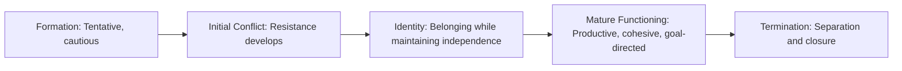
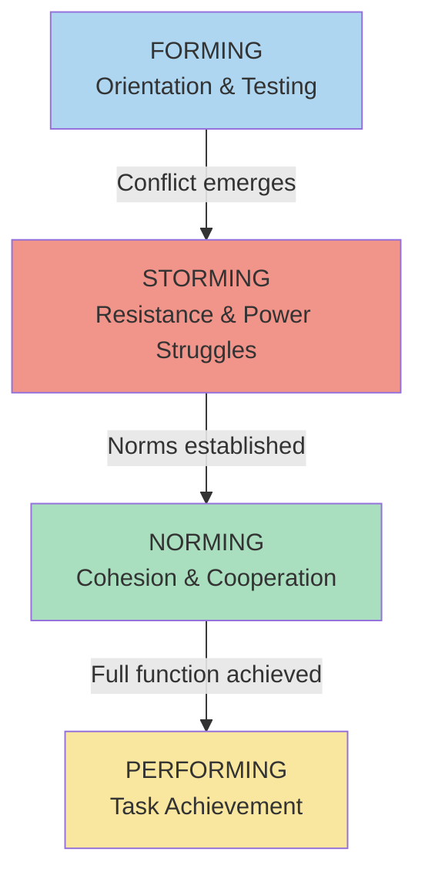
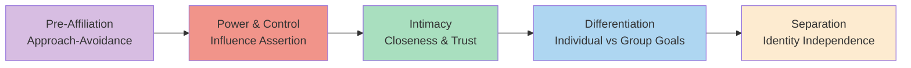

# Group Development: Tuckman's Stages and Garland-Jones-Kolodny Model

## Overview

Groups are not static entities — they **evolve over time**. Just as individuals go through developmental stages, groups have their own developmental trajectory. Understanding how groups develop helps leaders and members navigate the challenges of each stage, foster healthy dynamics, and achieve goals more effectively. This section covers the two most widely cited models of group development in social psychology: **Tuckman's (1963) stage model** and **Garland, Jones and Kolodny's (1976) five-stage model**.

:::info Source PDF
📄 [Block-4/Unit-2.pdf — Pages 30–31](/pdfs/MPC-004%20Advanced%20Social%20Psychology/Block-4/Unit-2.pdf)
📚 MPC-004 Advanced Social Psychology
:::

---

## 1. Why Do Groups Develop Through Stages?

Groups are not ready-made entities — they are **constructed through interaction**. As members come together, they must:

- Learn about each other's **personalities, skills and values**
- Establish **norms and roles** through trial and error
- Build **trust and cohesion** gradually
- Negotiate **status hierarchies**
- Create a **group culture** through sustained interaction

This process takes time and follows recognisable patterns — which is why stage models of group development have become foundational in social psychology.

> "As groups develop over time, group dynamic processes evolve." — IGNOU MPC-004 PDF

### General Pattern of Group Development

Group development typically follows this arc:

**Beginning stages** are characterised by:
- Tentative and cautious interaction
- Establishment of norms, roles and status hierarchies
- Slow emergence of group culture
- Little conflict initially

**Middle stages** are characterised by:
- Members becoming more comfortable
- Resistance can develop as members assert themselves
- Members want to belong but also maintain their own identity

---

## 2. Tuckman's (1963) Four-Stage Model: Forming-Storming-Norming-Performing

**Bruce Tuckman (1963)** proposed the most widely used model of small group development. His model identifies **four sequential stages** through which every group passes.

### The Four Stages

| Stage | Name | Characteristics |
|-------|------|----------------|
| **Stage 1** | **Forming** | Orientation, getting to know each other, dependence on the leader |
| **Stage 2** | **Storming** | Conflict, resistance, power struggles, testing boundaries |
| **Stage 3** | **Norming** | Cohesion develops, norms established, cooperation increases |
| **Stage 4** | **Performing** | Functional interdependence, task-focused, high productivity |

### Detailed Stage Analysis

#### Stage 1: Forming
- Members are **polite and cautious** — no one wants to rock the boat
- High **dependence on the leader** for direction
- Members are **exploring**: What is this group about? Who are these people? What are the rules?
- **Anxiety and uncertainty** are common
- Focus is on **inclusion and belonging**

#### Stage 2: Storming
- **Conflict emerges** as members assert themselves
- **Power struggles** over roles, leadership and direction
- **Resistance** to the task or to the leader
- Sub-group formation may occur
- This stage is **uncomfortable but necessary** — groups that avoid it often lack genuine cohesion

#### Stage 3: Norming
- **Resolution of conflict** from the storming stage
- **Cohesion develops** — members feel they belong
- **Norms and roles** become established and accepted
- **Cooperation increases** as trust builds
- Members begin to **support each other**

#### Stage 4: Performing
- The group is **functioning effectively** as a unit
- Focus shifts fully to **task accomplishment**
- Members are **flexible and interdependent**
- **High productivity** and creative problem-solving
- Members feel **competent and confident**

### Tuckman's 1977 Addition: Adjourning

In 1977, **Tuckman and Jensen** added a fifth stage:

**Stage 5: Adjourning (Mourning)**
- The group concludes its work and disbands
- Members experience a sense of **loss** and may grieve the end of the group
- Particularly important in **therapeutic groups** and **project teams**
- The leader's role is to facilitate **healthy closure and transition**

:::tip Exam Tip
The original 1963 model has four stages. The 1977 addition of "Adjourning" is often included in more recent textbooks. For IGNOU exams, focus on the original four: **Forming, Storming, Norming, Performing** (mnemonic: **FSNP** or "**Freddie Sings New Pop**").
:::

---

## 3. Garland, Jones and Kolodny's (1976) Five-Stage Model

**Garland, Jones and Kolodny (1976)** developed a **five-stage model** specifically for social work and therapeutic groups. It emphasises the **emotional and relational journey** of group members.

### The Five Stages

| Stage | Name | Key Focus |
|-------|------|----------|
| **Stage 1** | **Pre-Affiliation** | Should be affected to the group; approach/avoidance conflict |
| **Stage 2** | **Power and Control** | Should be able to have some influence over other members |
| **Stage 3** | **Intimacy** | There must be certain closeness and intimacy among members |
| **Stage 4** | **Differentiation** | Members differentiate their personal goals from group goals |
| **Stage 5** | **Separation** | Each member has a separate identity despite being part of the group |

### Detailed Stage Analysis

#### Stage 1: Pre-Affiliation
- Members experience an **approach-avoidance conflict** — they want the group's benefits but fear vulnerability
- Behaviour is **tentative and exploratory**
- Members test whether the group is **safe and worth joining**
- The leader's role is to **reduce anxiety** and make membership attractive

#### Stage 2: Power and Control
- Members begin asserting their need for **influence and autonomy**
- Testing of the **leader's authority** and group norms
- Members determine **their place in the hierarchy**
- Conflict may emerge over decision-making and leadership
- Similar to Tuckman's **Storming** stage but with stronger emphasis on power

#### Stage 3: Intimacy
- Members develop **genuine closeness** beyond surface politeness
- **Self-disclosure** increases — members share more personal information
- **Trust and mutual understanding** deepen
- The group begins to feel like a **community**
- Members are **invested** in each other's growth and wellbeing

#### Stage 4: Differentiation
- A more **mature** stage where members can distinguish between:
  - Their **personal goals** (what they want as individuals)
  - **Group goals** (what the group is collectively trying to achieve)
- Members appreciate the group while maintaining **individual identity**
- The group can **handle disagreement** without fragmenting
- Members can **challenge the leader** and each other constructively

#### Stage 5: Separation
- Preparation for the **end of the group**
- Members develop a **separate identity** — they carry the group's lessons forward as individuals
- They recognise they are part of the group AND distinct from it
- **Healthy termination** allows members to apply their growth in new contexts
- Contrast with unhealthy termination: **abandonment, avoidance or premature exit**

---

## 4. Comparing the Two Models

| Dimension | Tuckman (1963) | Garland, Jones & Kolodny (1976) |
|-----------|---------------|-------------------------------|
| **Number of stages** | 4 (+ Adjourning in 1977) | 5 |
| **Primary focus** | Task group development | Therapeutic/social work groups |
| **Emphasis** | Group task productivity | Emotional and relational journey |
| **Stage terminology** | Forming, Storming, Norming, Performing | Pre-Affiliation, Power/Control, Intimacy, Differentiation, Separation |
| **Best applied to** | Work teams, project groups, committees | Therapy groups, support groups, social work |
| **Handling conflict** | Storming stage = necessary conflict | Power & Control stage = authority testing |
| **Ending** | Adjourning | Separation |

### Which Model to Use?

- **Tuckman**: Best for **work teams, educational groups, project teams** where task achievement is primary
- **Garland et al.**: Best for **therapeutic groups, support groups, community development groups** where emotional process is central

Both models agree that:
- Group development is **sequential and progressive**
- **Conflict is normal and necessary** (Storming/Power & Control)
- **Cohesion builds over time** (Norming/Intimacy)
- **Healthy termination** requires deliberate attention (Adjourning/Separation)

---

## 5. Structural Characteristics and Group Development

**Many factors affect group development**, but structural characteristics have a particularly important impact:

### Key Structural Factors

| Structural Factor | Impact on Group Development |
|------------------|---------------------------|
| **Group size** | Smaller groups develop more quickly; larger groups have slower cohesion |
| **Group composition** | Homogeneous groups develop faster; heterogeneous groups develop more slowly but may produce better outcomes |
| **Group purpose** | Closed vs. open groups develop differently; therapeutic vs. task groups have different trajectories |
| **Leadership style** | Directive leaders can speed early stages; facilitative leaders support later stages |
| **Duration** | Short-term groups may not progress beyond early stages; long-term groups can reach full development |
| **Meeting frequency** | More frequent meetings accelerate development |

### Group Structure and Social Integration

As groups develop, **structure and social integration** become increasingly sophisticated:
- Members develop **positions** that stand in relationship to one another
- **Reciprocal role patterns** become established
- **Expectations and attitudes** become predictable
- This structure gives groups **stability and predictability**

---

## 6. Group Development in the Indian Context

### Indian Examples of Group Development Stages

**Self-Help Groups (SHGs)** in rural India provide excellent illustrations:

| Stage | SHG Example |
|-------|------------|
| **Pre-Affiliation / Forming** | Women initially uncertain whether to join; NGO worker builds trust and allays fears |
| **Power & Control / Storming** | Debates over who becomes treasurer or group leader; testing of facilitator's rules |
| **Intimacy / Norming** | Women begin sharing personal financial problems; mutual support develops |
| **Differentiation / Performing** | Individual members develop separate income-generating projects while supporting the group |
| **Separation / Adjourning** | Women graduate from micro-finance group; many form autonomous cooperatives |

### Cultural Factors in Indian Group Development

- **Collectivist orientation**: Indian groups may skip or minimize the Storming/Power & Control phase due to cultural pressure to maintain harmony — but this can lead to **suppressed conflict** that emerges later
- **Authority deference**: Hierarchical respect for elders/leaders may make the Power & Control stage less visible but no less present
- **In-group preference**: Indian groups often develop strong in-group cohesion quickly but struggle with integrating out-group members

---

## 7. External Resources

### Wikipedia Articles
- 🌐 [Tuckman's Stages of Group Development](https://en.wikipedia.org/wiki/Tuckman%27s_stages_of_group_development) — Comprehensive overview with research
- 🌐 [Group Development](https://en.wikipedia.org/wiki/Group_development) — Overview of multiple models
- 🌐 [Group Dynamics](https://en.wikipedia.org/wiki/Group_dynamics) — Broader context
- 🌐 [Forming-storming-norming-performing](https://en.wikipedia.org/wiki/Tuckman%27s_stages_of_group_development) — Detailed stage descriptions

### Educational Videos
- 🎥 [Tuckman's Stages of Group Development — Explained](https://www.youtube.com/watch?v=KoGr1k4oST0) — Clear visual explanation
- 🎥 [Group Dynamics in the Workplace — MIT OpenCourseWare](https://ocw.mit.edu) — Academic coverage
- 🎥 [Stages of Team Development](https://www.youtube.com/watch?v=Q6fRRnRJ0Sk) — Crash Course Psychology

### Recent Research Papers (2020–2024)
- 📄 **Tuckman, B.W. (original 1963, reviewed in Cassidy, S. (2021).** "Tuckman's model fifty years on: Critical review and future directions." *Small Group Research*, 52(3), 281–310.
- 📄 **Kozlowski, S.W.J., et al. (2021).** "Team development processes over time." *Annual Review of Organizational Psychology*, 8, 261–291. DOI: 10.1146/annurev-orgpsych-012420-062418
- 📄 **Mathieu, J.E., et al. (2020).** "A review of group development research: From formation to dissolution." *Journal of Management*, 46(6), 1028–1060.

---

## 8. Self-Assessment Questions

### Basic Level
1. **Name the four stages of Tuckman's (1963) model of group development in correct order.**
   - (a) Norming, Forming, Performing, Storming
   - (b) Forming, Storming, Norming, Performing
   - (c) Performing, Norming, Storming, Forming
   - (d) Storming, Forming, Norming, Performing

2. **Name the five stages of Garland, Jones and Kolodny's (1976) model.**

3. **What stage did Tuckman add in 1977? What does it involve?**

### Intermediate Level
4. **Compare Tuckman's "Storming" stage with Garland et al.'s "Power and Control" stage. What do they have in common? How do they differ?**

5. **Why is the Separation stage in Garland et al.'s model considered important for healthy group functioning?**

6. **A newly formed project team at a company seems stuck — members are openly arguing about roles and leadership. According to Tuckman's model, what stage are they in, and what should the leader do?**

### Advanced Level
7. **Critically evaluate the linear assumption in stage models of group development. Can groups regress to earlier stages? Give examples.**

8. **How do structural characteristics (size, composition, duration) affect the pace and quality of group development? Illustrate with examples from educational or therapeutic groups in India.**

9. **Compare and contrast Tuckman's model and Garland, Jones & Kolodny's model in terms of their applicability to: (a) a corporate work team, (b) a bereavement support group, and (c) a community development group in rural India.**

---

## 9. Memory Aid

### Tuckman's Stages — FSNP Mnemonic
**F** — **Forming** (polite, uncertain, dependent on leader)  
**S** — **Storming** (conflict, resistance, power struggle)  
**N** — **Norming** (cohesion builds, norms emerge)  
**P** — **Performing** (productive, cohesive, goal-focused)  

*"Freddie Sings New Pop"* or *"For Students, No Problem"*

### Garland et al. — PPIDS Mnemonic
**P** — **Pre-Affiliation** (approach-avoidance)  
**P** — **Power and Control** (influence assertion)  
**I** — **Intimacy** (closeness and trust)  
**D** — **Differentiation** (individual vs group goals)  
**S** — **Separation** (independence while belonging)  

*"Pretty People In Deep Sleep"*

---

## 10. Key Terms

| Term | Definition |
|------|-----------|
| **Group Development** | The progressive evolution of a group through recognisable stages over time |
| **Tuckman's Model** | Four-stage model: Forming → Storming → Norming → Performing |
| **Forming** | Initial orientation stage — members cautious, leader-dependent |
| **Storming** | Conflict stage — resistance, power struggles, assertion of individuality |
| **Norming** | Cohesion stage — norms established, cooperation increases |
| **Performing** | Productive stage — full task focus, functional interdependence |
| **Adjourning** | Fifth stage (Tuckman 1977) — group concludes and members separate |
| **Pre-Affiliation** | Garland et al. Stage 1 — approach/avoidance conflict about joining |
| **Separation** | Garland et al. Stage 5 — maintaining individual identity at group's end |
| **Structural Characteristics** | Features of group design (size, composition, duration) that affect development |

---

## 11. Cross-References

- ➡️ [Group Dynamics: Definition and Concept](/mpc-004/block-4/group-dynamics-definition-concept) — Foundation: what group dynamics means
- ➡️ [Communication and Cohesion in Groups](/mpc-004/block-4/communication-cohesion-group-dynamics) — How cohesion evolves through stages
- ➡️ [Social Integration and Culture](/mpc-004/block-4/social-integration-culture-groups) — Norms and roles that stabilise at later stages
- ➡️ [Types of Groups and Group Structure](/mpc-004/block-4/types-groups-structure) — Unit-1 foundation on group types

---

*Last updated: February 2025 | Source: MPC-004 Block-4 Unit-2, Pages 30–31*
