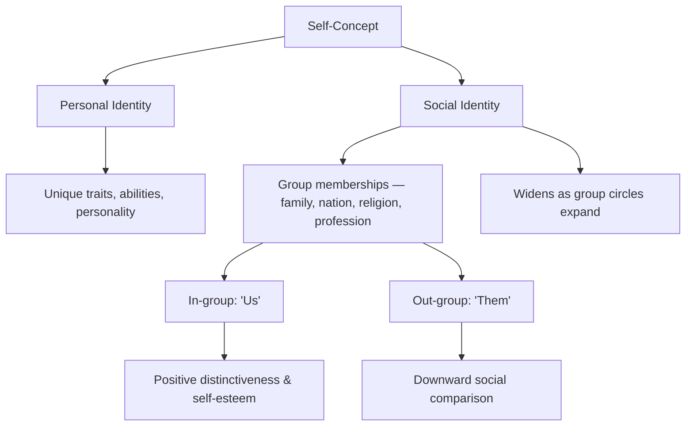
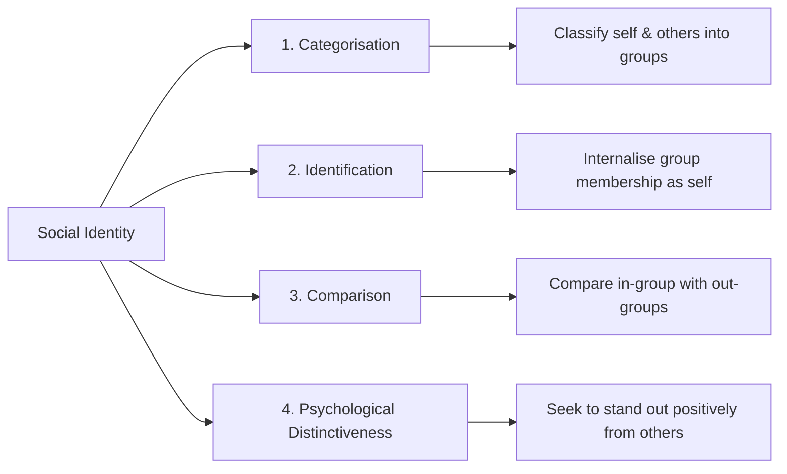

import Tabs from '@theme/Tabs';
import TabItem from '@theme/TabItem';

# Social Identity Theory: Self, Groups, and Belonging

> *"A person has not one 'personal self' but rather several selves that correspond to widening circles of group membership."* — Henri Tajfel & John Turner (1979)

## Introduction

Who are you? The answer is rarely simple. You might identify as a student, an Indian, a member of your family, a psychology enthusiast — and all of these memberships shape how you think, feel, and behave. This is the central insight of **Social Identity Theory (SIT)**, one of the most influential frameworks in social psychology.

Developed by Henri Tajfel and John Turner in 1979, SIT explains how people derive part of their **self-concept** from their memberships in social groups. The theory has transformed our understanding of prejudice, discrimination, intergroup conflict, and organisational behaviour — and remains a cornerstone of modern social psychology.

📄 **Source PDF**: [Block-4/Unit-3.pdf — Pages 35–36](/pdfs/MPC-004%20Advanced%20Social%20Psychology/Block-4/Unit-3.pdf)
📚 MPC-004 Advanced Social Psychology, Block 4: Group Dynamics

---

## What Is Social Identity?

**Social identity** refers to an individual's sense of who they are based on their group memberships. It is distinct from **personal identity**, which is based on unique personal attributes and one's autobiography.

According to Tajfel and Turner (1979), social identity is **the individual's self-concept derived from perceived membership in social groups** (Hogg & Vaughan, 2002).

### Key Insight: Multiple Social Selves

A person does not have one single "self" — they have **multiple social identities** that become salient (active) in different contexts:

- In a classroom → student identity is salient
- At a religious event → faith-based identity is salient
- During a cricket match → national identity is salient

Ethnicity is considered one of the **most powerful social identities**, involving common biological origins, customs, habits, norms, and a shared sense of history.

---

## The Four Components of Social Identity

Tajfel and Turner identified **four core elements** that constitute social identity:

| Component | Description | Example |
|-----------|-------------|---------|
| **Categorisation** | We classify people (including ourselves) into social categories to understand the social world | "I am a psychology student; they are engineering students" |
| **Identification** | We adopt the identity of groups we belong to; it becomes part of our self-concept | Feeling proud to be Indian |
| **Comparison** | We compare our in-group with relevant out-groups to evaluate our group's standing | "Our college is better than theirs" |
| **Psychological Distinctiveness** | We strive for our in-group to be positively distinct from out-groups | Emphasising what makes our group special |

---

## The Three Motivational Principles

Tajfel and Turner proposed that Social Identity Theory rests on three core motivational assumptions:

1. **People are motivated to maintain a positive self-concept.** We want to feel good about ourselves.
2. **The self-concept derives largely from group identification.** Because we identify with groups, how we evaluate those groups affects how we evaluate ourselves.
3. **People establish positive social identities by favourably comparing their in-group with an out-group.** We achieve self-esteem through *positive distinctiveness* — believing our group is better in some meaningful way.

### The In-Group Favouritism Mechanism

Tajfel and Turner identified three variables that influence how strongly in-group favouritism occurs:

- **The extent to which individuals identify with an in-group** — more identification → more favouritism
- **The extent to which the context provides ground for intergroup comparison** — some situations invite comparison more than others
- **The perceived relevance of the comparison group** — we compare with groups we see as similar or competitive

---

## Self-Concept and Social Cognition

Our **self-concept** is an organised collection of beliefs and feelings about ourselves. It is acquired through:
- Interaction with immediate family in early life
- Encounters with peers, institutions, and cultures as we grow

Self-concept includes:
- Information about our past, present, and future selves
- Our motives, emotional status, abilities, and self-evaluations
- Social identities and personal identities

The self-concept **influences how we process information** — we attend to, remember, and interpret information differently depending on which identity is active at a given moment.

### Social Identity and Information Processing

When a social identity is salient, people:
- Apply in-group norms and standards to evaluate behaviour
- Show **in-group bias** — rating in-group members more positively
- Display **out-group homogeneity** — seeing out-group members as "all the same"
- Use **social comparison** to gauge their standing relative to other groups

---

## Factors Shaping Social Identity

The significant factors that influence social identity include:

| Factor | Role |
|--------|------|
| **Individual Capacities** | Skills and talents shape which groups one joins or aspires to |
| **Experiences** | Shared experiences (trauma, triumph, tradition) bind groups |
| **Mobility** | Ability to leave or join groups affects identity stability |
| **Location** | Geographic and cultural context shapes available group memberships |

Social identities are associated with **normative rights, obligations, and sanctions** — being a member of a group comes with expected behaviours and responsibilities.

---

## Applications of Social Identity Theory

SIT has been applied across a remarkable range of fields:

### 1. Prejudice and Stereotyping
SIT explains how **stereotypes** arise naturally from categorisation: once people are categorised into groups, out-groups are viewed through generalised, often negative lenses. Prejudice is maintained by the need to preserve a positive in-group image.

**Research connection**: Tajfel's famous [Minimal Group Paradigm](https://en.wikipedia.org/wiki/Minimal_group_paradigm) experiments demonstrated that people show in-group favouritism even when groups are formed arbitrarily (e.g., based on a coin flip).

### 2. Organisational Behaviour
In workplaces, employees identify with their team, department, or company. SIT explains **interteam rivalry**, departmental silos, and why mergers often face psychological resistance.

### 3. Negotiation and Conflict Resolution
When negotiators see themselves as representing their group (not just themselves), social identity concerns drive decision-making — explaining why negotiations often stall over symbolic issues of group recognition.

### 4. Language Use
People adjust their language, accent, and communication style based on which social identity is active — a phenomenon called **speech accommodation theory**.

### 5. Social and Organisational Change
SIT has implications for how people **respond to social change**: change that threatens valued social identities meets stronger resistance. Effective change strategies must address identity concerns, not just rational incentives.

---

## Critique and Limitations

While immensely influential, SIT has faced several critiques:

- **Overemphasis on intergroup conflict**: The theory focuses on comparative processes, potentially neglecting cooperative intergroup relations.
- **Western cultural bias**: The emphasis on individualistic self-concept may not translate fully to collectivist cultures like India, where in-group identity is more fluid.
- **Static view of identity**: Real identities are dynamic and context-sensitive in ways the original theory did not fully capture.

Later developments — including **Self-Categorisation Theory** (Turner et al., 1987) — expanded SIT to address some of these limitations.

---

## Memory Aid: CICP Framework

**CICP** — the four pillars of Social Identity:
- **C** — Categorisation (sort people into groups)
- **I** — Identification (adopt group as part of self)
- **C** — Comparison (compare your group to others)
- **P** — Psychological Distinctiveness (strive to stand out positively)

*"Careful Individuals Compare Proudly"*

---

## External Resources

### Wikipedia
- 🌐 [Social Identity Theory](https://en.wikipedia.org/wiki/Social_identity_theory) — Full theoretical overview
- 🌐 [Henri Tajfel](https://en.wikipedia.org/wiki/Henri_Tajfel) — Founder's biography and work
- 🌐 [Minimal Group Paradigm](https://en.wikipedia.org/wiki/Minimal_group_paradigm) — Key experiments
- 🌐 [Self-Categorisation Theory](https://en.wikipedia.org/wiki/Self-categorization_theory) — Turner's extension of SIT

### Educational Videos
- 🎥 [Social Identity Theory — Simply Psychology](https://www.youtube.com/watch?v=wJCMTEQHZXs) — Clear overview for students
- 🎥 [Henri Tajfel's Minimal Group Experiments — Crash Course Psychology](https://www.youtube.com/watch?v=NNSoZnxFBBE) — Engaging visual explanation
- 🎥 [Social Identity & Intergroup Relations — MIT OpenCourseWare](https://ocw.mit.edu/courses/17-903-identity-conflict-and-power-summer-2022/) — Advanced academic treatment

### Recent Research (2020–2024)
- 📄 Reicher, S., & Haslam, S. A. (2021). Rethinking the psychology of tyranny: The BBC Prison Study. *British Journal of Social Psychology*. — How group identity shapes extreme behaviour
- 📄 Hornsey, M. J. (2022). Social identity theory and self-categorisation theory: A historical review. *Social and Personality Psychology Compass*, 2(1), 204–222.
- 📄 Postmes, T., & Branscombe, N. R. (2023). Clashes of knowledge: Fundamentals of social identity. *Psychological Inquiry*, 34(2), 110–124.
- 📄 Tajfel, H., & Turner, J. C. (1979/reprinted 2020). An integrative theory of intergroup conflict. In M. J. Hatch & M. Schultz (Eds.), *Organizational Identity*. — Original paper reprinted with contemporary commentary

---

## Indian Context

Social identity plays a particularly complex role in Indian society, where identities based on **caste, religion, language, region, and gender** overlap and intersect. Research in India has shown:

- **Caste identity** remains a powerful in-group marker affecting educational, occupational, and social outcomes
- **Religious identity** becomes especially salient during communal tensions, activating in-group favouritism and out-group hostility
- **Language identity** (Hindi, Tamil, Bengali, etc.) drives regional pride and occasional conflict

Understanding SIT helps explain both the **richness of Indian diversity** and the psychological roots of communal tensions — making it practically essential for Indian psychology students.

---

## Self-Assessment Questions

### Basic Level
1. Social Identity Theory was developed by whom and in which year?
2. List the four components of social identity as identified by Tajfel and Turner.
3. What is the difference between personal identity and social identity?

### Intermediate Level
4. Explain the concept of "multiple social identities" with two examples from Indian daily life.
5. How does the Minimal Group Paradigm demonstrate in-group favouritism? What did Tajfel's experiments show?
6. What are the three motivational principles underlying Social Identity Theory?

### Advanced Level
7. "Social Identity Theory offers a social-psychological explanation for prejudice and discrimination." Critically evaluate this claim with reference to the theory's core mechanisms.
8. Discuss the applicability of Social Identity Theory to understanding caste or religious group dynamics in India. What modifications, if any, might be needed?
9. How does Self-Categorisation Theory extend and refine Social Identity Theory? What additional insights does it provide?

---

## Cross-References

- 🔗 [Group Formation and Dynamics](/mpc-004/block-4/group-dynamics-definition-concept) — Foundation concepts
- 🔗 [Communication and Cohesion](/mpc-004/block-4/communication-cohesion-group-dynamics) — Group processes
- 🔗 [Social Integration and Culture](/mpc-004/block-4/social-integration-culture-groups) — Norms and conformity
- 🔗 [Crowd Behaviour and Theories](/mpc-004/block-4/crowd-behaviour-theories) — Identity loss in crowds

---

*Social Identity Theory reminds us that who we are cannot be separated from who we belong to. Every group we join becomes a part of how we see ourselves — and how we see the world.*
