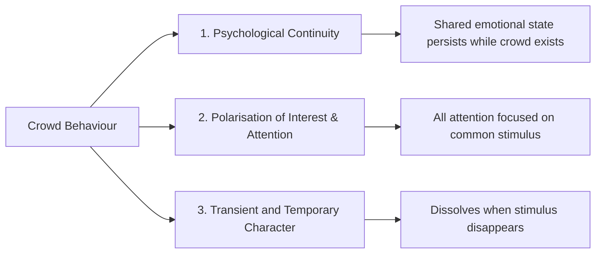
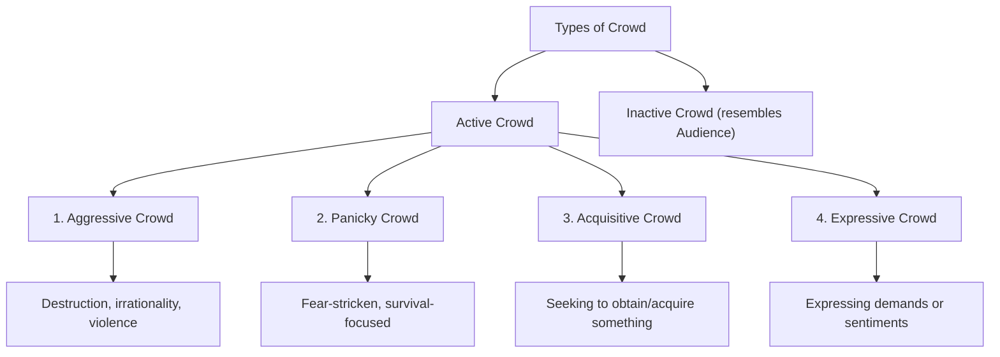

import Tabs from '@theme/Tabs';
import TabItem from '@theme/TabItem';

# Crowd: Definition, Types, and Characteristics

> *"A crowd is a gathering of a considerable number of persons around a centre or point of common attraction."* — Kimball Young

## Introduction

Every day, crowds form and dissolve — at railway stations, cricket matches, political rallies, markets, and street accidents. Yet what makes a crowd psychologically distinctive from a mere collection of people? How do individuals within crowds think, feel, and behave differently than when alone?

**Crowd psychology** is the branch of social psychology that examines these questions. From Gustave Le Bon's 19th-century observations to modern research on crowd dynamics, this field reveals how collective behaviour emerges and what it means for individual identity and social order.

📄 **Source PDF**: [Block-4/Unit-3.pdf — Pages 36–38](/pdfs/MPC-004%20Advanced%20Social%20Psychology/Block-4/Unit-3.pdf)
📚 MPC-004 Advanced Social Psychology, Block 4: Group Dynamics

---

## Defining the Crowd

Multiple sociologists and psychologists have offered definitions of the crowd:

| Scholar | Definition |
|---------|------------|
| **MacIver** | "A physically compact aggregation of human beings brought into direct, temporary and unorganised contact with one another" |
| **Kimball Young** | "A gathering of a considerable number of persons around a centre or point of common attraction" |
| **Majumder** | "An aggregation of individuals drawn together by an interest without premeditation on the part of any of them and without even tentative provision of what to expect" |

### Synthesised Definition

A **crowd** is a **temporary, direct, and unorganised group of individuals** whose curiosity, values, and emotions are temporarily identical and which arises because of a common interest or common stimulus. It is the most **transitory and unstable** of all social groups — it forms quickly and dissolves as soon as its cause vanishes.

---

## Three Aspects of Crowd Behaviour

All crowd behaviour involves three fundamental aspects:

**Example**: When two people start fighting on the road, a crowd collects (common stimulus) with shared attention on the fight (polarisation), and disperses when they stop (temporary character).

---

## Types of Crowds

Crowds are classified into two broad categories: **Active** and **Inactive**.

### Active Crowd

**Active crowds** are characterised by emotional intensity and some form of action-orientation.

#### 1. Aggressive Crowd
- Characterised by a **destructive and aggressive frame of mind**
- Capable of acts of destruction, brutality, and irrationality
- Exhibits **tremendous excitement** and heightened emotions
- **Example**: Riots, mob lynching, post-match violence

#### 2. Panicky Crowd
- Driven by **extreme fear** — members are "crazed with fear"
- Reasoning and judgment break down completely
- Primary motivation: **survival, escape from perceived danger**
- **Example**: Stampedes at religious gatherings, fire evacuations

#### 3. Acquisitive Crowd
- Formed when people compete to **obtain or acquire** something
- Motivated by individual goal attainment, not collective emotion
- **Example**: People rushing for cinema tickets, queuing for limited goods during scarcity

#### 4. Expressive Crowd
- Formed to **give expression to demands or sentiments**
- Less violent than aggressive crowds; more symbolic
- **Example**: Protest marches, public demonstrations, victory celebrations

### Inactive Crowd
- The distinction between active and inactive crowds is **only relative** — no crowd is entirely inactive
- Inactive crowds **resemble an audience** — gathered but not directly acting
- **Example**: People gathered at the scene of an accident, watching without intervening

---

## Characteristics of Crowd

All crowds, regardless of type, share certain defining psychological characteristics:

| Characteristic | Description |
|----------------|-------------|
| **No Predetermined Aim** | Crowds form spontaneously without prior planning |
| **No Fixed Time or Place** | Can arise anywhere, anytime, around any stimulus |
| **Common Interest** | Members temporarily share curiosity, values, or emotions |
| **Emotional Motivation** | Members are driven by emotion rather than reason |
| **Unpredictable Behaviour** | What the crowd will do next is uncertain |
| **Mutual Stimulation** | Members stimulate one another's emotions and actions |
| **Uncontrolled & Disorganised** | No formal authority or structure governs behaviour |
| **Contagion of Feeling** | Emotions spread rapidly through the crowd |

---

## Mechanisms of Crowd Behaviour

Three key psychological mechanisms drive crowd behaviour (Le Bon, 1895):

### 1. Anonymity
When individuals merge into a crowd, they **lose their individual identity**. This anonymity reduces personal accountability — people act in ways they would never act alone. The usual social constraints (fear of judgment, legal consequences) are weakened.

### 2. Contagion
Emotions and behaviours **spread rapidly** through a crowd like a contagion. This is facilitated by close physical proximity, jostling, and the emotional intensity of the situation. As Turner (1964) noted, the "close proximity" and "jostling like sheep in a herd" facilitates emotional spread.

### 3. Suggestibility
In the anonymous, emotionally charged crowd, individuals become **highly susceptible** to suggestions, slogans, and the actions of others. Critical thinking is suppressed; the crowd moves as one.

---

## The Frustration-Aggression Connection

**Dollard (1939)** applied the **frustration-aggression hypothesis** to explain violent crowd behaviour:
- When people's goals are blocked (frustration), aggression results
- In a crowd, individual frustrations merge into collective aggression
- The anonymity of the crowd provides a safe outlet for repressed hostility

**Turner's Emergent Norm Theory (1964)** offered a contrasting view:
- Crowd behaviour is not irrational but follows **emergent norms**
- New norms arise spontaneously in crowd situations and guide behaviour
- This explains why different crowds in similar situations sometimes behave very differently

---

## Crowd vs. Other Social Groups

The crowd is often compared with other social formations:

| Feature | Crowd | Group | Public | Mob |
|---------|-------|-------|--------|-----|
| Physical proximity | Required (compact) | Not required | Scattered | Required |
| Duration | Very temporary | Enduring | Varied | Very temporary |
| Organisation | None | Formal/informal | Diffuse | None |
| Aim | No set aim | Shared goals | Shared opinion | Immediate action |
| Emotional intensity | Moderate–High | Low–Moderate | Low | Very High |

---

## Memory Aid: APES Framework for Active Crowd Types

**APES** — four types of active crowds:
- **A** — Aggressive (destruction-oriented)
- **P** — Panicky (fear-driven)
- **E** — Expressive (sentiment-driven)
- **S** — acquisitive (Self-interest / getting-oriented)

*"Angry People Express Self-interest"*

---

## External Resources

### Wikipedia
- 🌐 [Crowd Psychology](https://en.wikipedia.org/wiki/Crowd_psychology) — History and theories
- 🌐 [Gustave Le Bon](https://en.wikipedia.org/wiki/Gustave_Le_Bon) — Pioneer of crowd psychology
- 🌐 [Collective Behaviour](https://en.wikipedia.org/wiki/Collective_behaviour) — Sociological framework
- 🌐 [Deindividuation](https://en.wikipedia.org/wiki/Deindividuation) — Identity loss in crowds

### Educational Videos
- 🎥 [Crowd Psychology — CrashCourse](https://www.youtube.com/watch?v=MEpiQCrPkEs) — Overview of social influence
- 🎥 [Why Crowds Go Crazy: The Science of Mob Mentality](https://www.youtube.com/watch?v=nVNGxbbIGz0) — BBC Science documentary
- 🎥 [Le Bon and Crowd Theory — Sociology Explained](https://www.youtube.com/watch?v=5d0eDTHCRho)

### Recent Research (2020–2024)
- 📄 Stott, C., Livingstone, A., & Hoggett, J. (2021). Policing crowd disorder in post-COVID contexts. *Policing and Society*, 31(4), 411–425.
- 📄 Drury, J., Novelli, D., & Stott, C. (2022). Intergroup dynamics in crowd emergencies. *Journal of Social Issues*, 78(2), 336–355.
- 📄 Reicher, S. D. (2020). The St Pauls riot revisited: Explaining crowd events after 40 years. *European Journal of Social Psychology*, 50(5), 959–968.

---

## Indian Context

India hosts some of the world's largest crowds — at **Kumbh Mela** (100+ million attendees), **Rath Yatra**, and **national celebrations** like Independence Day and cricket victories. Key crowd dynamics observed in Indian contexts:

- **Panicky crowds** during religious stampedes (e.g., Chamunda Devi temple, Rajasthan 2008; Hathras 2024) highlight the deadly consequences of crowd psychology failures
- **Acquisitive crowds** form around subsidised food distribution, election freebies, and railway ticket booking
- **Expressive crowds** are central to India's protest culture — from freedom struggle to modern farmers' marches

Understanding crowd psychology is essential for **event management, disaster relief, and public safety** planning in India's mass-gathering contexts.

---

## Self-Assessment Questions

### Basic Level
1. Define "crowd" according to MacIver and Kimball Young.
2. List the four types of active crowd with one example each.
3. What are the three aspects of crowd behaviour as described in the unit?

### Intermediate Level
4. Distinguish between panicky crowd and aggressive crowd with psychological explanations.
5. How do the mechanisms of anonymity, contagion, and suggestibility work together to produce crowd behaviour?
6. Compare crowd and public as social formations — what are the key differences?

### Advanced Level
7. Dollard's frustration-aggression hypothesis and Turner's emergent norm theory offer contrasting explanations for crowd behaviour. Critically compare both theories, citing strengths and limitations.
8. "Crowds are not irrational — they follow emergent social norms." Evaluate this statement from the perspective of Turner's (1964) theory.
9. Using your knowledge of crowd psychology, analyse the psychological dynamics that led to a crowd stampede (any real example from India). What psychological factors were involved and how could they have been mitigated?

---

## Cross-References

- 🔗 [Social Identity Theory](/mpc-004/block-4/social-identity-theory) — Identity loss in crowds
- 🔗 [Theories of Crowd Behaviour](/mpc-004/block-4/crowd-behaviour-theories) — Classical, Convergence, Group Mind theories
- 🔗 [Collective Behaviour](/mpc-004/block-4/collective-behaviour-mob-audience) — Mob, audience, mass society
- 🔗 [Group Dynamics — Definition](/mpc-004/block-4/group-dynamics-definition-concept) — Foundation concepts

---

*Crowds are among the most dramatic manifestations of collective human psychology. Understanding how and why they form — and what happens within them — is essential for any student of social psychology.*
