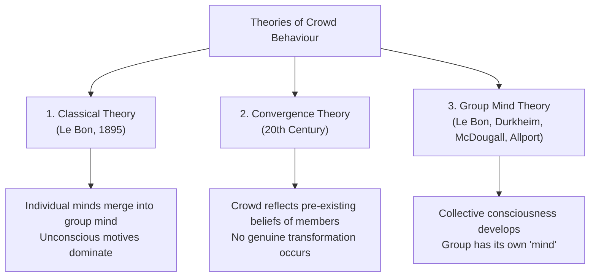
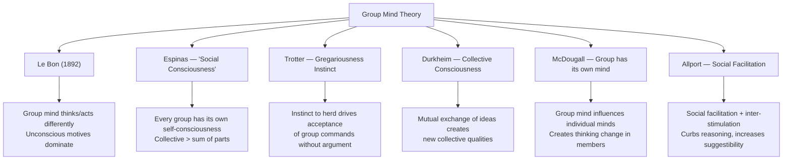

import Tabs from '@theme/Tabs';
import TabItem from '@theme/TabItem';

# Theories of Crowd Behaviour: Classical, Convergence, and Group Mind

> *"When individuals collect in a crowd, their individual mind becomes part of the collective mind — the collective mind thinks in its own way."* — Gustave Le Bon (1895)

## Introduction

Why do ordinary, reasonable people sometimes act in extraordinary, unreasonable ways when they are part of a crowd? What psychological transformation occurs when individuals merge into a mass? These questions have fascinated social scientists since the 19th century and led to three influential theoretical traditions explaining **crowd behaviour**.

Each theory offers a different explanation for the same phenomenon — and understanding their differences, strengths, and limitations is crucial for MAPC students.

📄 **Source PDF**: [Block-4/Unit-3.pdf — Pages 39–41](/pdfs/MPC-004%20Advanced%20Social%20Psychology/Block-4/Unit-3.pdf)
📚 MPC-004 Advanced Social Psychology, Block 4: Group Dynamics

---

## Overview: Three Major Theories

---

## 1. Classical Theory (Le Bon, 1895)

**Gustave Le Bon** published *"The Crowd: A Study of the Popular Mind"* in 1895 — one of the most influential and controversial works in social psychology.

### Core Ideas

Le Bon's Classical Theory proposes:

1. **Anonymity breeds irrationality**: When individuals join a crowd, they lose their personal identity through anonymity
2. **Collective mind formation**: The individual minds of crowd members merge to form a unified **crowd mind** or **group mind**
3. **Unconscious dominates**: In the crowd, unconscious motives become more active; conscious, rational motivation sinks into the background
4. **De-individualisation**: The person becomes uninhibited and may show behaviour they would never exhibit alone
5. **Contagion and suggestibility**: Emotions spread like a disease through the crowd; members become highly suggestible

### Carl Jung's Parallel
Le Bon's concept of the merged crowd mind parallels **Carl Jung's notion of the "collective unconscious"** — a shared layer of the unconscious mind common to all humans that can be activated under certain conditions.

### Crowd Characteristics According to Le Bon

| Characteristic | Description |
|----------------|-------------|
| **Anonymity** | Members feel unidentifiable and unaccountable |
| **Contagion** | Emotional spread — feelings and behaviours are "contagious" |
| **Suggestibility** | Critical thinking impaired; easily influenced by slogans, appeals |
| **Unconscious Domination** | Rational thinking replaced by primitive emotional impulses |
| **Loss of Individuality** | Personal responsibility dissolves into collective identity |

### Critique of Classical Theory
- **Overly negative view**: Le Bon saw crowd behaviour as inherently regressive and dangerous
- **Ignores positive crowd behaviour**: Solidarity, mutual aid, collective celebration are also crowd phenomena
- **Circular reasoning**: "The crowd acts irrationally because the crowd mind is irrational"
- **Historical bias**: Le Bon wrote during the French Revolution aftermath, heavily influencing his pessimistic view

---

## 2. Convergence Theory

**Convergence Theory** emerged in the 20th century as a direct critique of Le Bon's view.

### Core Ideas

1. **Crowd behaviour is not created by the crowd** — it is brought *into* the crowd by particular individuals
2. **Like-minded people converge**: People who already share certain beliefs, values, or intentions come together to form crowds
3. **No genuine transformation**: Unlike Le Bon, convergence theorists argue there is no magical psychological change when joining a crowd
4. **Crowd expresses existing beliefs**: The mob reaction is the "rational product of widespread popular feeling" — it reflects what these individuals already believed before joining

### Implication

- The crowd itself does **not generate** racial hatred or violence
- Violence occurs because people who **already harboured violent intentions** came together
- **Example**: A racist mob is not racist because it is a mob — it is a mob because racists converged

### Comparison: Classical vs. Convergence Theory

| Aspect | Classical Theory | Convergence Theory |
|--------|-----------------|-------------------|
| **Source of crowd behaviour** | The crowd itself transforms individuals | Individuals bring behaviour with them |
| **Psychological change** | Radical transformation occurs | No significant transformation |
| **Crowd as cause** | Yes — crowd creates the behaviour | No — pre-existing attitudes cause behaviour |
| **Implication for intervention** | Change the crowd situation | Change the individuals' attitudes before they converge |

### Critique of Convergence Theory
- **Does not fully explain contagion**: Sometimes neutral bystanders do get swept up in crowd behaviour
- **Overly rational**: Underestimates the genuine social-psychological dynamics that emerge in crowd situations
- **Deterministic**: Implies people's behaviour is entirely pre-determined by prior attitudes

---

## 3. Group Mind Theory

The **Group Mind Theory** is the most sociological of the three, advocated by several major thinkers: **Le Bon, Espinas, Trotter, Durkheim, McDougall, and Allport**.

### Core Proposition

When individuals gather in a group, a **collective consciousness** or **group mind** forms that is qualitatively different from — and more powerful than — the sum of individual minds.

### Contributors and Their Views

#### Le Bon (1892)
The **founder** of group mind theory. Le Bon argued that sentiments and ideas of all members "take one and the same direction" — their conscious personalities vanish and a collective mind forms with its own ideas and thoughts. In the group mind, emotional rather than rational processes dominate.

#### Espinas — Social Consciousness
Espinas described group mind as **"social consciousness"**. He argued:
- Every group has its own form of self-consciousness
- Collective consciousness is formed from many individuals' consciousness **taken together**
- But the collective has qualities **different** from any individual component

#### Trotter — Gregariousness Instinct
Trotter argued that humans possess an innate **"instinct of gregariousness"** — a biological drive to herd together. This instinct:
- Activates our mental system in group contexts
- Leads us to accept group commands **without argument**
- Makes us act according to the group's directives automatically

#### Durkheim — Collective Consciousness
**Émile Durkheim**, the founding father of sociology, explained group behaviour through **collective consciousness**:
- When people gather, mutual exchange of ideas creates a **new collective consciousness**
- This collective mind has **qualities different from** any individual's consciousness
- **"Mind is another name for the flow of consciousness"** — social consciousness flows from the group, not individuals

#### McDougall — The Group Has Its Own Mind
William McDougall argued that every group has **a mind of its own** — not merely a collection of individual minds. The group mind can:
- Influence individual minds
- Change how individuals think when they become group members
- Act as a force that transcends individual psychology

#### Allport — Social Facilitation and Inter-Stimulation
**Floyd Allport** — a pioneer of experimental social psychology — offered the most empirically grounded version. He argued crowd behaviour results from:

1. **Social Facilitation**: The presence of others energises behaviour (people perform actions more intensely when others are watching/participating)
2. **Inter-Stimulation**: Members of a crowd stimulate each other, creating a feedback loop of emotional escalation

Allport argued these two processes together **curb reasoning capacity** and **increase suggestibility** in crowd contexts.

### Critique of Group Mind Theory
- **Philosophical vagueness**: What exactly is a "group mind"? It cannot be empirically observed or measured
- **Reification**: Treating the "group mind" as a real entity risks confusing metaphor with mechanism
- **Individual agency neglected**: The theory leaves little room for individual resistance or variation within crowds

---

## Comparative Summary

| Theory | Key Thinker | Cause of Crowd Behaviour | Type of Change |
|--------|-------------|--------------------------|----------------|
| **Classical** | Le Bon | Anonymity + crowd atmosphere | Transformation of individual |
| **Convergence** | Turner et al. | Pre-existing attitudes | No genuine change |
| **Group Mind** | Durkheim, McDougall | Collective consciousness formation | Emergence of new collective entity |

---

## Memory Aid: CCC Framework

**CCC** — Three theories of crowd behaviour:
- **C**lassical (Le Bon — crowd transforms the individual)
- **C**onvergence (individuals bring behaviour into crowd)
- **C**ollective/Group Mind (new consciousness emerges)

*"Classic Crowds Create Consciousness"*

---

## External Resources

### Wikipedia
- 🌐 [Crowd Psychology](https://en.wikipedia.org/wiki/Crowd_psychology) — Theories overview
- 🌐 [Gustave Le Bon](https://en.wikipedia.org/wiki/Gustave_Le_Bon) — Classical theory founder
- 🌐 [Émile Durkheim](https://en.wikipedia.org/wiki/%C3%89mile_Durkheim) — Collective consciousness concept
- 🌐 [Floyd Allport](https://en.wikipedia.org/wiki/Floyd_Allport) — Social facilitation pioneer
- 🌐 [Deindividuation](https://en.wikipedia.org/wiki/Deindividuation) — Modern re-examination of Le Bon's ideas

### Educational Videos
- 🎥 [The Social Mind: Le Bon and Collective Psychology](https://www.youtube.com/watch?v=wt0NQI6Q9JM) — Historical overview
- 🎥 [Durkheim's Collective Consciousness — Explained](https://www.youtube.com/watch?v=8GcFHIusF1A)
- 🎥 [Social Facilitation Research — Classic Experiments](https://www.youtube.com/watch?v=H9T_7GAPK6E)

### Recent Research (2020–2024)
- 📄 Drury, J. (2020). The psychology of collective action: Crowds and change. *Current Opinion in Psychology*, 35, 62–68.
- 📄 Reicher, S., & Stott, C. (2021). On order and disorder during the 2011 riots. *British Journal of Criminology*, 61(3), 584–602.
- 📄 Spears, R., Postmes, T., & Lea, M. (2022). The SIDE model re-examined: Social identity and deindividuation effects. *European Review of Social Psychology*, 33(1), 1–56.
- 📄 Neville, F. G., & Reicher, S. D. (2023). Understanding crowd behaviour: Revisiting the elaborated social identity model. *Social and Personality Psychology Compass*, 17(5), e12765.

---

## Self-Assessment Questions

### Basic Level
1. Name the three major theories of crowd behaviour and their key proponents.
2. What does Le Bon mean by the "group mind" or "collective mind"?
3. How does Convergence Theory differ from Classical Theory in explaining crowd violence?

### Intermediate Level
4. Explain Durkheim's concept of collective consciousness and how it relates to crowd behaviour.
5. How do social facilitation and inter-stimulation (Allport) work together to explain crowd suggestibility?
6. "Trotter's gregariousness instinct makes humans naturally prone to crowd behaviour." Evaluate this claim.

### Advanced Level
7. Compare and contrast Classical Theory and Convergence Theory as explanations of crowd violence. Which do you find more convincing, and why? Support your argument with evidence.
8. The Group Mind Theory has been criticised for "reification" — treating a metaphor as a real entity. How valid is this critique? Can the concept of collective consciousness be salvaged scientifically?
9. Using any theory studied in this unit, analyse the psychological processes that might explain the behaviour of a flash mob that turns violent. How might emergent norm theory (Turner, 1964) offer a different explanation than Le Bon's classical theory?

---

## Cross-References

- 🔗 [Crowd Definition & Types](/mpc-004/block-4/crowd-definition-types) — Foundation concepts
- 🔗 [Social Identity Theory](/mpc-004/block-4/social-identity-theory) — Identity processes in crowds
- 🔗 [Collective Behaviour: Mob, Audience, Mass Society](/mpc-004/block-4/collective-behaviour-mob-audience) — Applied forms of collective behaviour
- 🔗 [Group Cohesion and Communication](/mpc-004/block-4/communication-cohesion-group-dynamics) — Group-level processes

---

*The debate over what "really" happens when people join crowds continues to this day. Each theory captures something true — and understanding all three gives you the richest possible picture of this fascinating and important social phenomenon.*
