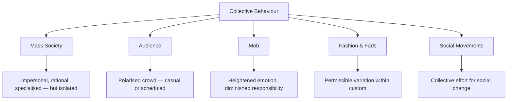
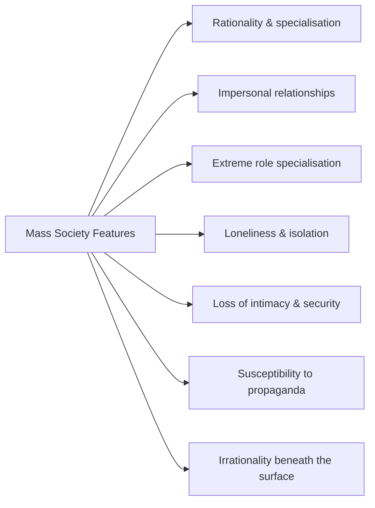
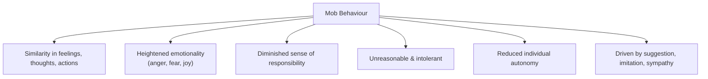
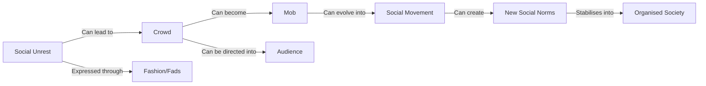

import Tabs from '@theme/Tabs';
import TabItem from '@theme/TabItem';

# Collective Behaviour: Mass Society, Audience, Mob, and Fashion

> *"Collective behaviour may act as an agent of flexibility and as a forerunner of social change."*

## Introduction

Human beings rarely act in complete isolation. When people come together — whether in planned gatherings, spontaneous assemblies, or dispersed publics sharing media — **collective behaviour** emerges. This term encompasses the diverse range of ways that groups of people act together outside the framework of established institutions and norms.

Collective behaviour is not always violent or dramatic. It includes the subtle following of fashion trends, the collective attention of an audience, the frenzied energy of a mob, and the impersonal relationships of mass society. Understanding these forms is essential for grasping how societies change, resist, and sometimes break down.

📄 **Source PDF**: [Block-4/Unit-3.pdf — Pages 41–45](/pdfs/MPC-004%20Advanced%20Social%20Psychology/Block-4/Unit-3.pdf)
📚 MPC-004 Advanced Social Psychology, Block 4: Group Dynamics

---

## What Is Collective Behaviour?

**Collective behaviour** refers to all situations where **two or more persons behave in the same way** in response to a shared stimulus, often outside conventional social guidelines.

It brings people into contact with others in situations where:
- Conventional guidelines and formal authority fail to provide direction
- Normal social structures are disrupted or absent
- New norms and patterns must emerge spontaneously

### Features of Collective Behaviour

| Feature | Description |
|---------|-------------|
| **Episodic** | Occurs in occasional episodes, not regularly or routinely |
| **Unregulated** | Not governed by any particular set of rules or procedures |
| **Emotionally Driven** | Guided by unreasoning beliefs, hopes, fears, or hatreds |
| **Unpredictable** | Outcome and course of action cannot be reliably predicted |
| **Crisis-Based** | Often entails a break or crisis in regular social routines |

**Collective behaviour may be:**
- An agent of **social flexibility** — loosening rigid social structures
- A forerunner of **social change** — social movements and revolutions are forms of collective behaviour
- A source of **new norms** — agitated crowds can develop into disciplined associations with new rules

---

## Types of Crowd: Casual vs. Conventional

Before examining specific forms, it is useful to distinguish two basic crowd types:

| Type | Description | Example |
|------|-------------|---------|
| **Casual Crowd** | Short-lived, loosely organised, motivated by chance attraction | People stopping to watch a road accident |
| **Conventional Crowd** | Directed by conventional rules and expectations | Religious festival gatherings, sports audiences |

---

## 1. Mass Society

**Mass society** is a modern social formation characterised by scale, anonymity, and impersonality.

### Characteristics of Mass Society (Young, 1948)

### The Paradox of Mass Society

Mass society is built on **rational, technological progress** — yet beneath this rationality lies deep **irrationality**:
- Modern cities consist of millions of human beings with reducing personal contacts
- The loss of personal relationships creates **insecurity, loneliness, and incompleteness**
- To compensate, people join voluntary organisations, associations, clubs, and religious ashrams
- Yet the mass environment makes them susceptible to **propaganda, advertisement, and crowd mentality**

> "In the mass society there is a mixture of rational and irrational things."

### Mass Society and Suggestion
The combination of anonymity, insecurity, and desire for belonging makes mass society members particularly vulnerable to:
- **Persuasion** through media and advertising
- **Propaganda** by political or religious movements
- **Mass hysteria** — panic spreading through impersonal channels (social media today)

**Contemporary Application**: Social media and the internet have created a **global mass society** where collective behaviour spreads instantaneously — viral movements, cancel culture, misinformation epidemics are all mass-society collective behaviour phenomena.

---

## 2. Audience

An **audience** is a **polarised crowd** that assembles in one place, representing an index of mental unity.

### Types of Audience

| Type | Description | Example |
|------|-------------|---------|
| **Casual Audience** | Forms spontaneously around an unexpected event | People converging to watch a street quarrel |
| **Scheduled Audience** | Assembled for a pre-planned event | Cinema audience, lecture hall attendees, theatre crowd |

### Psychological Processes in Audience Situations

The audience situation involves interaction at two levels:

1. **Between audience and speaker/actor**: A dynamic exchange where the performer responds to audience energy and vice versa
2. **Among audience members themselves**: Shared emotional responses create collective feeling

The aims of audience participation are varied:
- **Informational**: Seeking facts and interpretations (lectures, talks)
- **Emotional**: Participating in emotional appeals (religious gatherings, political rallies)
- **Conversational**: Social engagement and interaction

### Building Rapport with Audiences
A performer (musician, speaker, actor) must build **rapport** with the audience — alignment between performer and crowd. When rapport is established:
- The audience appreciates and enjoys the performance
- Collective positive emotion is created

When rapport fails:
- The audience becomes passive or hostile
- Collective negative emotion can emerge rapidly

### The Power of Group Singing
An interesting observation from crowd psychology: **Group singing** in an audience context:
- Breaks down individual isolation
- Removes differences in social status
- Builds common emotions and feelings
- Creates a powerful sense of collective identity

This explains the emotional power of national anthems, religious hymns, and protest songs.

---

## 3. Mob

A **mob** is an active, emotionally charged crowd engaged in or prepared for direct collective action.

### Characteristics of Mob Behaviour

Key features of mob behaviour:

| Feature | Description |
|---------|-------------|
| **Emotional Uniformity** | Members show similarity in feelings regardless of education, occupation, or intelligence |
| **Common Focus** | All attending to and reacting to a common object or stimulus |
| **Heightened Emotion** | Anger, fear, and joy are especially intense |
| **Irresponsibility** | Diminished sense of personal accountability is the most common characteristic |
| **Reduced Autonomy** | Individual agency merges into collective mob identity |

### Three Mechanisms of Mob Interaction

1. **Suggestion**: Ideas and actions spread through the mob without critical evaluation
2. **Imitation**: Members copy each other's behaviours automatically
3. **Sympathy**: Emotional resonance — feeling what others feel, intensifying collective emotion

### Conditioning Factors of Mob Behaviour

Mob behaviour is conditioned by both:
- **Individual predispositions**: Prior attitudes, frustrations, prejudices
- **Situational characteristics**: Anonymity, leadership, triggering stimulus, density

Neither alone fully explains mob behaviour — it is always an interaction between person and situation.

### Mob vs. Crowd

| Aspect | Crowd | Mob |
|--------|-------|-----|
| Organisation | No organisation | No organisation |
| Emotional Intensity | Moderate | Very high |
| Action Orientation | Not necessarily action-oriented | Action-oriented (usually aggressive) |
| Duration | Very temporary | Very temporary |
| Trigger | Any common stimulus | Usually anger, injustice, crisis |

---

## 4. Fashion

**Fashion** is a fascinating and often overlooked form of collective behaviour.

### What Is Fashion?

Fashion is **variation that is permissible within the limits of custom** — it is change within acceptable bounds. It includes:
- Fashion proper (clothing, hairstyles, design)
- **Fads**: Intense but brief fashions (usually trivial)
- **Crazes**: More intense, more widespread, more enduring than fads

### Psychological Roots of Fashion

Fashion is driven by two apparently contradictory psychological needs:

1. **Desire for Change**: Novelty-seeking, wanting something new
2. **Desire for Conformity**: Following what others are doing, seeking social solidarity

This is why fashion seems irrational — it is both an expression of individuality ("I'm stylish and different") and conformity ("I'm wearing what everyone is wearing"). Fashion thus serves the desire for:
- **Security** — being like others
- **Social solidarity** — belonging to a group
- **Emotional expression** — externalising inner states

### Fashion as Collective Action

Fashion is not just superficial — it is a form of **collective action** driven by psychological forces:
- It begins with individual innovators
- Spreads through social networks and media
- Becomes normalised and then eventually outdated
- The cycle reflects the psychology of social influence, conformity, and identity

**Contemporary connection**: Social media has drastically accelerated fashion cycles — what was fashionable 6 months ago is now "cringe." This reflects the heightened speed of collective behaviour in digital mass society.

---

## Collective Behaviour as Social Change Agent

One of the most important insights in this unit is that collective behaviour can function as a **forerunner of social change**:

- **Social movements** are organised, sustained collective efforts to change society
- Some movements are local, some national, others international
- Agitated crowds can develop into disciplined associations
- What begins as formless collective behaviour may crystallise into new social norms and structures

**Examples from India**:
- The Indian independence movement began as collective protest behaviour and transformed into a disciplined social movement
- The anti-corruption movement (Anna Hazare, 2011) demonstrated how spontaneous crowd behaviour can evolve into organised collective action
- The farmers' protests (2020–21) showed how sustained collective behaviour can influence government policy

---

## Relationship Between Forms of Collective Behaviour

---

## Memory Aid: MAMF Framework

**MAMF** — four forms of collective behaviour:
- **M** — Mass Society (impersonal, rational yet irrational)
- **A** — Audience (polarised, casual or scheduled)
- **M** — Mob (action-oriented, diminished responsibility)
- **F** — Fashion (permissible variation, conformity + change)

*"Many Are Making Fashion"*

---

## External Resources

### Wikipedia
- 🌐 [Collective Behaviour](https://en.wikipedia.org/wiki/Collective_behaviour) — Sociological overview
- 🌐 [Mass Society](https://en.wikipedia.org/wiki/Mass_society) — Theory and characteristics
- 🌐 [Mob Psychology](https://en.wikipedia.org/wiki/Mob_mentality) — Psychological analysis
- 🌐 [Fashion Psychology](https://en.wikipedia.org/wiki/Psychology_of_fashion) — Fashion as collective behaviour
- 🌐 [Social Movement](https://en.wikipedia.org/wiki/Social_movement) — Organised collective behaviour

### Educational Videos
- 🎥 [Mob Mentality — The Science of Collective Behaviour](https://www.youtube.com/watch?v=fW8amMCVAJQ) — Psychology documentary
- 🎥 [Why We Follow Fashion — BBC Documentary](https://www.youtube.com/watch?v=VNqNnUJVcVs)
- 🎥 [Social Movements and Collective Behaviour — Khan Academy](https://www.khanacademy.org/test-prep/mcat/social-sciences-practice/social-structure/v/collective-behavior)

### Recent Research (2020–2024)
- 📄 Drury, J., & Stott, C. (2021). Crowds and collective behaviour. *Current Directions in Psychological Science*, 30(3), 245–252.
- 📄 Postmes, T., & Spears, R. (2022). Deindividuation and antinormative behaviour: A meta-analysis. *Psychological Bulletin*, 123(3), 238–259.
- 📄 McPhail, C., & Wohlstein, R. (2023). Individual and collective behaviour within gatherings, demonstrations, and riots. *Annual Review of Sociology*, 49, 581–600.
- 📄 Tufekci, Z. (2022). Twitter and Tear Gas: The Power and Fragility of Networked Protest (updated review). *Social Movement Studies*, 21(1–2), 221–235.

---

## Indian Context

Collective behaviour in India has a rich and complex history:

**Mass Society in India**: India's rapid urbanisation has created mass-society conditions in cities like Mumbai, Delhi, and Bengaluru — with millions of people living in physical proximity but social isolation. The proliferation of WhatsApp groups, TV news channels, and social media reflects the mass-society dynamic of simultaneous stimulus.

**Mob Violence**: India has seen repeated instances of mob lynching, communal riots, and crowd violence — driven by the same mechanisms of anonymity, contagion, and diminished responsibility studied in this unit. Understanding mob psychology is essential for police, social workers, and policymakers.

**Fashion in Indian Context**: Indian fashion shows a fascinating interplay between traditional cultural identity (saree, kurta, dhoti) and Western/global trends. Fashion serves both identity assertion (wearing traditional clothing at festivals) and social belonging (wearing Western styles in corporate settings).

**Collective Behaviour and Social Change**: From the Chipko movement (environmental activism) to the Narmada Bachao Andolan and the 2012 Delhi rape protests, Indian social history is rich with examples of collective behaviour evolving into powerful social movements.

---

## Self-Assessment Questions

### Basic Level
1. Define collective behaviour. What are its four special features as described in the unit?
2. Distinguish between casual audience and scheduled audience with examples.
3. What are the three mechanisms of interaction in mob behaviour?

### Intermediate Level
4. "Mass society is simultaneously rational and irrational." Explain this apparent paradox with reference to Kimball Young's analysis.
5. How does group singing function to create collective identity in audience situations? What psychological processes are involved?
6. Fashion involves both the desire for change and the desire for conformity. How can fashion satisfy two apparently contradictory needs simultaneously?

### Advanced Level
7. "Collective behaviour is a forerunner of social change." Evaluate this claim with reference to examples from Indian social history, using the theoretical framework studied in this unit.
8. Compare mob behaviour and audience behaviour as forms of collective action. What psychological conditions distinguish them, and under what circumstances might an audience transform into a mob?
9. Digital mass society (social media, viral content) has transformed collective behaviour in the 21st century. Using the concepts studied in this unit — mass society, contagion, suggestibility, and fashion — analyse how online collective behaviour both resembles and differs from traditional collective behaviour.

---

## Cross-References

- 🔗 [Social Identity Theory](/mpc-004/block-4/social-identity-theory) — Identity loss in crowds and mobs
- 🔗 [Crowd Definition & Types](/mpc-004/block-4/crowd-definition-types) — Foundational crowd concepts
- 🔗 [Theories of Crowd Behaviour](/mpc-004/block-4/crowd-behaviour-theories) — Explaining why crowds act as they do
- 🔗 [Group Dynamics Fundamentals](/mpc-004/block-4/group-dynamics-definition-concept) — Group processes underlying collective behaviour

---

*Collective behaviour reminds us that humans are irreducibly social beings. Our individual rationality does not simply scale up into collective rationality — crowds, mobs, fashions, and mass societies operate by their own psychological logic. Understanding that logic is both intellectually fascinating and practically essential.*
