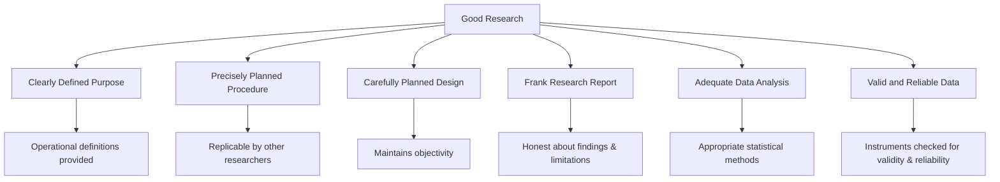

# Definition and Meaning of Research in Psychology

## 🎯 Learning Objectives

After studying this topic, you will be able to:
- Define research and explain its meaning in a scientific context
- Describe the criteria that distinguish good research from poor research
- List and explain the qualities that characterise good psychological research
- Identify the major objectives that research seeks to accomplish
- Appreciate the importance of research as a systematic, empirical enterprise

---

## 📄 Source Reference

**Source PDF**: 📄 [Block-1/Unit-1.pdf — Pages 5–9](/pdfs/MPC-005%20Research%20Methods/Block-1/Unit-1.pdf)  
**Course**: MPC-005 Research Methods in Psychology

---

## 1. What Is Research?

The word **research** is composed of two syllables — *re* (meaning again, anew, or over again) and *search* (meaning to examine closely and carefully, to test and try, or to probe). Together they describe a careful, systematic, patient study and investigation in some field of knowledge, undertaken to establish facts or principles (Grinnell, 1993).

At its simplest, research means **searching for facts, answers to questions, and solutions to problems**. But scientific research goes far beyond everyday curiosity — it is a disciplined, rule-governed enterprise that demands rigour, transparency, and verifiability.

### Formal Definitions

| Scholar | Definition |
|---------|-----------|
| **Encyclopaedia of Social Science** | "The manipulation of generalising to extend, connect or verify knowledge" |
| **Kerlinger (1973)** | "A systematic, controlled, empirical and critical investigation of hypothetical propositions about the presumed relationship about various phenomena" |
| **Burns (1994)** | "A systematic investigation to find answers to a problem" |
| **Grinnell (1993)** | A careful, systematic, patient study undertaken to establish facts or principles |

### The Most Comprehensive Definition

Scientific research may be defined as:

> **The systematic and empirical analysis and recording of controlled observation, which may lead to the development of theories, concepts, generalisations and principles, resulting in prediction and control of those activities that may have some cause-effect relationship.**

This definition captures several key elements:
- **Systematic** — follows a defined process and rules
- **Empirical** — grounded in real-world observation and experience
- **Controlled** — designed to isolate variables and minimise confounds
- **Generalisable** — seeks principles that extend beyond the immediate study

### Research as a Structured Process

Research is not a single act but a **sequence of interconnected steps**. These steps vary slightly depending on whether the study is quantitative (numerical, statistical) or qualitative (narrative, interpretive), but the underlying logic — observe, hypothesise, test, conclude — remains constant across all psychological inquiry.

---

## 2. Criteria of Good Research

The criteria define *what research must achieve* to be considered scientifically sound. The IGNOU MPC-005 curriculum identifies six essential criteria:

**1. Clearly Defined Purpose** — Research objectives must be stated in precise, unambiguous terms. All key concepts must be given *operational definitions* — definitions in terms of how they are measured or produced.

**2. Precisely Planned Procedure** — The methodology must be described in sufficient detail that another researcher could replicate the study. Vague or ambiguous procedures undermine both replication and public scrutiny.

**3. Carefully Planned Design** — The research design must be structured to maintain *objectivity* and to justify the conclusions drawn. A flawed design can produce systematically misleading results.

**4. Frank Research Report** — Researchers must be honest about the scope and limitations of their findings. Overstating results or concealing contradictory data violates research ethics.

**5. Adequate Data Analysis** — The analytical methods used must be appropriate to the nature of the data and the research questions. Statistical significance does not automatically mean practical significance.

**6. Valid and Reliable Data** — Instruments used to collect data must demonstrate both *validity* (measuring what they claim to measure) and *reliability* (producing consistent results across administrations).

---

## 3. Objectives of Good Research

Although every study has its own specific purpose, research objectives can be grouped into four broad categories:

| Type | Objective | Example |
|------|-----------|---------|
| **Exploratory** | Gain familiarity with a phenomenon; achieve new insights | Studying the lived experience of first-generation college students |
| **Descriptive** | Portray accurately the characteristics of an individual, situation, or group | Describing the personality profile of Indian managers |
| **Diagnostic** | Determine frequency of occurrence or association between variables | How often does exam anxiety co-occur with poor academic performance? |
| **Hypothesis-Testing** | Test a causal relationship between variables (experimental) | Does sleep deprivation impair working memory capacity? |

These four objectives are not mutually exclusive; many studies combine descriptive and hypothesis-testing aims. In psychology, the exploratory and hypothesis-testing forms are particularly common because human behaviour is both complex and context-dependent.

---

## 4. Qualities of Good Research

Good research is distinguished not just by what it asks, but by **how** it answers. The following six qualities are essential:

### 4.1 Systematic
Research follows a structured sequence of steps governed by a set of rules. Importantly, systematic research does *not* preclude creativity — it channels creative thinking into disciplined inquiry rather than guessing or intuition.

### 4.2 Empirical
All conclusions must be grounded in evidence gathered from real-life observations and experiences. Empirical research provides a basis for *external validity* — the capacity to generalise results beyond the immediate setting.

### 4.3 Valid and Verifiable
- **Valid**: The researcher uses instruments that accurately measure the constructs they claim to measure; conclusions correctly reflect the data.
- **Verifiable**: The methodology and results are transparent enough that other researchers can independently check, replicate, or refute them.

### 4.4 Logical
Research is guided by the rules of reasoning — particularly *inductive* (specific observations → general principles) and *deductive* (general principles → specific predictions) logic. Logical consistency makes findings meaningful and actionable.

### 4.5 Theory-Developing
Good research contributes to the building of psychological theory. From carefully observed samples, researchers make sound generalisations about populations. Over time, these generalisations coalesce into theories — structured bodies of knowledge that guide future inquiry.

### 4.6 Replicable
Results must be reproducible under similar conditions by independent investigators. Replicability is not merely a procedural nicety — it is the bedrock of scientific credibility. The "replication crisis" in psychology (see § External Resources) has underscored why this quality matters so profoundly.

---

## 5. The Replication Crisis: A Contemporary Context

The replication crisis refers to the widespread failure of researchers to reproduce the results of classic psychology studies when attempted independently. A landmark 2015 project (*Reproducibility Project: Psychology*, Science) attempted to replicate 100 psychology studies and found that fewer than half showed the same effect size and direction as the originals. This underscores that the *qualities* of research — especially systematic procedures, transparent reporting, and replicability — are not abstract ideals but practical necessities.

> **Indian Context**: ICSSR-funded research in India has begun emphasising pre-registration of studies and open data practices to address replication concerns. The Indian Psychological Science Association (IPSA) now includes replication workshops in its annual conferences.

---

## 📚 External Resources

### Wikipedia
- [Scientific method — Wikipedia](https://en.wikipedia.org/wiki/Scientific_method) — foundational overview of the principles underpinning all scientific research
- [Replication crisis — Wikipedia](https://en.wikipedia.org/wiki/Replication_crisis) — the challenge that has reshaped psychology's methodological culture

### Educational Videos
- 🎬 [**Crash Course Psychology #2: Psychological Research** (YouTube)](https://www.youtube.com/watch?v=esmzYhuFnds) — excellent 10-minute overview of what psychological research is and why it matters
- 🎬 [**What is Research? | MIT OpenCourseWare**](https://ocw.mit.edu/courses/res-9-003-brains-minds-and-machines-summer-institute-2015/) — MIT's framing of research as systematic inquiry

### Research Papers
- **Open Science Collaboration (2015)**. "Estimating the reproducibility of psychological science." *Science*, 349(6251). DOI: 10.1126/science.aac4716 — the landmark replication study
- **Simmons, J. P., Nelson, L. D., & Simonsohn, U. (2011)**. "False-positive psychology: Undisclosed flexibility in data collection and analysis allows presenting anything as significant." *Psychological Science*, 22(11), 1359–1366 — explains how weak research practices inflate false-positive rates

### Additional Reading
- [American Psychological Association — Research Methods](https://www.apa.org/research) — APA's guide to standards in psychological research
- [PsycINFO — APA's Research Database](https://www.apa.org/pubs/databases/psycinfo) — the primary literature search engine for psychology
- [NCERT Psychology Textbook (Class XII) — Chapter on Research Methods](https://ncert.nic.in/ncerts/l/kepy106.pdf) — useful Indian context for foundational research concepts
- [Open Science Framework (OSF)](https://osf.io/) — platform supporting transparent, replicable research
- [Khan Academy — Intro to the Scientific Method](https://www.khanacademy.org/science/ap-biology/science-of-biology/biology-and-the-scientific-method/a/the-science-of-biology) — free foundational resource

---

## 🧠 Memory Aids

### Mnemonic: **SEVLTR** (Qualities of Good Research)
> **S**ystematic · **E**mpirical · **V**alid and Verifiable · **L**ogical · **T**heory-Developing · **R**eplicable

Remember: *"Scientists Establish Very Logical Theories Repeatedly"*

### Mnemonic: **EDDHFE** (Criteria of Good Research)
> **E**xplicitly defined purpose · **D**etailed procedure · **D**esign maintains objectivity · **H**onest report · **F**it-for-purpose analysis · **E**xamined for validity & reliability

---

## ✅ Self-Assessment Questions

1. **Define scientific research** in your own words. What distinguishes it from ordinary, everyday inquiry?

2. **A student researcher** reports that children who eat breakfast perform better in school. Identify which of the four research objectives (exploratory, descriptive, diagnostic, or hypothesis-testing) this study best fits, and explain why.

3. **Validity vs. Reliability**: A questionnaire consistently gives the same scores each time it is administered to the same person, but the scores do not predict academic performance. Is this instrument valid? Is it reliable? Explain the difference.

4. **Why is replicability considered the cornerstone of scientific credibility?** Use the replication crisis to illustrate your answer.

5. **Logical reasoning in research** involves both induction and deduction. Provide a concrete example of each in the context of psychological research.

---

## 🔗 Cross-References

- [Research Process — Steps in Conducting Research](/mpc-005/block-1/research-process-steps) — next unit

---

*📄 Source: MPC-005 Research Methods, Block-1, Unit-1, Pages 5–9 | IGNOU*
