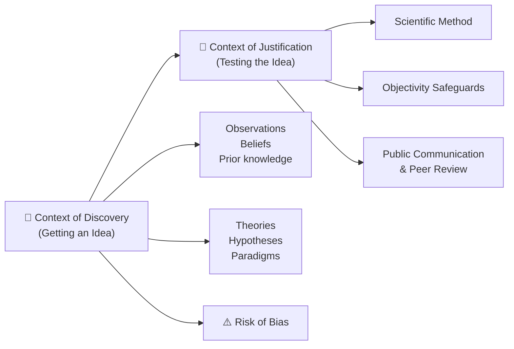
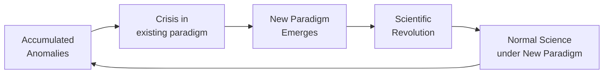

# Research Process — Context of Discovery and Justification

## 🎯 Learning Objectives

After studying this topic, you will be able to:
- Distinguish between the context of discovery and the context of justification
- Explain the roles of theories, hypotheses, and paradigms in psychological research
- Identify and describe the major types of research biases
- Explain how scientific attitudes and objectivity safeguards protect the research process

---

## 📄 Source Reference

**Source PDF**: 📄 [Block-1/Unit-1.pdf — Pages 9–11](/pdfs/MPC-005%20Research%20Methods/Block-1/Unit-1.pdf)  
**Course**: MPC-005 Research Methods in Psychology

---

## 1. The Two Contexts of Psychological Research

Psychological research proceeds through two fundamentally distinct but sequential phases:

### 1.1 Context of Discovery

The **context of discovery** is the initial phase of research during which observations, beliefs, information, and general knowledge lead someone to come up with a new idea or a different way of thinking about a phenomenon.

This is the *creative* stage of science. It is less rule-governed than the justification phase — insights can come from:
- Casual observations in everyday life (e.g., noticing that anxious students perform better on easy tasks)
- Reading prior research and spotting gaps
- Clinical or applied experience
- Theoretical deduction (predicting an untested phenomenon from an established theory)

**Key tools of discovery**: theories, hypotheses, and paradigms.

---

## 2. Theories, Hypotheses, and Paradigms

### 2.1 Theory

A **theory** is a body of interrelated principles used to explain or predict a psychological phenomenon. Psychological theories attempt to understand how the brain, mind, behaviour, and environment function and how they are related.

The value of a theory is measured in the quality of the hypotheses it generates — testable predictions that, when confirmed or disconfirmed, either support or challenge the theory.

| Feature | Description |
|---------|-------------|
| **Explanatory** | Accounts for observed patterns of behaviour |
| **Predictive** | Generates testable predictions about future events |
| **Generative** | Stimulates new research questions and hypotheses |
| **Revisable** | Can be modified or rejected in light of evidence |

### 2.2 Hypothesis

A **hypothesis** is a *tentative and testable* explanation of the relationship between two or more events or variables. Key features:

- Stated in declarative sentence form
- Must be falsifiable (it must be possible to show it is wrong)
- Derived from theory, prior findings, or observation
- **Must be formulated BEFORE data are collected** — post-hoc hypothesising is a form of bias

**Example**: "Students who are rewarded for correct answers will require fewer trials to learn a list of vocabulary words than students who receive no reward."

A **variable** is any factor that changes or varies. In the example above:
- *Independent variable* (IV): reward vs. no reward
- *Dependent variable* (DV): number of trials required to learn

### 2.3 Paradigm

A **paradigm** (from Thomas Kuhn, 1970) is a model of the functions and interrelationships of a process — a "way of thinking" about the world and how to study it. Paradigms shape:
- Which questions seem worth asking
- Which methods are considered appropriate
- How results are interpreted

When a dominant paradigm is challenged by accumulated anomalies, a **paradigm shift** occurs — a revolution in scientific understanding. In psychology, the shift from behaviourism to cognitive science in the 1960s–1970s is the classic example.

*Kuhn's model of scientific revolutions as applied to psychology.*

---

## 3. Research Biases — Threats in the Context of Discovery

One of the central challenges of research is remaining objective. Biases distort both the collection and interpretation of data.

### Types of Research Bias

| Bias Type | Description | Example |
|-----------|-------------|---------|
| **Personal/Cultural Bias** | External influences (culture, media) shape what a researcher sees as meaningful | A researcher raised in a collectivist culture may interpret independent behaviour as deviant |
| **Observer Bias** | Researchers selectively notice events consistent with their expectations | A clinician expecting depression may over-identify depressive symptoms |
| **Expectancy Bias** | Researchers find what they expect, rather than what is actually there; self-fulfilling prophecy in data collection | The "Pygmalion effect" in education research |
| **Placebo Bias** | Participants' belief in a treatment produces real effects independent of the treatment itself | A participant reports feeling calmer after taking a sugar pill described as a sedative |

### Why Biases Are Hard to Eliminate

Researchers are not blank slates — they grew up in particular cultures, absorbed gender role expectations, and hold professional commitments to existing theories. These background factors *inevitably* influence:
- What phenomena they choose to study
- What instruments they develop
- How they interpret ambiguous data

This is why objectivity safeguards in the context of *justification* are essential.

---

## 4. Context of Justification

The **context of justification** is the second phase of research, in which results are tested and prepared for useful communication with the scientific community. The primary tool here is the **scientific method** — a general set of procedures for gathering and interpreting evidence in ways that limit errors and yield dependable conclusions.

### 4.1 Scientific Attitudes and Values

Scientists in the justification phase must embody specific attitudes:

- **Curiosity** — motivation to explore the unknown
- **Critical/Sceptical Stance** — withhold acceptance of any conclusion until it has been independently replicated
- **Transparency** — all data, methods, and findings must be open to public scrutiny
- **Communalism** — scientific knowledge belongs to the community, not to individuals

### 4.2 Objectivity Safeguards

Four key safeguards protect the justification phase from bias:

| Safeguard | What It Involves |
|-----------|-----------------|
| **Procedural Safeguards** | Keeping complete, accessible records; writing standardised reports for peer review |
| **Standardisation** | Using uniform, consistent procedures across all participants; every subject receives identical instructions and treatment |
| **Operationalisation** | Defining every concept in terms of exactly how it is measured (operational definition) |
| **Bias-Avoidance Controls** | Blinding procedures (single-blind, double-blind designs); random assignment; control groups |

### Operational Definition — In Focus

An **operational definition** specifies the exact operations that produce or measure a given concept:

- *Anxiety* (operationally defined) = score on the Spielberger State-Trait Anxiety Inventory
- *Learning* (operationally defined) = number of trials needed to recall a 10-item word list with 100% accuracy
- *Aggression* (operationally defined) = number of shocks administered to a confederate in a Milgram-type procedure

Without operational definitions, research findings cannot be meaningfully replicated or compared across studies.

---

## 5. Science as a Process, Not a Set of Rules

A common misconception is that science is a fixed algorithm. In reality, science is a **dynamic social process** of asking, observing, explaining, testing, and retesting explanations of reality. Its power derives from:

1. **Self-correction** — errors eventually surface through replication and public scrutiny
2. **Cumulation** — knowledge builds progressively
3. **Community** — individual biases are tempered by collective review

Publication is the mechanism that moves research from individual discovery to public knowledge. Peer review — the evaluation of manuscripts by other experts before publication — is the primary quality-control mechanism, though it is imperfect (see: publication bias).

> **Indian Context**: The Indian Council of Social Science Research (ICSSR) and UGC both fund psychological research, but challenges remain in accessing peer-reviewed journals, which is why initiatives like PsyArXiv (open access preprints) and IGNOU's own research publications are valuable for MAPC students.

---

## 📚 External Resources

### Wikipedia
- [Hypothesis — Wikipedia](https://en.wikipedia.org/wiki/Hypothesis) — comprehensive explanation with scientific examples
- [Paradigm shift — Wikipedia](https://en.wikipedia.org/wiki/Paradigm_shift) — Kuhn's revolutionary concept explained accessibly

### Educational Videos
- 🎬 [**Crash Course Philosophy #8: Karl Popper, Science, & Pseudoscience**](https://www.youtube.com/watch?v=wf-sGqBsWv4) — falsifiability and the logic of scientific testing
- 🎬 [**The Scientific Method — Khan Academy**](https://www.khanacademy.org/science/biology/intro-to-biology/science-of-biology/v/the-scientific-method) — accessible 8-minute overview

### Research Papers
- **Kuhn, T. S. (1970)**. *The Structure of Scientific Revolutions* (2nd ed.). University of Chicago Press — foundational text on paradigms and scientific revolutions
- **Rosenthal, R. (1976)**. *Experimenter effects in behavioral research* (enlarged ed.). Irvington — the definitive study of expectancy bias in research

### Additional Resources
- [APA's Introduction to Research Methods](https://www.apa.org/ed/precollege/psn/2021/01/research-methods-introduction) — APA's primer
- [Simplypsychology.org — Context of Discovery vs Justification](https://www.simplypsychology.org/research-methods.html) — clear explanatory resource
- [Open Science Framework](https://osf.io/) — supports bias reduction through pre-registration
- [Observer Bias — Verywell Mind](https://www.verywellmind.com/what-is-observer-bias-2795497) — practical discussion
- [Placebo Effect — NIH](https://www.ncbi.nlm.nih.gov/pmc/articles/PMC3358544/) — research on placebo mechanisms

---

## 🧠 Memory Aids

### Mnemonic: **DEEP** (Types of Bias)
> **D**iscovery phase bias · **E**xpectancy bias · **E**xternal/cultural bias · **P**lacebo bias

Plus: **O**bserver bias = DEOP → *"Discovering Exactly Our Problems"*

### The Discovery–Justification Distinction in One Line
> **Discovery = "I have an idea."  Justification = "Let me prove it properly."**

### Paradigm Shift Memory Hook
> *Kuhn said: science doesn't evolve smoothly — it **revolves**.*

---

## ✅ Self-Assessment Questions

1. **True or False**: A researcher coming up with a new theory about stress and cardiovascular disease is working in the context of justification. Explain your answer.

2. **Distinguish** between a theory and a hypothesis with one example from psychological research. Why must a hypothesis be formulated *before* data collection?

3. **Explain paradigm shift** using one historical example from psychology (e.g., the cognitive revolution). How did the new paradigm change the questions psychologists asked?

4. **A clinical researcher** strongly believes that meditation reduces anxiety. She rates participants' anxiety levels and reports that most participants in the meditation group seem calmer. What type of bias is operating? How could it be controlled?

5. **Operationally define** the following concepts: (a) Intelligence, (b) Stress, (c) Academic achievement. Discuss why operational definitions are essential for scientific research.

---

## 🔗 Cross-References

- [Definition and Meaning of Research](/mpc-005/block-1/definition-meaning-research) — foundational concepts
- [Research Process Steps](/mpc-005/block-1/research-process-steps) — the full seven-step model

---

*📄 Source: MPC-005 Research Methods, Block-1, Unit-1, Pages 9–11 | IGNOU*
