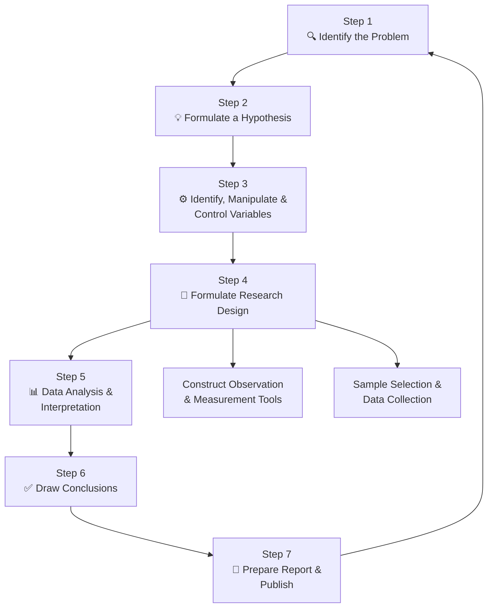
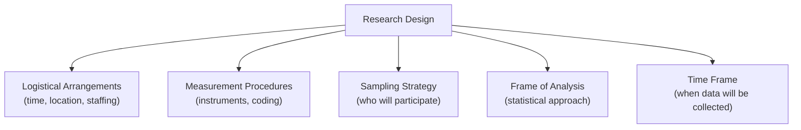

# Steps in the Research Process

## 🎯 Learning Objectives

After studying this topic, you will be able to:
- List and explain each of the seven steps in the research process
- Describe the role of literature review in identifying and refining research problems
- Distinguish between independent, dependent, and extraneous variables
- Explain the purpose of a research design and the criteria for selecting one
- Describe the options for data analysis and interpretation

---

## 📄 Source Reference

**Source PDF**: 📄 [Block-1/Unit-1.pdf — Pages 11–16](/pdfs/MPC-005%20Research%20Methods/Block-1/Unit-1.pdf)  
**Course**: MPC-005 Research Methods in Psychology

---

## Overview: The Research Process as a System

Research is not a linear, mechanical sequence — it is better understood as a **cyclical and iterative system** in which each step informs subsequent ones and conclusions often loop back to generate new questions. However, for clarity, the process can be structured into seven principal steps:

---

## Step I: Identification of the Problem

The **first and most important** step is identifying a researchable question — one that arises from curiosity, practical need, or theoretical gaps. Psychological research typically addresses questions of one of three kinds:

1. What are the causes or determinants of a given behaviour?
2. What is the structure of a behaviour and how is it linked to other behaviours?
3. What are the relationships between internal psychological processes and behavioural phenomena?

### How to Identify a Good Problem

A good research problem should:
- **Not have been adequately investigated** before
- **Contribute meaningfully** to understanding of the topic
- Be **feasible** — accessible to the researcher given available time, funds, and expertise
- **Lead to further questions** — generative of new lines of inquiry

### The Critical Role of Literature Review

A **literature review** surveys prior work in a research domain. It is not optional — it is essential. Literature can be found in:
- **Journals** (e.g., *Psychological Science*, *Journal of Abnormal Psychology*)
- **Books and edited volumes**
- **Abstracts and indexes** — notably **PsycINFO** (APA's electronic database) and its print companion *Psychological Abstracts*

**Four functions of the literature review:**

| Function | Description |
|----------|-------------|
| **Identifying relevant variables** | Clarifies which variables have been found important (or unimportant) in related work |
| **Assessing prior work** | Prevents duplication; reveals opportunities for meaningful extension |
| **Systematising knowledge** | Helps the researcher organise the growing body of knowledge and draw useful conclusions |
| **Refining the problem** | Helps redefine variables, clarify meanings, and build a compelling case for the study's merit |

---

## Step II: Formulating a Hypothesis

Once the problem is identified and the literature reviewed, the researcher formulates a **hypothesis** — a tentative, testable statement of the relationship between variables.

Hypotheses are typically derived from:
- Existing theories
- Prior research findings
- Personal observations and clinical experience

### Properties of a Good Hypothesis

| Property | Explanation |
|----------|-------------|
| **Declarative** | Stated as a sentence, not a question |
| **Testable/Falsifiable** | Must be possible to show it is wrong |
| **Prior to data collection** | Never formulated *after* data are examined (this introduces confirmation bias) |
| **Precise** | Clearly identifies the variables and the expected relationship |

**Example**: "Students who are rewarded will require fewer trials to learn a word list than students who receive no reward."

### Null vs. Alternative Hypothesis

In practice, statistical analysis tests the *null hypothesis* (H₀) — the assumption that there is no effect — against the *alternative hypothesis* (H₁) — the expected effect. Rejecting H₀ provides support for H₁.

---

## Step III: Identifying, Manipulating, and Controlling Variables

### Types of Variables

| Variable Type | Definition | Example (Reward & Learning Study) |
|---------------|-----------|-----------------------------------|
| **Independent Variable (IV)** | The condition or characteristic manipulated or selected by the researcher to study its effect | Reward (present vs. absent) |
| **Dependent Variable (DV)** | The characteristic that changes as a function of the IV; what is measured | Number of trials to reach criterion learning |
| **Extraneous Variable (EV)** | Uncontrolled variable that may affect the DV; must be controlled | Prior knowledge of the words, time of day, participant motivation |

The goal of good experimental design is to ensure that any observed change in the DV can be attributed confidently to the manipulation of the IV, not to uncontrolled EVs.

### Operational Definitions of Variables

Because psychological variables are often abstract and complex, they must be **operationally defined** — that is, defined in terms of the precise operations used to produce or measure them. This allows:
- Precise measurement
- Clear communication to other researchers
- Replication across laboratories

**Common operational measures in psychology:**
- **Verbal measures** — questionnaires, self-reports, ratings
- **Behavioural measures** — response time, frequency of specific actions, error rates
- **Physiological measures** — heart rate, cortisol levels, EEG readings

---

## Step IV: Formulating a Research Design

A **research design** is the blueprint specifying how the study will be conducted — it defines the logic of inquiry and specifies how to control for threats to validity.

### What a Research Design Must Specify

### Types of Research Design (Overview)

| Design Type | When Used |
|-------------|-----------|
| **Experimental** | Testing causal hypotheses; IV is manipulated; participants randomly assigned |
| **Quasi-experimental** | IV exists naturally; no random assignment |
| **Correlational** | Examining relationships without manipulation |
| **Survey/Descriptive** | Describing characteristics of a population |
| **Case Study** | In-depth investigation of an individual or group |

**Key principle**: A faulty design produces misleading findings. Empirical investigation is primarily evaluated in light of the research design adopted.

### 4.1 Constructing Tools for Observation and Measurement

Once the design is formulated, the researcher selects or develops appropriate **data collection instruments**:
- Questionnaires (e.g., Beck Depression Inventory)
- Interview schedules (structured or semi-structured)
- Observational checklists
- Standardised tests

If validated instruments are available, they should be used rather than ad hoc tools; if not, new instruments must be developed and pilot-tested before the main study.

### 4.2 Sample Selection and Data Collection

The researcher decides:
- **Who** will participate (sample from the target population)
- **How many** (sample size — balancing statistical power with feasibility)
- **How** data will be collected (individual vs. group administration; online vs. in-person)

In psychology, participants may include children, adolescents, college students, teachers, managers, clinical patients, or other groups in whom the phenomenon is prevalent. Sample selection must also address considerations of:
- Cost and accuracy
- Reliability and validity of data collection procedures
- Ethical treatment of participants

---

## Step V: Data Analysis and Interpretation

After data are collected, they are analysed using **quantitative and/or qualitative techniques**. The purpose of analysis is to make sense of the data — to see what they reveal about the research hypotheses.

### Types of Statistical Analysis

| Analysis Type | When Used |
|---------------|-----------|
| **Univariate** | One characteristic of interest; e.g., mean score on a depression measure |
| **Bivariate** | Two characteristics; e.g., correlation between anxiety and performance |
| **Multivariate** | More than two characteristics; e.g., multiple regression, MANOVA |

### Parametric vs. Non-Parametric Statistics

| Type | When Used |
|------|-----------|
| **Parametric** | Data meet assumptions of normality and interval/ratio scale |
| **Non-Parametric** | Data are ordinal/nominal or do not meet parametric assumptions |

**General goal of statistical analysis**: Reject the null hypothesis (H₀) so that the alternative hypothesis (H₁) may be supported. This is achieved when the probability of the observed result occurring by chance falls below the accepted significance level (typically p < 0.05).

---

## Step VI: Drawing Conclusions

After analysing results, the researcher draws **conclusions** — generalisations from the sample to the broader population. At this stage:
- Hypotheses are accepted or rejected
- Conclusions are related back to the theory from which the hypothesis was derived
- If necessary, the original theory is modified to accommodate new findings

**Important constraints on conclusions:**
- Conclusions must be proportional to the evidence — avoid overgeneralisation
- Conclusions from one culture, gender, or age group may not apply universally (external validity concern)
- Statistical significance does not equal practical significance

---

## Step VII: Preparation of Report and Publication

The final step documents all stages of the research in a standardised scientific report. A complete report:
- Describes what was done, what was found, and what conclusions were drawn
- Follows a standard format (typically: Abstract, Introduction, Method, Results, Discussion, References)
- Allows other researchers to **replicate** the study
- Is submitted for **peer review** and, if accepted, published in scientific journals or books

Publication makes findings available for:
- Wider scientific scrutiny and critique
- Integration into meta-analyses and systematic reviews
- Application to practical problems in clinical, educational, or organisational psychology

---

## 🌍 Real-World Application: Research in Indian Psychology

The seven-step process applies across all domains of psychology. In India, researchers at institutions like NIMHANS (Bengaluru), AIIMS, and IIT's psychology departments regularly publish studies following exactly this sequence. Indian-specific variables — such as joint family dynamics, caste identity, collectivist value systems — are increasingly being incorporated as important research foci rather than afterthoughts.

---

## 📚 External Resources

### Wikipedia
- [Research design — Wikipedia](https://en.wikipedia.org/wiki/Research_design) — overview of how research is structured and justified
- [Dependent and independent variables — Wikipedia](https://en.wikipedia.org/wiki/Dependent_and_independent_variables) — clear definitions with examples

### Educational Videos
- 🎬 [**Research Methods in Psychology: Crash Course Psychology #2**](https://www.youtube.com/watch?v=esmzYhuFnds) — covers hypothesis formulation, variables, and research design
- 🎬 [**Identifying Variables in Psychological Research — Khan Academy**](https://www.khanacademy.org/test-prep/mcat/behavior/research-and-statistical-methods-in-psychology/v/independent-and-dependent-variables) — focused 6-minute tutorial

### Research Papers
- **Hulley, S. B., et al. (2013)**. *Designing Clinical Research* (4th ed.). Lippincott Williams & Wilkins — the gold standard text on research design principles
- **Field, A. & Hole, G. (2003)**. *How to Design and Report Experiments*. SAGE Publications — practical, accessible guide to experimental design

### Additional Resources
- [APA Research Methods Glossary](https://www.apa.org/research/responsible/glossary) — definitions of all key research terms
- [PsycINFO Database — APA](https://www.apa.org/pubs/databases/psycinfo) — primary tool for literature review
- [Simply Psychology — Research Methods](https://www.simplypsychology.org/research-methods.html) — clear summaries for students
- [Research Rundowns: Steps in Quantitative Research](https://researchrundowns.com/quantitative-methods/research-process/) — step-by-step visual explanations
- [ICSSR: Indian Council of Social Science Research](https://icssr.org/) — primary funding body for Indian social science research

---

## 🧠 Memory Aids

### Mnemonic: **IFIVDCD** — The 7 Steps
> **I**dentify the Problem · **F**ormulate Hypothesis · **I**dentify Variables · **V**erify through Design · **D**ata Analysis · **C**onclusions · **D**isseminate (Report)

Memory sentence: *"If Freda Is Very Determined, Creative Discoveries Follow."*

### Variables in One Line
> **IV** is what you **do** (Independent = you **In**tervene)  
> **DV** is what you **measure** (Dependent = it **De**pends on IV)  
> **EV** is what you **control** (Extraneous = everything **Else**)

---

## ✅ Self-Assessment Questions

1. **Why must a hypothesis be formulated before data collection?** What methodological problem arises from formulating a hypothesis after seeing the data?

2. **A researcher wants to study whether background music affects exam performance**. Identify the IV, DV, and at least two EVs you would need to control. Write an operational definition for each variable.

3. **Distinguish between a research design and a research method**. Why is selecting an appropriate research design so critical?

4. **What are the four functions of a literature review?** Illustrate each function with an example from psychological research.

5. **Explain the difference between parametric and non-parametric statistics**. Under what conditions would a researcher choose a non-parametric test?

---

## 🔗 Cross-References

- [Definition and Meaning of Research](/mpc-005/block-1/definition-meaning-research) — foundational concepts
- [Context of Discovery and Justification](/mpc-005/block-1/research-process-discovery-justification) — the two phases of research
- [Importance of Research in Psychology](/mpc-005/block-1/importance-research-psychology) — applications and significance

---

*📄 Source: MPC-005 Research Methods, Block-1, Unit-1, Pages 11–16 | IGNOU*
