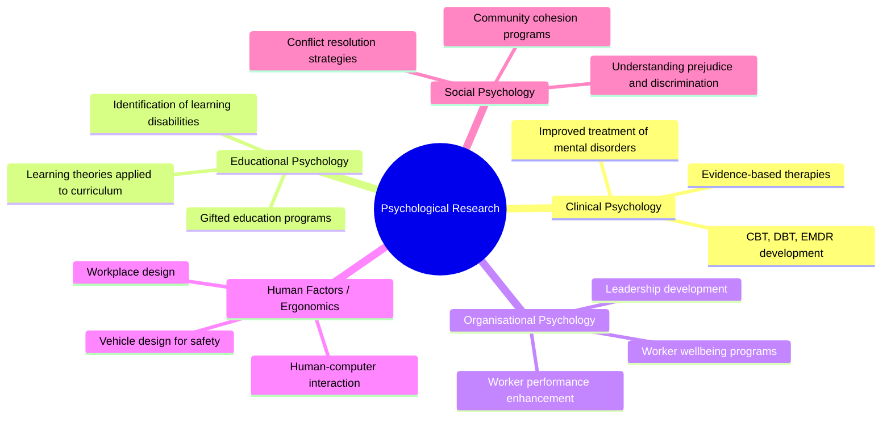

# Importance of Research in Psychology

## 🎯 Learning Objectives

After studying this topic, you will be able to:
- Explain why research is indispensable to psychology as a science
- Describe the role of research in advancing theoretical and applied psychology
- Identify the major domains in which psychological research has made a practical impact
- Appreciate the relevance of research for Indian psychology and everyday life

---

## 📄 Source Reference

**Source PDF**: 📄 [Block-1/Unit-1.pdf — Pages 16–17](/pdfs/MPC-005%20Research%20Methods/Block-1/Unit-1.pdf)  
**Course**: MPC-005 Research Methods in Psychology

---

## 1. Research as the Foundation of Psychological Knowledge

Psychology aspires to be a **science of mind and behaviour**. What distinguishes scientific psychology from folk wisdom, intuition, or philosophy is precisely its commitment to *systematic research*. Without research:
- Theories would have no empirical grounding
- Clinical practices would rely on tradition and authority rather than evidence
- Interventions could do harm as easily as good

Research transforms psychology from an art of observation into a **discipline capable of producing reliable, generalisable knowledge**.

---

## 2. Domains of Psychological Research Impact

Psychological research has had measurable, transformative impact across virtually every sphere of human life. The IGNOU text highlights these key domains:

### 2.1 Clinical Psychology

Perhaps nowhere is the importance of research more evident than in clinical practice. Research has:
- Developed **evidence-based treatments** for depression, anxiety, PTSD, and schizophrenia
- Established the effectiveness (or ineffectiveness) of specific therapeutic modalities
- Led to standardised diagnostic criteria (DSM-5, ICD-11) grounded in empirical observation

**Example**: Cognitive Behavioural Therapy (CBT) — one of the most widely used psychological treatments — was developed and validated through decades of controlled research. Without research, clinicians would rely solely on theoretical preference or clinical intuition.

### 2.2 Educational Psychology

Research has profoundly shaped how teaching and learning are understood and practiced:
- Theories of **motivation** have informed classroom management
- Research on **cognitive load** has shaped curriculum design
- Studies of **learning disabilities** (dyslexia, ADHD) have led to better identification and remedial programmes

**Indian Context**: NCERT curriculum design is increasingly informed by developmental psychology research. The Right to Education Act (2009) was partly informed by research on inclusive education.

### 2.3 Organisational Psychology

Psychological research on work behaviour has led to:
- Better **selection and placement** of employees
- More effective **training programmes**
- Understanding of **burnout, stress, and job satisfaction**
- Improved **leadership** models (transformational, servant leadership)

**Practical gain (as cited in the IGNOU text)**: "new ways of enhancing the performance and happiness of workers" — directly attributable to applied psychological research.

### 2.4 Human Factors and Ergonomics

The IGNOU text notes specifically: "better designs of vehicles to make them easier and safe to use." This refers to the field of **human factors psychology**, which applies research on perception, attention, decision-making, and motor control to the design of machines, interfaces, and environments.

Examples include:
- Cockpit design in aviation
- Car dashboard layout
- Hospital equipment design to reduce medical errors

---

## 3. The Scientific Character of Psychological Research

### Experimental Methods and Control

Psychological research has become increasingly sophisticated in its use of experimental methodology. Researchers have developed techniques to:
- **Isolate the effects of independent variables** from confounding factors
- **Manipulate variables** that would otherwise be impossible to study (e.g., through simulation)
- Use **standardised experimental designs** that permit meaningful cross-study comparison

### Quantification and Statistical Rigour

By transforming psychological observations into **quantitative form** — scores, frequencies, reaction times, physiological measurements — research can be subjected to rigorous statistical analysis. This method-oriented approach:
- Allows objective comparison across groups and time points
- Supports detection of even subtle effects
- Enables meta-analysis — the statistical integration of findings from multiple studies

### The Growth of Empirical Fields

Active areas of empirical psychological research include:
- **Learning and memory** — how information is encoded, stored, and retrieved
- **Motivation** — what drives behaviour and sustains effort
- **Perception** — how sensory information is organised and interpreted
- **Concept learning** — how categories and concepts are formed
- **Comparative psychology** — behaviour across species

Each of these fields has generated substantial practical applications.

---

## 4. Research as a Fountain of Knowledge

Research serves multiple broader societal functions:

| Function | Description |
|----------|-------------|
| **Pure Knowledge** | Expands understanding of the mind for its own sake |
| **Practical Problem-Solving** | Generates solutions to personal, professional, governmental, and social problems |
| **Professional Training** | Equips practitioners to understand and apply new developments |
| **Policy Informing** | Informs government policy on education, mental health, criminal justice |
| **Critical Thinking** | Trains researchers and consumers of research to evaluate evidence |

---

## 5. Why MAPC Students Need to Understand Research Methods

For students of the IGNOU MAPC programme, research methodology is not merely an academic requirement — it is a **professional necessity**:

1. **Reading and evaluating literature**: Practitioners and researchers must be able to critically appraise published studies
2. **Designing investigations**: Whether in clinical practice or academic research, you will need to design systematic investigations of psychological questions
3. **Evidence-based practice**: All helping professions (clinical, counselling, educational) now demand evidence-based justification for interventions
4. **MAPC dissertation**: The MAPC dissertation requires you to conduct and report original research following the steps outlined in this unit

---

## 📚 External Resources

### Wikipedia
- [Psychology — Wikipedia](https://en.wikipedia.org/wiki/Psychology) — overview of psychology as a scientific discipline
- [Applied psychology — Wikipedia](https://en.wikipedia.org/wiki/Applied_psychology) — the bridge between research and real-world application

### Educational Videos
- 🎬 [**Why Study Psychology? — American Psychological Association**](https://www.youtube.com/watch?v=vo4pMVb0R6M) — APA's overview of psychology's societal impact

### Research Papers
- **VandenBos, G. R. (Ed.) (2007)**. *APA Dictionary of Psychology*. American Psychological Association — foundational reference covering research across all domains
- **Kazdin, A. E. (2003)**. "Research design in clinical psychology" (4th ed.). Allyn & Bacon — authoritative guide to the importance of research design in clinical contexts

### Additional Resources
- [American Psychological Association — Research](https://www.apa.org/research) — APA's hub for psychological research
- [NIMHANS Research Publications](https://nimhans.ac.in/research/) — India's premier psychiatric research institute
- [ICMR Mental Health Research](https://www.icmr.gov.in/) — Indian Council of Medical Research's mental health division
- [Greater Good Science Center — UC Berkeley](https://greatergood.berkeley.edu/) — applying psychological research to wellbeing and flourishing
- [The British Psychological Society — Research](https://www.bps.org.uk/research) — UK perspective on evidence-based practice
- [Psychology Today — Research Explained](https://www.psychologytoday.com/us/basics/research) — accessible summaries of research findings for general audience

---

## 🧠 Memory Aids

### Acronym: **CEOHS** (Domains of Psychological Research Impact)
> **C**linical · **E**ducational · **O**rganisational · **H**uman Factors · **S**ocial

Memory sentence: *"Clever Experts Often Help Society"*

### Why Research Matters — The 4 Ps
> **P**roblem-Solving · **P**rediction · **P**revention · **P**olicy

Research in psychology helps us solve problems, predict behaviour, prevent harm, and inform policy — the **4 Ps of applied research value**.

---

## ✅ Self-Assessment Questions

1. **"Psychology without research is merely speculation."** Evaluate this statement using examples from clinical and educational psychology.

2. **Identify three practical gains** that psychological research has produced, as mentioned in the IGNOU text. For each, describe how research made this gain possible.

3. **What role does research play in evidence-based practice?** Why can't practitioners simply rely on their clinical experience?

4. **As an MAPC student**, you will conduct an original research dissertation. Based on this unit's overview of the research process, outline the steps you would follow to investigate whether mindfulness training reduces academic anxiety among postgraduate students in India.

---

## 🔗 Cross-References

- [Definition and Meaning of Research](/mpc-005/block-1/definition-meaning-research) — what research is
- [Research Process — Discovery & Justification](/mpc-005/block-1/research-process-discovery-justification) — the two phases of inquiry
- [Steps in the Research Process](/mpc-005/block-1/research-process-steps) — the seven-step model

---

*📄 Source: MPC-005 Research Methods, Block-1, Unit-1, Pages 16–17 | IGNOU*
