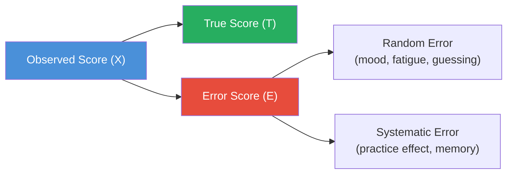
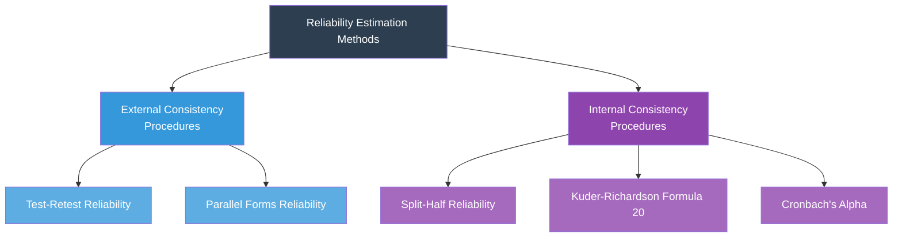

# Reliability in Psychological Research — Concepts and Methods

## 🎯 Learning Objectives

After studying this topic, you will be able to:
- Define reliability and explain its importance in psychological measurement
- Distinguish between external and internal consistency procedures
- Describe and compare test-retest, parallel forms, split-half, KR-20, and Cronbach's Alpha methods
- Identify the strengths and limitations of each reliability estimation technique
- Apply the Spearman-Brown formula concept to split-half corrections

---

## 📄 Source Reference

**Source PDF**: 📄 [Block-1/Unit-2.pdf — Pages 19–25](/pdfs/MPC-005%20Research%20Methods/Block-1/Unit-2.pdf)  
**Course**: MPC-005 Research Methods in Psychology

---

## 1. What Is Reliability?

**Reliability** is the bedrock of psychological measurement. Without consistency, no instrument — however sophisticated — can yield trustworthy data. The fundamental principle is simple: if you measure the same thing twice under the same conditions, you should get the same answer.

Reliability is formally defined as **the consistency of measurement** — the degree to which an instrument measures the same construct in the same way each time it is used, under the same conditions, with the same participants.

### The Key Insight: Reliability Is Estimated, Not Measured

Unlike a physical quantity such as length, reliability cannot be directly observed. It must be *inferred* from patterns in data. A test is considered reliable when individuals' scores on repeated administrations correlate strongly with one another.

### Classic Definitions

| Scholar | Definition |
|---------|-----------|
| **Anastasi (1957)** | "The reliability of a test refers to the consistency of scores obtained by the individual on different occasions or with different sets of equivalent items." |
| **Stodola & Stordahl (1972)** | "The reliability of a test can be defined as the correlation between two or more sets of scores of equivalent tests from the same group of individuals." |
| **Guilford (1954)** | "Reliability is the proportion of the true variance in obtained test scores." |

### True Score Theory: Understanding Measurement Error

Every observed score (X) contains two components:
- **True score (T)** — the actual ability or trait the test is designed to measure
- **Error score (E)** — random fluctuations due to chance factors

> **X = T + E**

Reliability is essentially the ratio of true score variance to total observed variance. A perfectly reliable test would have zero error — but in psychological measurement, some error is always present. The goal is to *minimise and quantify* it, not to pretend it doesn't exist.

---

## 2. Classification of Reliability Methods

Reliability estimation methods fall into two broad categories:

**External consistency procedures** compare data from two *independent* collection processes.  
**Internal consistency procedures** evaluate consistency *within* a single test administration.

---

## 3. External Consistency Procedures

### 3.1 Test-Retest Reliability

**Definition**: The same test is administered to the *same sample* on *two separate occasions*. The correlation between scores from the two administrations is the reliability coefficient.

**Core Assumption**: The construct being measured is *stable* over the time interval between administrations. This assumption holds for stable traits (intelligence, personality) but less so for fluctuating states (anxiety before an exam, mood).

**Time Gap Matters**:
- Shorter gap → higher correlation (less true change, but more memory effect risk)
- Longer gap → lower correlation (real change in construct, more external events intervene)

#### Limitations

| Limitation | Explanation |
|------------|-------------|
| **Memory / Carry-over Effect** | Participants remember their previous responses, especially on short intervals (e.g., 15 minutes). This inflates reliability artificially. |
| **Practice Effect** | Repeated exposure improves scores independent of the construct (classic in IQ testing — scores improve simply with practice). |
| **Participant Attrition** | Some participants may not return for the second administration, introducing selection bias. |

**When to Use**: Best suited for stable trait measures; widely used in experimental and quasi-experimental designs where a control group is measured at two time points.

---

### 3.2 Parallel Forms Reliability (Alternate Forms)

**Also Known As**: Alternate forms reliability, equivalent form reliability, comparable form reliability.

**Definition**: Two *equivalent forms* of a test are created — same construct, same difficulty level, same format, but *different items*. Participants complete both forms. The Pearson correlation between scores on the two forms estimates reliability.

**Administration Options**:
- **Same day, both forms** — captures only random measurement error and form differences
- **Different days, both forms** — additionally captures time-sampling error

#### Strengths
- Eliminates the memory/carry-over effect entirely (different items each time)
- Provides one of the most rigorous reliability assessments available
- Particularly useful when multiple test administrations are needed (pre/post designs)

#### Limitations
- Expensive and time-consuming — creating two psychometrically equivalent forms is technically demanding
- Rarely used in practice because of the development burden
- If forms are not truly equivalent, the "reliability" estimate conflates form differences with true measurement error

**Practical Reality**: Most test developers find it too burdensome to develop two forms and prefer single-form internal consistency methods.

---

## 4. Internal Consistency Procedures

When only a single test form exists, internal consistency is evaluated by examining how consistently the *items within the test* measure the same construct.

### 4.1 Split-Half Reliability

**Procedure**:
1. Divide all test items (designed to measure the same construct) randomly into two halves
2. Administer the complete test to the sample
3. Calculate total scores for each half
4. Correlate the two half-scores

The resulting correlation *underestimates* true reliability because it is based on half-length tests. A correction is needed.

**Spearman-Brown Formula** (corrects for test length):

$$r_{sb} = \frac{2r_{hh}}{1 + r_{hh}}$$

Where *r_hh* is the correlation between the two halves.

**Example**: If the two halves correlate at 0.70, the Spearman-Brown corrected reliability = 2(0.70)/(1 + 0.70) = 1.40/1.70 = **0.82**.

#### Limitation
Works best on *long tests*. Short tests risk unstable split-half correlations because small halves are subject to greater random fluctuation.

---

### 4.2 Kuder-Richardson Formula 20 (KR-20)

**Application**: Tests where each item is scored *dichotomously* (right = 1, wrong = 0) — e.g., multiple-choice knowledge tests, true/false questionnaires.

**Formula**:

$$KR\text{-}20 = \frac{N}{N-1}\left(1 - \frac{\sum pq}{\sigma^2}\right)$$

Where:
- N = number of items
- p = proportion answering each item correctly
- q = proportion answering each item incorrectly (q = 1 − p)
- σ² = variance of total test scores

**Conceptual Meaning**: KR-20 measures the extent to which all items are measuring the same underlying construct. If items are unrelated to each other, KR-20 will be low. If they all tap the same construct, KR-20 will be high.

**Item Difficulty Index**: KR-20 uses the *item difficulty index* (p-value) — the proportion of test takers answering the item correctly. An item with p = 0.67 was answered correctly by 67% of respondents.

---

### 4.3 Cronbach's Alpha (α)

**Developed by**: Lee Cronbach (1951); later elaborated by Novick & Lewis (1967) and Kaiser & Michael (1975).

**The Generalisation of KR-20**: Cronbach's Alpha extends the KR-20 to tests where items are *not* scored dichotomously — including Likert-scale items (strongly agree → strongly disagree), rating scales, and behavioural checklists.

**Formula**:

$$\alpha = \frac{N}{N-1}\left(1 - \frac{\sum \sigma_j^2}{\sigma^2}\right)$$

Where:
- N = number of items
- σ²_j = variance of individual item j
- Σσ²_j = sum of all item variances
- σ² = variance of total test scores

**Conceptual Meaning**: Cronbach's Alpha can be interpreted as the *mean of all possible split-half coefficients* for a given test, corrected by the Spearman-Brown formula. It ranges from 0.00 to 1.00.

**Interpretation Benchmarks** (widely used in research):

| Alpha Value | Interpretation |
|-------------|----------------|
| ≥ 0.90 | Excellent |
| 0.80–0.89 | Good |
| 0.70–0.79 | Acceptable |
| 0.60–0.69 | Questionable |
| 0.50–0.59 | Poor |
| < 0.50 | Unacceptable |

> **Caution**: Very high alpha (> 0.95) may indicate item *redundancy* — multiple items asking essentially the same question. Good tests balance alpha with item diversity.

---

## 5. Comparison of Reliability Estimators

| Method | Best Used When | Key Limitation |
|--------|---------------|----------------|
| **Test-Retest** | Stable trait measurement; experimental/quasi-experimental designs | Memory & practice effects; attrition |
| **Parallel Forms** | Two equivalent forms exist; need to eliminate memory effects | Expensive to develop; rarely used |
| **Split-Half** | Long tests with homogeneous items | Underestimates reliability; must correct with Spearman-Brown |
| **KR-20** | Dichotomous items (right/wrong) | Only applicable to binary-scored items |
| **Cronbach's Alpha** | Polytomous items (Likert scales, ratings) | Sensitive to number of items; inflated by redundant items |

**General Pattern**: Test-retest and inter-rater reliability estimates tend to be *lower* than parallel forms and internal consistency estimates because they introduce additional sources of variance (time sampling, rater differences).

---

## 🌍 Real-World Applications

### Clinical Assessment
The Revised NEO Personality Inventory (NEO PI-R) reports Cronbach's Alpha values ranging from 0.73 to 0.89 for its five major factors — this is cited every time a clinician uses the tool to ensure its scores are trustworthy.

### Indian Context
The Mangal General Mental Ability Test (MGMAT), widely used in Indian educational settings, reports test-retest reliability of approximately 0.92 over a two-week interval — meaning scores remain stable, which is essential for placement decisions in schools.

### Exam Construction
All national-level entrance examinations in India (NEET, JEE, UPSC) undergo rigorous item analysis using KR-20 to ensure internal consistency before results are declared. A test with low KR-20 would suggest items are not measuring a common domain.

---

## 📚 External Resources

### Wikipedia
- [Reliability (statistics) — Wikipedia](https://en.wikipedia.org/wiki/Reliability_(statistics)) — detailed overview with mathematical derivations
- [Cronbach's Alpha — Wikipedia](https://en.wikipedia.org/wiki/Cronbach%27s_alpha) — history, formula, and interpretation

### Educational Videos
- 🎬 [**Reliability in Research: Types and Methods** (Practical Psychology, YouTube)](https://www.youtube.com/watch?v=VUN35BC11Qk) — clear visual walkthrough of all reliability types
- 🎬 [**Cronbach's Alpha — When to Use It and How** (Statistics How To, YouTube)](https://www.youtube.com/watch?v=KfFCOg5o_E4) — step-by-step applied explanation

### Recent Research Papers
- **Taber, K. S. (2018)**. "The use of Cronbach's Alpha when developing and reporting research instruments in science education." *Research in Science Education*, 48, 1273–1296. DOI: 10.1007/s11165-016-9602-2 — a critical review of how alpha is used (and misused)
- **Sijtsma, K. (2009)**. "On the use, the misuse, and the very limited usefulness of Cronbach's alpha." *Psychometrika*, 74(1), 107–120 — essential critical reading
- **McNeish, D. (2018)**. "Thanks coefficient alpha, we'll take it from here." *Psychological Methods*, 23(3), 412–433. DOI: 10.1037/met0000144 — on modern alternatives to alpha

### Additional Reading
- [Reliability Analysis — StatisticsHowTo.com](https://www.statisticshowto.com/reliability/) — accessible applied guide
- [Spearman-Brown Formula — Laerd Statistics](https://statistics.laerd.com/statistical-guides/reliability-in-research.php) — clear explanation with examples
- [APA Standards for Psychological Testing](https://www.apa.org/science/programs/testing/standards) — professional standards for reliability reporting
- [Test Theory — Psychometrics Explained (Simply Psychology)](https://www.simplypsychology.org/reliability.html) — student-friendly overview
- [Classical Test Theory (CTT) Primer — NCME](https://www.ncme.org/resources/faqs/classical-test-theory) — from the National Council on Measurement in Education

---

## 🧠 Memory Aids

### Mnemonic: **TPSKC** — Five Reliability Methods
> **T**est-retest · **P**arallel forms · **S**plit-half · **K**uder-Richardson · **C**ronbach's Alpha

Remember: *"The Psychology Student Knows Consistency"*

### The "Two Types" Rule
- **External** = Two *occasions* or two *forms* (comparing *outside* the single test)
- **Internal** = One occasion, one form — but *inside* the test, items are compared with each other

### Cronbach's Alpha in a Sentence
"Alpha is the average of all possible ways to split the test in half" — if all splits give similar results, the test is internally consistent.

---

## ✅ Self-Assessment Questions

1. **Define reliability** and explain why it is said to be "estimated" rather than "measured directly."

2. **Compare and contrast** test-retest reliability and parallel forms reliability. In what situation would you prefer parallel forms over test-retest?

3. **A researcher** uses split-half reliability on a 10-item test and gets a correlation of 0.60 between the two halves. What would the Spearman-Brown corrected reliability coefficient be? What does this tell you about the test?

4. **Distinguish KR-20 from Cronbach's Alpha** — when is each appropriate, and why can't they be used interchangeably?

5. **Practical Scenario**: A clinical psychologist administers a depression scale to a patient. The patient scores 28/40 (severe depression). Two weeks later, the same scale is re-administered and the patient scores 19/40 (moderate depression). What reliability and validity considerations arise when interpreting this change?

---

## 🔗 Cross-References

- [Validity in Psychological Research](/mpc-005/block-1/validity-types-threats) — the companion concept; also from Unit-2
- [Research Process Steps](/mpc-005/block-1/research-process-steps) — how reliability fits into the broader research design process
- [Psychological Testing (MPC-003)](/mpc-003/block-1/psychological-testing-overview) — reliability in the context of personality assessment

---

*📄 Source: MPC-005 Research Methods, Block-1, Unit-2, Pages 19–25 | IGNOU*
