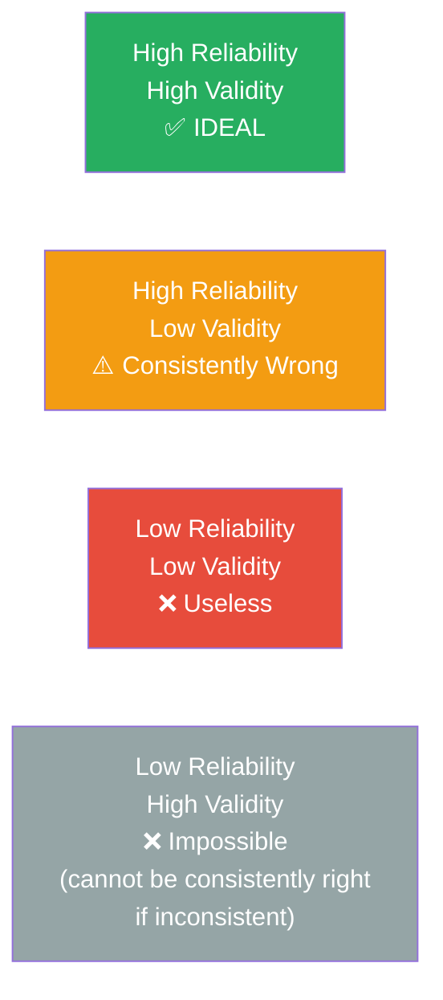
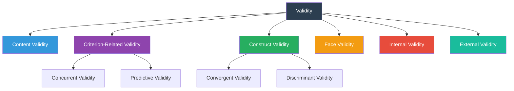

# Validity in Psychological Research — Types and Threats

## 🎯 Learning Objectives

After studying this topic, you will be able to:
- Define validity and explain its distinction from reliability
- Describe and distinguish all major types of validity: content, criterion-related, construct, face, internal, and external
- Identify and explain threats to internal validity with examples
- Identify and explain threats to external validity with examples
- Apply validity concepts to evaluate the quality of a psychological research design

---

## 📄 Source Reference

**Source PDF**: 📄 [Block-1/Unit-2.pdf — Pages 25–33](/pdfs/MPC-005%20Research%20Methods/Block-1/Unit-2.pdf)  
**Course**: MPC-005 Research Methods in Psychology

---

## 1. What Is Validity?

If reliability answers the question "Is this measurement *consistent*?", validity answers the deeper question: "Is this measurement *meaningful and accurate*?"

**Validity refers to the degree to which a test measures what it claims to measure.** A test can be highly reliable (consistent) yet completely invalid (measuring the wrong thing). A thermometer that consistently reads 2°C too high is reliable but not valid for accurate temperature measurement.

### Formal Definitions

| Scholar | Definition |
|---------|-----------|
| **AERA, APA & NCME (1985, 1999)** | "A test is valid to the extent that inferences drawn from it are appropriate, meaningful and useful." |
| **Cronbach (1951)** | "Validity is the extent to which a test measures what it purports to measure." |
| **Freeman (1971)** | "An index of validity shows the degree to which a test measures what it purports to measure when compared with accepted criteria." |
| **Anastasi (1988)** | "The validity of a test concerns what the test measures and how well it does so." |

### The Reliability-Validity Relationship

A critical conceptual point: **Reliability is necessary but not sufficient for validity.**

**The key rule**: You cannot have high validity without high reliability. An invalid measure can still be reliable (e.g., measuring head circumference as a proxy for intelligence — consistent but wrong). But a valid measure must be reliable, because valid conclusions require consistent measurement.

---

## 2. Types of Validity

### Overview

---

### 2.1 Content Validity

**Definition (McBurney & White, 2007)**: "Content validity is the notion that a test should sample the range of behaviour that is represented by the theoretical concept being measured."

Content validity is **non-statistical** — it is determined through expert judgment and logical analysis rather than correlation coefficients.

**How It Is Established**:
- Define the full *universe* of content the test should cover
- Select a representative *sample* of items from that universe
- Have independent experts rate item relevance
- Include only items that both experts rate as highly relevant

**Example**: A spelling test for 3rd-grade students has content validity if it samples words that 3rd graders are expected to know — not words from graduate textbooks, and not trivially simple words that every child already knows.

**Key Characteristic**: Content validity is built into the test during item selection. It cannot be improved after the test is constructed without redesigning items.

---

### 2.2 Criterion-Related Validity

**Definition**: A valid test should correlate meaningfully with *other independent measures* of the same (or related) theoretical construct. The correlation between the test and the criterion is the **validity coefficient**.

There are two subtypes based on *timing*:

#### 2.2.1 Concurrent Validity
- The criterion measure is obtained **at the same time** as the test
- Reflects how well the test *describes current status*
- Example: A new anxiety scale has concurrent validity if it correlates strongly with an already-established anxiety scale administered on the same day
- Most useful for: **diagnostic clinical tests** and **achievement tests**

#### 2.2.2 Predictive Validity
- The criterion measure is obtained **in the future**, after the test
- Reflects how well the test *predicts future performance*
- Example: Aptitude test scores predicting academic success one year later
- Most useful for: **entrance examinations** and **occupational selection tests**

**Indian Examples**: The CAT (Common Admission Test) for IIM entrance relies heavily on predictive validity — scores should predict MBA academic performance. Similarly, the UPSC Civil Services examination is validated partly by how well scores predict job performance of IAS officers.

---

### 2.3 Construct Validity

Construct validity is conceptually the most complex and arguably the most important type. It addresses a fundamental question: does this test actually measure the *psychological construct* it claims to measure?

**Definition (McBurney & White, 2007)**: "The property of a test that the measurements actually measure the constructs they are designed to measure."

**Three Indicators of Construct Validity**:
1. The test measures its target construct, not something theoretically unrelated (e.g., a leadership test should not primarily measure extraversion)
2. The test does *not* measure constructs it theoretically should not (e.g., a musical aptitude test should not require high reading ability)
3. The test predicts outcomes related to the construct (e.g., a musical ability test should predict benefit from music lessons)

#### 2.3.1 Convergent Validity
The test correlates *strongly* with other measures that theoretically *should* be related to the same construct.

*Example*: Two independently developed depression scales should converge — if they both validly measure depression, they should correlate highly.

#### 2.3.2 Discriminant Validity (Divergent Validity)
The test does *not* correlate with measures of theoretically *unrelated* constructs.

*Example*: A depression scale should correlate poorly with measures of mathematical ability — these are theoretically unrelated. If the correlation is high, the depression scale may actually be measuring cognitive performance rather than mood.

**The Multitrait-Multimethod Matrix (MTMM)** — developed by Campbell & Fiske (1959) — is the classic method for simultaneously assessing convergent and discriminant validity by measuring multiple traits with multiple methods.

---

### 2.4 Face Validity

**Definition**: What the test *appears* to measure at first glance — its superficial plausibility.

Face validity is the weakest form of validity and is based on the *subjective judgment* of the researcher or test users. A test has face validity when test items seem obviously relevant to the construct being measured.

**Why It Matters Despite Being Weak**: Tests with low face validity may be rejected by respondents who question their relevance. A measure of workplace stress that asks only about food preferences would have poor face validity and might be dismissed as absurd — reducing participation and data quality.

**Limitation**: Face validity can be *deceiving*. A test might look valid superficially but fail to measure the construct accurately (high face validity, low construct validity). Alternatively, a test might look strange but be empirically valid.

---

## 3. Internal Validity

**Definition**: Internal validity is the extent to which a study provides evidence of a *causal relationship* between the independent variable (IV) and the dependent variable (DV).

High internal validity means: when the DV changes, we can be confident the IV *caused* that change — not some other factor.

Internal validity is the most critical consideration in experimental research. Without it, causal conclusions are unwarranted.

### 3.1 Threats to Internal Validity

The following threats are alternative explanations for observed changes in the DV — if present, they undermine the conclusion that the IV caused the change:

| Threat | Description | Example |
|--------|-------------|---------|
| **Confounding** | Two variables' effects cannot be separated | Testing a stress-reduction intervention only on highly stressed women — gender and stress level are confounded |
| **Selection Bias** | Pre-existing differences between groups at baseline | Experimental group volunteers have higher motivation than control group |
| **History** | External events between measurements influence results | A new mental health awareness campaign runs during a depression treatment study |
| **Maturation** | Participants change naturally over the study period | Children's reading improves simply due to development, not the teaching intervention |
| **Repeated Testing** | Practice with the test itself improves performance | Participants score higher on memory test at Time 2 simply from having done it at Time 1 |
| **Instrument Change** | Measurement tool changes between pre and post | Switching from observer A to observer B mid-study |
| **Regression Toward the Mean** | Extreme scores naturally drift toward the mean | Selecting only very anxious participants — some will become less anxious by Time 2 purely statistically |
| **Mortality (Attrition)** | Participants drop out non-randomly | Sicker participants drop out of a depression treatment study, making treatment look more effective |
| **Diffusion** | Treatment effects "leak" from experimental to control group | Experimental and control participants share information about what they've learned |
| **Compensatory Rivalry** | Control group tries harder because they know they are being compared | Placebo group works extra hard in a memory training study |
| **Experimenter Bias** | Researcher unintentionally treats groups differently | Knowing who received treatment leads to differential enthusiasm in post-test administration |

**Addressing Experimenter Bias**: The *double-blind design* — where neither participants nor experimenters know treatment assignments — is the gold standard for eliminating experimenter bias. This is why randomised controlled trials (RCTs) are considered methodologically rigorous.

---

## 4. External Validity

**Definition (McBurney & White, 2007)**: "External validity concerns whether results of the research can be generalised to another situation, different subjects, settings, times and so on."

Internal validity asks "Did X cause Y *in this study*?" External validity asks "Would X cause Y *in general*?"

High internal validity and high external validity are often in tension — the more tightly controlled a study (boosting internal validity), the more artificial and removed from real life it becomes (reducing external validity).

### 4.1 Threats to External Validity

All threats to external validity involve the *interaction* of the independent variable with some other factor — meaning the causal relationship only holds under certain conditions.

| Threat | Description |
|--------|-------------|
| **Aptitude-Treatment Interaction** | The sample has special characteristics that limit generalisation (e.g., volunteers, clinical populations, students) |
| **Situational Factors** | Lab conditions (lighting, timing, experimenter presence, demand characteristics) may not generalise to real-world settings |
| **Pre-Test Sensitisation** | Pre-testing makes participants aware of what is being measured, changing their responses to the treatment |
| **Post-Test Effects** | Post-testing interacts with the treatment to produce effects that wouldn't occur in non-tested populations |
| **Rosenthal Effects** | Findings depend on the particular experimenters and cannot be generalised to other researchers |

**Ecological Validity** — a related concept — refers specifically to whether the findings generalise to *real-world settings*. Laboratory experiments often sacrifice ecological validity for experimental control.

**The WEIRD Problem in Psychology**: Much psychological research is conducted on WEIRD (Western, Educated, Industrialised, Rich, Democratic) populations, severely limiting external validity to other cultural contexts. This is particularly relevant for Indian psychology students — many classic findings from North American or European samples may not replicate in Indian sociocultural contexts.

---

## 5. Reliability vs. Validity vs. Threats: A Unified View

Understanding the relationship between these concepts is essential for designing good research:

| Concept | Question It Answers | Level of Analysis |
|---------|-------------------|-------------------|
| Reliability | "Are measurements *consistent*?" | Measurement instrument |
| Validity (content, criterion, construct, face) | "Does the instrument measure *what it should*?" | Measurement instrument |
| Internal validity | "Can we conclude the IV *caused* the DV change?" | Research design / experiment |
| External validity | "Can findings *generalise* beyond this study?" | Research context / sample |

---

## 📚 External Resources

### Wikipedia
- [Validity (statistics) — Wikipedia](https://en.wikipedia.org/wiki/Validity_(statistics)) — comprehensive overview
- [Internal validity — Wikipedia](https://en.wikipedia.org/wiki/Internal_validity) — in-depth with threats and examples

### Educational Videos
- 🎬 [**Internal vs External Validity** (Simply Psychology / YouTube)](https://www.youtube.com/watch?v=7Pd0fYn3Zq8) — clear conceptual differentiation
- 🎬 [**Types of Validity in Research** (Practical Psychology, YouTube)](https://www.youtube.com/watch?v=BX1ORs7MF4E) — all validity types covered in sequence

### Recent Research Papers
- **Shadish, W. R., Cook, T. D., & Campbell, D. T. (2002)**. *Experimental and Quasi-Experimental Designs for Generalized Causal Inference.* — the canonical reference on validity threats (updated from Campbell & Stanley, 1963)
- **Henrich, J., Heine, S. J., & Norenzayan, A. (2010)**. "The weirdest people in the world?" *Behavioral and Brain Sciences*, 33(2–3), 61–83. DOI: 10.1017/S0140525X0999152X — the landmark paper on WEIRD bias in psychology
- **Drost, E. A. (2011)**. "Validity and reliability in social science research." *Education Research and Perspectives*, 38(1), 105–123 — excellent accessible overview of all validity types

### Additional Reading
- [Threats to Internal Validity — Research Methods Knowledge Base](https://conjointly.com/kb/internal-validity/) — William Trochim's classic taxonomy
- [External Validity — Simply Psychology](https://www.simplypsychology.org/external-validity.html) — with examples and strategies
- [Construct Validity — StatisticsHowTo](https://www.statisticshowto.com/construct-validity/) — applied explanation
- [Campbell & Fiske (1959) — Multitrait-Multimethod Matrix](https://psycnet.apa.org/record/1959-00124-001) — original paper on convergent and discriminant validity
- [APA Validity Standards](https://www.apa.org/science/programs/testing/standards) — professional standards for validity evidence

---

## 🧠 Memory Aids

### Mnemonic: **4C2F** — Six Validity Types
> **C**ontent · **C**riterion-related · **C**onstruct · **C**oncurrent (under criterion) · **F**ace · (Internal + External = the design-level pair)

A simpler grouping: **Instrument-level** (content, criterion, construct, face) vs. **Design-level** (internal, external)

### Mnemonic: **CSHMMM-DER-CR** — Threats to Internal Validity
> **C**onfounding · **S**election bias · **H**istory · **M**aturation · **M**ortality · **M**eans (regression toward) · **D**iffusion · **E**xperimenter bias · **R**epeated testing · **C**ompensatory rivalry

Or simply remember *"Confounded Scientists Have Many Major Difficulties Every Research Cycle"*

### Reliability vs. Validity in One Sentence
> **Reliability** = Can I hit the same spot on the target consistently?  
> **Validity** = Am I aiming at the *right* target?

---

## ✅ Self-Assessment Questions

1. **Define validity** and explain how it differs from reliability. Can a test be reliable but not valid? Provide an example.

2. **Content validity** cannot be computed statistically — it is a matter of judgment. What does this mean for how psychologists establish content validity? What are its practical limitations?

3. **A researcher develops a new scale to measure "grit" in Indian adolescents**. Describe how you would establish (a) convergent validity and (b) discriminant validity for this scale.

4. **Threats to Internal Validity**: A school introduces a new mindfulness programme in January. By June, students report lower stress. Identify at least four threats to internal validity that could explain this finding without crediting the mindfulness programme.

5. **External Validity and WEIRD**: Most of the classic studies on cognitive dissonance were conducted on American college students. Discuss the threats to external validity when applying these findings to rural Indian populations.

---

## 🔗 Cross-References

- [Reliability in Psychological Research](/mpc-005/block-1/reliability-concepts-methods) — the companion concept from this same unit
- [Research Design Types (Unit-3)](/mpc-005/block-1/research-design-types) — how validity considerations shape experimental design choices
- [Psychological Testing — MPC-003](/mpc-003/block-1/psychological-testing-overview) — validity in the context of standardised assessment

---

*📄 Source: MPC-005 Research Methods, Block-1, Unit-2, Pages 25–33 | IGNOU*
