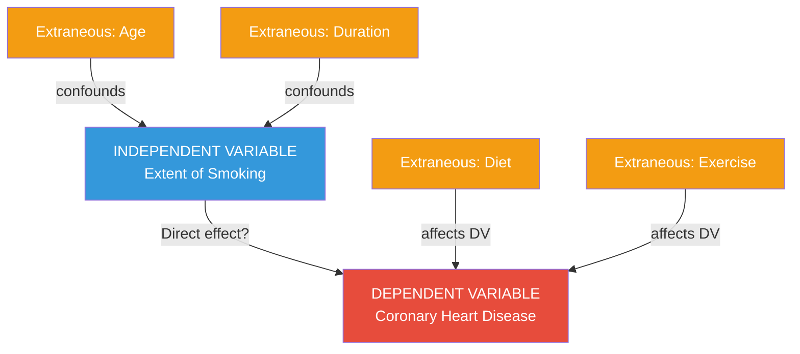
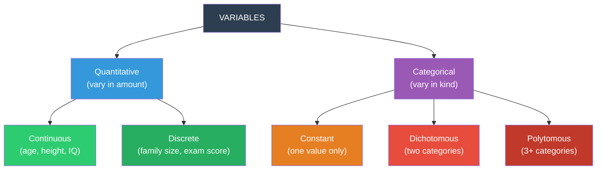

# Extraneous, Confounded, Active, Attribute, Quantitative & Categorical Variables

## Introduction

Once a researcher identifies their independent and dependent variables, a new challenge emerges: the real world is messy. Experiments don't happen in vacuums. Participants bring their personalities, histories, and biology into the lab. Environmental conditions fluctuate. The sequence of events creates unintended effects. All of these complications are captured in the concept of **extraneous variables** — and when they get tangled with the independent variable, they become the even more dangerous **confounded variables**.

This section explores the full taxonomy of psychological variables, from those that threaten the integrity of research (extraneous and confounded) to those that describe the nature of measurement (quantitative and categorical, continuous and discrete).

---

**Source PDFs**:
- 📄 [Block-1/Unit-3.pdf - Pages 38-41](/pdfs/MPC-005%20Research%20Methods/Block-1/Unit-3.pdf)
- 📚 MPC-005 Research Methods in Psychology, IGNOU

---

## 3.3.3 Extraneous and Confounded Variables

### Extraneous Variables

**Extraneous variables** are any and all variables that may *mask* or *distort* the relationship between the independent variable and the dependent variable. They are not the variables of interest, but they can influence the DV if not controlled.

Think of extraneous variables as **unwanted noise** in a measurement system. Just as background noise can interfere with hearing a specific musical note clearly, extraneous variables interfere with detecting the true relationship between IV and DV.

#### Three Major Types of Extraneous Variables

| Type | What It Includes | Examples |
|------|-----------------|---------|
| **Organismic Variables** | Participant characteristics | Age, sex, IQ, personality traits, anxiety level |
| **Situational Variables** | Environmental & task-related factors | Noise level, room temperature, lighting, experimental instructions |
| **Sequential Variables** | Effects arising from order of conditions | Practice effects, fatigue, habituation, carryover effects |

Sequential variables are especially tricky in **within-subjects designs** (where the same participant experiences multiple experimental conditions). Exposure to multiple conditions may result in:
- **Adaptation**: Participants get used to the stimulus
- **Fatigue**: Performance degrades over time
- **Practice effects**: Performance improves simply due to repetition, regardless of the IV

#### The Classic Example: Smoking and Coronary Heart Disease

The IGNOU textbook uses this powerful real-world example to illustrate extraneous variables:

**Research Question**: Does smoking cause coronary heart disease?

| Variable Type | Specific Variable |
|---------------|-----------------|
| **Independent Variable** | Extent of smoking |
| **Dependent Variable** | Presence/severity of coronary heart disease |
| **Extraneous Variables** | Number of cigarettes/day; duration of smoking; age of the smoker; dietary habits; amount of exercise |

All those extraneous variables can either increase or decrease the magnitude of the smoking → CHD relationship. A sedentary heavy smoker with a poor diet has multiple risk factors operating simultaneously — and if we don't account for exercise and diet, we can't cleanly isolate smoking's effect.

### Confounded Variables

**Confounding** occurs when an extraneous variable *varies systematically with the independent variable*, making it impossible to separate the effect of the IV from the effect of the extraneous variable.

The key word is **systematic**. Random variation in extraneous variables is less problematic (it adds noise but not bias). Systematic variation creates **bias** — a consistent distortion in your findings.

#### Classic Confounding Example: Television Violence Research

Suppose a researcher studies the effect of violent television viewing on perception of violence, and:
- **Experimental group**: consists only of **adolescents**
- **Control group**: consists only of **adults**

Now age is **confounded** with the IV (violent TV viewing). Any differences in violence perception between groups could be due to:
1. Television violence (the intended IV), OR
2. Age differences between the groups (the confound)

We cannot separate these two explanations. This makes the study's conclusions fundamentally untrustworthy.

#### Confounding in Indian Research Contexts

Indian researchers studying outcomes across states or demographic groups must be especially vigilant about confounding. For example:
- A study comparing literacy rates across Indian states that also vary in per-capita income must control for economic development — otherwise economic status is confounded with geographic region
- Research on stress differences between urban and rural students in India may confound urbanisation with socioeconomic status, access to resources, and family structure simultaneously

#### How to Deal With Extraneous Variables

| Strategy | Description | Example |
|----------|-------------|---------|
| **Randomisation** | Randomly assign participants to conditions | Ensures extraneous variables distribute evenly across conditions |
| **Matching** | Match participants on key extraneous variables | Match experimental and control groups on age, IQ, SES |
| **Holding constant** | Keep extraneous variable fixed across all conditions | Test all participants at the same time of day, in the same room |
| **Statistical control** | Use ANCOVA or regression to remove extraneous effects | Statistically remove the effect of IQ from the IV-DV relationship |
| **Counterbalancing** | Systematically vary the order of conditions | Reduces sequential effects in within-subjects designs |

---

## 3.3.4 Active and Attribute Variables

A second important classification cuts across the IV/DV distinction to describe **how variables enter the research design**:

### Active Variables

**Active variables are manipulated** — the researcher directly controls their values by intervening in the experimental situation.

Examples of active variables:
- **Reward and punishment** (operant conditioning studies)
- **Methods of teaching** (comparative education research)
- **Creating anxiety through instructions** (stress induction paradigms)
- **Drug dosage** (pharmacological research)
- **Feedback type** (positive vs. negative vs. no feedback)

Active variables are characteristic of true experiments, where the researcher's manipulation is the IV. They support the strongest causal inferences.

### Attribute Variables

**Attribute variables are measured, not manipulated** — they are pre-existing characteristics of participants that the researcher observes and records.

The word "attribute" is linguistically accurate: it refers to inherent properties *attributed* to an organism, institution, or group. Attribute variables include:
- **Intelligence (IQ)**
- **Aptitudes** (spatial, verbal, numerical)
- **Sex / Gender**
- **Socioeconomic status (SES)**
- **Field dependence/independence**
- **Need for achievement (nAch)**
- **Political affiliation**
- **Religious belief**

Crucially, attribute variables can also be IVs in quasi-experimental or correlational designs — but since they are not manipulated, they are Type S independent variables (using D'Amato's classification from Unit 3.3.2).

#### Active vs. Attribute: Quick Comparison

| Feature | Active Variable | Attribute Variable |
|---------|----------------|-------------------|
| Researcher control | High (directly manipulated) | Low (only observed) |
| Assignment to levels | Random possible | Selection-based only |
| Causal inference | Stronger | Weaker (correlational) |
| Examples | Noise level, reward type | IQ, personality, age |
| IV type | Type E | Type S |

---

## 3.3.5 Quantitative and Categorical Variables

Variables can also be classified by the **nature of the values they take**:

### Quantitative Variables

**Quantitative variables vary in *amount*** — they can be ordered along a numerical continuum, and differences between values are meaningful.

Examples:
- Speed of response (milliseconds)
- Intensity of sound (decibels)
- Level of illumination (lux)
- Intelligence test scores
- Blood pressure (mmHg)
- Number of words recalled

Quantitative variables allow **precise mathematical operations**: you can calculate means, standard deviations, and run parametric statistical tests (t-tests, ANOVA, regression).

### Categorical Variables

**Categorical variables vary in *kind*** — they divide participants into discrete groups or categories that differ qualitatively, not quantitatively.

Examples:
- Gender (male / female / non-binary)
- Race / Ethnicity
- Religion (Hindu / Muslim / Christian / Sikh / Buddhist / Jain etc.)
- Political affiliation (BJP / Congress / AAP / Regional parties)
- Diagnosis (depressed / anxious / non-clinical)

Categorical variables have three subtypes:

| Subtype | Description | Example |
|---------|-------------|---------|
| **Constant** | Can take only one value — not truly a variable! | All participants are "university students" |
| **Dichotomous** | Exactly two categories | Yes/No; Pass/Fail; Employed/Unemployed |
| **Polytomous** | Three or more categories | Religion; political parties; Likert scale items |

### The Measurement Scale Connection

The quantitative/categorical distinction maps onto Stevens's levels of measurement:

| Categorical → | Nominal scale (categories with no order) |
| Categorical (ordered) → | Ordinal scale (categories with order, but no equal intervals) |
| Quantitative → | Interval or Ratio scale (equal intervals, with or without absolute zero) |

Understanding this connection is crucial for **choosing appropriate statistical tests** — a skill heavily tested in MPC-006 Statistics.

---

## 3.3.6 Continuous vs. Discrete Variables (within Quantitative)

Quantitative variables divide further into **continuous** and **discrete** types:

### Continuous Variables

A **continuous variable** can be measured with **arbitrary precision** — there is always a possible value between any two values. The measurement is limited only by the precision of your instrument.

Examples of continuous variables:
- **Age**: Can be measured in years, months, days, hours, seconds
- **Height**: Measurable to millimetres (or micrometres with precise instruments)
- **Intelligence**: Theoretically exists on a continuum, even if we round test scores
- **Reaction time**: Measurable to milliseconds or microseconds
- **Blood pressure**: Measured continuously with a sphygmomanometer

### Discrete Variables

A **discrete variable** has **clear gaps** between possible values — it cannot take intermediate values. You can count discrete variable values, but you cannot meaningfully interpolate between them.

Examples of discrete variables:
- **Number of family members**: You can have 3 or 4 members, but not 3.5
- **Number of books in a library**: A whole number count
- **Number of correct answers on an exam**: Integer values only
- **Bar presses in a Skinner box**: Each press is a distinct event

#### The Activity from IGNOU (with Answers)

| Variable | Continuous (C) | Discrete (D) |
|---------|---------------|-------------|
| Bar presses a rat makes in Skinner box | | D — each press is a distinct event |
| Height of six-year-old children | C — measured in cm to decimal places | |
| Score on a true-false exam | | D — integer scores only |
| Distance travelled in 5 hours | C — measurable to any precision | |

---

## 🧠 Memory Aid: VCAT-Q

To remember all variable types, use **VCAT-Q**:

**V**ariables are classified by:
- **C**ausation role → IV (cause), DV (effect)
- **A**gency → Active (manipulated) vs. Attribute (measured)
- **T**ype of value → Quantitative (amount) vs. Categorical (kind)
- **Q**uantitative subtype → Continuous (any value) vs. Discrete (whole numbers)

Plus: **E**xtraneous (unwanted) and **C**onfounded (systematically mixed with IV) = the threats to avoid!

---

## 📚 External Resources

### Essential Reading
1. **Campbell, D.T. & Stanley, J.C. (1966/reprinted 2015)** — *Experimental and Quasi-Experimental Designs* — The foundational text on controlling extraneous variables
2. **Shadish, W.R., Cook, T.D. & Campbell, D.T. (2002)** — *Experimental and Quasi-Experimental Designs for Generalized Causal Inference* — Updated treatment of confounding
3. **Creswell, J.W. & Creswell, J.D. (2022)** — *Research Design: Qualitative, Quantitative, and Mixed Methods Approaches* (6th ed.) — Contemporary chapter on variable identification

### Wikipedia Articles
- 🌐 [Confounding](https://en.wikipedia.org/wiki/Confounding) — Excellent diagrams showing how confounding works statistically
- 🌐 [Levels of Measurement](https://en.wikipedia.org/wiki/Level_of_measurement) — Stevens's classification connecting to variable types

### Educational Videos
- 🎥 [**Confounding Variables — Crash Course Statistics**](https://www.youtube.com/watch?v=JoHMQVEDfGk) — Clear animated explanations of confounding (≈10 min)
- 🎥 [**Types of Variables in Research — Practical Psychology**](https://www.youtube.com/watch?v=HINPbpHr8es) — Visual classification of all variable types (≈7 min)

### Recent Research
- 📑 VanderWeele, T.J. (2019). Principles of confounder selection. *European Journal of Epidemiology, 34*(3), 211-219 — Modern statistical perspective on confounder identification
- 📑 Wysocki, A.C. et al. (2022). Statistical control requires causal justification. *Advances in Methods and Practices in Psychological Science, 5*(2) — Critical reading on when statistical control of extraneous variables is appropriate
- 📑 Cinelli, C. & Hazlett, C. (2020). Making sense of sensitivity. *Journal of the Royal Statistical Society, 82*(1), 39-67 — Tools for evaluating the impact of unmeasured confounders

---

## ✅ Self-Assessment Questions

**Q1 (Definition):** Distinguish between extraneous variables and confounded variables. Why is confounding more damaging to a study's conclusions than mere extraneous variation?

**Q2 (Application):** A researcher studying the effect of yoga on depression in Indian women uses a convenience sample of urban housewives for the experimental group and working women for the control group. Identify: (a) the IV and DV; (b) at least three extraneous variables; (c) the specific confound this design creates.

**Q3 (Classification):** Classify each of the following as active or attribute variables:
- (a) Number of hours of sleep before a test
- (b) Gender of participants  
- (c) Type of feedback given (positive/negative/none)
- (d) Socioeconomic status

**Q4 (Measurement):** For each variable, identify whether it is quantitative or categorical, and if quantitative, whether it is continuous or discrete:
- (a) Number of siblings
- (b) Reaction time in milliseconds
- (c) Religious affiliation
- (d) Depression score on PHQ-9
- (e) Number of correct answers on a 50-item test

**Q5 (Design):** Describe two different strategies a researcher could use to control for participant IQ when studying the effect of sleep deprivation on problem-solving performance. Explain the advantages and limitations of each.

💡 Answer Guide

**Q1:** Extraneous variables are any variables outside the IV-DV relationship that might influence the DV. They become confounded when they vary *systematically* with the IV, making it impossible to attribute observed DV changes to the IV alone. Confounding is more damaging because it introduces *systematic bias* — not just random noise — that consistently distorts the IV-DV relationship in one direction, rendering causal conclusions invalid.

**Q2:** (a) IV: Yoga practice (yes/no); DV: Depression levels. (b) Extraneous variables: employment status, social support networks, financial stress, physical activity level, diet and nutrition, childcare responsibilities. (c) Specific confound: Urban vs. working status is confounded with the yoga IV — any differences in depression between groups could be due to yoga OR the fact that urban housewives and working women have systematically different lifestyles, stress levels, and social support.

**Q3:** (a) Active — the researcher could manipulate sleep hours; (b) Attribute — researchers don't change participants' gender; (c) Active — the type of feedback is directly controlled; (d) Attribute — pre-existing participant characteristic.

**Q4:** (a) Discrete quantitative (whole numbers); (b) Continuous quantitative (measurable to any precision); (c) Categorical (polytomous); (d) Continuous quantitative (theoretically, though scores are discrete approximations); (e) Discrete quantitative.

**Q5:** Strategy 1 — **Matching**: Select participants and match them on IQ across experimental and control conditions. Advantage: directly controls IQ variation. Limitation: time-consuming, may restrict sample size. Strategy 2 — **Statistical Control (ANCOVA)**: Measure IQ for all participants and use it as a covariate in analysis. Advantage: no need to restrict sample, can handle continuous IQ scores. Limitation: requires assumptions about linearity and doesn't guarantee causal control.

---

## 🔗 Related Topics

- [Variables: Meaning, S-O-R Model & IV/DV](/mpc-005/block-1/variables-meaning-types-sor) — Foundation for this material
- [Constructs: Intervening Variables & Hypothetical Constructs](/mpc-005/block-1/constructs-intervening-hypothetical) — Moving from variables to theoretical concepts
- [Validity: Types and Threats](/mpc-005/block-1/validity-types-threats) — Confounding directly threatens internal validity
- [Research Process: Steps](/mpc-005/block-1/research-process-steps) — Where variable identification fits in the research pipeline
