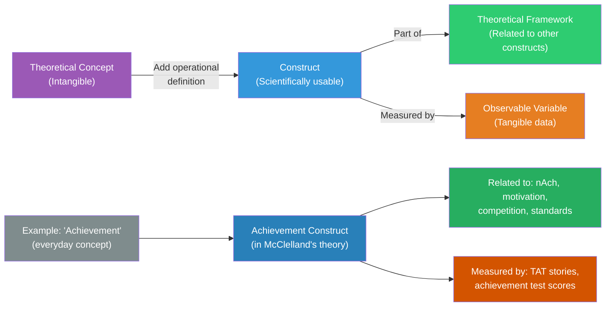
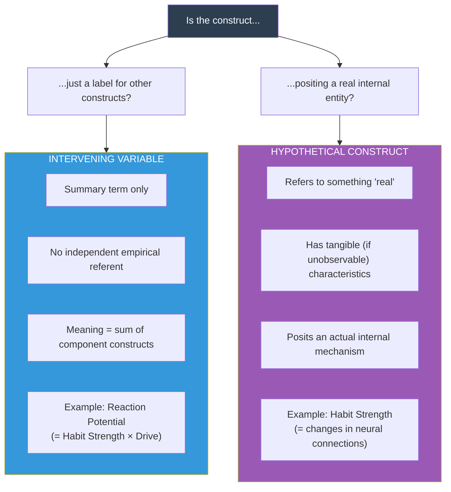

# Constructs in Psychology: Concepts, Intervening Variables & Hypothetical Constructs

## Introduction

Psychology occupies a peculiar scientific position: it studies entities that cannot be directly observed. We cannot *see* motivation, *touch* intelligence, or *weigh* anxiety. Yet these invisible entities are central to understanding why people behave as they do. How does science deal with the unobservable?

The answer lies in the concept of a **construct** — a theoretical entity carefully defined and operationalised to allow systematic scientific investigation. Understanding constructs, and the critical distinction between **intervening variables** and **hypothetical constructs** (articulated by MacCorquodale & Meehl in their landmark 1948 paper), is essential for advanced psychological research literacy.

This section bridges the tangible world of variables and the abstract world of psychological theory, showing how researchers systematically move between observation and explanation.

---

**Source PDFs**:
- 📄 [Block-1/Unit-3.pdf - Pages 41-44](/pdfs/MPC-005%20Research%20Methods/Block-1/Unit-3.pdf)
- 📚 MPC-005 Research Methods in Psychology, IGNOU

---

## 3.4 Constructs: From Concepts to Scientific Tools

### Concepts vs. Constructs

The terms **concept** and **construct** are related but distinct:

**A concept** is defined as:
- "Any describable regularity of real or imagined events or objects" (Bourne, Ekstrand & Dominowski, 1971)
- "A set of features connected by some rule" (Hulse, Egeth & Deese, 1980)

Concepts are the **building blocks of thinking** — they allow us to organise knowledge systematically. The concept "bird" organises our knowledge of feathered, winged, egg-laying vertebrates. The concept "achievement" organises our observations of behaviours associated with mastery of tasks.

**A construct** is a concept with an added dimension: it is **invented or adopted for a specific scientific purpose**. Constructs are concepts that have been:
1. Explicitly defined within a theoretical framework
2. Related systematically to other constructs
3. Operationalised so they can be observed and measured

### The "Intelligence" Example

The IGNOU textbook uses "intelligence" to illuminate this distinction beautifully:

| Aspect | As Concept | As Scientific Construct |
|--------|-----------|------------------------|
| **What it is** | An everyday abstraction about mental ability | A formal theoretical entity with defined relationships to other constructs |
| **How used** | Loosely, in everyday language | Precisely, within psychometric theory |
| **Measurable?** | Not specifically | Yes — via IQ tests like Wechsler, Stanford-Binet |
| **Related to other constructs?** | Vaguely | Explicitly (related to school achievement, working memory, g-factor, creativity) |
| **Scope** | Broad, commonsense | Narrower but more precise than the everyday concept |

Intelligence as a construct connects to:
- School achievement (intelligence → academic performance)
- Motivation (intelligence × motivation → achievement)
- Working memory (WM capacity predicts fluid intelligence)
- Creativity (complex, debated relationship)

### Two Characteristics of All Constructs

1. **Theoretical embeddedness**: The construct is part of a theoretical framework and is related in specified ways to other constructs
2. **Operational definition**: The construct is defined precisely enough to allow its observation and measurement

#### Example: Reinforcement as a Construct

*Reinforcement* is one of the most powerful constructs in psychology:

- **Theoretical level**: Related to constructs like drive, motivation, association, habit strength — core elements of Hull's learning theory and Skinner's operant conditioning framework
- **Operational definition**: Any stimulus or event which increases the probability of occurrence of a (desired) response

Without the operational definition, reinforcement remains a fuzzy concept. With it, researchers can measure reinforcement schedules, manipulate them experimentally, and test precise predictions.

---

## 3.5 Types of Constructs: The MacCorquodale-Meehl Distinction

The foundational typology of psychological constructs was proposed by **MacCorquodale and Meehl (1948)** in their influential paper in *Psychological Review*. They identified two fundamentally different types of constructs based on their relationship to observable reality:

1. **Intervening Variables**
2. **Hypothetical Constructs**

This distinction is conceptually demanding but critically important for understanding how psychological theories are built and tested.

---

## 3.5.1 Intervening Variables

### Definition

An **intervening variable** is a construct that functions as a **summary or shorthand term** for a group of other constructs. Crucially, it has **no independent empirical meaning** — its meaning is entirely derived from the constructs it summarises.

Think of an intervening variable as a mathematical symbol that stands for a combination of other terms. It simplifies theoretical language without adding new empirical content.

### Clark Hull's Reaction Potential

The textbook's primary example comes from Clark Hull's behaviourist learning theory:

**Hull's formula**: Reaction Potential (sEr) = Habit Strength (sHr) × Drive (D)

- **Habit Strength (sHr)**: Defined as the number of reinforced practice trials — directly measurable
- **Drive (D)**: Measured physiologically (hours of food deprivation, etc.) — directly measurable
- **Reaction Potential (sEr)**: The probability/vigor of a learned response

**Reaction Potential is an intervening variable** because:
- It is entirely defined as the combination of Habit Strength and Drive
- It has no meaning outside this relationship
- You cannot measure Reaction Potential directly — you measure sHr and D, then calculate sEr

### Additional Example: Hostility

*Hostility* is cited as another intervening variable — it is inferred from hostile and aggressive acts. Hostility has no direct observable referent of its own; it exists as a summary label for patterns of observed behaviour.

### The Knowledge Example (K = AC × IQ)

The IGNOU textbook provides this elegant example:

**K = AC × IQ**

Where:
- K = Knowledge
- AC = Amount of Conditioning (number of reinforced trials)
- IQ = Score on standard intelligence test

In this equation:
- **AC** = Hypothetical Construct (directly measured by counting trials)
- **IQ** = Hypothetical Construct (directly measured by test score)
- **K** = Intervening Variable (if defined as a *function of* AC and IQ — it has no independent meaning)

**BUT**: If K is defined as "number of correct solutions on a knowledge test," then K becomes a **hypothetical construct** — because it now has a direct empirical referent.

---

## 3.5.2 Hypothetical Constructs

### Definition

A **hypothetical construct** is a theoretical term employed to describe something "real" — that is, it refers to an actual (if unobservable) entity or process that has **tangible characteristics**. It goes beyond merely summarising other constructs; it is an *intermediary* that is presumed to actually exist.

Hypothetical constructs are the "real things" that mediate between stimulus and response — the internal mechanisms, neural processes, and psychological structures that actually cause behaviour.

### The Reflex Example

The IGNOU textbook uses the "reflex" brilliantly:

- **Patellar reflex (knee-jerk)**: When the patellar tendon is struck, the lower leg extends — this is observable
- **"Reflex"** refers to the chain of neurological events *within* the organism between stimulus and response — the afferent signal, interneuron activation, efferent motor command
- This internal chain is **real** (it actually happens in the nervous system) but **not directly observable** without invasive measurement
- Therefore, "reflex" is a **hypothetical construct** — it posits a real internal mechanism

### Classic Psychological Hypothetical Constructs

| Construct | Theoretical Domain | What It Posits |
|-----------|------------------|----------------|
| **Habit Strength (sHr)** | Hull's learning theory | Real change in neural pathways from reinforced practice |
| **Short-term memory** | Cognitive psychology | A functionally distinct memory system with limited capacity |
| **Ego** | Psychoanalytic theory | A real (if unobservable) structural component of psyche |
| **Schema** | Cognitive psychology | Organised mental structures that guide information processing |
| **Attachment** | Developmental psychology | Real internal working models formed in early relationships |
| **g-factor** | Intelligence theory | A general cognitive ability underlying performance on all tasks |

### Hypothetical Constructs in Indian Psychology Research

Indian psychology researchers have engaged with several significant constructs:

- **Collective efficacy** — studied by researchers at JNU and Delhi University in relation to community health behaviours
- **Familism** (family collectivism) — a construct used to understand decision-making patterns in Indian families, particularly relevant for ICSSR-funded studies
- **Jugaad mindset** — emerging as a construct in Indian organisational psychology to describe frugal innovation thinking
- **Dharmic orientation** — proposed as a culturally-rooted construct for understanding moral reasoning in Indian populations (distinct from Western moral constructs)

---

## Comparing Intervening Variables and Hypothetical Constructs

| Feature | Intervening Variable | Hypothetical Construct |
|---------|---------------------|----------------------|
| **Reality status** | No claim to real existence | Posits real internal entity |
| **Empirical content** | Derived entirely from component constructs | Has independent empirical referent |
| **Measurability** | Indirectly only (via components) | Can be defined by direct operations |
| **Examples** | Reaction Potential, K (as function only) | Habit Strength, Reflex, STM |
| **Primary theorist** | Tolman (early use) | Hull, Freud, Piaget |
| **IGNOU Mnemonic** | "IV = I Value only my components" | "HC = Has Characteristics (real ones)" |

---

## Why This Distinction Matters

The intervening variable vs. hypothetical construct distinction has significant consequences:

**For theory building**: Hypothetical constructs make bold empirical claims — they say "there is a real thing here." This makes theories more vulnerable to disconfirmation (a good thing in science!) but also potentially more powerful explanations.

**For operationalisation**: Intervening variables are operationalised *indirectly* (measure the components). Hypothetical constructs must be operationalised *directly* (develop a measure of the construct itself).

**For reductionism**: Hypothetical constructs can, in principle, be *reduced* to lower-level descriptions (e.g., psychological constructs reduced to neurological processes). Intervening variables cannot — they are purely theoretical conveniences.

**For falsifiability**: Theories using hypothetical constructs are generally more falsifiable (a Popperian virtue) than those using only intervening variables.

---

## 🧠 Memory Aid: The "IV Has No Soul; HC Has a Body" Analogy

**Intervening Variable**: Like a *budget category label* in accounting — it's a useful summary of line items but has no independent existence. Remove the line items and the label means nothing.

**Hypothetical Construct**: Like a *virus* before microscopes were invented — we knew it existed because of its effects (fever, coughing), and we posited a real entity (the virus) with its own characteristics. The entity was real even when we couldn't see it.

Or more simply:
- **IV** = Mathematical shorthand (K = AC × IQ)
- **HC** = Theoretical entity (habit strength = real change in the nervous system)

---

## 📚 External Resources

### Landmark Paper
1. **MacCorquodale, K. & Meehl, P.E. (1948)** — "On a distinction between hypothetical constructs and intervening variables." *Psychological Review, 55*(2), 95-107 — The original paper; foundational reading for this unit
2. **Cronbach, L.J. & Meehl, P.E. (1955)** — "Construct validity in psychological tests." *Psychological Bulletin, 52*(4), 281-302 — The follow-up classic on measuring hypothetical constructs

### Wikipedia Articles
- 🌐 [Intervening Variable](https://en.wikipedia.org/wiki/Intervening_variable) — Clear explanation with additional examples from learning theory
- 🌐 [Hypothetical Construct](https://en.wikipedia.org/wiki/Hypothetical_construct) — Historical development and contemporary uses
- 🌐 [Construct Validity](https://en.wikipedia.org/wiki/Construct_validity) — How hypothetical constructs are validated scientifically

### Educational Videos
- 🎥 [**Operationalizing Variables in Psychology — Simply Psychology**](https://www.youtube.com/watch?v=FvChR9TGZJQ) — Understanding how constructs become variables (≈9 min)
- 🎥 [**Latent Variables and Structural Equation Modeling — StatQuest**](https://www.youtube.com/watch?v=Jk4KO8JEXaM) — Modern statistical treatment of hypothetical constructs (≈15 min)

### Recent Research
- 📑 Borsboom, D., Mellenbergh, G.J., & van Heerden, J. (2003). The theoretical status of latent variables. *Psychological Review, 110*(2), 203-219 — Contemporary philosophical analysis of hypothetical constructs
- 📑 Fried, E.I. & Robinaugh, D.J. (2020). Systems all the way down. *PeerJ, 8*, e9686 — Network approach challenging traditional hypothetical construct models
- 📑 Haig, B.D. (2023). Construct validity: The diagnostic and theoretical status of psychological constructs. *Theory & Psychology, 33*(1), 3-21 — Contemporary assessment of where construct theory stands today

---

## ✅ Self-Assessment Questions

**Q1 (Classification):** The IGNOU textbook provides these examples. Classify each as Intervening Variable (IV) or Hypothetical Construct (HC):
- (a) Thinking is the mental activity leading to problem solving
- (b) Arousal is the increase in neural activity in the lower brain stem following stimulation
- (c) A reinforcement is something that makes you want to repeat the rewarded behaviour
- (d) The id is the deepest part of the psyche and motivates our "base" desires

**Q2 (Conceptual):** What are the two defining characteristics that distinguish a construct from a mere concept? Why are both characteristics necessary?

**Q3 (Analysis):** Hull's equation: Effective Reaction Potential (sEr) = Habit Strength (sHr) × Drive (D) × Incentive (K). In this expanded formula, classify sEr, sHr, D, and K as intervening variables or hypothetical constructs. Justify each classification.

**Q4 (Application):** Consider the construct "academic burnout" as studied in Indian students preparing for competitive exams. (a) Identify two other constructs it would be theoretically related to; (b) Propose an operational definition that makes it measurable; (c) Classify it as an intervening variable or hypothetical construct and justify your answer.

**Q5 (Synthesis):** Explain why Freud's concepts (id, ego, superego) are typically classified as hypothetical constructs rather than intervening variables. What implication does this classification have for the falsifiability of psychoanalytic theory?

💡 Answer Guide

**Q1:**
- (a) *Thinking → problem solving* — **Intervening Variable**: Thinking here merely summarises the relationship between stimulation and solution; it has no independent tangible characteristics specified
- (b) *Arousal → neural activity* — **Hypothetical Construct**: It specifies a real neural mechanism (activity in the lower brain stem) with tangible physiological characteristics
- (c) *Reinforcement → repeat behaviour* — **Intervening Variable**: Defined purely in terms of its functional effect (increases probability of response); no independent existence claimed
- (d) *Id → base desires* — **Hypothetical Construct**: Freud posited the id as a real structural entity in the psyche with specific characteristics (operates on pleasure principle, primary process thinking)

**Q2:** (1) Theoretical embeddedness — the construct must be part of a network of theoretical relationships with other constructs; and (2) Operational definition — the construct must be precisely defined to allow observation and measurement. Both are necessary: embeddedness without operationalisation gives us untestable speculation; operationalisation without theoretical embeddedness gives us an isolated measure with no explanatory power.

**Q3:** sHr (Habit Strength) = Hypothetical Construct — posits real changes in neural pathways from reinforced practice; D (Drive) = Hypothetical Construct — posits real physiological states (e.g., blood glucose, hormonal states); K (Incentive) = Hypothetical Construct — posits a real cognitive representation of reward value; sEr (Effective Reaction Potential) = Intervening Variable — entirely defined as the product of the other three; has no independent empirical referent.

**Q4:** (a) Academic burnout theoretically relates to: perceived stress, self-efficacy (low), study engagement, social support, and exam anxiety. (b) Operational definition: Score ≥ X on the Maslach Burnout Inventory — Student Survey (MBI-SS), covering emotional exhaustion, cynicism, and reduced academic efficacy subscales. (c) Hypothetical Construct — because burnout is posited as a real psychological state with neurobiological correlates (elevated cortisol, altered autonomic function, hippocampal changes) and characteristic symptom patterns; it has empirical referents beyond simply summarising other variables.

**Q5:** Id, ego, and superego are hypothetical constructs because Freud claimed they are real structural components of the psyche — the id *actually* operates on the pleasure principle, the ego *actually* mediates reality testing. This claim to reality makes psychoanalytic theory potentially falsifiable (if the id doesn't exist, Freudian predictions should fail). However, because these constructs were operationalised poorly in the original theory — often in circular ways — many Freudian predictions proved difficult to test rigorously, which is the primary basis of Popper's criticism that psychoanalysis was not scientific. The classification as hypothetical constructs thus reveals both the ambition and the vulnerability of the theory.

---

## 🔗 Related Topics

- [Variables: Meaning, S-O-R Model & IV/DV](/mpc-005/block-1/variables-meaning-types-sor) — The observable side of the variable-construct continuum
- [Extraneous & Other Variable Types](/mpc-005/block-1/extraneous-confounded-active-attribute-variables) — How variable classification informs research control
- [Reliability: Concepts and Methods](/mpc-005/block-1/reliability-concepts-methods) — Measuring constructs reliably is a central challenge in research
- [Validity: Types and Threats](/mpc-005/block-1/validity-types-threats) — Construct validity: are we really measuring what we claim?
- [Definition and Meaning of Research](/mpc-005/block-1/definition-meaning-research) — How constructs figure in the broader research enterprise
