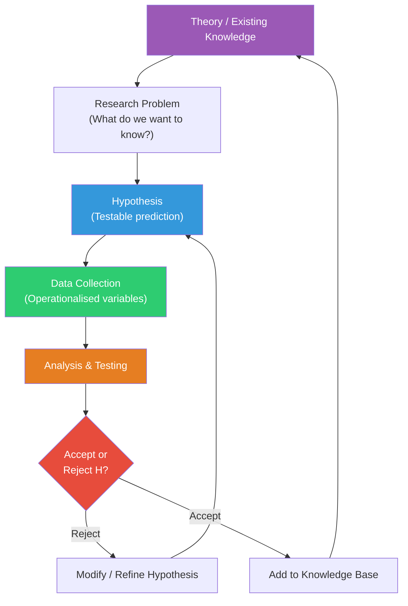
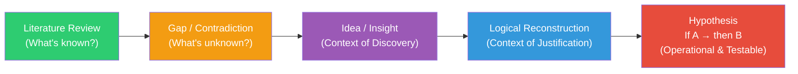

# Hypothesis in Psychology: Meaning, Characteristics & Formulation

## Introduction

If variables are the building blocks of research, the **hypothesis** is the architectural blueprint. It tells us which variables to study, what relationship to expect between them, and how to interpret the data we collect. Without a hypothesis, research is — as Goode and Hatt famously warned — "unfocussed, a random empirical wandering" where results cannot be studied as facts with clear meaning.

Every scientific discovery, from Pavlov's conditioning experiments to modern cognitive neuroscience studies, began with a hypothesis — a testable prediction about the world. This section explores what hypotheses are, what makes a good one, how to construct one, and what pitfalls to avoid.

---

**Source PDFs**:
- 📄 [Block-1/Unit-4.pdf - Pages 46-52](/pdfs/MPC-005%20Research%20Methods/Block-1/Unit-4.pdf)
- 📚 MPC-005 Research Methods in Psychology, IGNOU

---

## 4.2 Meaning and Characteristics of Hypothesis

### What Is a Hypothesis?

A **hypothesis** is a **tentative and testable statement** of a possible relationship between two or more variables under investigation. The key words here deserve careful attention:

- **Tentative**: A hypothesis is a *guess* — an educated, theory-informed guess, but a guess nonetheless. It has not yet been proven.
- **Testable**: The hypothesis must be structured such that it can, in principle, be confirmed or refuted through empirical data.
- **Statement of relationship**: It proposes a specific connection between variables — not merely describes them.

Several prominent researchers have formally defined hypotheses:

| Scholar | Definition |
|---------|-----------|
| **McGuigan (1990)** | "A testable statement of a potential relationship between two or more variables, i.e. advance as potential solution to the problem" |
| **Kerlinger (1973)** | "A conjectural statement of the relation between two or more variables" |
| **Russell & Reichenbach (1947)** | A hypothesis can be stated in logical if-then form: *If A is true, then B should follow* |

The **if-then format** is particularly useful because it makes the logical structure explicit. For example:
- *If verbal ability is responsible for childhood amnesia, then children should be unable to recall events for which they lacked the verbal labels at the time.*

This structure immediately tells us what to measure (verbal ability, recall of pre-verbal events) and what relationship to expect (inverse — more verbal ability, less amnesia).

### Hypotheses as Bridges

Hypotheses serve as bridges between **theory** and **empirical investigation**. A theory makes abstract claims; a hypothesis translates those claims into specific, measurable predictions. Consider:

- **Theory**: Social learning theory predicts that aggressive behaviour is learned through observation
- **Hypothesis**: Children who watch 3 hours of violent television daily will show significantly higher rates of playground aggression than those who watch non-violent content (as measured by the Aggression Observation Scale over 2 weeks)

The hypothesis operationalises the theory — converting "aggressive behaviour" and "observation" into measurable variables with specified conditions.

---

## 4.2 (continued) Characteristics of a Good Hypothesis

Not all hypotheses are equally useful. A **good research hypothesis** must meet several criteria. The IGNOU textbook identifies six essential characteristics:

### 1. Conceptually Clear
The hypothesis must use terms and concepts that are clearly defined and understood. Ambiguous concepts lead to ambiguous findings. For example, "happiness" is too vague — a hypothesis about "self-reported life satisfaction as measured by the Satisfaction With Life Scale (SWLS)" is conceptually clear.

### 2. Testable (Empirically Verifiable)
This is the sine qua non of scientific hypotheses. A hypothesis that cannot, even in principle, be tested is not a scientific hypothesis — it is a philosophical or metaphysical claim. Karl Popper's criterion of **falsifiability** is relevant here: a good hypothesis must be capable of being proven wrong.

**Not testable**: "People with good souls are more helpful" (soul cannot be measured)
**Testable**: "Individuals who score high on agreeableness (Big Five) will volunteer more frequently in community service programs"

### 3. Related to Existing Theory
Good hypotheses don't emerge from thin air. They are grounded in **prior research findings, established theories, and systematic observation**. This embeddedness ensures cumulative knowledge-building — each study contributes to a larger theoretical structure.

### 4. Logical Unity and Comprehensiveness
A hypothesis must be internally coherent and logically consistent. It should not contradict itself or create logical paradoxes. When a study has multiple hypotheses, they should form a logically unified system — not a random collection of unrelated predictions.

### 5. Capable of Verification
Related to testability, this criterion emphasises that the hypothesis must be verifiable using available methods and instruments. A hypothesis about processes that are currently unmeasurable (e.g., specific neural micro-circuits in vivo) may be valid in principle but not yet verifiable in practice.

### 6. Operationalisable
The constructs in the hypothesis must be translatable into measurable variables. This connects directly to operational definitions. A hypothesis about "academic motivation" must specify how motivation will be measured (e.g., Academic Motivation Scale scores, time-on-task measurements, goal-setting behaviour).

### Summary Table: Characteristics of a Good Hypothesis

| Characteristic | What It Requires | Example of Violation |
|----------------|-----------------|---------------------|
| Conceptually clear | Unambiguous terms | "Success affects wellbeing" (both vague) |
| Testable | Empirically verifiable prediction | "Evil people are less happy" |
| Theory-grounded | Based on prior research | Hypothesis with no literature support |
| Logically unified | Internal coherence | Contradictory sub-hypotheses |
| Verifiable | Measurable with available methods | Requires currently impossible measurements |
| Operationalisable | Convertible to measured variables | Abstract constructs with no operational definition |

---

## 4.3 Formulation of Hypothesis

### The Scientific Process of Hypothesis Formulation

The IGNOU textbook articulates the sequence clearly:
1. **Observation** → noticing a pattern or phenomenon
2. **Hypothesis formulation** → creating a testable prediction
3. **Hypothesis testing** → collecting data and applying statistical tests
4. **Accept or Reject** → if accepted, replicate; if rejected, refine and retest

This cyclical process is the engine of scientific progress. It is important to note that **rejection of a hypothesis is not failure** — it eliminates possibilities and refines understanding, which is itself a contribution to knowledge.

### Reichenbach's Discovery-Justification Distinction

**Hans Reichenbach (1938)** made an influential distinction that helps understand how hypotheses are actually formed:

| Context | What It Describes |
|---------|-----------------|
| **Context of Discovery** | The informal, creative, sometimes serendipitous process of *getting* an idea for a hypothesis — walking in the park, noticing an anomaly, reading a paper |
| **Context of Justification** | The formal, logical, systematic process of *presenting* and testing the hypothesis — how a scientist reconstructs their reasoning and communicates it to others |

Scientists operate primarily in the **context of justification** when writing and communicating research. They don't say "I thought of this in the shower" — they present a logical argument from prior theory to testable prediction. The creative, intuitive aspects of hypothesis formation (context of discovery) are systematically reconstructed into logical form.

This distinction liberates researchers: **there is no "right" way to get an idea for a hypothesis**. The idea may come from personal observation, a chance conversation, a surprising finding in a different domain, or a dream. What matters is that it can be logically justified and empirically tested.

### Sources of Hypotheses

Where do good research hypotheses come from? Three primary sources:

1. **Earlier research findings**: The most common source. Reading the literature reveals gaps, contradictions, or unexplored extensions that suggest new hypotheses.

2. **Existing theories**: A theory generates specific predictions that can be tested. Hull's learning theory, Bandura's social learning theory, and Festinger's cognitive dissonance theory have all generated hundreds of testable hypotheses.

3. **Personal observations and experience**: Clinical practitioners notice unusual patterns in patients; teachers observe unexpected student responses; ordinary people notice phenomena that challenge common assumptions.

### Key Considerations in Hypothesis Formulation

The IGNOU textbook specifies three essential considerations:

**i) Expected relationship or differences between variables**
The hypothesis must specify *what kind* of relationship is expected — positive (as X increases, Y increases), negative (as X increases, Y decreases), or simply that a difference exists.

**ii) Operational definition of variables**
All constructs in the hypothesis must be operationally defined before data collection begins.

**iii) Prior review of literature**
Hypotheses should be formulated *after* reviewing relevant literature. The literature tells you what is already known, what methods work, and what relationships have been established — all essential for crafting a well-grounded hypothesis.

---

## 4.4 Difficulties in Formulating a Good Hypothesis

The IGNOU textbook identifies three major difficulties:

### 1. Absence of Theoretical Framework
Without knowledge of relevant theories, it is nearly impossible to formulate a good hypothesis. Theoretical frameworks tell us which variables matter, what relationships to expect, and what has already been established. A researcher who doesn't know cognitive dissonance theory cannot formulate a meaningful hypothesis about attitude change.

**Solution**: Thorough literature review before hypothesis formulation.

### 2. Lack of Awareness of Available Evidence
Even when theoretical evidence exists, a researcher may not be aware of it. Relevant studies published in different fields, languages, or time periods may contain crucial insights that are overlooked.

**Solution**: Systematic, comprehensive literature searches using databases like PsycINFO, PubMed, Google Scholar, and Shodhganga (for Indian research).

### 3. Ignorance of Scientific Research Techniques
Without knowledge of research methods and design, a researcher cannot frame a hypothesis that is testable with available methods. They may formulate hypotheses that are conceptually interesting but methodologically unfeasible.

**Solution**: Training in research methods (exactly what this course provides!).

### Additional Practical Challenges

Beyond the three identified in the textbook, researchers commonly face:

- **Confusing correlation with causation** in hypothesis framing
- **Overly broad hypotheses** that cannot be operationalised cleanly
- **Cultural bias** — hypotheses derived from WEIRD (Western, Educated, Industrialised, Rich, Democratic) samples may not generalise to Indian populations
- **Confirmation bias** — formulating hypotheses that reflect the researcher's preferences rather than genuine uncertainty

---

## Indian Context: Hypothesis Formulation Challenges in MAPC Research

Indian psychology researchers face specific challenges:

1. **Translating Western constructs**: Hypotheses about "self-esteem" or "individualism" require careful adaptation for Indian collectivist contexts. NIMHANS researchers have highlighted how direct translations of Western instruments yield poor construct validity in Indian samples.

2. **Sampling constraints**: In a country of 1.4 billion with extraordinary diversity, defining the "population" to which a hypothesis applies is a significant challenge. A hypothesis about "Indian students" could apply to students in metropolitan CBSE schools or rural vernacular-medium schools — very different populations.

3. **ICSSR guidelines**: The Indian Council of Social Science Research emphasises culturally contextualised hypotheses in funded research, pushing researchers to anchor predictions in Indian socio-cultural realities rather than importing Western hypotheses wholesale.

---

## 🧠 Memory Aid: The CTVLVO Mnemonic

For the six characteristics of a good hypothesis:

**C** — Conceptually clear
**T** — Testable (empirically verifiable)
**V** — Value from existing theory (theory-grounded)
**L** — Logically unified
**V** — Verifiable (can be done with available methods)
**O** — Operationalisable

Or remember it as **"Can This Very Logical Venture Operate?"**

---

## 📚 External Resources

### Foundational Texts
1. **Kerlinger, F.N. (1973/1986)** — *Foundations of Behavioral Research* — Essential reading on hypothesis construction and scientific inference
2. **McGuigan, F.J. (1990)** — *Experimental Psychology: A Methodological Approach* — Clear applied treatment of hypothesis formulation in experimental psychology
3. **Reichenbach, H. (1938)** — *Experience and Prediction* — Original source for the discovery/justification distinction

### Wikipedia Articles
- 🌐 [Hypothesis](https://en.wikipedia.org/wiki/Hypothesis) — Comprehensive overview of hypothesis types across sciences, with philosophy of science context
- 🌐 [Scientific Method](https://en.wikipedia.org/wiki/Scientific_method) — How hypothesis formulation fits into the broader scientific process

### Educational Videos
- 🎥 [**How to Write a Hypothesis — Scribbr**](https://www.youtube.com/watch?v=IxeOSiN0tqQ) — Step-by-step guide to hypothesis writing with research examples (≈8 min)
- 🎥 [**The Scientific Method — Crash Course Philosophy**](https://www.youtube.com/watch?v=EYPapE-3FRw) — Broader context for how hypotheses function in science (≈10 min)

### Recent Research
- 📑 Oberauer, K. & Lewandowsky, S. (2019). Addressing the theory crisis in psychology. *Psychonomic Bulletin & Review, 26*, 1596-1618 — On the importance of theory-grounded hypothesis formulation
- 📑 Devezer, B., Navarro, D.J., Vandekerckhove, J., & Buzbas, E.O. (2021). The case for formal methodology in scientific reform. *Royal Society Open Science, 8*(3) — How rigorous hypothesis formulation supports replicable science
- 📑 Szollosi, A. & Donkin, C. (2021). Arrested theory development. *Perspectives on Psychological Science, 16*(4), 717-724 — Why psychology needs better theories to generate better hypotheses

---

## ✅ Self-Assessment Questions

**Q1 (Definition):** Write a hypothesis for each of the following research questions, ensuring it meets the six characteristics of a good hypothesis:
- (a) Is physical attractiveness related to friendship formation?
- (b) Does meaningfulness of material affect the rate of learning?
- (c) Does onset of fatigue reduce the efficiency of workers?

**Q2 (Application):** A researcher is interested in studying the effect of yoga on exam anxiety in UPSC aspirants. (a) Write an if-then hypothesis for this study; (b) Identify what needs to be operationalised; (c) List two possible sources from which the researcher might derive this hypothesis.

**Q3 (Analysis):** Evaluate the following hypotheses against the six characteristics. Identify which characteristics are satisfied and which are violated:
- (a) "Intelligent people are more successful"
- (b) "Students who study for 6+ hours daily will score at least 15% higher on standardised tests than those who study for 3 hours or less"

**Q4 (Conceptual):** Explain the difference between the context of discovery and the context of justification in hypothesis formulation. Why does Reichenbach argue that science primarily operates in the context of justification?

**Q5 (Critical thinking):** A researcher claims: "I don't need to review the literature before formulating my hypothesis — fresh thinking is more creative." Evaluate this claim from a scientific methodology perspective. What specific risks does this approach carry?

💡 Answer Guide

**Q1:**
- (a) *Individuals who are rated as more physically attractive by independent raters will report significantly more close friendships (as measured by the Close Relationships Survey) than those rated as less attractive.* (Directional, testable, operationalised)
- (b) *Students who study material rated as high in meaningfulness (≥7/10 on the Noble-McNeely Meaningfulness Scale) will reach a criterion of 90% correct recall in significantly fewer trials than students studying material rated as low in meaningfulness (≤4/10).* 
- (c) *Workers who have been performing repetitive assembly tasks for more than 6 consecutive hours will show significantly lower output (units per hour) and higher error rates than workers in the first 3 hours of their shift, as measured by production records.*

**Q2:**
- (a) *If regular yoga practice (45 min/day, 5 days/week for 8 weeks) reduces exam anxiety, then UPSC aspirants in the yoga condition will score significantly lower on the Westside Test Anxiety Scale post-intervention compared to a waitlist control group.*
- (b) Operationalise: "yoga practice" (specific routine, duration, frequency, instructor qualifications), "exam anxiety" (WTAS score or physiological markers), "UPSC aspirants" (specific stage of preparation)
- (c) Sources: (1) Clinical research literature on yoga and anxiety (e.g., studies from NIMHANS, Swami Vivekananda Yoga Anusandhana Samsthana); (2) Personal clinical observation of anxiety reduction in yoga-practising clients

**Q3:**
- (a) *"Intelligent people are more successful"* — Violations: Not operationalisable (intelligence and success undefined); not testable as stated; lacks specified relationship type. Satisfies: logically unified, theory-related (broadly)
- (b) *"Students who study 6+ hours... score 15% higher"* — Satisfies ALL six: conceptually clear (specific hours, specific test), testable, operationalised (standardised tests, specific percentages), verifiable, logically unified, can be grounded in study-time research literature

**Q4:** Context of discovery is the informal, creative process of getting an idea — from observation, intuition, accident, or dream. Context of justification is the formal logical reconstruction of that idea into a rigorously stated, theory-grounded, testable hypothesis. Reichenbach argues science operates primarily in context of justification because science is a *communal, cumulative enterprise* — what matters for scientific progress is not how you got an idea but whether you can justify it logically and test it empirically. The context of discovery is idiosyncratic and unrepeatable; the context of justification is public, communicable, and evaluable.

**Q5:** Risks of skipping literature review: (a) Reinventing the wheel — the hypothesis may already be well-tested; (b) Ignorance of disconfirming evidence — prior studies may have already shown the hypothesis to be false; (c) Methodological naivety — appropriate methods for testing the hypothesis may not be known; (d) Lack of theoretical grounding — the hypothesis cannot be interpreted within an existing framework, limiting its contribution to knowledge; (e) Higher probability of confounding — prior researchers will have identified and controlled relevant extraneous variables that a naive researcher may overlook.

---

## 🔗 Related Topics

- [Null Hypothesis, Alternative Hypothesis & Type I/II Errors](/mpc-005/block-1/hypothesis-types-errors-importance) — The statistical mechanics of hypothesis testing
- [Variables: Meaning, S-O-R Model & IV/DV](/mpc-005/block-1/variables-meaning-types-sor) — Understanding the variables that hypotheses connect
- [Research Process: Steps](/mpc-005/block-1/research-process-steps) — Where hypothesis formulation fits in the overall research sequence
- [Reliability & Validity](/mpc-005/block-1/reliability-concepts-methods) — What makes hypothesis testing trustworthy
