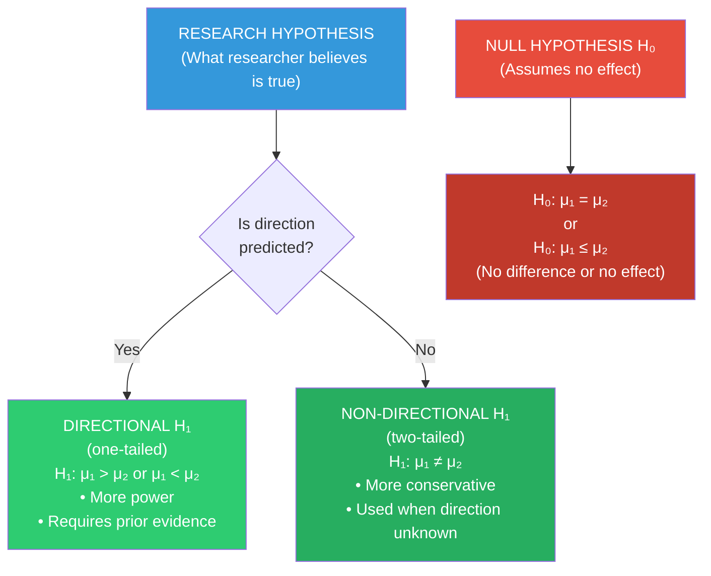

# Null & Alternative Hypotheses, Type I/II Errors & Importance of Hypothesis Testing

## Introduction

Once a hypothesis is formulated, researchers must decide *how to test it statistically*. This requires a particular way of framing predictions — through **null** and **alternative** hypotheses — and an understanding of the inevitable errors that can occur when making decisions under uncertainty. The framework of null hypothesis significance testing (NHST) is the dominant statistical approach in psychology, despite ongoing controversies about its limitations.

This section unpacks the logic of null and alternative hypotheses, explores the critical distinction between directional and non-directional predictions, and examines the two fundamental errors — Type I and Type II — that every researcher must understand and manage.

---

**Source PDFs**:
- 📄 [Block-1/Unit-4.pdf - Pages 50-52](/pdfs/MPC-005%20Research%20Methods/Block-1/Unit-4.pdf)
- 📚 MPC-005 Research Methods in Psychology, IGNOU

---

## 4.5 Types of Hypotheses

Broadly, there are two categories of hypothesis used in statistical testing:

1. **Null Hypothesis (H₀)**
2. **Alternative Hypothesis (H₁ or Hₐ)**

This categorisation arises from the conventions of statistical inference rather than from the logical structure of hypotheses alone. The null and alternative hypotheses are complementary — together they cover all possible outcomes.

---

## 4.5.1 Null Hypothesis (H₀)

### Definition

The **null hypothesis** (symbolised **H₀**, pronounced "H-naught") asserts that there is **no true difference** between groups, or **no relationship** between variables. Any observed difference or relationship in the data is attributed to random sampling fluctuation — chance, not a real effect.

In its classic form, the null hypothesis states that **population means are equal**, or that the correlation between variables is zero.

### Classic Examples from the Textbook

- *H₀: Schizophrenic patients and normal controls do not differ with respect to digit span memory.*
- *H₀: There is no relationship between intelligence and height.*

### Formal Notation

For a vocabulary-memory experiment comparing high-vocabulary (HV) and low-vocabulary (LV) children:

**H₀: μ_HV ≤ μ_LV**

This reads: "The population mean of high-vocabulary children is less than or equal to the population mean of low-vocabulary children." (They don't perform better.)

### Why Use a Null Hypothesis?

The logic of NHST is indirect — rather than directly proving the research hypothesis (which is logically impossible), researchers attempt to *disprove the null hypothesis*:

1. Assume H₀ is true (no effect exists)
2. Collect data
3. If data is extremely unlikely under H₀ (p < .05), **reject H₀**
4. Rejection of H₀ provides indirect support for H₁

This is similar to **proof by contradiction** in mathematics — you disprove the opposite of what you want to show.

### Key Features

- **Always specific**: H₀ should not state "approximately" — it should specify an exact value (usually zero difference or zero correlation)
- **The default position**: H₀ represents the conservative claim that nothing is happening
- **Innocent until proven guilty**: Like the legal presumption of innocence, H₀ is assumed true until data provides sufficient evidence against it

---

## 4.5.2 Alternative Hypothesis (H₁ or Hₐ)

### Definition

The **alternative hypothesis** (symbolised **H₁** or **Hₐ**) specifies the values that the **researcher believes to be true** — the actual research prediction. It represents "all other possibilities" beyond what the null hypothesis claims.

For the vocabulary-memory experiment:

**H₁: μ_HV > μ_LV**

This reads: "The population mean of high-vocabulary children is *greater than* that of low-vocabulary children."

### Directional vs. Non-Directional Hypotheses

This distinction is one of the most exam-relevant in this unit:

**Directional Hypothesis (One-Tailed)**

A directional hypothesis predicts the **specific direction** of the relationship or difference. The researcher states not just that groups will differ, but *which group will be higher*.

- *"High-vocabulary children will outperform low-vocabulary children on memory tasks"* (HV > LV)
- *"Reward will reduce the number of trials needed to learn"* (reward < no-reward)

Directional hypotheses are used when existing theory and evidence make a clear prediction about direction.

**Non-Directional Hypothesis (Two-Tailed)**

A non-directional hypothesis predicts that groups will **differ** without specifying the direction. The researcher acknowledges that either group could be higher.

- *"High- and low-vocabulary children will differ on memory tasks"* (μ₁ ≠ μ₂)
- *"There will be a relationship between stress and memory performance"* (could be positive or negative)

| Feature | Directional | Non-Directional |
|---------|------------|----------------|
| Specifies direction? | Yes | No |
| Statistical test | One-tailed | Two-tailed |
| More statistical power | ✅ Yes | ❌ No |
| Requires prior evidence | ✅ Yes | Less required |
| More conservative | ❌ No | ✅ Yes |
| IGNOU notation | H₁: μ₁ > μ₂ or μ₁ < μ₂ | H₁: μ₁ ≠ μ₂ |

### Formal Notation for Non-Directional

**H₀: μ₁ = μ₂**
**H₁: μ₁ ≠ μ₂**

The null hypothesis says the means are equal; the alternative says they are different (in either direction).



---

## 4.6 Errors in Testing a Hypothesis

Hypothesis testing involves **decision-making under uncertainty** — we use sample data to draw conclusions about populations. This inherently involves the risk of making wrong decisions. Two fundamental errors can occur:

### Type I Error (α — Alpha)

**Definition**: Rejecting the null hypothesis when it is actually **true**.

In other words: concluding that an effect exists when it really doesn't. This is a **false positive** — seeing something that isn't there.

- **Probability of Type I error** = α (significance level, typically set at .05)
- **Example**: Concluding that a new therapy reduces depression when, in reality, any observed improvement was due to chance or placebo effects

**Real-world analogy**: Convicting an innocent person in a criminal trial.

**In Indian context**: A researcher concludes that a specific Indian curriculum improves children's IQ scores when the improvement was actually seasonal (children perform better in summer months when the post-test was administered).

### Type II Error (β — Beta)

**Definition**: Accepting (failing to reject) the null hypothesis when it is actually **false**.

In other words: concluding that no effect exists when there really is one. This is a **false negative** — missing something that is really there.

- **Probability of Type II error** = β
- **Statistical power** = 1 - β (probability of correctly detecting a real effect)
- **Example**: Concluding that a new teaching method makes no difference when it actually does improve learning — perhaps because the sample was too small to detect the effect

**Real-world analogy**: Acquitting a guilty person in a criminal trial.

### The Trade-off Between Type I and Type II Errors

The cruel irony of hypothesis testing is that **reducing Type I error increases Type II error**, and vice versa:

| If you make α more stringent (e.g., .01 instead of .05)... | You increase β (Type II error risk) |
| If you make α more lenient (e.g., .10 instead of .05)... | You decrease β but increase Type I risk |

The only way to reduce *both* errors simultaneously is to **increase sample size** — larger samples provide more statistical power.

```mermaid
quadrantChart
    title Type I vs Type II Errors in Hypothesis Testing
    x-axis "H₀ is FALSE (Effect exists)" --> "H₀ is TRUE (No effect)"
    y-axis "Reject H₀" --> "Fail to Reject H₀"
    quadrant-1 Type I Error (False Positive) α
    quadrant-2 Correct: True Positive (Power = 1-β)
    quadrant-3 Correct: True Negative (1-α)
    quadrant-4 Type II Error (False Negative) β
```

### Summary: The Four Possible Outcomes

| Decision | H₀ is True (no effect) | H₀ is False (effect exists) |
|----------|------------------------|----------------------------|
| **Reject H₀** | ❌ Type I Error (α) | ✅ Correct (Power = 1-β) |
| **Fail to Reject H₀** | ✅ Correct (1-α) | ❌ Type II Error (β) |

### Causes of Errors in Hypothesis Testing

The IGNOU textbook lists five sources of erroneous conclusions:

1. **Faulty sampling procedure** — biased or unrepresentative samples
2. **Inaccurate data collection methods** — poor measurement, instrumentation error
3. **Faulty study design** — confounding variables, lack of control
4. **Inappropriate statistical methods** — wrong test for the data type or distribution
5. **Incorrect conclusions** — misinterpretation of valid results

---

## 4.7 Importance of Hypothesis Formulation

### Why Hypotheses Matter

Goode and Hatt's warning captures the essence: **without hypotheses, research is unfocussed — random empirical wandering**. The results cannot be interpreted as facts with clear meaning. Hypotheses provide:

**1. Direction and Focus**
A hypothesis narrows the research question, specifying exactly which variables to measure, what relationship to look for, and how to design data collection. Without a hypothesis, what data do you collect? When do you stop?

**2. Bridge Between Theory and Investigation**
Hypotheses translate abstract theories into concrete, testable predictions. This is how scientific knowledge grows cumulatively — theories generate hypotheses, hypotheses are tested, and results either support or challenge the theory.

**3. Basis for Statistical Decision-Making**
Null hypothesis testing provides a formal framework for deciding whether observed data patterns reflect real phenomena or sampling chance.

**4. Enhanced Objectivity**
A pre-specified hypothesis reduces the risk of **HARKing** (Hypothesizing After Results are Known) — a serious threat to scientific integrity where researchers formulate hypotheses to match their results after seeing the data.

**5. Replicability**
A clearly stated hypothesis makes the study replicable. Other researchers can test the same prediction with different samples, in different cultures, at different times — building a robust body of evidence.

---

## 🧠 Memory Aids

### For Type I and Type II Errors: The "False Alarm vs. Miss" Framework

| Error | Informal Name | Signal Detection Analogy |
|-------|--------------|--------------------------|
| **Type I** | False Alarm | Fire alarm goes off — no fire exists |
| **Type II** | Miss | Fire exists — alarm doesn't go off |

### For the Null Hypothesis: "The Skeptic's Hypothesis"
H₀ is always the *skeptic* — it says "nothing is happening." You need evidence to convince the skeptic (reject H₀). If evidence is insufficient, the skeptic wins (fail to reject H₀).

### The "CROW" Mnemonic for Hypothesis Errors
- **C**onvict innocent = Type I (Reject true H₀)
- **R**elease guilty = Type II (Accept false H₀)
- **O**nly way to reduce both = more data (larger sample)
- **W**atch out for the trade-off between α and β

---

## 📚 External Resources

### Essential Reading
1. **Cohen, J. (1994)** — "The earth is round (p < .05)." *American Psychologist, 49*(12), 997-1003 — Classic critique of over-reliance on null hypothesis testing
2. **Nickerson, R.S. (2000)** — "Null hypothesis significance testing: A review of an old and continuing controversy." *Psychological Methods, 5*(2), 241-301 — Comprehensive treatment of NHST logic and controversies

### Wikipedia Articles
- 🌐 [Null Hypothesis](https://en.wikipedia.org/wiki/Null_hypothesis) — History, logic, and controversies in NHST
- 🌐 [Type I and Type II Errors](https://en.wikipedia.org/wiki/Type_I_and_type_II_errors) — Clear explanation with decision matrix and real-world examples

### Educational Videos
- 🎥 [**Hypothesis Testing — Crash Course Statistics #20**](https://www.youtube.com/watch?v=bf3egy7TQ2Q) — Engaging introduction to null/alternative hypotheses and decision-making (≈13 min)
- 🎥 [**Type 1 and Type 2 Errors — StatQuest**](https://www.youtube.com/watch?v=7mE-K_w1v90) — Clear visual explanation of both error types and the power-error trade-off (≈10 min)

### Recent Research
- 📑 Lakens, D. et al. (2018). Justify your alpha. *Nature Human Behaviour, 2*, 168-171 — Modern discussion of how to set significance thresholds appropriately
- 📑 Wasserstein, R.L. & Lazar, N.A. (2016). The ASA statement on p-values. *The American Statistician, 70*(2), 129-133 — American Statistical Association's official guidance on interpreting hypothesis test results
- 📑 Benjamin, D.J. et al. (2018). Redefine statistical significance. *Nature Human Behaviour, 2*, 6-10 — Proposal to change α from .05 to .005 to reduce false positives in psychological research

---

## ✅ Self-Assessment Questions

**Q1 (Identification):** For each research scenario, write a null hypothesis (H₀) and an alternative hypothesis (H₁), specifying whether H₁ is directional or non-directional:
- (a) Does meditation reduce cortisol levels?
- (b) Is there a relationship between birth order and personality?
- (c) Does bilingual education improve cognitive flexibility compared to monolingual education?

**Q2 (Error Classification):** For each scenario, identify whether a Type I or Type II error has occurred:
- (a) A researcher concludes that a new drug treats ADHD effectively, but subsequent large-scale trials show no effect
- (b) A researcher concludes that mindfulness training has no effect on workplace stress, but a meta-analysis of 50 studies shows it is highly effective
- (c) A diagnostic test incorrectly flags a healthy patient as having depression

**Q3 (Analysis):** A researcher studying the effect of classical music on infant cognitive development sets α = .001 (very stringent) rather than the conventional .05. (a) What does this decision reduce? (b) What does it increase? (c) How could the researcher reduce *both* error types simultaneously?

**Q4 (Application):** A pharmaceutical company is testing a new antidepressant in India. Consider: (a) Which error would be more costly — a Type I or Type II error — and why? (b) How should this cost consideration influence the choice of α?

**Q5 (Critical thinking):** The replication crisis in psychology revealed that many published findings (with p < .05) could not be replicated. Using the concepts of Type I error and statistical power, explain how this crisis could arise even when researchers are following standard NHST conventions honestly.

<details>
<summary>💡 Answer Guide</summary>

**Q1:**
- (a) H₀: Meditation does not reduce cortisol levels (μ_meditation ≥ μ_control); H₁: Meditation reduces cortisol levels (μ_meditation < μ_control) — *Directional*
- (b) H₀: There is no relationship between birth order and personality (r = 0); H₁: There is a relationship (r ≠ 0) — *Non-directional* (unclear which birth order has which personality)
- (c) H₀: Bilingual and monolingual education groups do not differ on cognitive flexibility; H₁: The bilingual group will show higher cognitive flexibility scores — *Directional*

**Q2:**
- (a) **Type I Error** — Rejected true H₀ (concluded effect exists when it doesn't)
- (b) **Type II Error** — Failed to reject false H₀ (missed a real effect)
- (c) **Type I Error** — A "false positive" diagnosis (correctly speaking, this is analogous: concluding disease when none exists = rejecting the null "no disease" hypothesis incorrectly)

**Q3:** (a) Setting α = .001 reduces Type I error risk — the researcher is much less likely to falsely conclude an effect exists. (b) It increases Type II error (β) — with such a stringent criterion, many real effects will fail to reach significance, and the researcher will miss them. (c) The only way to reduce both simultaneously is to increase sample size — more data increases statistical power (1-β) while maintaining the same α level.

**Q4:** (a) **Type I error** (approving an ineffective drug) has serious costs — wasted healthcare resources, patient harm from side effects without benefit, and loss of opportunity to find real treatments. **Type II error** (missing an effective drug) has serious costs too — patients who would benefit go untreated. In pharmaceutical contexts, regulatory agencies typically consider both types of errors carefully, but safety concerns often prioritise minimising Type I error. (b) To minimise Type I error, set α very low (.01 or .001). However, this requires much larger sample sizes to maintain adequate statistical power — pharmaceutical trials are typically very large for exactly this reason.

**Q5:** The replication crisis arises partly from the cumulative effects of Type I errors combined with publication bias. With α = .05, there is a 5% chance of a false positive per study. If many researchers are testing similar (true null) hypotheses simultaneously, some will get p < .05 by chance — and *only these* tend to get published (publication bias). Over time, the literature fills with spurious findings. Additionally, many psychology studies have small samples, leading to low statistical power — they can only detect real effects if those effects are large. Small-effect studies with low power produce many Type II errors, but the occasional Type I error that slips through appears to "replicate" other Type I errors. Correcting this requires pre-registration, larger samples, and publication of null results.

</details>

---

## 🔗 Related Topics

- [Hypothesis: Meaning, Characteristics & Formulation](/mpc-005/block-1/hypothesis-meaning-characteristics-formulation) — The foundation this section builds on
- [Sampling Methods: Non-Probability & Probability](/mpc-005/block-1/sampling-methods-probability-nonprobability) — How sample characteristics affect hypothesis testing errors
- [Validity: Types and Threats](/mpc-005/block-1/validity-types-threats) — Statistical conclusion validity is directly threatened by Type I and II errors
- [Variables: Meaning, S-O-R Model & IV/DV](/mpc-005/block-1/variables-meaning-types-sor) — What the hypothesis connects
