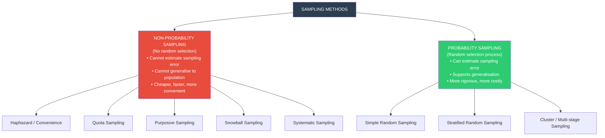

# Sampling in Psychology: Concepts, Terminology & Methods

## Introduction

A census of India's 1.4 billion people is an enormous undertaking that happens only every decade. Yet Indian psychologists study "Indian behaviour" continuously — through samples. The **logic of sampling** is deceptively simple: study a carefully selected subset of a population, and use your findings to draw conclusions about the whole.

But sampling done badly can be catastrophically misleading. The **Literary Digest** poll of 1936 predicted landslide victory for Landon over Roosevelt — a spectacularly wrong prediction because their sample (telephone directories and car owners) systematically excluded poorer voters. Good sampling is a science, and psychology relies on it for almost every empirical claim it makes.

This section covers the complete sampling framework: definitions, terminology, purposes, and all major probability and non-probability sampling methods — with attention to their strengths, limitations, and applications in Indian psychological research.

---

**Source PDFs**:
- 📄 [Block-1/Unit-4.pdf - Pages 53-61](/pdfs/MPC-005%20Research%20Methods/Block-1/Unit-4.pdf)
- 📚 MPC-005 Research Methods in Psychology, IGNOU

---

## 4.8 Sampling: Definition and Core Concepts

### What Is Sampling?

**Sampling** is the process of selecting a subset of individuals (or cases, units, organisations) from a target population, with the intention of using observations from that subset to make inferences about the entire population.

Three classic definitions from the textbook:

| Scholar | Definition |
|---------|-----------|
| **Young (1992)** | "A statistical sample is a miniature picture or cross-section of the entire group or aggregate from which the sample is taken" |
| **Goode & Hatt (1981)** | "A sample, as the name implies, is a smaller representative of a large whole" |
| **Blalock (1960)** | "A small piece of the population obtained by a probability process that mirrors, with known precision, the various patterns and sub-classes of the population" |

Note Blalock's emphasis: a *good* sample mirrors the population — it is **representative**. A biased sample that systematically over- or under-represents certain groups may be large but still misleading.

---

## 4.8.2 Key Sampling Terminology

Understanding sampling requires mastering its vocabulary:

| Term | Definition | Example |
|------|-----------|---------|
| **Population** | The complete, well-defined set of all elements with a given characteristic | All MAPC students enrolled in IGNOU in 2024-25 |
| **Universe** | Another term for population; sometimes used more broadly | All psychology students in India |
| **Finite population** | A population whose members can be counted | All psychology faculty at University of Delhi |
| **Infinite population** | A population too large to count completely | All wheat grains in India; all fish in the Ganga |
| **Parameter** | A measure computed from the *entire population* | The true mean IQ of all Indian adults |
| **Sample** | A subset of the population selected to represent it | 500 MAPC students from 5 regional centres |
| **Statistic** | A measure computed from the *sample* | The mean IQ of our 500 sampled students |
| **Sample size (n)** | Number of individuals in the sample | n = 500 |
| **Sampling design/strategy** | The specific method used to select the sample | Stratified random sampling by gender |
| **Sampling unit** | Each individual element that can be selected | A single student |
| **Sampling frame** | The complete list of all units in the population from which the sample is drawn | IGNOU's enrollment register of all MAPC students |

### The Parameter vs. Statistic Distinction

This distinction appears frequently in MPC-006 Statistics. A critical point:

- We **know** the statistic (computed from our sample)
- We **estimate** the parameter (inferred from the statistic)
- **Sampling error** = the difference between the statistic and the true parameter

The goal of good sampling is to minimise sampling error by making the sample as representative as possible.

### Sampling Frame Quality

The IGNOU textbook specifies that a sampling frame must be:
- **Comprehensive**: Includes all units in the population
- **Complete**: No omissions
- **Up-to-date**: Reflects current population composition

Poor sampling frames are a major source of bias. Classic examples:
- Using a telephone directory as a frame (excludes non-telephone owners)
- Using voter rolls (excludes non-registered citizens)
- Using student email lists (excludes students who haven't updated contact information)

In India, this is particularly relevant: a sampling frame of "university students" using institute records may undercount first-generation learners or students from marginalised communities who drop out before completing registration.

---

## 4.8.3 Purpose of Sampling

The primary objectives of sampling are:

1. **Cost minimisation**: Studying an entire population is prohibitively expensive. A sample provides needed information at a fraction of the cost.
2. **Maximum reliability**: A carefully designed sample can actually be *more accurate* than a carelessly conducted census (reduced measurement error per unit).
3. **Maximum precision**: Achieve the highest accuracy possible within a given sample size.
4. **Avoidance of bias**: Select samples without systematic distortion.

### When Does Sampling Bias Occur?

The textbook identifies three conditions:
- (a) The researcher selects the sample non-randomly, influenced by personal preferences or convenience
- (b) The sampling frame doesn't accurately cover the target population
- (c) A section of the sample population is impossible to locate or refuses to cooperate (non-response bias)

---

## 4.9 Sampling Methods: The Big Picture

Blalock (1960) classified all sampling methods into two categories:

---

## 4.9.1 Non-Probability Sampling Methods

In non-probability sampling, **not every unit in the population has a known, non-zero probability of being selected**. This means:
- We cannot calculate how representative the sample is
- We cannot estimate sampling error
- Generalisation to the population is limited

Despite these limitations, non-probability methods are widely used — particularly in exploratory research, clinical psychology, and qualitative studies.

### i) Haphazard / Accidental / Convenience Sampling

**What it is**: Selecting whoever is most easily available — the "person on the street" approach.

**Example**: 
- Interviewing students in the college canteen because it's convenient
- TV news "vox pop" interviews with whoever walks by
- Using one's own class as a research sample because the teacher is the researcher's friend (textbook example)

**Strengths**:
- Extremely cheap and quick
- Easy to implement with minimal resources

**Weaknesses**:
- Highly unrepresentative — systematic errors are likely
- Can seriously misrepresent the population
- TV interviews often avoid unattractive, elderly, or inarticulate people — producing a distorted view of public opinion
- May be *worse than no sample at all* because it gives false confidence in findings

**When used**: Pilot studies, preliminary exploration only. Never for drawing firm conclusions.

### ii) Quota Sampling

**What it is**: The researcher pre-identifies relevant categories and decides how many participants to include from each — then fills quotas using convenience sampling.

**Example from textbook**: 
- Select 5 males and 5 females under 30
- 10 males and 10 females aged 30-60
- 5 males and 5 females over 60
- Total: 40-person sample

**Strengths**:
- Ensures diversity across key demographic categories
- Prevents all interviewees being from the same age/sex/background
- More convenient and less costly than probability methods
- Introduces some control over sample composition

**Weaknesses**:
- Still uses convenience within each quota cell
- Interviewers may select those easiest to interview (friendly, accessible)
- Cannot estimate accuracy because randomisation is absent
- Sampling bias remains possible within categories

**Indian Research Context**: Quota sampling is common in large-scale Indian survey research (e.g., NSSO supplementary surveys, ASER reports) where full probability sampling is impractical but demographic representativeness is essential.

### iii) Purposive Sampling

**What it is**: The researcher uses expert judgment to select cases that are specifically informative for the research purpose.

**Example from textbook**: Studying attitudes on national issues by selecting journalists, teachers, and legislators — those most likely to have informed, representative views.

**Another example**: Identifying problem-behaviour children through multiple methods (teacher referrals, clinical records, behavioural assessments) to study their temperamental attributes.

**Strengths**:
- Highly appropriate for exploratory and field research
- Selects uniquely informative or typical cases
- Less costly and more accessible than probability methods
- Targets exactly the relevant population segment

**Weaknesses**:
- No way to verify sample represents the broader population
- Heavily dependent on researcher's judgment (subjective)
- Cannot estimate sampling error

**Indian Applications**: 
- Studying suicide ideation in doctors at AIIMS (selected purposively as high-risk professionals)
- Investigating mental health of LGBTQ+ youth in India (hard-to-reach, purposive access through NGOs)
- Research on meditation masters at Himalayan ashrams

### iv) Snowball Sampling

**What it is**: Begins with a small initial group of participants, who then refer the researcher to other potential participants, who refer more — like a growing snowball.

Also known as: **network sampling, chain referral sampling, reputation sampling**.

**Process**:
1. Collect data from 1-3 initial contacts
2. Ask each participant for contacts who might participate
3. Contact those individuals, collect data, ask for more referrals
4. Repeat until sufficient sample is obtained

**Strengths**:
- Essential when the population is **hidden, rare, or difficult to access**
- Reveals social network structures and communication patterns
- Effective for studying informal social groups
- Can reach populations with no enumerable sampling frame

**Weaknesses**:
- Biased toward socially connected individuals (isolates are excluded)
- Sample depends on initial contacts' social networks
- Cannot use probability statistical methods
- Becomes unwieldy when network exceeds ~100 members

**Best for**: Studying drug users, sex workers, undocumented immigrants, survivors of childhood abuse, rare clinical conditions, cult members — populations where no sampling frame exists and stigma or legal concerns make random sampling impossible.

**Indian Applications**: 
- Studying experience of acid attack survivors in India (rare, hard-to-find population)
- Research on survivors of honour-based violence
- Investigating practices among specific caste-based informal worker groups

### v) Systematic Sampling

**What it is**: Selecting every *k*th unit from a predetermined list, where *k* is the sampling interval (population size / desired sample size).

**Example from textbook**: Selecting every 5th roll number from a class of 60 students (k = 60/12 = 5).

**Another example**: Drawing every 8th name from a telephone directory.

**Process**:
1. Calculate k = N/n (population size / sample size)
2. Randomly select a starting point between 1 and k
3. Select every kth unit thereafter

**Strengths**:
- Quick and easy to implement
- Easy to check for errors
- Has some element of randomness (first element is randomly chosen)

**Weaknesses**:
- Not a true probability method — excludes all persons between selected elements
- Vulnerable to periodicity bias: if the list has a periodic pattern matching k, sampling error inflates
- **Example of periodicity**: If an apartment list always puts the head of household first, selecting every kth head-of-household misses the actual household distribution

**Classification controversy**: The textbook notes that "systematic" is somewhat misleading — all probability methods are systematic. In practice, systematic sampling is often treated as a near-probability method but is technically non-probability.

---

## 4.9.2 Probability Sampling Methods

In probability sampling, **every unit in the population has a known, non-zero probability of being selected**. This enables:
- Estimation of sampling error
- Statistical inference to the population
- Calculation of confidence intervals
- Representative generalisation

### i) Simple Random Sampling (SRS)

**What it is**: Every individual in the population has an **equal and independent** chance of being selected.

**Three requirements** (textbook):
1. Complete listing of all population elements (sampling frame)
2. Equal chance for each element to be selected
3. Selection of one element has no effect on chance of another being selected

**Methods**:
- **Lottery method**: Write names on equal-sized slips, draw blindly from a container
- **Random number tables**: Assign numbers to all units, use RNG to select
- **Computer generation**: Use statistical software (R, SPSS, Excel RAND function)

**With vs. Without Replacement**:
- **With replacement**: Selected unit returns to pool; same individual can be selected twice (probability stays constant at 1/N each draw)
- **Without replacement**: Selected unit removed from pool (probability changes slightly — 1/N, 1/(N-1), 1/(N-2)...)
- Most psychological research uses without replacement (you don't interview the same person twice)

**Advantages**:
- Gold standard for representativeness — equal probability for all
- Provides a foundation against which other methods are evaluated
- Least costly accuracy assessment
- Sample size increases → more representative

**Disadvantages**:
- Requires complete, up-to-date sampling frame (often unavailable)
- Large sample size needed for reliability
- High cost when population is geographically dispersed
- Requires skilled investigators

### ii) Stratified Random Sampling

**What it is**: The population is divided into **homogeneous subgroups (strata)**, and a random sample is drawn independently from each stratum.

**Stratification criteria**: Can use single criterion (e.g., sex → male/female strata) or multiple criteria (e.g., sex × education level → 4 strata: male-graduate, male-undergraduate, female-graduate, female-undergraduate).

**Key requirement**: Strata must be:
- **Internally homogeneous** (similar units within each stratum)
- **Mutually exclusive** (non-overlapping)
- **Collectively exhaustive** (together constitute the entire population)

**Example from textbook**: Studying 3rd grade children in India:
- Strata by state → select random states
- Within selected states → random districts
- Within districts → random schools
- Within schools → random children

**Proportional vs. Disproportional Stratification**:
- **Proportional**: Each stratum sampled in proportion to its population size
- **Disproportional**: Smaller strata over-sampled to ensure adequate representation (important for rare subgroups)

**Advantages**:
- More representative than SRS (ensures all subgroups are included)
- Higher precision — reduces sampling error by controlling variance within strata
- Saves time and cost (can use smaller total sample)
- Administrative convenience (separate teams can work in different strata)

**Disadvantages**:
- Improper stratification can produce misleading results
- Requires complete knowledge of stratification variable in population
- Geographically dispersed strata increase cost
- Trained investigators required

**Indian Example**: NFHS (National Family Health Survey) uses stratified sampling by state, urban/rural, and socioeconomic status — essential for capturing India's extraordinary diversity.

### iii) Cluster Sampling (Multi-stage Sampling)

**What it is**: The population is divided into clusters (naturally occurring groups), clusters are randomly selected, and then individuals are sampled from selected clusters.

**Multi-stage process**: Cluster sampling typically involves multiple stages of random selection:
1. Stage 1: Random selection of large units (e.g., states)
2. Stage 2: Random selection of smaller units within selected large units (e.g., districts)
3. Stage 3: Random selection of even smaller units (e.g., schools within districts)
4. Stage 4: Random selection of individuals (e.g., children within schools)

**Key feature**: Only selected clusters are studied in detail at subsequent stages — massive efficiency gain over SRS for geographically dispersed populations.

**Advantages**:
- Most practical method for large, geographically dispersed populations
- Does not require a complete sampling frame at the start (only a list of clusters)
- Flexible — can adjust number of stages
- Much less costly than SRS for wide geographic coverage

**Disadvantages**:
- Less accurate than single-stage SRS for same total sample size
- Design effect (deff) — must account for clustering in statistical analysis
- Can be complex to design and analyse properly
- Within-cluster homogeneity reduces effective sample size

**Indian Applications**: 
- ASER surveys of learning outcomes in rural India
- National Mental Health Survey (NMHS) 2015-16 — used cluster sampling across 12 Indian states
- Longitudinal Ageing Study in India (LASI)

---

## Comparing All Sampling Methods: A Quick Reference

| Method | Probability? | Representative? | Cost | When to Use |
|--------|-------------|----------------|------|------------|
| Convenience | ❌ No | ❌ Poor | 💰 Very low | Pilot studies only |
| Quota | ❌ No | 🔶 Moderate | 💰💰 Low | When demographics must be controlled, resources limited |
| Purposive | ❌ No | ❌ Not goal | 💰💰 Low | Exploratory, expert informants needed |
| Snowball | ❌ No | ❌ Network-dependent | 💰💰 Low | Hidden/stigmatised populations |
| Systematic | ⚠️ Near | 🔶 Moderate | 💰💰 Low | Ordered lists, when SRS is impractical |
| Simple Random | ✅ Yes | ✅ High | 💰💰💰 Moderate | Small, accessible populations |
| Stratified | ✅ Yes | ✅ Very High | 💰💰💰 Moderate | Known subgroups, precision required |
| Cluster | ✅ Yes | ✅ High | 💰💰 Low-Moderate | Large geographic areas, no central frame |

---

## 4.10 Importance of Sampling

Why has sampling become the dominant approach in psychological research?

1. **Population vastness**: Populations of interest are typically too large to study completely
2. **Difficulty of access**: People are mobile, private, and increasingly unwilling to participate
3. **High refusal rates**: Census methods face enormous non-response problems
4. **Definitional challenges**: Defining and enumerating the "universe" is often impossible
5. **Data quality**: Smaller samples allow more intensive, accurate data collection per unit
6. **Speed**: Research results available faster, enabling timely decision-making
7. **Modern methodology improvements**: Advances in sampling theory have made results highly reliable

As Ader, Mellenbergh & Hand (2008) note: sampling's three main advantages are **lowest cost, faster data collection, and improved accuracy** due to the ability to ensure homogeneity in smaller datasets.

---

## 🧠 Memory Aid: "HQPSS-SRC" for Sampling Methods

**Non-probability methods**: **H**aphazard, **Q**uota, **P**urposive, **S**nowball, **S**ystematic

**Probability methods**: **S**imple Random, **S**tratified **R**andom, **C**luster

Remember: "**HQP-SS** gets you non-random; **SRC** gets you representative!"

Or associate:
- **H**aphazard = **H**andful of whoever's nearby
- **Q**uota = **Q**ualified by categories
- **P**urposive = **P**ick the **P**erfect informants
- **S**nowball = **S**ocial network grows
- **S**ystematic = **S**elect every kth
- **S**imple Random = **S**ame chance for all
- **R** (Stratified) = **R**espect the subgroups
- **C**luster = **C**lump, then sample clumps

---

## 📚 External Resources

### Core Texts
1. **Blalock, H.M. (1960)** — *Social Statistics* — Original classification framework used in this unit
2. **Cochran, W.G. (1977)** — *Sampling Techniques* (3rd ed.) — The definitive mathematical treatment of sampling theory
3. **Ader, H.J., Mellenbergh, G.J., & Hand, D.J. (2008)** — *Advising on Research Methods* — Practical guidance on sampling decisions

### Wikipedia Articles
- 🌐 [Sampling (Statistics)](https://en.wikipedia.org/wiki/Sampling_(statistics)) — Comprehensive overview of all sampling methods
- 🌐 [Stratified Sampling](https://en.wikipedia.org/wiki/Stratified_sampling) — Detailed mathematical treatment with worked examples
- 🌐 [Snowball Sampling](https://en.wikipedia.org/wiki/Snowball_sampling) — Limitations, applications, and variations

### Educational Videos
- 🎥 [**Sampling Methods — CrashCourse Statistics #16**](https://www.youtube.com/watch?v=be9e-Q-jC-0) — Engaging introduction to all major sampling methods with animations (≈12 min)
- 🎥 [**Probability vs. Non-Probability Sampling — Research Methods**](https://www.youtube.com/watch?v=J_cq-XhSGwk) — Clear comparison of the two families of methods with examples (≈9 min)

### Recent Research
- 📑 Vaske, J.J. (2019). Survey research and analysis: Applications in parks, recreation and human dimensions. — Comprehensive practical treatment of sampling design
- 📑 Bhattacherjee, A. (2012). Social science research: Principles, methods, and practices. Textbooks Collection — Open-access research methods text with extensive sampling chapter
- 📑 NMHS Collaborators (2016). National Mental Health Survey of India, 2015-16. NIMHANS. — Premier example of cluster sampling in large-scale Indian psychological research

---

## ✅ Self-Assessment Questions

**Q1 (Terminology):** Define each of the following and provide an Indian research example: (a) Population vs. Universe, (b) Parameter vs. Statistic, (c) Sampling Frame, (d) Sampling Unit.

**Q2 (Method Identification):** For each scenario, identify the most appropriate sampling method and justify your choice:
- (a) A researcher wants to study depression rates across all Indian states
- (b) A clinical psychologist wants to study the lived experience of women who have survived domestic violence in rural Haryana
- (c) A researcher wants to study the academic motivation of IGNOU students, ensuring equal representation from men and women in each age group (18-25, 26-40, 40+)
- (d) An LGBTQ+ researcher in India wants to study mental health of gender non-conforming individuals

**Q3 (Comparison):** Compare simple random sampling and stratified random sampling in terms of: (a) requirements, (b) representativeness, (c) precision, and (d) practical feasibility for a study of 1,000 Indian college students.

**Q4 (Evaluation):** A researcher studying mental health of NEET aspirants uses convenience sampling at a single coaching institute in Kota, Rajasthan. Critically evaluate this sampling approach: (a) What biases might it introduce? (b) To what population can findings be generalised? (c) What would you recommend instead?

**Q5 (Application):** Design a sampling strategy to study the mental health of migrant labourers in Mumbai. Specify: (a) Your sampling method, (b) Why this method is appropriate, (c) How you would construct a sampling frame, (d) One major limitation of your chosen method.

💡 Answer Guide

**Q1:**
- (a) Population = the complete set of individuals with the characteristic of interest (e.g., all psychology students enrolled in Indian universities in 2024-25). Universe is sometimes used more broadly, including hypothetical members. Indian example: Population might be "all IGNOU MAPC students"; universe might be "all potential psychology learners in India"
- (b) Parameter = a measurement describing the entire population (true mean, true proportion — usually unknown). Statistic = a measurement from our sample (sample mean, sample proportion — known). Example: True average STAI score of all Indian medical students = parameter; mean STAI in our 300-student sample = statistic
- (c) Sampling Frame = complete list of all units in the population. Example: IGNOU's current enrollment database of all MAPC students; electoral rolls in a district study
- (d) Sampling Unit = each individual element eligible for selection. Example: each individual MAPC student; each household in a family study

**Q2:**
- (a) **Cluster sampling** (multi-stage): Too many states to sample individually; select random states, then random districts, then random respondents. Feasible without a national individual-level frame.
- (b) **Purposive + Snowball sampling**: Hard-to-reach, stigmatised population; start with women identified through NGOs working in domestic violence, then use snowball to reach others. Purposive ensures relevant cases; snowball expands reach.
- (c) **Stratified random sampling**: Known subgroups (gender × age) must be represented; stratify by gender and age group, randomly sample within each stratum. Disproportional stratification ensures adequate cell sizes.
- (d) **Snowball sampling**: No sampling frame exists for this population in India; stigma and legal risks make random sampling impossible; begin with LGBTQ+ support organisations and use chain referral.

**Q3:**
| Aspect | Simple Random Sampling | Stratified Random Sampling |
|--------|----------------------|--------------------------|
| Requirements | Complete sampling frame; no knowledge of subgroups needed | Complete frame PLUS knowledge of stratification variable for all members |
| Representativeness | High on average; may under/over-represent subgroups by chance | Guaranteed representation of all strata |
| Precision | Lower (variance not controlled) | Higher (within-stratum variance is lower) |
| Feasibility for 1,000 Indian students | Requires complete national student database; feasible with university registrar records | Requires knowing gender/age/location of all students before sampling; more planning but achievable |

**Q4:**
- (a) Biases: selection bias toward students at one specific institute (Kota is unusual — highest-stakes coaching environment in India, possibly extreme stress levels); geographic bias (Kota culture differs from small-town aspirants); self-selection bias (students willing to participate may differ from those who refuse)
- (b) Generalisation is only strictly valid to NEET aspirants at that specific institute; cannot generalise to all NEET aspirants, rural aspirants, self-studying aspirants, or aspirants outside Rajasthan
- (c) Recommendation: Stratified random sampling across multiple coaching centres in different cities AND self-studying students; or cluster sampling where cities are first-level clusters, institutes within cities are second-level, and students within institutes are third-level. Include multiple geographic regions to capture India's diversity.

**Q5:** (Note: Any reasonable answer demonstrating method understanding is acceptable)
- (a) **Snowball sampling** initiated through labour union contacts and community health workers (as starting contacts)
- (b) Appropriate because: migrant labourers constitute a hidden, mobile population with no centralised registry; they move frequently across construction sites and industries; they may be suspicious of authorities; snowball allows access through trusted community members
- (c) Sampling frame construction: Identify 10-15 construction sites registered with BMC; through site supervisors, identify initial participants; this serves as a partial frame for the first stage
- (d) Limitation: Network bias — only labourers with social connections to initial contacts are reachable; isolated, marginalised, or very recently arrived migrants (possibly most vulnerable) are systematically excluded

---

## 🔗 Related Topics

- [Hypothesis: Meaning, Characteristics & Formulation](/mpc-005/block-1/hypothesis-meaning-characteristics-formulation) — Sampling serves hypothesis testing
- [Hypothesis Types & Errors](/mpc-005/block-1/hypothesis-types-errors-importance) — Sample size directly affects Type II error probability
- [Validity: Types and Threats](/mpc-005/block-1/validity-types-threats) — External validity depends on sampling quality
- [Research Process: Steps](/mpc-005/block-1/research-process-steps) — Sampling design is a core research planning step
