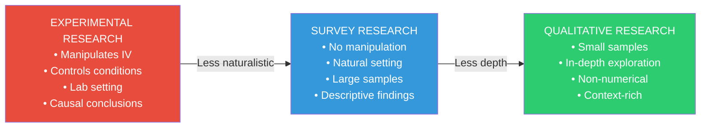
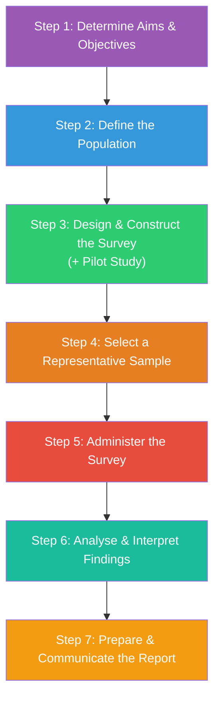

# Survey Research: Concept, Steps & Instruments

## Introduction

When Gallup wants to know who Indians will vote for, when NIMHANS wants to understand the prevalence of depression across age groups, or when a multinational wants to know consumer satisfaction — they all turn to the same fundamental tool: **survey research**. It is arguably the most widely used research method in applied social science, yet it is also one of the most frequently misused.

Survey research is deceptively simple on the surface — "just ask people questions." But designing surveys that yield valid, reliable, and actionable data requires careful attention to every step of the process, from framing objectives to selecting instruments to disseminating findings. This unit demystifies the process systematically.

---

**Source PDFs**:
- 📄 [Block-2/Unit-1.pdf - Pages 5-10](/pdfs/MPC-005%20Research%20Methods/Block-2/Unit-1.pdf)
- 📚 MPC-005 Research Methods in Psychology, IGNOU

---

## 1.2 Concept and Meaning of Survey Research

### Formal Definition

**Survey research** is a **non-experimental, descriptive, quantitative** research method that collects data from a sample of respondents through standardised questionnaires or interviews, with the goal of making inferences about a larger population.

Let's unpack the key terms:

| Term | Meaning in Context |
|------|-------------------|
| **Non-experimental** | No manipulation of variables under controlled conditions; no IV deliberately varied |
| **Descriptive** | Describes the state of affairs as it is — not explains causes |
| **Quantitative** | Primarily produces numerical data amenable to statistical analysis |
| **Standardised** | Same questions asked in the same way to all respondents |
| **Sample** | A representative subset of the target population |
| **Inferences** | Conclusions drawn about the population based on sample findings |

Survey research can gather data through:
- **Direct observation**: Face-to-face interviews where the researcher observes responses in real time
- **Indirect observation**: Opinions collected through mail questionnaires about attitudes towards library services, for example

### What Makes Survey Research Distinctive?

Survey research occupies a unique methodological position:

Survey research trades causal precision (the strength of experiments) for **breadth, ecological validity, and practical feasibility**. You can survey 10,000 people across India in ways that a laboratory experiment never could.

### Where Is Survey Research Used in Psychology?

Survey research is the backbone of:
- **Epidemiological psychology**: Establishing prevalence rates of mental disorders (e.g., India's National Mental Health Survey 2015-16)
- **Social psychology**: Studying attitudes, stereotypes, and public opinion
- **Organisational psychology**: Employee satisfaction, burnout, organisational climate
- **Educational psychology**: Learning attitudes, teacher efficacy, school climate
- **Consumer psychology**: Brand preferences, decision-making patterns
- **Health psychology**: Health behaviours, risk perceptions, treatment adherence

---

## 1.3 Steps Involved in Conducting Survey Research

Survey research follows a systematic 7-step process. Each step builds on the previous and determines the quality of the final findings.

### Step 1: Determine Aims and Objectives

The researcher must:
- Identify the specific research area or issue to be studied
- State clear, focused, measurable objectives
- Ensure the objectives are relevant and meaningful to the target population

**Example**: A study of academic burnout among NEET aspirants might have objectives like: (a) estimate prevalence of burnout symptoms; (b) identify demographic correlates; (c) examine relationship between coaching hours and burnout levels.

### Step 2: Define the Population

The researcher must explicitly define the **target population** — the group whose characteristics are being studied and to whom findings will be generalised. Population definition involves specifying:
- Who qualifies (inclusion criteria): NEET aspirants currently enrolled in coaching
- Who doesn't (exclusion criteria): Already-admitted medical students
- Geographic scope: Students across 5 major coaching hubs in India

Poorly defined populations lead to meaningless or misleading inferences.

### Step 3: Design and Construct the Survey (+ Pilot Study)

This step involves:
- Choosing the survey instrument (questionnaire, interview, observation)
- Deciding the format and wording of items
- **Conducting a pilot study** — a small-scale trial run of the survey with a subset of the target population

The **pilot study** is critically important. It helps the researcher:
- Identify ambiguous, confusing, or offensive questions
- Estimate the time needed to complete the survey
- Check whether response scales are appropriate
- Ensure data collection procedures work as planned
- Refine the instrument before full-scale deployment

A good rule of thumb: pilot with 10-20 participants from the target population before finalising the instrument.

### Step 4: Select a Representative Sample

Using the sampling methods covered in Block-1 Unit-4, the researcher selects a sample that:
- Represents the major characteristics of the population
- Is large enough to detect the effects of interest
- Is selected through an appropriate sampling method (random vs. purposive, depending on research goals)

**Key principle**: If the sample is a good representation of the population, findings can be generalised to the population as a whole.

### Step 5: Administer the Survey

The researcher collects data by administering the survey instrument to the selected sample. Administration involves:
- Standardised instructions to all participants
- Ensuring response rates are adequate (low response rates introduce non-response bias)
- Managing logistics (timing, location, language)
- Training data collectors for interview-based surveys

**Non-response bias** is a major threat: if those who don't respond differ systematically from those who do, the sample becomes unrepresentative.

### Step 6: Analyse and Interpret Findings

Data analysis involves:
- **Coding**: Converting raw responses into numerical or categorical codes
- **Data entry and cleaning**: Checking for errors, missing values, outliers
- **Statistical analysis**: Descriptive statistics (means, frequencies, percentages), inferential tests (correlations, chi-square, regression)
- **Interpretation**: Drawing conclusions about the research questions/hypotheses in light of the statistical findings

### Step 7: Prepare and Communicate the Report

The final report must:
- Clearly present aims, methods, sample characteristics
- Report results systematically
- Interpret findings in relation to objectives and prior literature
- Discuss limitations honestly
- Make recommendations for practice or policy where appropriate
- **Disseminate findings** to relevant stakeholders — policymakers, practitioners, the public

Dissemination is often overlooked but is ethically important: research that never reaches those who can use it fails its ultimate purpose.

---

## 1.4 Instruments for Data Collection in Survey Research

Three major instruments are used in survey data collection:

### Instrument 1: Sampling (as a Tool)

Sampling itself functions as an instrument by determining *whose* data is collected. As discussed in Block-1 Unit-4, proper sampling ensures the data collected is representative.

Two key sampling approaches in surveys:
- **Randomisation**: Each unit has an equal chance of selection (reduces selection bias)
- **Stratification**: Population divided into categories; samples drawn from each stratum (ensures demographic representation)

**Example**: Studying job satisfaction in an Indian multinational — select 10 persons from each department using stratified random sampling to ensure all divisions are represented.

### Instrument 2: Questionnaire

A questionnaire is a **paper-pencil or digital instrument** containing a structured set of items that respondents answer independently.

**Three modes of questionnaire administration**:

#### i) Mail Survey (including Email/Online)

Questionnaires sent to respondents via post or email; responses returned by the same route.

| Feature | Details |
|---------|---------|
| **Advantage** | Inexpensive; can reach large geographically dispersed samples; no interviewer bias; respondents complete at their own pace |
| **Disadvantage** | Low response rates; cannot clarify confusing questions; not suitable for complex items requiring explanation; literacy required |
| **Best for** | Large national samples; professional populations (doctors, academics); sensitive topics where anonymity helps |

#### ii) Group Administered Questionnaire

Respondents gathered together at a specific time and place; questionnaire completed as a group.

| Feature | Details |
|---------|---------|
| **Advantage** | High response rates (captive audience); respondents can ask for clarification immediately; efficient for institutional populations |
| **Disadvantage** | Social desirability bias (people may see each other's answers); requires physical gathering; logistically complex for dispersed populations |
| **Best for** | School/university populations; workplace studies; training programmes |

#### iii) Household Drop-Off Survey

Researcher personally delivers and collects questionnaires from respondents' homes.

| Feature | Details |
|---------|---------|
| **Advantage** | Personal contact increases response rates; researcher can answer procedural questions; respondent completes at own convenience |
| **Disadvantage** | Time-consuming and expensive; limited geographic reach; researcher still not present during completion |
| **Best for** | Community surveys; studies requiring personal contact in areas without telephone/internet coverage |

### Instrument 3: Interview

An interview is a **structured or semi-structured conversation** between researcher and respondent, allowing more flexible and in-depth data collection.

**Key advantage over questionnaires**: The interviewer can ask follow-up questions, observe non-verbal cues, and probe for deeper responses.

**Three types of interviews**:

#### i) Structured Interview

All questions are **prepared and preplanned** in advance. The interviewer asks questions in a fixed order and records responses systematically.

- **Strength**: High standardisation, comparable across respondents, easier to analyse quantitatively
- **Limitation**: Inflexible; may miss important nuances; respondents may feel constrained
- **Best for**: Large surveys requiring comparability across many respondents

#### ii) Unstructured Interview

The interview flows **informally**, with no predetermined question list. The respondent's answers guide subsequent questions.

- **Strength**: Captures rich, contextual, unexpected information; builds rapport; allows depth
- **Limitation**: Inconsistent across respondents; difficult to quantify and compare; requires skilled interviewer
- **Best for**: Exploratory research; clinical settings; qualitative studies

#### iii) Telephonic Interview

Questions asked and answered by telephone (or video call in modern practice).

- **Strength**: Time and cost efficient; can cover geographically dispersed samples
- **Limitation**: Limited to those with telephone access; cannot observe non-verbal cues; higher refusal rates than face-to-face
- **Best for**: Quick surveys; follow-up interviews; populations with phone access

### Comparing the Three Interview Types

| Feature | Structured | Unstructured | Telephonic |
|---------|-----------|-------------|-----------|
| Standardisation | High | Low | Moderate |
| Depth | Low | High | Low-Moderate |
| Cost | Moderate | High | Low |
| Speed | Fast | Slow | Fast |
| Non-verbal data | Yes | Yes | No |
| Comparability | High | Low | Moderate |
| Best design | Quantitative | Qualitative | Quick survey |

---

## Indian Research Context: Survey Methods in Practice

Survey research has been instrumental in mapping India's psychological landscape:

**National Mental Health Survey (NMHS) 2015-16**: Conducted by NIMHANS across 12 states using multi-stage cluster sampling and structured interviews. Found that 10.6% of adults required mental health care, with significant urban-rural and gender disparities.

**ASER (Annual Status of Education Report)**: Annual household survey assessing learning outcomes of rural Indian children using structured instruments administered to children and caregivers at home.

**NSSO Health Survey**: Uses stratified random sampling and household interviews to collect health behaviour and mental wellbeing data across socioeconomic strata.

These surveys face India-specific challenges: linguistic diversity (22 scheduled languages), geographical barriers, low digital literacy in rural areas, and cultural reluctance to discuss mental health — all of which must be addressed in instrument design and administration.

---

## 🧠 Memory Aid: "DPSSA-AC" for Survey Steps

**D** — Determine aims & objectives
**P** — Population definition
**S** — Survey design + pilot study
**S** — Select sample
**A** — Administer survey
**A** — Analyse and interpret
**C** — Communicate report

Or remember the key decision at each step: **"WHY → WHO → HOW → WHOM → WHEN → WHAT → SHARE"**

---

## 📚 External Resources

### Foundational Texts
1. **Fowler, F.J. (2014)** — *Survey Research Methods* (5th ed.). SAGE — The standard reference for survey methodology
2. **Babbie, E. (2021)** — *The Practice of Social Research* (15th ed.) — Comprehensive treatment of survey design
3. **Dillman, D.A., Smyth, J.D., & Christian, L.M. (2014)** — *Internet, Phone, Mail, and Mixed-Mode Surveys: The Tailored Design Method* — Modern multi-mode survey design

### Wikipedia Articles
- 🌐 [Survey Methodology](https://en.wikipedia.org/wiki/Survey_methodology) — Comprehensive overview of survey design, administration, and analysis
- 🌐 [Questionnaire](https://en.wikipedia.org/wiki/Questionnaire) — Types, design principles, and applications of questionnaires in research

### Educational Videos
- 🎥 [**Survey Research Methods — Crash Course Statistics**](https://www.youtube.com/watch?v=7eLF4Yx9xbI) — Clear introduction to survey design and common biases (≈12 min)
- 🎥 [**How to Design a Survey — Research Methods**](https://www.youtube.com/watch?v=WV4HWk5-gg4) — Practical walkthrough of survey construction with examples (≈9 min)

### Recent Research
- 📑 Bhattacherjee, A. (2012). Social science research: Principles, methods, and practices — Open-access comprehensive text with strong survey methods chapter
- 📑 Tourangeau, R., Conrad, F.G., & Couper, M.P. (2013). *The Science of Web Surveys*. Oxford University Press — Essential for modern digital survey methods
- 📑 NIMHANS (2016). National Mental Health Survey of India, 2015-16: Summary. — Premier example of large-scale survey research in Indian psychology

---

## ✅ Self-Assessment Questions

**Q1 (Definition):** Why is survey research classified as "non-experimental"? What does this mean for the kinds of conclusions a survey researcher can draw? Give an example of a conclusion that survey research CAN support and one that it CANNOT.

**Q2 (Steps):** A researcher wants to study smartphone addiction among Class 11 and 12 students across Maharashtra. Walk through all 7 steps of survey research, specifying what decisions need to be made at each step.

**Q3 (Instruments):** For each research scenario, identify the most appropriate data collection instrument (mail questionnaire, group-administered questionnaire, household drop-off, structured interview, unstructured interview, or telephonic interview) and justify your choice:
- (a) Studying depression symptoms in elderly patients at a geriatric clinic in Chennai
- (b) Assessing academic motivation of 200 students in a Delhi university
- (c) Exploring the lived experience of caregivers of children with autism in rural UP

**Q4 (Critical Evaluation):** A researcher studying sexual behaviour in Indian college students uses a group-administered questionnaire in a classroom setting. What specific concerns does this raise about data quality? What instrument would you recommend instead?

**Q5 (Application):** A pilot study of a new workplace stress questionnaire among 15 IT employees reveals that: (a) 8 participants left 3 questions blank, (b) 5 reported not understanding what "work-life balance" means in question 7, and (c) the average completion time was 45 minutes. Analyse these findings: what specific changes should the researcher make to the questionnaire before the main study?

💡 Answer Guide

**Q1:** Survey research is non-experimental because it doesn't manipulate any independent variable — it simply measures variables as they exist naturally. This means it CAN support descriptive and correlational conclusions. CAN support: "There is a positive correlation between study hours and academic achievement among NEET aspirants" (describing a relationship). CANNOT support: "Increasing study hours causes higher scores" (causal claim requires an experiment with random assignment to conditions). Survey findings are always correlational — they reveal associations, not causes.

**Q2:** Step 1 (Aims): Objectives — estimate prevalence of smartphone addiction, identify grade/gender differences, examine associations with sleep and academic performance. Step 2 (Population): Class 11 and 12 students currently enrolled in Maharashtra state board and CBSE schools. Step 3 (Design): Develop a questionnaire using the Smartphone Addiction Scale (SAS) adapted for Indian students; pilot with 20 students from one school. Step 4 (Sample): Stratified cluster sampling — stratify by district (rural/urban) and board (state/CBSE); randomly select schools; randomly select classes within schools. Step 5 (Administer): Group-administered in classrooms during school hours with teacher present. Step 6 (Analyse): Calculate SAS scores, compute prevalence rates, run chi-square for grade/gender comparisons, correlations with sleep hours. Step 7 (Report): Present findings to school administrators, publish in educational psychology journal, share summary with Maharashtra Department of Education.

**Q3:** (a) **Structured interview**: Elderly patients may have literacy difficulties; depression symptoms require sensitive probing; face-to-face allows observation of affect and cognitive state; researcher can adapt language. (b) **Group-administered questionnaire**: Large sample (200) manageable in classroom setting; academic motivation is not highly sensitive; immediate clarification possible; cost-efficient. (c) **Unstructured interview**: Exploring lived experience requires depth and flexibility; caregivers' experiences are complex and personal; structured instruments would miss contextual nuance; rapport essential for rural participants who may be unfamiliar with research contexts.

**Q4:** Concerns: (a) **Social desirability bias** — students may under-report sexual behaviour when peers are present; (b) **Privacy violation** — sexual behaviour is highly personal; group setting eliminates confidentiality; (c) **Peer influence** — students may see each other's answers and conform; (d) **Power dynamics** — teacher/instructor presence may inhibit honest disclosure. Recommendation: An **anonymous mail/online questionnaire** sent to students' personal email addresses, with emphasis on anonymity, no classroom setting, completed privately, and collected through sealed envelopes or secure online platform.

**Q5:** (a) 8 participants leaving 3 questions blank indicates those items are probably unclear, ambiguous, or asking about something participants don't have experience with — rewrite those 3 questions using simpler language or add "not applicable" response options. (b) "Work-life balance" being unfamiliar to 5 participants suggests the term is jargon for this population — replace with a concrete operational description or example. (c) 45 minutes completion time is far too long for a workplace survey (typical target: 10-15 minutes) — significantly shorten by removing redundant items, combining related questions, or splitting into modular sections.

---

## 🔗 Related Topics

- [Types of Survey Research & Question Design](/mpc-005/block-2/survey-types-questions-precautions) — Cross-sectional vs. longitudinal, and structured vs. unstructured questions
- [Sampling Methods](/mpc-005/block-1/sampling-methods-probability-nonprobability) — How the sample is selected in Step 4
- [Hypothesis Formulation](/mpc-005/block-1/hypothesis-meaning-characteristics-formulation) — Survey research often tests hypotheses formulated in advance
- [Reliability & Validity](/mpc-005/block-1/reliability-concepts-methods) — Essential standards for survey instruments
