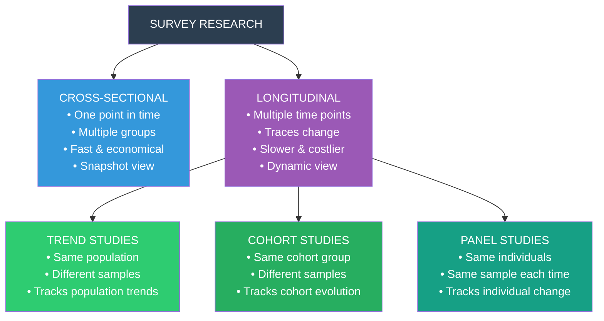

# Survey Types, Question Design, Precautions & Strengths/Limitations

## Introduction

Two of the most consequential decisions in survey research are (1) **when and how many times** to collect data, and (2) **what kind of questions** to ask. The first determines your study's temporal architecture — whether you capture a single snapshot or trace change over time. The second shapes the very nature of the data you'll be working with.

Cross-sectional surveys give you breadth; longitudinal studies give you depth across time. Structured questions give you comparability; unstructured questions give you richness. Understanding these trade-offs — and the practical precautions needed to execute each well — is the mark of a sophisticated researcher.

---

**Source PDFs**:
- 📄 [Block-2/Unit-1.pdf - Pages 9-16](/pdfs/MPC-005%20Research%20Methods/Block-2/Unit-1.pdf)
- 📚 MPC-005 Research Methods in Psychology, IGNOU

---

## 1.5 Types of Survey Research

### The Temporal Dimension of Surveys

The most fundamental classification of survey types is based on **time**:



---

### Cross-Sectional Survey

**Definition**: Data collected from **different groups at a single point in time**.

The "groups" may differ by age, sex, nationality, ethnicity, socioeconomic status, or any other characteristic of interest. The researcher studies multiple groups simultaneously, treating each group as representing a different position on the variable being studied.

**Example from textbook**: Studying the effect of socialisation on children of different age groups in a country — children of ages 5, 8, 12, and 16 are all surveyed at the same time, and differences across age groups are interpreted as reflecting developmental changes.

**This is why cross-sectional studies are also called "age comparative" or "developmental snapshot" studies.**

#### Strengths of Cross-Sectional Surveys

| Strength | Explanation |
|----------|-------------|
| **Time-efficient** | Completed quickly — data from all groups collected simultaneously |
| **Economical** | Less expensive than longitudinal studies (no follow-up required) |
| **No attrition** | Participants lost to follow-up is not a problem since data is collected once |
| **Practical for large samples** | Feasible to survey thousands at once |
| **Cohort effects avoided** | Doesn't follow the same individuals, so no practice or testing effects |

#### Limitations of Cross-Sectional Surveys

| Limitation | Explanation |
|------------|-------------|
| **Cannot establish causality** | Correlational snapshot — no temporal precedence demonstrated |
| **Cohort confound** | Age differences may reflect cohort effects (historical/cultural experiences) not developmental changes |
| **No individual change data** | Cannot track how specific individuals change over time |
| **Snapshot bias** | Situational factors at time of measurement may distort findings |

**Indian Example**: The ASER (Annual Status of Education Report) conducts annual cross-sectional surveys of rural children's learning outcomes across different age groups and grades — providing a national snapshot of educational achievement each year.

---

### Longitudinal Survey

**Definition**: Data collected from the **same population at multiple time points**, allowing the researcher to track change over time.

Longitudinal studies are the only way to:
- Establish temporal precedence (did X precede Y?)
- Track individual trajectories of change
- Study developmental processes as they unfold
- Evaluate long-term effects of interventions

Three major subtypes are distinguished:

---

### Longitudinal Type 1: Trend Studies

**Definition**: The researcher studies the **same population** at different time points, but draws **different samples** each time.

The samples are drawn from the same population but are not the same individuals. Over time, the composition of the sample may naturally change (as members of the population join or leave).

**Example from textbook**: A yearly survey of the number of graduates actively using university library books and journals — each year a different sample of graduates is studied, but all belong to the same population (graduates of that university).

**Key feature**: The population is tracked, not the individuals.

**Strengths**:
- Tracks population-level trends over time
- Less attrition concern (new samples each time)
- Can continue across generations of researchers

**Limitations**:
- Cannot track individual change
- Sample characteristics may shift over time, complicating comparisons
- Cannot establish whether the same individuals changed

**Indian Example**: The Longitudinal Ageing Study in India (LASI), which tracks health and social trends in the elderly population with rotating samples across waves.

---

### Longitudinal Type 2: Cohort Studies

**Definition**: The focus is on a **specific cohort** (a group sharing a defining characteristic, typically birth year or life event). The cohort is studied at multiple time points with **different samples drawn from the same cohort** each time.

A **cohort** is a group united by a shared historical experience: the "Class of 2009," people who migrated to Mumbai in the 2010s, or women who gave birth in 2015.

**Example from textbook**: Investigating the number of 2009 graduates who are actively using the library — then 4 years later, studying another sample of 2009 graduates to see if library usage attitudes have changed within that cohort.

**Key distinction from trend studies**: Cohort studies track a specific generation/cohort; trend studies track a population that may include multiple cohorts.

**Strengths**:
- Traces how a specific generational group evolves
- More specific than trend studies
- Can reveal cohort-specific effects (e.g., how the pandemic cohort of students differs from pre-pandemic cohorts)

**Limitations**:
- Still uses different samples each time (cannot track individual change)
- Cohort may be difficult to define and enumerate
- Long duration required

**Indian Example**: Tracking mental health outcomes of IIT students from the 2015 batch — surveying different samples of 2015-batch IITians at graduation, 5 years post-graduation, and 10 years post-graduation to track career stress trajectories.

---

### Longitudinal Type 3: Panel Studies

**Definition**: The researcher studies the **same individuals** (the "panel") at each data collection point.

This is the most rigorous longitudinal design because it tracks actual individual change, not just population or cohort averages.

**Example from textbook**: Studying library usage trends among graduate students, then asking the **same group** similar questions later to track changes in their habits and the reasons behind those changes.

#### Distinguishing Panel, Cohort, and Trend Studies

| Feature | Trend Study | Cohort Study | Panel Study |
|---------|------------|-------------|------------|
| Same population? | ✅ Yes | ✅ Same cohort | ✅ Yes |
| Same individuals? | ❌ No | ❌ No | ✅ Yes |
| Tracks individual change? | ❌ No | ❌ No | ✅ Yes |
| Attrition concern? | Low | Moderate | ⚠️ High |
| Richest data? | Population trends | Cohort evolution | Individual trajectories |

#### Attrition: The Panel Study's Achilles' Heel

Panel studies face a major practical challenge: **attrition** — the progressive loss of participants over time. Participants move, die, lose interest, become unreachable, or simply refuse to continue. Each wave of data collection typically loses 5-20% of the original panel.

Attrition creates **selection bias** if those who drop out are systematically different from those who remain (e.g., sicker participants, more stressed individuals, or less engaged respondents may be more likely to drop out — systematically distorting findings).

**Indian Context**: Panel studies in India face particularly high attrition due to:
- High internal migration (seasonal workers, rural-urban movement)
- Address instability (no reliable address database)
- Low trust in researchers among marginalised populations
- Cultural and language barriers in follow-up

---

## 1.7 Types of Questions in Survey Research

The design of individual survey questions is both a science and an art. Questions can be broadly classified into **structured** (closed-ended) and **unstructured** (open-ended) types.

### 1.7.1 Structured Questions

Structured questions have **preplanned, predefined formats** — response options are specified in advance. They produce quantitative data amenable to statistical analysis.

Three main types:

#### i) Dichotomous Questions

Questions with **exactly two possible responses**.

**Examples**:
- Do you currently exercise regularly? ☐ Yes ☐ No
- Have you ever experienced symptoms of depression? ☐ Yes ☐ No
- Please indicate your gender: ☐ Male ☐ Female

**Strengths**: Simple, quick to answer, easy to analyse, clear interpretation
**Limitations**: Forces a binary choice; may not capture nuance (e.g., "Yes" to exercise may mean very different things to different respondents)

#### ii) Level of Measurement–Based Questions

Questions designed according to the **level of measurement** of the variable being assessed:

**Nominal-level questions** (classify respondents into categories with no inherent order):
```
Please state the category to which you belong:
□ General    □ OBC    □ SC/ST    □ Other
```
Numbers here only represent labels — they have no mathematical meaning.

**Ordinal-level questions** (rank or preference-based; order matters but intervals are unequal):
```
Please rank the following stress management techniques from most helpful (1) to least helpful (4):
___ Meditation    ___ Exercise    ___ Social support    ___ Music
```
The ranking tells us order but not how much difference exists between ranks.

**Interval-level questions** (the most common in psychological surveys — rating scales with equal intervals):

The **Likert scale** is the most widely used interval-level format in psychological research:

```
Statement: "I feel overwhelmed by my studies most of the time."
1           2           3           4           5
Strongly   Agree   Neither agree  Disagree   Strongly
agree              nor disagree              disagree
```

Likert scales typically use 5, 7, or 9 points. The choice of scale points involves trade-offs:
- **5-point scales**: Simpler, faster; less variability; suitable for general audiences
- **7-point scales**: More nuance; better discrimination; preferred in academic research
- **9-point scales**: Maximum nuance; can be cognitively taxing

#### iii) Filter (Contingency) Questions

Questions where **follow-up questions are only answered by those who gave a specific response to the initial question**. They create branching pathways through the questionnaire.

```
Have you ever attended a mental health professional?
□ Yes → If yes, please answer questions 12-18
□ No  → Please skip to question 19

(For those who answered Yes:)
How many times have you visited a mental health professional in the past year?
□ Once
□ 2-5 times
□ 6-10 times
□ More than 10 times
```

**Benefits**: Avoids irrelevant questions; reduces respondent burden; creates logical flow
**Caution**: Should not exceed 2-3 levels of branching — deeper nesting confuses respondents and complicates analysis

### 1.7.2 Unstructured Questions

Unstructured questions (also called **open-ended questions**) give respondents freedom to answer in their own words, without predefined response options.

**Examples**:
- "How has the COVID-19 pandemic affected your mental health?"
- "What do you find most challenging about your work environment?"
- "Please describe your experience with meditation in your own words."

**Used in**:
- Qualitative components of mixed-methods surveys
- Exploratory research where the range of responses is unknown
- Clinical interviews where individual narrative is the goal

**The researcher's role with unstructured responses**:
- Give **silent probes** (nodding, brief "mm-hmm") to encourage elaboration
- **Verbally encourage**: "Could you tell me more about that?"
- **Ask for clarification**: "When you say 'stressed,' what does that feel like for you?"
- **Maintain empathy**: Show genuine interest without leading the respondent

**Strengths**: Rich, contextual data; captures unexpected responses; allows respondents' own conceptual framework
**Limitations**: Time-consuming to collect and analyse; difficult to compare across respondents; requires skilled interviewers; content analysis needed to quantify

---

## 1.8 Precautions While Designing Survey Instruments

Good instrument design is governed by four core precautions:

### 1. Clarity, Specificity, Relevance, and Brevity

Items must be:
- **Clear**: Unambiguous; no double meanings; no technical jargon
- **Specific**: Ask about one thing at a time (avoid double-barrelled questions like "Do you eat healthily and exercise regularly?")
- **Relevant**: Directly related to the research objectives
- **Brief**: Concise wording; avoid unnecessarily long preambles

**Common pitfalls to avoid**:
- **Leading questions**: "Don't you think the government should do more for mental health?" — guides respondents toward a specific answer
- **Double-barrelled questions**: "Do you exercise and meditate daily?" — respondent may do one but not the other
- **Loaded questions**: Questions with emotionally charged language
- **Ambiguous time frames**: "Do you often feel anxious?" — "often" means different things to different people

### 2. Respondent Capability

Questions must be answerable by the target population. Consider:
- **Literacy level**: Can all respondents read the questions? (Critical in India where adult literacy averages around 77%)
- **Cognitive accessibility**: Are questions too complex for elderly or cognitively impaired respondents?
- **Cultural familiarity**: Are all respondents familiar with the concepts being asked about?
- **Language**: Is the questionnaire available in the respondents' primary language?

### 3. Ethical Sensitivity and Empathy

The researcher must:
- **Respect respondents' dignity**: Avoid questions that demean, shame, or stereotype
- **Obtain informed consent**: Participants must know what they're agreeing to answer
- **Protect privacy**: Don't collect identifying information unnecessarily
- **Allow withdrawal**: Respondents should be able to skip questions without penalty
- **Be culturally sensitive**: Questions about caste, religion, sexuality, and mental illness require particular care in the Indian context

### 4. Eliminate Researcher Bias

The researcher's own biases can infiltrate:
- **Question wording**: Reflecting researcher assumptions
- **Response option design**: Omitting certain categories that reflect the researcher's worldview
- **Order effects**: Placing questions in an order that primes certain responses

Strategies to minimise bias: peer review of the instrument; cognitive interviewing (ask respondents to think aloud while answering); independent expert review; cross-cultural adaptation for diverse populations.

---

## 1.9 Advantages and Disadvantages of Survey Research

### Advantages

| Advantage | Details |
|-----------|---------|
| **Cost-effective** | Reach large samples at fraction of experimental research cost |
| **Temporal flexibility** | Can track change over time (longitudinal) or capture broad snapshot (cross-sectional) |
| **Large samples feasible** | Statistical power from large N; more stable estimates |
| **Ecological validity** | Studies behaviour in natural contexts, not artificial lab settings |
| **Versatile** | Can study almost any psychological variable through appropriate questionnaire |
| **Standardisation** | Same questions to all participants; comparable data |
| **Non-intrusive** | Doesn't require observation or experimental manipulation |

### Disadvantages

| Disadvantage | Details |
|-------------|---------|
| **Self-report bias** | Respondents may misremember, exaggerate, or minimise; social desirability bias |
| **Privacy concerns in group settings** | Group-administered surveys may inhibit honest answers on sensitive topics |
| **Attrition in longitudinal studies** | High dropout rates in panel studies compromise representativeness |
| **Cannot establish causation** | Correlational design — no manipulation means no causal inference |
| **Superficial depth** | Structured surveys sacrifice depth for breadth |
| **Non-response bias** | Those who don't respond may systematically differ from those who do |
| **Cultural response styles** | Acquiescence bias (tendency to agree), extreme response bias, and mid-point selection vary across cultures |

---

## 1.10 Difficulties and Issues in Survey Research

The IGNOU textbook identifies four major issue categories:

### 1. Issues in Selecting the Type of Survey
- Which survey type (cross-sectional vs. longitudinal) is most appropriate?
- Is the researcher comfortable with the language of the target population?
- What geographic restrictions apply?
- How to handle dispersed populations (e.g., across India's 28 states and 8 UTs)?

### 2. Issues in Survey Instruments
- Are questions clear, specific, and appropriate for the population?
- Is the length manageable (respondent fatigue)?
- Do response scales match the nature of the variable?

### 3. Bias Issues
- Researcher bias in question design and administration
- Social desirability bias in respondents
- Interviewer bias in face-to-face settings (appearance, tone, mannerisms affecting responses)
- Cultural bias in imported Western instruments

### 4. Administrative Issues
- Cost management
- Mode of survey (paper, online, telephone, in-person)
- Geographic feasibility
- Timeline management
- Training of data collectors

---

## 🧠 Memory Aid: The "TLC-PA" Survey Types Mnemonic

**T**rend (same population, different samples)
**L**ongitudinal umbrella — all time-based studies
**C**ohort (same cohort, different samples)
**P**anel (same individuals)
**A**nd — **C**ross-sectional (different groups, one time)

For question types: **"D-L-F" = Dichotomous, Level-based (Likert), Filter**

---

## 📚 External Resources

### Essential Reading
1. **Shadish, W.R., Cook, T.D. & Campbell, D.T. (2002)** — *Experimental and Quasi-Experimental Designs* — Coverage of cross-sectional vs. longitudinal validity threats
2. **Singer, J.D. & Willett, J.B. (2003)** — *Applied Longitudinal Data Analysis* — Definitive text on panel and cohort study analysis
3. **Spector, P.E. (1992)** — *Summated Rating Scale Construction* — Classic guide to Likert scale design

### Wikipedia Articles
- 🌐 [Cross-sectional Study](https://en.wikipedia.org/wiki/Cross-sectional_study) — Design features, strengths, and limitations with research examples
- 🌐 [Longitudinal Study](https://en.wikipedia.org/wiki/Longitudinal_study) — Overview of panel, cohort, and trend designs with famous examples
- 🌐 [Likert Scale](https://en.wikipedia.org/wiki/Likert_scale) — History, construction, statistical treatment, and common misuses

### Educational Videos
- 🎥 [**Cross-sectional vs. Longitudinal Studies — Research Methods**](https://www.youtube.com/watch?v=E4Xsl5cVIBA) — Clear visual comparison of design types with examples (≈8 min)
- 🎥 [**Designing Survey Questions — SAGE Research Methods**](https://www.youtube.com/watch?v=5dZ3YsFbB7k) — Practical guidance on question wording and response formats (≈10 min)

### Recent Research
- 📑 Spector, P.E. (2019). Do studies of self-rated constructs suffer from response consistency artifacts? *The importance of distinguishing within-person from between-person effects. Industrial and Organizational Psychology, 12*, 1–10 — On self-report biases in survey research
- 📑 Tourangeau, R. & Yan, T. (2007). Sensitive questions in surveys. *Psychological Bulletin, 133*(5), 859-883 — How to handle sensitive survey questions
- 📑 Podsakoff, P.M. et al. (2022). Recommendations for reducing the occurrence of common method bias in behavioral and organizational research. *Annual Review of Organizational Psychology and Organizational Behavior, 10* — Current best practices for reducing survey bias

---

## ✅ Self-Assessment Questions

**Q1 (Classification):** For each scenario, identify the survey type (cross-sectional, trend, cohort, or panel study) and explain your reasoning:
- (a) ASER surveys 500 children from rural districts each year, selecting a new sample each time
- (b) A researcher tracks 300 IIM graduates from the batch of 2018 annually for 10 years
- (c) A psychologist compares stress levels of 10-year-olds, 15-year-olds, and 20-year-olds in Mumbai in 2024
- (d) A researcher studies the 2010 flood survivors in Andhra Pradesh at 1 year, 5 years, and 10 years post-flood using different samples each time

**Q2 (Question Design):** Write one example each of: (a) a dichotomous question; (b) a nominal-level question; (c) an ordinal-level question; (d) a Likert-scale question; and (e) a filter question — all for a survey studying mental health among Indian college students.

**Q3 (Evaluation):** Identify the specific flaws in each of the following survey questions and rewrite them:
- (a) "Don't you agree that social media is harmful to young people's mental health?"
- (b) "Do you exercise regularly and maintain a healthy diet?"
- (c) "How often do you feel sad?" with response options: Rarely / Sometimes / Often

**Q4 (Comparison):** Compare panel studies and cohort studies in terms of: (a) what each tracks, (b) attrition risk, (c) richness of data, and (d) an appropriate Indian research example for each.

**Q5 (Critical thinking):** A research team wants to study the long-term psychological effects of the 2004 Tsunami on survivors in Tamil Nadu's coastal communities. They propose a panel study following the same 200 survivors over 20 years. Evaluate the feasibility and ethical considerations of this design. What alternative longitudinal design might be more practical?

<details>
<summary>💡 Answer Guide</summary>

**Q1:**
- (a) **Trend study** — same population (rural children), different samples each year, tracking population-level trends
- (b) **Panel study** — same 300 individuals tracked over time; individual trajectories can be followed
- (c) **Cross-sectional study** — different age groups compared at a single point in time; developmental snapshot
- (d) **Cohort study** — same cohort (2010 flood survivors) studied at multiple time points with different samples from the cohort each time

**Q2:** (a) Dichotomous: "Have you ever sought help from a mental health professional? □ Yes □ No"
(b) Nominal: "What is your primary academic stream? □ Arts □ Commerce □ Science □ Professional/Technical"
(c) Ordinal: "Rank the following campus stressors from most stressful (1) to least stressful (4): ___ Exams ___ Relationships ___ Financial pressure ___ Academic workload"
(d) Likert: "I feel able to cope with the pressures of college life. 1=Strongly Disagree, 2=Disagree, 3=Neither, 4=Agree, 5=Strongly Agree"
(e) Filter: "Have you experienced symptoms of anxiety in the past month? □ Yes → Please complete Section B (questions 15-25) □ No → Please proceed to Section C (question 26)"

**Q3:**
- (a) **Flaw**: Leading question (assumes a position). **Rewrite**: "To what extent do you think social media affects mental health in young people? □ Very negatively □ Slightly negatively □ No effect □ Slightly positively □ Very positively"
- (b) **Flaw**: Double-barrelled (asks about two behaviours simultaneously). **Rewrite**: Separate into two questions — "How many days per week do you engage in physical exercise?" and "How would you describe your typical diet?"
- (c) **Flaw**: "Sad" is vague; time frame is absent; "Rarely/Sometimes/Often" are not anchored to specific frequencies. **Rewrite**: "In the past two weeks, how many days have you felt persistently sad or depressed? □ 0 days □ 1-3 days □ 4-7 days □ 8-11 days □ 12-14 days"

**Q4:**
| Feature | Panel Study | Cohort Study |
|---------|------------|-------------|
| What it tracks | Same individuals' change | Same generation's/cohort's evolution |
| Attrition risk | Very high | Moderate |
| Data richness | Highest (individual trajectories) | Moderate (group-level trends) |
| Indian example | Following 500 AIIMS MBBS students from 2020 to 2030 annually | Tracking the 2015-COVID generation of students at multiple intervals using different samples |

**Q5:** Feasibility challenges: Over 20 years, attrition will be severe — survivors may migrate (high coastal mobility), die, refuse participation due to traumatic recall. Maintaining 200 participants over 20 years in a low-resource coastal community is extraordinarily difficult. Ethical considerations: Repeatedly asking Tsunami survivors about trauma may cause re-traumatisation; informed consent must be renewed at each wave; participants must have the right to withdraw at any stage without penalty; culturally appropriate debriefing and psychological support must be available at each data collection point; the research team has an obligation to provide community benefit in exchange for long-term participant commitment. **Alternative**: A **cohort study** using different samples of Tsunami survivors at each wave (1-year, 5-year, 10-year, 20-year intervals) — similar temporal coverage without the burden on the same individuals; lower attrition risk; still captures cohort-level psychological trajectories.

</details>

---

## 🔗 Related Topics

- [Survey Research: Concept, Steps & Instruments](/mpc-005/block-2/survey-research-concept-steps-instruments) — Foundation for this file
- [Sampling Methods](/mpc-005/block-1/sampling-methods-probability-nonprobability) — How participants are selected
- [Reliability & Validity](/mpc-005/block-1/reliability-concepts-methods) — Ensuring survey instruments measure what they claim
- [Variables: Meaning & Types](/mpc-005/block-1/variables-meaning-types-sor) — Survey questions operationalise variables
