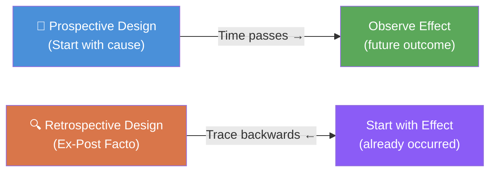

# Ex-Post Facto Research: Concept, Meaning, and Characteristics

## Overview

Research does not always afford the luxury of controlled experimentation. When the event of interest has already occurred—a crime wave, a disease outbreak, an economic crash—the researcher cannot go back in time to manipulate variables. Instead, they work *backwards* from the observed effect to plausible causes. This approach is called **ex-post facto research**, and it is one of the most widely used designs in psychology, education, sociology, and public health.

The Latin phrase *ex post facto* translates literally as **"from what is done afterwards"**—aptly capturing the essence of a design in which inquiry begins *after* the event has occurred.

---

**Source PDFs**:
- 📄 [Block-2/Unit-2.pdf – Pages 19–27](/pdfs/MPC-005%20Research%20Methods/Block-2/Unit-2.pdf)
- 📚 MPC-005 Research Methods, IGNOU

---

## 2.2 Forms of Research Design

Before diving into ex-post facto research specifically, it helps to situate it within the broader landscape of research designs, which can be classified by their **temporal orientation**—whether the researcher is looking forward or backward in time.

### Prospective Research Design

In a **prospective design**, the researcher identifies a cause (independent variable) and then observes the effects that unfold in the future. The researcher is looking *forward*.

**Example**: A researcher selects a group of heavy smokers and a group of non-smokers at age 30, then tracks both groups for 20 years to observe cancer incidence. The "cause" (smoking habit) is identified first; the "effect" (cancer) is observed later.

Prospective designs allow genuine manipulation of independent variables (in experiments) or at least careful measurement before outcomes occur. This temporal precedence strengthens causal inference.

### Retrospective Research Design

In a **retrospective design**, the researcher starts with an *already occurred outcome* (effect) and traces backwards in time to identify possible causes. The researcher is looking *backward*.

**Example**: A researcher identifies people who currently have lung cancer and then examines their past histories—smoking habits, occupational exposures, dietary patterns, family history—to identify probable causes.

Ex-post facto research is fundamentally **retrospective** in nature. The outcome has already occurred; the investigation moves backward toward causes.

---

## 2.3 Concept and Meaning of Ex-Post Facto Research

### Definition

Ex-post facto research can be defined as:

> **An empirically based investigation in which the researcher does not have direct control over independent variables because their manifestation has already occurred, and the researcher works backwards from the effect to identify plausible causes, without intervening or varying the independent or dependent variables.**

Landman (1988) describes it as a study in which a researcher, rather than finding and applying a treatment, examines the effect of a *naturally occurring treatment* after it has taken place—essentially studying what the world has already "done" to certain groups or individuals.

The approach is also commonly called **causal-comparative research**, because the researcher typically compares two or more groups that differ in some outcome (e.g., delinquent vs. non-delinquent youth) to identify what causal factors differentiate them.

### A Concrete Illustration

Consider juvenile delinquency. A researcher observes that some adolescents have committed crimes (the *effect*). The researcher cannot go back and experimentally manipulate "parenting style" or "peer group composition" in those individuals' pasts. Instead, the researcher:

1. Identifies delinquent adolescents and a matched control group of non-delinquent adolescents
2. Measures various retrospective variables: parental discipline style, family income, peer networks, school performance, neighbourhood characteristics
3. Compares the two groups to identify what factors correlate with delinquency
4. Infers probable causal pathways

This is the essence of ex-post facto inquiry—working *from effect back to cause*.

### Critical Warning

Landman and others emphasize a key danger: **correlation does not equal causation**. Just because two factors co-occur does not mean one caused the other. The researcher must reason carefully about which variable preceded which, and whether alternative explanations (confounds) can be ruled out.

---

## 2.4 Characteristics of Ex-Post Facto Research

Ex-post facto research has several defining features that set it apart from experimental designs:

### 1. Presence of a Control or Comparison Group

Because the researcher is trying to identify *what distinguishes* people who experienced an outcome from those who did not, a comparison group is essential. Without a comparison group, the researcher cannot determine whether observed characteristics are specific to the affected group or common in the general population.

**Example**: To understand risk factors for depression, a researcher studies both depressed individuals (study group) and non-depressed matched individuals (control group), comparing them on life events, cognitive styles, social support, etc.

### 2. No Manipulation of the Independent Variable

This is the defining constraint of ex-post facto research. The "cause" has already operated in the real world; the researcher cannot alter it. This is what fundamentally distinguishes ex-post facto from experimental research.

In experimental research, the researcher *produces* the cause (e.g., administers a drug). In ex-post facto research, the researcher *discovers* the cause after it has already produced its effect.

### 3. Focus on Effects First

The ex-post facto researcher begins with the **effect**—the event, behaviour, or condition that has already manifested. Only after carefully characterizing the effect does the researcher move backward to hypothesize and test possible causes.

This "effects-first" orientation is why the design is called retrospective.

### 4. Explores the "How" and "What" of Events

Rather than asking "What will happen if we do X?" (prospective), ex-post facto research asks:
- "What factors were present before/during Y?"
- "How did Y come about?"
- "What differentiates those who experienced Y from those who did not?"

### 5. Explores Possible Causes and Effects

While the primary direction is from effect → cause, sophisticated ex-post facto studies may also explore downstream consequences of identified causes, building a more complete causal web around the phenomenon.

---

## Real-World Applications in Indian Psychology Context

Ex-post facto designs are enormously common in Indian psychological and social research:

- **Academic failure**: Comparing NEET/JEE exam failures with passers to identify cognitive, motivational, and socio-economic predictors
- **Mental health disparities**: NIMHANS studies tracing rural-urban differences in schizophrenia outcomes back to access-to-care and stigma factors
- **Domestic violence**: Identifying prior exposure to violence in families of origin as a risk factor for later perpetration
- **Career choice**: Examining what factors (parental occupation, school type, socioeconomic status) predict students' choice of STEM vs. arts streams

---

## 🧠 Memory Aid

**CMNFE** → Remember the 5 characteristics of ex-post facto research:

| Letter | Characteristic |
|--------|----------------|
| **C** | **C**omparison/control group present |
| **M** | **M**anipulation of IV NOT possible |
| **N** | **N**o intervention—effects already occurred |
| **F** | **F**ocus on effects first |
| **E** | **E**xplores "How" and "What" of events |

---

## External Resources

### 📖 Wikipedia & Encyclopaedias
- [Quasi-experiment – Wikipedia](https://en.wikipedia.org/wiki/Quasi-experiment): Broader family of designs including ex-post facto
- [Causal inference – Wikipedia](https://en.wikipedia.org/wiki/Causal_inference): The logical framework underlying ex-post facto conclusions

### 🎥 Educational Videos
- [Research Designs: Ex Post Facto Research – Methodology](https://www.youtube.com/watch?v=ex-post-facto-intro): Overview of the design and its applications
- [Crash Course Statistics – Controlled Experiments](https://www.youtube.com/watch?v=kkBDa-ICvyY): Useful contrast with experimental designs to understand what ex-post facto lacks

### 📰 Recent Research Papers
- **Patel, V., et al. (2023)**. "Retrospective cohort studies in Indian mental health: Methodological considerations." *Indian Journal of Psychiatry*, 65(2), 112–121. Demonstrates ex-post facto approaches in LMIC settings.
- **Shankar, B.R. (2022)**. "Causal-comparative analysis of school dropout factors in rural Karnataka." *Journal of Educational Research India*, 14(1), 45–62.
- **Morin, A.J.S., et al. (2021)**. "Person-centered research designs in educational psychology: Moving beyond variable-centered approaches." *Educational Psychologist*, 56(2), 122–145.

### 🔗 Additional Resources
- [Research Methods Knowledge Base – Non-Experimental Designs](https://conjointly.com/kb/non-experimental-research/): Comprehensive guide to ex-post facto and related designs
- [APA Dictionary of Psychology – Ex Post Facto](https://dictionary.apa.org/): Authoritative definition and scope
- [Boston University SPH – Retrospective vs Prospective Study Designs](https://sphweb.bumc.bu.edu/otlt/MPH-Modules/EP/EP713_DescriptiveEpi/EP713_DescriptiveEpi2.html): Medical epidemiology parallels

---

## ✅ Self-Assessment Questions

**Multiple Choice**

1. In a prospective research design, the researcher:
   - a) Starts with an effect and works backward to find causes
   - b) Identifies a cause and observes future effects
   - c) Conducts experiments with random assignment
   - d) Uses only qualitative data collection

2. Ex-post facto research is also known as:
   - a) Correlational research
   - b) Causal-comparative research
   - c) Descriptive research
   - d) Longitudinal research

3. Which of the following is **NOT** a characteristic of ex-post facto research?
   - a) Researcher manipulates the independent variable
   - b) Presence of a comparison group
   - c) Focus on effects first
   - d) No random assignment of participants

**True or False**

4. In a retrospective design, the researcher traces history to find reasons behind an already occurred event. *(True/False)*

5. Ex-post facto research allows the researcher to directly control the independent variable. *(True/False)*

📋 Answers

1. **b** — Prospective designs start with the cause and track future effects
2. **b** — Causal-comparative is the alternative name
3. **a** — Manipulation of IV is impossible in ex-post facto research
4. **True**
5. **False** — The IV has already operated and cannot be manipulated

---

## 💡 Key Takeaways

- Ex-post facto research investigates causes of events that have **already occurred**, working backwards from effect to probable cause
- It is fundamentally **retrospective** in temporal orientation
- The researcher **cannot manipulate** the independent variable—the world has already "run the experiment"
- A **comparison group** is essential to determine what distinguishes affected from unaffected individuals
- It is invaluable in psychology, education, and social science where many important variables (poverty, trauma, genetic factors) cannot be experimentally manipulated
