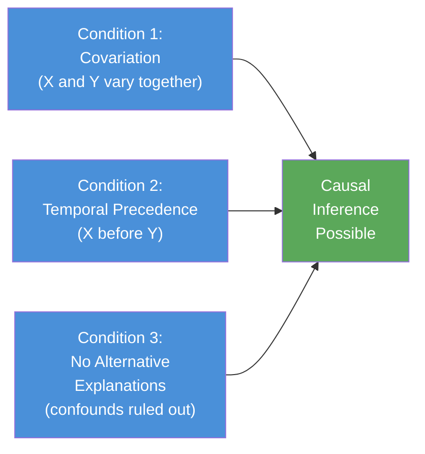

# Ex-Post Facto vs Experimental Research: Differences and Causal Inference

## Overview

Understanding *when and why* we can claim that X *caused* Y is one of the most challenging problems in behavioural science. This file explores the critical differences between experimental and ex-post facto research—and the conditions that must be met before any causal conclusion can be drawn from ex-post facto data.

---

**Source PDFs**:
- 📄 [Block-2/Unit-2.pdf – Pages 22–24](/pdfs/MPC-005%20Research%20Methods/Block-2/Unit-2.pdf)
- 📚 MPC-005 Research Methods, IGNOU

---

## 2.5 Differences Between Experimental and Ex-Post Facto Research

Both designs investigate relationships between variables and aim for valid conclusions. But they differ fundamentally in the researcher's relationship to the independent variable.

### Comparison Table

| Dimension | Experimental Research | Ex-Post Facto Research |
|-----------|----------------------|------------------------|
| **Control over IV** | Researcher directly *manipulates* the IV | Researcher has *no control*; IV has already operated |
| **Randomisation** | Random assignment to groups is possible | Random assignment is impossible—groups self-select |
| **Variable manipulation** | Variables can be altered during the study | Variables cannot be altered—already occurred |
| **Causal strength** | Strong: manipulation + randomisation → high internal validity | Weaker: must rule out alternative explanations |
| **Interpretation** | Clearer—researcher engineered the IV → effect link | More complex—multiple possible causes for one effect |
| **Ethical constraints** | Sometimes variables cannot be ethically manipulated | Can study naturally occurring "treatments" that can't be imposed |
| **External validity** | Lab conditions may not generalise | Often uses real-world events → higher ecological validity |
| **Temporal direction** | Prospective: cause → observe future effects | Retrospective: effect already occurred → trace causes |

### Why This Matters for Causal Inference

The gold standard for establishing causality is the **randomized controlled experiment (RCT)**. When a researcher randomly assigns participants to conditions and manipulates the IV, they can control for confounding variables by randomisation—so differences in outcome can be confidently attributed to the IV.

In ex-post facto research, there is **no random assignment**. People who experienced different "treatments" (e.g., abusive childhoods vs. nurturing childhoods) were not randomly assigned to those conditions—life assigned them. This means:

- Individuals in different groups may differ on *many* variables simultaneously
- We cannot be sure which of those differences caused the observed outcome
- Alternative explanations always remain possible

---

## 2.6 Essentials for Inferring Causal Relationships

Even in ex-post facto research, the researcher *can* make reasonable causal inferences if three fundamental conditions are met. These conditions, rooted in the philosophy of science, are known as the **requirements for causal inference**.

### Condition 1: Associative Variation (Covariation)

**Definition**: For X to be considered a cause of Y, changes in X must be systematically associated with changes in Y.

If smoking causes cancer, then higher levels of smoking should be associated with higher rates of cancer. If no relationship exists between two variables, one cannot be the cause of the other.

**In ex-post facto terms**: The researcher must demonstrate a statistically significant association between the suspected cause (X) and the observed effect (Y).

**Example**: Children raised in homes with domestic violence (X) show higher rates of aggressive behaviour in school (Y). The association must be demonstrable in the data.

### Condition 2: Systematic Order of Events (Temporal Precedence)

**Definition**: The cause (X) must occur *before* or *simultaneously with* the effect (Y). X cannot follow Y and still be its cause.

This is the **time-order** requirement—cause must precede effect.

**The challenge in ex-post facto research**: Because data are collected retrospectively, establishing temporal order can be difficult. Participants may misremember the sequence of events, or records may be incomplete.

**Example**: If depression in a parent is associated with a child's anxiety disorder, we need to establish that the parent's depression preceded the child's anxiety onset—not the other way around (a depressed child could cause parental depression).

### Condition 3: Elimination of Alternative Explanations (Ruling Out Confounds)

**Definition**: The researcher must demonstrate that no other plausible variable (confound) can explain the observed X → Y relationship.

This is the most difficult condition to satisfy in ex-post facto research, because without random assignment, many variables may differ between groups simultaneously.

**Strategies used**:
- **Matching**: Pair individuals in the study group with comparable individuals in the comparison group on key confounding variables
- **Statistical control**: Use multiple regression or ANCOVA to partial out the effects of known confounds
- **Multiple comparison groups**: Compare the affected group against several different control groups to triangulate causes

### The Fundamental Problem of Causal Inference

Philosopher David Hume identified centuries ago that we never *directly observe* causation—we only observe correlation. We infer causation from patterns of co-occurrence, time order, and the elimination of alternatives. Ex-post facto research operates squarely in this inferential space.

The **counterfactual framework** in modern causal inference asks: "What would have happened to this person if X had not occurred?" Since we can never observe the counterfactual for any individual (we can't replay life), we approximate it through comparison groups.

---

## Ethical Dimension: Why Ex-Post Facto Research is Indispensable

Many critical psychological questions **cannot** be studied experimentally for ethical reasons:

| Research Question | Why Experiment is Impossible | Ex-Post Facto Solution |
|-------------------|------------------------------|------------------------|
| Does childhood abuse cause adult PTSD? | Cannot ethically abuse children | Compare adults with/without abuse histories |
| Does poverty cause cognitive developmental delays? | Cannot randomly assign children to poverty | Compare children from different socioeconomic backgrounds |
| Does exposure to war cause long-term trauma? | Cannot ethically expose people to war | Study veterans vs. matched civilians |
| Does maternal smoking cause lower birth weight? | Cannot ethically have mothers smoke during pregnancy | Compare birth weights of children born to smokers vs. non-smokers |

This ethical dimension makes ex-post facto research not just useful but *necessary* for a complete understanding of human psychology.

---

## Indian Research Context

The distinction between experimental and ex-post facto research is critically important in Indian psychological research contexts:

- **Mental health studies**: NIMHANS researchers studying the causes of schizophrenia cannot experimentally induce psychosis—they study individuals who have already developed the disorder vs. matched controls
- **Educational psychology**: Studies comparing academic performance of students from rural vs. urban schools use ex-post facto designs because students cannot be randomly assigned to geographic locations
- **ICSSR-funded research**: Much ICSSR social science funding supports ex-post facto studies of social inequalities where experimental manipulation is ethically impossible
- **Disaster research**: Studying the psychological impact of natural disasters (floods, earthquakes) in India uses ex-post facto designs comparing affected vs. unaffected communities

---

## 🧠 Memory Aid

**ACE** — The three conditions for causal inference:

| Letter | Condition | Key Question |
|--------|-----------|--------------|
| **A** | **A**ssociative variation (covariation) | Do X and Y vary together? |
| **C** | **C**hronological order (temporal precedence) | Does X come before Y? |
| **E** | **E**limination of alternatives (no confounds) | Is there another explanation? |

Without all three ACE conditions met, causal inference is premature.

---

## External Resources

### 📖 Wikipedia & References
- [Causality (Wikipedia)](https://en.wikipedia.org/wiki/Causality): Philosophical foundations of cause-effect reasoning
- [Confounding (Wikipedia)](https://en.wikipedia.org/wiki/Confounding): The key challenge in ex-post facto causal inference

### 🎥 Educational Videos
- [Correlation vs Causation – CrashCourse Statistics #8](https://www.youtube.com/watch?v=GtV-VYdNt_g): Essential viewing on why correlation ≠ causation
- [Internal Validity and Confounding Variables](https://www.youtube.com/watch?v=internal-validity-research): Why experimental control is the gold standard

### 📰 Research Papers
- **Rohrer, J.M. (2018)**. "Thinking clearly about correlations and causation: Graphical causal models for observational data." *Advances in Methods and Practices in Psychological Science*, 1(1), 27–42. Excellent review of causal inference methods for non-experimental data.
- **Pearl, J., & Mackenzie, D. (2018)**. *The Book of Why: The New Science of Cause and Effect*. Chapter 1 covers the foundations of causal reasoning directly applicable to ex-post facto designs.
- **Shadish, W.R., Cook, T.D., & Campbell, D.T. (2002)**. *Experimental and Quasi-Experimental Designs for Generalized Causal Inference*. Classic reference for understanding internal validity threats.

### 🔗 Additional Resources
- [Stanford Encyclopedia of Philosophy – Causation](https://plato.stanford.edu/entries/causation-counterfactual/): Deep dive into the philosophy of causation
- [Research Methods in Psychology – Comparison of Designs](https://opentextbc.ca/researchmethods/): Open textbook with clear comparisons
- [MIT OpenCourseWare – Causal Inference](https://ocw.mit.edu/courses/statistics/): Advanced treatment of causal methods

---

## ✅ Self-Assessment Questions

**Short Answer**

1. List two advantages of experimental research over ex-post facto research in establishing causality.

2. A researcher finds that people who eat breakfast regularly have higher academic performance. Identify which of the three conditions for causal inference may be difficult to establish in this ex-post facto finding.

3. Why can't researchers randomly assign participants in ex-post facto studies?

**True or False**

4. In an experimental study, the researcher can use random assignment to control for confounding variables. *(True/False)*

5. Temporal precedence means the effect must occur before the cause. *(True/False)*

**Application Question**

6. A researcher studies whether attending private schools (vs. government schools) causes higher scores on competitive exams in India. Explain why this would be an ex-post facto study and what the major causal inference challenges would be.

📋 Answers

1. **Experimental advantages**: (i) Can randomly assign to conditions, ruling out individual differences as confounds; (ii) Can directly manipulate the IV, establishing a clear causal mechanism
2. **Temporal precedence** is hardest to establish (does breakfast cause performance, or do high-performing students happen to eat breakfast for other reasons?). Also **confounds** (socioeconomic status may cause both).
3. Because the "cause" (e.g., exposure to poverty, trauma, etc.) has already occurred naturally—the researcher is studying real-world events, not creating them.
4. **True**
5. **False** — The cause must occur *before* the effect (temporal precedence = cause precedes effect)
6. It's ex-post facto because students were not randomly assigned to school type. Major challenges: (i) Family income is a confound (wealthy families select private schools *and* invest in tutoring); (ii) Prior ability differences between school types; (iii) Geographic factors.

---

## 💡 Key Takeaways

- Experimental research allows **causal certainty** through manipulation + randomisation; ex-post facto allows only **causal inference** through careful reasoning
- The three ACE conditions—**covariation, temporal precedence, elimination of confounds**—must all be met for ex-post facto causal conclusions to be defensible
- Ex-post facto designs are ethically necessary for studying many psychological phenomena (abuse, trauma, poverty) that cannot be experimentally imposed
- Indian social science research relies heavily on ex-post facto designs for studying structural inequalities and mental health outcomes
