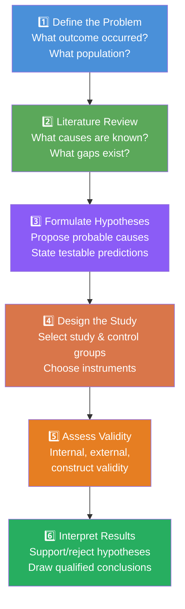
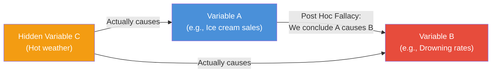

# Ex-Post Facto Research: Steps, Strengths, Weaknesses, and Post Hoc Fallacy

## Overview

Knowing *what* ex-post facto research is and *why* it differs from experiments is the foundation. This file focuses on the **practical conduct** of ex-post facto studies—the step-by-step process researchers follow—and then critically evaluates its strengths and weaknesses. We end with one of the most important logical errors in science: the **post hoc fallacy**, which is the particular cognitive trap that ex-post facto researchers must constantly guard against.

---

**Source PDFs**:
- 📄 [Block-2/Unit-2.pdf – Pages 23–27](/pdfs/MPC-005%20Research%20Methods/Block-2/Unit-2.pdf)
- 📚 MPC-005 Research Methods, IGNOU

---

## 2.7 Steps of Ex-Post Facto Research

Two authoritative frameworks describe the steps of ex-post facto research: **Isaac & Michael (1971)** and **Jacobs et al. (1992)**. Together they provide a comprehensive map of the process.

### Framework 1: Isaac and Michael (1971) — Six Steps

#### Step 1: Determining the Problem

The researcher must first identify, define, and clearly articulate the research problem. This is not merely selecting a topic—it involves:

- Specifying the **effect** to be studied (What outcome/event has already occurred?)
- Defining the **populations** of interest (Who experienced this outcome? Who did not?)
- Clarifying the **conceptual framework** (What theory suggests what causes this effect?)
- Stating the research question precisely

**Example problem statement**: "What factors in early childhood differentiate adolescents who develop clinical anxiety disorders from those who do not?"

#### Step 2: Literature Review

Before hypothesising about causes, the researcher must survey existing knowledge. A thorough literature review:

- Identifies factors already linked to the outcome in prior research
- Reveals methodological limitations of previous studies to avoid
- Provides theoretical frameworks to guide hypothesis generation
- Helps the researcher identify the most important potential causes to investigate

In India, databases like MEDLINE, PsycINFO, Shodhganga, and ICSSR's research registry are key sources for literature review in psychological ex-post facto studies.

#### Step 3: Formulation of Hypotheses

Based on theory and literature, the researcher proposes specific, testable hypotheses about probable causes. Because ex-post facto research involves multiple possible causes for a single effect, multiple hypotheses are typically formulated.

**Example hypotheses for juvenile delinquency**:
- H₁: Adolescents with delinquent behaviour will have experienced significantly more parental rejection compared to non-delinquent controls
- H₂: Delinquent adolescents will report significantly higher levels of peer pressure toward antisocial behaviour
- H₃: Lower socioeconomic status will be a significant predictor of delinquency even controlling for family warmth

#### Step 4: Designing the Approach

This involves crucial methodological decisions:

**Sample selection**: The researcher must identify:
- The **study group** (individuals who experienced the outcome)
- The **control/comparison group** (individuals who did not experience the outcome, matched on relevant variables)

**Matching** is critical: If the study group is predominantly male, young, and urban, the control group should also be predominantly male, young, and urban—so that these variables don't confound the comparison.

**Instrument selection**: Appropriate measures are chosen or constructed for each hypothesised causal variable. Existing validated scales are preferred; new instruments require their own validation.

**Statistical plan**: The researcher selects appropriate analyses (chi-square, t-tests, logistic regression, multiple regression) to test each hypothesis.

#### Step 5: Validity of the Research

The researcher must critically examine threats to validity:

- **Internal validity**: Are the group differences actually due to the hypothesised cause, or could confounds explain them?
- **External validity**: Can findings be generalised beyond the study sample?
- **Construct validity**: Do the measures actually capture the constructs they claim to measure?

This step requires intellectual honesty about what the study can and cannot conclude.

#### Step 6: Interpretation of Conclusions

The final step involves analysing results and drawing carefully qualified conclusions:

- Which hypothesised causes received empirical support?
- What is the magnitude of the effect?
- What alternative explanations remain viable?
- What are the implications for theory and practice?
- What questions remain for future research?

Crucially, the researcher selects the "best supported" causal explanation while acknowledging competing possibilities.

---

### Framework 2: Jacobs et al. (1992) — Four Steps

Jacobs et al. offer a more streamlined framework with four stages:

| Step | Name | Key Activity |
|------|------|--------------|
| **1** | State the problem | Define the outcome event and research question |
| **2** | Determine groups | Select study group and proportionally matched comparison group |
| **3** | Collect data | Use questionnaires, interviews, literature search |
| **4** | Interpret findings | Accept or reject hypotheses; draw qualified causal conclusions |



---

## 2.8 Strengths and Weaknesses of Ex-Post Facto Research

### ✅ Strengths

**1. Ethically feasible when experiments are not**

Many of the most important variables in psychology—childhood trauma, poverty, abuse, genetic predispositions—cannot be ethically manipulated in experiments. Ex-post facto research allows these crucial areas to be studied at all.

**2. Applicable to a wide range of behavioural phenomena**

Particularly valuable in:
- Sociological variables (delinquency, criminal behaviour, social mobility)
- Educational variables (academic achievement, school dropout, learning disabilities)
- Clinical variables (mental disorders, addiction, chronic illness)
- Developmental variables (attachment patterns, adverse childhood experiences)

**3. Economical and time-efficient**

Compared to prospective longitudinal studies that may follow participants for decades, retrospective ex-post facto studies collect past-history data at a single point in time, significantly reducing cost and time.

**4. High ecological validity**

Because ex-post facto research studies real-world events (not laboratory simulations), findings often have strong ecological validity and direct relevance to applied settings.

**5. Allows researcher judgment in synthesis**

The researcher can integrate multiple sources of retrospective information and apply theoretical judgment to identify the most parsimonious causal explanation.

---

### ❌ Weaknesses and Limitations

**1. Cannot manipulate independent variables**

The researcher works with the independent variable as it has already occurred in the world. This means the researcher cannot:
- Vary the dose or intensity of the "treatment"
- Control when the treatment occurred
- Ensure the treatment was the same for all participants

**2. Cannot randomly assign participants**

Without random assignment, the study and comparison groups may differ on many variables simultaneously. Any of these differences could be the "true" cause of the observed outcome.

**3. Multiple possible causes for a single effect**

In the real world, effects usually have multiple causes. Distinguishing which cause (or combination of causes) produced the observed effect is immensely challenging.

**4. Retrospective bias in data collection**

Participants are asked to recall past events. Memory is reconstructive and subject to:
- **Recall bias**: Those who experienced a negative outcome may remember their past differently from those who did not
- **Telescoping**: Misremembering when events occurred
- **Social desirability**: Omitting embarrassing or stigmatised past events

**5. Difficulty establishing temporal order**

Determining which variable came first (required for causal inference) is challenging when data is collected retrospectively from participants' memories.

**6. Weak causal claims**

The cumulative effect of the above limitations is that ex-post facto studies can establish association and suggest causation but rarely *prove* it.

---

## 2.9 The Post Hoc Fallacy

### Definition

The **post hoc fallacy** (from the Latin *post hoc ergo propter hoc*—"after this, therefore because of this") is one of the most common errors in causal reasoning. It is the tendency to conclude that because B followed A, A must have caused B.

More specifically, as described in the IGNOU text: "It is a tendency of humans to arrive at conclusions that when two factors go together, one is the cause and the other is the effect."

### The Classic Logical Error

```
A occurred → B occurred → Therefore A caused B
```

This reasoning is flawed because:
- A and B may both be caused by a third variable C (spurious correlation)
- The temporal relationship may be coincidental
- The association may be due to sampling bias

### Illustrative Examples

**Example 1 (from the text)**: Delinquency and poor parenting co-occur. A researcher concludes: "Poor parenting *caused* delinquency." But the actual cause may be the peer group the child belongs to, which influenced both behaviour and created conflict with parents—making poor parenting and delinquency co-effects of a third variable (deviant peer association).

**Example 2**: Ice cream sales and drowning rates both peak in summer. Therefore ice cream causes drowning? Obviously not—both are caused by the **third variable** of hot weather (more swimming, more ice cream consumption).

**Example 3**: Students who sit in the front rows of classrooms get better grades. Therefore sitting in the front causes better grades? More likely, motivated students *choose* to sit in front AND get better grades—motivation is the confound.



### Why Ex-Post Facto Research is Especially Vulnerable

Because the researcher lacks experimental control and random assignment, they must work with observational associations. When two variables are found to co-occur, the temptation to declare one the cause of the other is powerful—but this is precisely the post hoc fallacy.

**Guards against the post hoc fallacy**:

1. **Multiple competing hypotheses**: Always consider several alternative causal explanations and test them all
2. **Statistical control**: Use multivariate methods to control for potential confounds
3. **Replication**: If the finding holds across multiple samples and contexts, causal inference becomes more defensible
4. **Theoretical grounding**: Anchor causal claims in well-tested theoretical frameworks
5. **Peer review**: Subject findings to scrutiny by the scientific community

### Relationship to Bradford Hill Criteria

Sir Austin Bradford Hill (1965) developed nine criteria for assessing causal claims in epidemiology—widely applicable to ex-post facto research:

| Criterion | Description |
|-----------|-------------|
| Strength of association | Stronger associations are more likely causal |
| Consistency | Same finding across different studies/populations |
| Specificity | Cause leads to specific effect, not all effects |
| Temporality | Cause precedes effect |
| Biological gradient | Dose-response relationship exists |
| Plausibility | Mechanism is scientifically plausible |
| Coherence | Consistent with existing knowledge |
| Experiment | Experimental evidence supports the relationship |
| Analogy | Similar causes produce similar effects |

The more criteria satisfied, the stronger the causal case—even from ex-post facto data.

---

## 🧠 Memory Aids

### SEEMDWR — Steps of Ex-Post Facto Research (Isaac & Michael)

| Letter | Step |
|--------|------|
| **S** | **S**tate/determine the problem |
| **E** | **E**xamine literature (literature review) |
| **E** | **E**stablish hypotheses |
| **M** | **M**ake the research design |
| **D** | **D**etermine validity |
| **W** | **W**rite up interpretations and conclusions |
| **R** | **R**eport findings |

### Post Hoc Fallacy Reminder

> **"Crows crow before dawn—do they cause the sun to rise?"**
>
> Just because B follows A does not mean A caused B. Always ask: "What else might explain this co-occurrence?"

---

## External Resources

### 📖 Wikipedia & References
- [Post hoc ergo propter hoc – Wikipedia](https://en.wikipedia.org/wiki/Post_hoc_ergo_propter_hoc): Detailed treatment of the logical fallacy
- [Correlation does not imply causation – Wikipedia](https://en.wikipedia.org/wiki/Correlation_does_not_imply_causation): Comprehensive overview with examples

### 🎥 Educational Videos
- [Post Hoc Fallacy Explained – Wireless Philosophy](https://www.youtube.com/watch?v=WWN-9ahbdIU): Clear philosophical explanation
- [Research Methods: Strengths and Weaknesses of Non-Experimental Designs](https://www.youtube.com/watch?v=nonexp-designs): Applied overview for psychology students

### 📰 Research Papers
- **Hernán, M.A., Hernández-Díaz, S., & Robins, J.M. (2004)**. "A structural approach to selection bias." *Epidemiology*, 15(5), 615–625. Classic paper on confounding and causal inference in observational data.
- **Levin, J. (2008)**. "Spurious correlations in psychology: Methodological considerations." *Educational Researcher*, 37(3), 200–208.
- **Singh, A. & Mishra, P. (2022)**. "Common methodological errors in Indian psychology research: A systematic review." *Indian Journal of Applied Psychology*, 59(1), 12–28.

### 🔗 Additional Resources
- [Bradford Hill Criteria – Understanding Causality](https://www.edwardtufte.com/tufte/causation): Application of Hill's criteria
- [Fallacy Files – Post Hoc](https://www.fallacyfiles.org/posthoc.html): Examples and analysis of the post hoc fallacy
- [NIMHANS Research Methodology Workshops](https://nimhans.ac.in/research/): Indian context training materials

---

## ✅ Self-Assessment Questions

**Short Answer**

1. List the six steps of ex-post facto research according to Isaac and Michael (1971).

2. Why is matching comparison groups important in ex-post facto research?

3. What is the post hoc fallacy? Give an original example.

**Multiple Choice**

4. The primary purpose of the literature review step in ex-post facto research is to:
   - a) Collect primary data from participants
   - b) Identify previous findings and theoretical frameworks to guide hypothesis generation
   - c) Assign participants to experimental groups
   - d) Calculate statistical significance of findings

5. The post hoc fallacy occurs when:
   - a) A researcher fails to include a control group
   - b) A researcher concludes causation from mere co-occurrence or temporal sequence
   - c) A researcher uses the wrong statistical test
   - d) A researcher over-samples from one demographic group

**Evaluation Question**

6. A researcher finds that students who participate in extracurricular activities score higher on standardized tests. The researcher concludes: "Extracurricular activities improve academic performance." Critically evaluate this conclusion using the concepts of post hoc fallacy, confounding variables, and the three conditions for causal inference.

<details>
<summary>📋 Answers</summary>

1. **Six steps**: (1) Determine problem, (2) Literature review, (3) Formulate hypotheses, (4) Design the approach, (5) Validity assessment, (6) Interpret conclusions

2. **Matching** ensures the study group and control group are comparable on known confounding variables, so differences in the outcome can be more confidently attributed to the variable of interest rather than to demographic or background differences between groups.

3. **Post hoc fallacy**: Concluding that because B followed A, A caused B. Original example: "People who carry umbrellas experience more rain—therefore umbrellas cause rain."

4. **b** — Literature review guides hypothesis generation from existing theory and evidence

5. **b** — Concluding causation from temporal sequence or co-occurrence is the post hoc fallacy

6. **Critical evaluation**: (i) *Post hoc fallacy*: Just because activity participation and test scores co-occur doesn't mean one caused the other. (ii) *Confounds*: Motivated, academically engaged students may both choose activities AND study harder—motivation is the confound. Higher-SES families may enable both. (iii) *Conditions for causal inference*: Covariation ✓ (they go together); Temporal precedence—unclear (did activities come first or did high performers self-select?); Alternative explanations—not ruled out (motivation, SES). Conclusion: The causal claim is premature; this is an interesting correlation requiring further investigation.

</details>

---

## 💡 Key Takeaways

- Ex-post facto research follows a systematic process: problem definition → literature review → hypotheses → design → validity → interpretation
- The design has important strengths: ethical feasibility, ecological validity, economy
- It also has significant weaknesses: no IV manipulation, no randomisation, multiple possible causes, retrospective bias
- The **post hoc fallacy** is the greatest logical threat: inferring causation from mere co-occurrence
- Bradford Hill's criteria provide a structured framework for assessing how confident causal conclusions can be from non-experimental data
- Ex-post facto findings must always be stated with appropriate qualification and hedging, acknowledging alternative explanations
