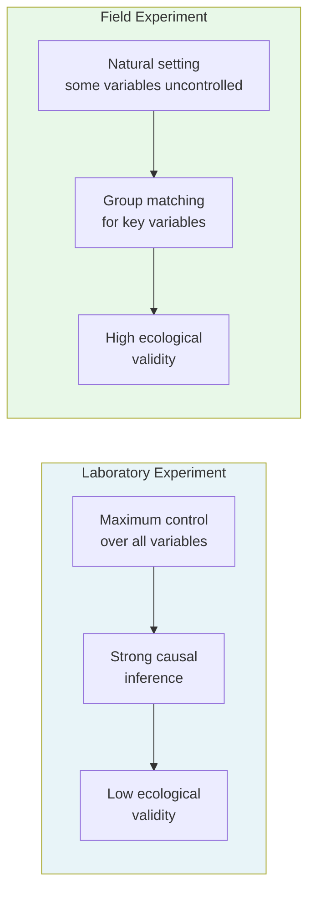

# Experimental Research and Field Experiments: Concepts and Comparison

## Overview

Experimental research is the bedrock of scientific psychology. Through the carefully controlled experiment, psychology establishes cause-and-effect relationships with precision. Yet the artificial environment of the laboratory raises a fundamental question: do findings from controlled settings actually apply to the messy, unpredictable real world?

**Field experiments** were developed to bridge this gap—retaining as much experimental rigour as possible while moving research into natural, real-life settings. This file explores both designs, compares them systematically, and evaluates their strengths and limitations.

---

**Source PDFs**:
- 📄 [Block-2/Unit-3.pdf – Pages 28–32](/pdfs/MPC-005%20Research%20Methods/Block-2/Unit-3.pdf)
- 📚 MPC-005 Research Methods, IGNOU

---

## 3.2.1 Identifying the Research Problem

Every research begins with **defining the research problem**. This step is more consequential than it may appear:

- It focuses the investigator on a specific, answerable question
- It forces **operationalisation**—translating abstract concepts into measurable variables
- It determines what will be manipulated, what will be measured, and what must be controlled
- It leads to **hypothesis formulation**: a positive, negative, or null hypothesis the study will test

A poorly defined problem cascades into poorly designed studies, uninterpretable results, and wasted resources.

**Example operationalisation**: "Stress causes poor academic performance" is a hunch. Operationalised: "Students exposed to a standardised 10-minute stressor (Trier Social Stress Test) will perform worse on a subsequent 30-item working memory task compared to students in a relaxation condition."

---

## 3.2.2 Experimental Research

### Definition

Experimental research is a **systematic and scientific approach** in which the researcher:
1. **Manipulates** one or more **independent variables (IVs)**
2. **Controls** all other extraneous variables
3. **Measures** the effect of manipulation on the **dependent variable (DV)**

The goal is to establish unambiguous **cause-and-effect relationships**—ensuring that any change in the DV can only be attributed to the IV.

### Key Features

- At minimum, **two variables** are required: an IV and a DV
- The IV is **actively manipulated** by the researcher (not merely observed)
- **All extraneous factors** are controlled within the laboratory
- Participants may be **randomly assigned** to experimental conditions
- Results are expressed **quantitatively**
- Studies are **replicable**

### When to Use Experimental Research

Most appropriate when:
- The researcher needs to establish **causality** with high confidence
- Variables of interest **can be ethically manipulated**
- **Precise control** over conditions is feasible
- **Quantitative measurement** of the DV is possible

---

## 3.2.3 Field Experiments

### Definition

A **field experiment** is an experiment conducted in **real-life, natural settings** rather than in a laboratory. The researcher still manipulates an independent variable and measures its effects—but does so in environments like classrooms, hospitals, workplaces, or communities.

### How Field Experiments Work

Because the natural environment cannot be fully controlled, field experiments use a different strategy: **group matching**. Two groups are matched on key characteristics likely to confound results (age, sex, education, socioeconomic status, prior performance). Both groups exist in the same natural setting, so they face similar extraneous influences. The researcher manipulates the IV for one group (experimental) and withholds it from the other (control), then compares outcomes.

### Concrete Example

A researcher compares **lecture vs. tutorial teaching methods** on academic performance:

1. From a school's 5th standard (200 students), 100 are randomly selected
2. These 100 are randomly assigned: 50 to experimental group (lecture), 50 to control (tutorial)
3. Both groups take a **pre-test** of academic performance
4. Teaching proceeds for **1 month** in the school's natural environment
5. Both groups take a **post-test**
6. Statistical comparison (t-test) determines whether performance differences are significant

The school is the **natural setting**; teaching methods are the **IV**; academic performance is the **DV**.

---

## Comparison: Experimental Research vs Field Experiments

| Dimension | Experimental Research | Field Experiment |
|-----------|----------------------|-----------------|
| **Setting** | Laboratory (controlled) | Natural/real-life setting |
| **Subjects** | Homogeneous, controlled conditions | Vary in characteristics; natural conditions |
| **IV control** | Complete manipulation and control | Active manipulation, less control |
| **Extraneous variables** | Fully controlled | Partially controlled through group matching |
| **Causal inference** | Strong | Moderate |
| **Type of results** | Quantitative only | Quantitative and qualitative |
| **Ecological validity** | Lower | Higher |
| **Generalisability** | May not generalise to real world | More generalisable to everyday contexts |

---

## 3.3 Strengths and Weaknesses of Field Experiments

### Strengths

**Ecologically valid and socially relevant**: Field experiments produce findings directly relevant to real-world problems—educational practices, workplace interventions, community health programs.

**Suited for complex social phenomena**: Social psychologists studying group dynamics, prejudice reduction, or prosocial behaviour need natural social contexts that laboratories poorly approximate.

**Tests theories and solves practical problems simultaneously**: A well-designed field experiment can both test a theoretical proposition and generate directly actionable recommendations.

**Broad hypothesis testing and flexible**: Can be adapted across diverse problem domains—education, organizational psychology, clinical psychology, community psychology.

### Weaknesses

**Greater vulnerability to confounds**: Extraneous variables cannot be fully controlled in natural settings. Despite group matching, unmeasured variables may still differ between groups.

**Researcher bias**: Working in less structured field environments increases the risk of confirmation bias—unconsciously interpreting ambiguous results in ways that support the hypothesis.

**Consent and cooperation challenges**: Field experiments require institutional permission (from schools, hospitals, workplaces) and participant cooperation, creating practical barriers.

**Lack of precision**: Without laboratory-grade control of variables and measurement instruments, field experiments inherently sacrifice some precision.

---

## Indian Research Context

Field experiments are particularly valuable in Indian psychological research:

- **Education**: Comparing pedagogical interventions across government school districts under SSA (Sarva Shiksha Abhiyan)
- **Community health**: Testing mental health awareness programs in rural communities (NIMHANS community psychiatry projects)
- **Development psychology**: Field studies of anganwadi/ICDS programs examining effects of nutrition supplementation on cognitive development
- **Occupational psychology**: Studying productivity interventions across factory shift patterns

India's natural heterogeneity (languages, SES variation, rural/urban differences) makes field experiments especially important for testing whether psychological interventions generalise across diverse populations.

---

## Memory Aid

**CALM** — What field experiments offer over lab experiments:

| Letter | Feature |
|--------|---------|
| **C** | **C**omplex social phenomena—better studied in real settings |
| **A** | **A**pplicability—broad hypothesis testing in diverse contexts |
| **L** | **L**ife-like—high ecological validity |
| **M** | **M**atching—groups matched rather than purely randomly assigned |

---

## External Resources

### Wikipedia
- [Field experiment – Wikipedia](https://en.wikipedia.org/wiki/Field_experiment): Overview with historical examples
- [Internal validity – Wikipedia](https://en.wikipedia.org/wiki/Internal_validity): What field experiments sacrifice vs. lab designs

### Educational Videos
- [Experimental vs. Correlational Research — Crash Course Psychology](https://www.youtube.com/watch?v=kkBDa-ICvyY): Experimental design fundamentals
- [Field Experiments in Social Psychology — Khan Academy](https://www.khanacademy.org/social-studies-ap/social-science): Real-world applications of field experimental design

### Research Papers
- **Gerber, A.S., & Green, D.P. (2012)**. *Field Experiments: Design, Analysis, and Interpretation*. W.W. Norton. The definitive modern text on field experimental methodology.
- **Banerjee, A.V., & Duflo, E. (2009)**. "The experimental approach to development economics." *Annual Review of Economics*, 1, 151–178. Nobel Prize-winning field experiments in poverty research.
- **Gneezy, U., & List, J.A. (2006)**. "Putting behavioral economics to work: Testing for gift exchange in labor markets using field experiments." *Econometrica*, 74(5), 1365–1384.

### Additional Resources
- [J-PAL – Randomized Evaluations](https://www.povertyactionlab.org/): Policy-focused field experiments in development
- [Research Methods in Psychology – OpenStax](https://openstax.org/books/psychology-2e/pages/2-1-why-is-research-important): Free textbook chapter
- [APA Division 5 – Quantitative and Qualitative Methods](https://div5.apanet.org/): Resources on research design
- [MIT OpenCourseWare – Experimental Design](https://ocw.mit.edu/): Advanced treatment of experimental methodology

---

## Self-Assessment Questions

**Short Answer**

1. Define experimental research and identify its two essential variables.

2. A researcher wants to test whether a new mindfulness program reduces exam anxiety among engineering students. Design a brief field experiment identifying the IV, DV, experimental group, control group, and how extraneous variables would be controlled.

3. List three strengths and two weaknesses of field experiments.

**Multiple Choice**

4. Which feature of experimental research is typically absent in field experiments?
   - a) Random assignment to conditions
   - b) An independent variable
   - c) Statistical analysis of results
   - d) A comparison group

5. In a field experiment studying the effects of background music on worker productivity in an Indian textile factory, the dependent variable would be:
   - a) The type of music played
   - b) Worker productivity (output per hour)
   - c) The factory environment
   - d) Workers' music preferences

**True or False**

6. Field experiments can generate both qualitative and quantitative results. *(True/False)*

7. Laboratory experiments have higher ecological validity than field experiments. *(True/False)*

Answers

1. Experimental research is a systematic scientific approach where the researcher manipulates the **independent variable (IV)** and measures its effect on the **dependent variable (DV)**, controlling all other extraneous factors.

2. **IV** = mindfulness training (present vs. absent); **DV** = exam anxiety scores on a validated scale; **Experimental group** = receives 4-week mindfulness program; **Control group** = matched students who receive no program; **Extraneous variable control** = match groups on baseline anxiety, academic year, department, and gender; administer pre- and post-tests for both groups.

3. **Strengths**: (i) Higher ecological validity; (ii) Suited for complex social phenomena; (iii) Tests broad hypotheses and practical interventions. **Weaknesses**: (i) Less control over extraneous variables; (ii) Requires institutional permission and cooperation.

4. **a** — True random assignment to conditions is the hallmark of experimental designs.

5. **b** — Worker productivity is the outcome (DV) being measured; music type is the IV.

6. **True** — Field experiments can capture both quantitative data (test scores) and qualitative observations.

7. **False** — Laboratory experiments have *lower* ecological validity; field experiments have *higher* ecological validity.

---

## Key Takeaways

- Experimental research manipulates IVs in controlled laboratory settings → **strong causal inference, low ecological validity**
- Field experiments manipulate IVs in natural settings using group matching → **moderate causal inference, high ecological validity**
- Both begin with clear problem identification and operationalisation of variables
- Field experiments are indispensable for studying complex social phenomena that cannot be adequately simulated in the lab
- The choice is a trade-off: **internal validity** (laboratory advantage) vs. **ecological validity** (field advantage)
