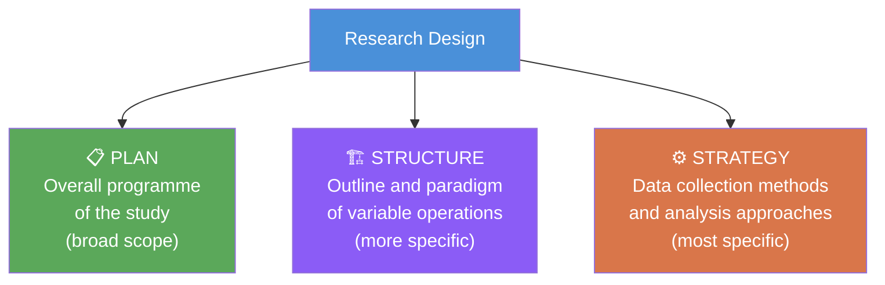
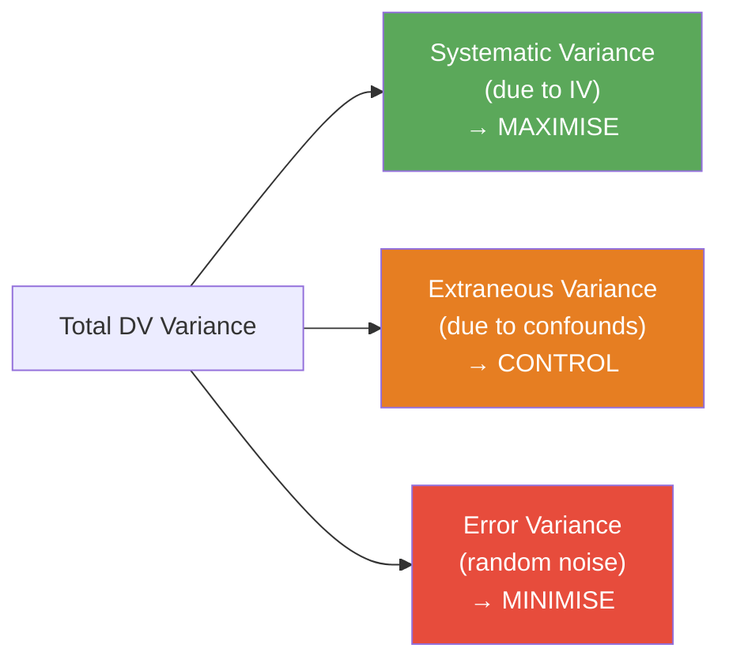

# Research Design: Definition, Objectives, and Criteria for Quality

## Overview

A **research design** is the architect's blueprint before construction begins. No matter how sophisticated the statistical tools or how rich the data, a poorly designed study will yield results that cannot answer the research question or, worse, will answer the wrong question entirely. This file examines what research design actually is, what it must accomplish, and how to evaluate whether a design is adequate for its purpose.

---

**Source PDFs**:
- 📄 [Block-2/Unit-3.pdf – Pages 33–35](/pdfs/MPC-005%20Research%20Methods/Block-2/Unit-3.pdf)
- 📚 MPC-005 Research Methods, IGNOU

---

## 3.5 Research Design: Definition

Research can be etymologically understood as **Re + Search = again + explore**—a systematic attempt to explore relationships between variables. Research is a **scientific methodology** that uses controlled observation and experimentation as its primary tools, giving psychology its status as a science.

**Controlled observation** is central: the researcher observes the impact of the independent variable on the dependent variable under *specific, controlled conditions*, manipulating the IV systematically and recording changes in the DV in a principled way.

### Kerlinger's Classic Definition (1998)

According to Fred Kerlinger, one of the most influential methodologists in behavioural science, a research design encompasses three elements:

1. **Plan** — The overall scheme or programme of the study; the broad proposal that specifies what will be done
2. **Structure** — The more specific framework: the outline, the scheme, the paradigm of how variables will operate and relate to each other
3. **Strategy** — The most specific element: the methods for collecting and analysing data, how research objectives will be reached, and how problems will be tackled

Myers (1980) complements this by describing design as "the general structure of the experiments, not its specific content"—emphasising that design is about architecture, not the furniture inside.

---

## 3.6 Objectives of Research Design

A research design serves two fundamental and equally important objectives:

### Objective 1: Providing Answers to Research Questions

The researcher needs answers in terms of **validity**, **objectivity**, **accuracy**, and **economy**—not merely commonsense impressions.

Research problems are typically stated as hypotheses, and the design must be "carefully worked out to yield dependent and valid answers to the research questions epitomised by the hypotheses" (Kerlinger, 1998).

Different research problems demand different designs. If the hypothesis concerns an **interaction effect** between two variables, a **factorial design** using Analysis of Variance (ANOVA) is clearly indicated. If the question is about change over time, a **longitudinal design** is appropriate. Matching design to question is the researcher's first responsibility.

An adequate research design also specifies:
- The number of observations required
- Which variables are **active** (can be manipulated) vs. **attribute** (can only be categorised)
- How data will be collected and from whom

### Objective 2: Controlling Variance

**Variance** refers to the spread or deviation of scores in a dataset. In research, variance can come from multiple sources—the IV's effects, extraneous variables, and random error. A good design must manage these sources systematically.

Kerlinger articulated **three principles of variance control** that every researcher must apply:

#### Principle 1: Maximise Systematic (Experimental) Variance

The IV must be varied substantially enough that its effect on the DV can be detected. If the IV varies only slightly, its signal may be indistinguishable from background noise.

**Example**: If testing the effect of caffeine on reaction time, the researcher should use meaningful dose differences (e.g., 0mg vs. 200mg vs. 400mg of caffeine), not trivial ones (e.g., 195mg vs. 200mg). The IV must "show itself."

**Purpose**: Maximise the proportion of DV variance explained by the IV → this is what makes effects detectable.

#### Principle 2: Control Extraneous Variance

Extraneous variables are factors other than the IV that could affect the DV and confound results. The design must prevent these from operating freely.

Three strategies for controlling extraneous variables:

| Strategy | Description | Example |
|----------|-------------|---------|
| **Elimination** | Remove the variable entirely from the study | Test only adults to eliminate age variation |
| **Randomisation** | Randomly assign participants to conditions | Random assignment balances extraneous variables across groups |
| **Building into the design** | Include the extraneous variable as an additional IV | Add gender as a factor in a factorial design |

**Purpose**: Ensure DV changes are due to the IV, not to uncontrolled extraneous influences.

#### Principle 3: Minimise Error Variance

**Error variance** is unpredictable, random variation in DV scores due to chance factors—individual differences in mood, fatigue, measurement inconsistency, distractions during testing. Unlike extraneous variance (systematic and potentially identifiable), error variance is essentially noise.

Two methods to minimise error variance:
1. **Reduce measurement errors** through standardised, controlled testing conditions
2. **Increase reliability of measures** by using validated instruments with high reliability coefficients

**Purpose**: A study with high error variance cannot detect true effects—the signal is drowned in noise. Minimising error variance increases statistical power.

---

## 3.7 Criteria for a Good Research Design

How do we evaluate whether a research design is adequate? Six key questions must be answered affirmatively:

| # | Criterion | Key Question |
|---|-----------|-------------|
| 1 | **Specificity** | Does the design give specific answers to the research question? |
| 2 | **Hypothesis testing** | Does the design adequately test the hypothesis? |
| 3 | **Problem appropriateness** | Does the design present/address the appropriate question or problem? |
| 4 | **Extraneous variable control** | Does the design adequately control extraneous independent variables? |
| 5 | **Generalisability** | Can we generalise the results to other subjects/contexts? |
| 6 | **Validity** | Does the design give both internal and external validity? |

### Unpacking the Validity Criterion

**Internal validity** asks: Did the IV actually cause the changes in the DV, or could something else explain the findings? A design with high internal validity has controlled confounds effectively.

**External validity** asks: Can the findings be generalised beyond this particular study, sample, and setting? A design with high external validity produces results applicable to other people, places, and times.

The classic tension in research design is that strategies that maximise internal validity (laboratory control, homogeneous samples, standardised conditions) often reduce external validity—and vice versa. A good design achieves the best possible balance given the research question.

---

## Constructing a Field Experiment: The Six-Step Process

The IGNOU text outlines six practical steps for constructing and conducting a field experiment:

1. **Planning** — Thorough planning ensures proper conditions, tools, and measures are in place before data collection begins
2. **Sampling** — Selecting an appropriate, representative sample using probability (random, stratified, cluster, systematic) or non-probability (quota, purposive, accidental) methods
3. **Research design** — The blueprint: setting, sample composition, procedure, what is manipulated, what is measured, group sizes
4. **Tools of data collection** — Which instruments will be used; how results will be measured; what statistical tools will be applied
5. **Procedure** — Gaining institutional permission, selecting participants, implementing the intervention, collecting pre- and post-test data
6. **Statistical analysis** — Applying appropriate tests (e.g., t-test, ANOVA) to determine if group differences are statistically significant

---

## Indian Context: Research Design Challenges

Indian psychological researchers face particular challenges in achieving good research design:

- **Heterogeneous populations**: India's linguistic, religious, caste, and regional diversity means samples must be carefully described—what constitutes a "representative" sample for a country of 1.4 billion people?
- **Institutional access**: Getting permission from schools, hospitals, and government bodies adds layers of bureaucracy
- **Measurement validity**: Many psychological instruments developed in Western contexts need adaptation and revalidation for Indian populations (the WEIRD problem—Western, Educated, Industrialised, Rich, Democratic bias in psychological measurement)
- **ICSSR funding requirements**: The Indian Council of Social Science Research increasingly requires pre-registration of research designs before data collection, elevating design quality standards

---

## Memory Aid

**SPAM-EV** — Kerlinger's three variance control principles:

| Letters | Principle |
|---------|-----------|
| **S** | **S**ystematic variance → Maximise |
| **P** | **P**ure control of extraneous variance |
| **A** | **A**pply randomisation to control confounds |
| **M** | **M**inimise error variance |
| **EV** | **E**xternal and internal **V**alidity → both must be achieved |

---

## External Resources

### Wikipedia
- [Research design – Wikipedia](https://en.wikipedia.org/wiki/Research_design): Comprehensive overview of design types and objectives
- [Variance – Wikipedia](https://en.wikipedia.org/wiki/Variance): Mathematical foundations of variance relevant to research design

### Educational Videos
- [Research Design: What It Is and Why It Matters — SAGE Research Methods](https://www.youtube.com/watch?v=research-design-sage): Professional overview of design concepts
- [Internal vs External Validity — Simply Psychology](https://www.youtube.com/watch?v=internal-external-validity): Clear explanation of the validity trade-off

### Research Papers
- **Kerlinger, F.N. (1998)**. *Foundations of Behavioral Research* (4th ed.). Surjeet Publications. The primary source for Kerlinger's definition of research design used in the IGNOU curriculum.
- **Shadish, W.R., Cook, T.D., & Campbell, D.T. (2002)**. *Experimental and Quasi-Experimental Designs for Generalized Causal Inference*. Houghton Mifflin. The definitive guide to design and validity.
- **Creswell, J.W., & Creswell, J.D. (2018)**. *Research Design: Qualitative, Quantitative, and Mixed Methods Approaches* (5th ed.). SAGE. Current standard textbook.

### Additional Resources
- [SAGE Research Methods Online](https://methods.sagepub.com/): Comprehensive database of research methods resources
- [APA Publication Manual – Research Design Section](https://apastyle.apa.org/): APA standards for design reporting
- [Open Science Framework – Pre-registration](https://osf.io/prereg/): Platform for pre-registering research designs

---

## Self-Assessment Questions

**Short Answer**

1. According to Kerlinger (1998), what are the three elements of a research design?

2. What are the two basic objectives of research design?

3. Explain the three principles of variance control with an example for each.

**Multiple Choice**

4. Which principle of variance control aims to ensure the independent variable has a large enough effect to be detectable?
   - a) Minimise error variance
   - b) Maximise systematic variance
   - c) Control extraneous variance
   - d) Randomise participant assignment

5. A researcher uses random assignment to groups in her study. Which variance control principle is she primarily applying?
   - a) Maximise systematic variance
   - b) Minimise error variance
   - c) Control extraneous variance
   - d) All three principles simultaneously

**Application Question**

6. A researcher designs a study to test whether yoga reduces stress in UPSC exam aspirants. Critically evaluate this design against the six criteria for a good research design: (a) she recruits only aspirants from Delhi coaching centres; (b) she has no control group; (c) she measures stress using a self-designed, unvalidated questionnaire.

Answers

1. **Plan** (overall scheme), **Structure** (outline and paradigm of variable operations), **Strategy** (methods for data collection and analysis)

2. (i) To provide answers to research questions (in terms of validity, objectivity, accuracy, economy); (ii) To control variance (maximise systematic, control extraneous, minimise error)

3. (i) **Maximise systematic variance**: Use meaningfully different IV levels—e.g., comparing no yoga vs. 1 hour/week vs. 5 hours/week of yoga on stress scores; (ii) **Control extraneous variance**: Randomly assign aspirants to conditions so baseline stress, study hours, and other factors are balanced; (iii) **Minimise error variance**: Use a validated, standardised stress scale (PSS-10) administered under consistent conditions by trained assessors.

4. **b** — Maximising systematic variance ensures the IV produces large, detectable effects.

5. **c** — Random assignment is the primary method for controlling extraneous variance by balancing confounds across groups.

6. Critical evaluation: (a) *Generalisability fails*—Delhi coaching centre aspirants may not represent all UPSC aspirants; external validity is limited. (b) *Hypothesis testing fails*—without a control group, any stress reduction could be due to time passage, practice effects, or other factors, not yoga. (c) *Specificity and validity fail*—an unvalidated questionnaire may not measure "stress" as conceptualised; internal and construct validity are threatened. Overall: the design is inadequate on at least four of the six criteria.

---

## Key Takeaways

- Research design = **Plan + Structure + Strategy** (Kerlinger's definition)
- Two objectives: answering research questions AND controlling variance
- Three variance control principles: **Maximise** systematic variance, **Control** extraneous variance, **Minimise** error variance
- A good design passes six criteria: specificity, hypothesis testing, problem appropriateness, extraneous control, generalisability, and both forms of validity
- The core trade-off in design: **internal validity** (experimental control) vs. **external validity** (generalisability to real world)
