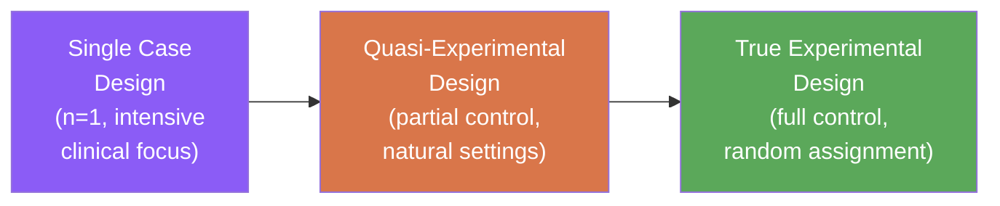
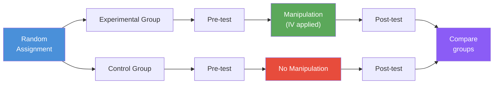

# Types of Experimental Research Designs: Single Case, Quasi-Experimental, and True Experimental

## Overview

Not all psychological research questions can be answered with the same design. A clinical psychologist studying behaviour modification in a single patient, an educational researcher testing curriculum changes across intact school classes, and a neuroscientist studying reaction times in a tightly controlled lab—each needs a different experimental design.

This file explores the **three major types of experimental research designs** used in psychology and the sub-designs within the true experimental category. Understanding when each design is appropriate—and what each can and cannot claim—is essential for both conducting and critically evaluating psychological research.

---

**Source PDFs**:
- 📄 [Block-2/Unit-3.pdf – Pages 35–38](/pdfs/MPC-005%20Research%20Methods/Block-2/Unit-3.pdf)
- 📚 MPC-005 Research Methods, IGNOU

---

## Why Multiple Designs Exist

Pure experimental research with complete control is ideal for establishing causality—but it is not always possible or appropriate in behavioural and social sciences. Key limitations include:

- **Ethical constraints**: Cannot always randomly assign participants to harmful conditions
- **Practical constraints**: Cannot always control all variables in real-world settings
- **Statistical impracticality**: Classrooms, therapy groups, and natural communities are intact units that cannot be randomised
- **Clinical necessity**: Some questions are best answered by intensively studying one individual

The three design types represent a **continuum of experimental control**:

---

## 3.8.1 Single Case Experimental Design

### Definition

The **single case experimental design** (also called N=1, idiographic, or ABAB design) uses a single participant (or a very small number) as both the experimental and control unit, with behaviour measured repeatedly over time under different conditions.

### Key Features

- **Repeated measurements**: The individual's behaviour is measured many times across different phases
- **Phases**: Typically alternates between baseline (no treatment, "A" phase) and treatment ("B" phase)
- **Intra-individual comparison**: Changes within the same person serve as the evidence for treatment effects
- **Detailed information**: Provides rich, nuanced data about one individual that group designs average away

### Primary Application

Single case designs are most valuable in **clinical research**, especially **behaviour modification** and applied behaviour analysis (ABA). When a therapist wants to determine whether a specific intervention reduces self-injurious behaviour in a child with autism, a single case design enables this without needing a large group sample.

### A Classic ABAB Design

| Phase | Condition | Purpose |
|-------|-----------|---------|
| **A₁** | Baseline (no treatment) | Establish stable pre-treatment behaviour rate |
| **B₁** | Treatment introduced | Measure behaviour change with treatment |
| **A₂** | Treatment withdrawn | Test whether behaviour reverts (confirms treatment caused change) |
| **B₂** | Treatment reinstated | Restore the treatment effect |

If behaviour improves during B phases and reverts during A phases, the treatment is demonstrated to cause the change—even with just one participant.

### Strengths and Limitations

**Strengths**: Clinically practical, ethically permits intensive study of one individual, detects subtle behavioural changes that group averages mask, useful when a condition is rare.

**Limitations**: Cannot easily generalise findings to the broader population; participants are not randomly selected; findings may be idiosyncratic to that individual.

---

## 3.8.2 Quasi-Experimental Design

### Definition

**Quasi-experimental designs** are all experimental situations in which the researcher does **not have full control** over the assignment of experimental units randomly to treatment conditions—or where the treatment itself cannot be fully manipulated.

The prefix "quasi" means "resembling"—these designs resemble true experiments but lack one or more of the defining features (usually random assignment).

### Why Quasi-Experimental Designs Exist

Real-world research often requires studying intact groups (entire classrooms, hospital wards, communities) that cannot be broken up and randomly reassigned. Field experiments are often quasi-experiments by necessity.

**Example**: A researcher wants to test a new anxiety management curriculum in schools. Randomly assigning individual students to different classrooms is disruptive and impractical. Instead, the researcher designates entire classrooms as "experimental" or "control"—a quasi-experimental approach.

### Advantages of Quasi-Experimental Designs

- **Natural and realistic**: Conducted in real-life settings, producing ecologically valid findings
- **Ethically feasible**: When random assignment is impossible (studying effects of poverty, natural disasters, policy changes)
- **Answers retrospective questions**: Can examine the effects of past situations that cannot be recreated
- **Generalisable**: Natural settings increase the generalisability of findings to similar real-world contexts
- **Can include random selection**: Even without random assignment to conditions, participants can be randomly selected from the population

### Key Threats to Validity

Because random assignment is absent, quasi-experiments are more vulnerable to:
- **Selection bias**: Groups that chose different "treatments" may differ systematically
- **History effects**: External events may affect one group but not another
- **Maturation effects**: Participants naturally change over time, confounding treatment effects

Researchers use statistical controls (covariate adjustment, matching, propensity scores) to reduce these threats.

---

## 3.8.3 True Experimental Design

### Definition

**True experimental designs** are conducted in laboratory settings with **complete control over all variables** and **random assignment** of subjects to treatment groups. The researcher can:
- Fully manipulate the independent variable
- Study the pure, isolated effects of that manipulation on the DV
- Control the scheduling and presentation of IVs
- Use advanced statistical analyses

### Sub-Types of True Experimental Designs

The true experimental design category contains several important specific designs:

#### i. Between-Subjects Design

Each participant is assigned to **only one** treatment condition. Groups of different participants experience different levels of the IV.

**Example**: 60 participants randomly assigned to three groups (20 each): high stress, medium stress, low stress. Each participant experiences only one condition.

**Advantage**: No carryover effects—previous conditions don't contaminate later ones.
**Disadvantage**: Requires more participants; individual differences between groups may produce noise.

#### ii. Within-Subjects Design (Repeated Measures)

Each participant is exposed to **all treatment conditions**. The same individuals serve as their own controls.

**Example**: All 20 participants experience high stress, then medium stress, then low stress (with counterbalancing to control order effects).

**Advantage**: Each participant serves as their own control, eliminating between-person variability; requires fewer participants.
**Disadvantage**: Carryover effects (fatigue, learning, practice) can confound results; order effects must be controlled through counterbalancing.

#### iii. Mixed Design

Some factors come from **between subjects** (different participants in different conditions) and some come from **within subjects** (same participants measured multiple times).

**Example**: Gender (between-subjects) × Time (within-subjects, measured at pre-test and post-test) in a 2×2 ANOVA.

#### iv. Classical Pretest–Posttest Design

The total population is randomly divided into **experimental** and **control** samples. Both take a pretest, only the experimental group receives the manipulation, then both take a posttest. Any divergence in pre-post change between groups is attributed to the manipulation.

**Limitation**: The pretest itself may sensitise participants to the manipulation—a **testing effect**. This is the problem the Solomon Four-Group Design addresses.

#### v. Solomon Four-Group Design

This elegant design controls for the **interaction between pretesting and treatment** by using four groups:

| Group | Pretest? | Manipulation? | Posttest? |
|-------|----------|---------------|-----------|
| 1 (Experimental) | ✅ Yes | ✅ Yes | ✅ Yes |
| 2 (Control) | ✅ Yes | ❌ No | ✅ Yes |
| 3 (Experimental, no pretest) | ❌ No | ✅ Yes | ✅ Yes |
| 4 (Control, no pretest) | ❌ No | ❌ No | ✅ Yes |

By comparing Groups 1 and 3 (both received treatment, one with pretest and one without), the researcher can detect whether the pretest sensitised participants to the treatment.

**Advantage**: Controls for testing effects; Gold standard for treatment evaluation.
**Disadvantage**: Requires four times as many participants as the simplest design.

#### vi. Factorial Design

A **factorial design** studies the effects of **two or more IVs simultaneously** and—crucially—the **interaction** between them.

**Example**: A 2×3 factorial design studying the effects of:
- **IV1**: Teaching method (lecture vs. discussion) — 2 levels
- **IV2**: Class size (10 vs. 25 vs. 40 students) — 3 levels

This design creates **6 conditions** (2×3) and allows the researcher to determine:
1. **Main effect of IV1**: Does teaching method matter, overall?
2. **Main effect of IV2**: Does class size matter, overall?
3. **Interaction effect**: Does the effect of teaching method *depend* on class size? (e.g., discussion may work in small classes but not large ones)

Interaction effects are often the most psychologically interesting findings—they reveal that the world is more complex than simple main effects suggest.

---

## Comparison Summary

| Feature | Single Case | Quasi-Experimental | True Experimental |
|---------|-------------|-------------------|-------------------|
| **Sample size** | N=1 (or very small) | Groups (intact) | Groups (randomly assigned) |
| **Random assignment** | Not applicable | No (or partial) | Yes |
| **Setting** | Clinical/applied | Natural | Laboratory |
| **Control over IV** | High within-person | Partial | Full |
| **Causal inference** | Moderate (within individual) | Moderate | Strong |
| **Generalisability** | Low | Moderate | Moderate |
| **Best for** | Clinical, behaviour modification | Field research, policy evaluation | Basic research, causality testing |

---

## Indian Context: Design Choices in Practice

- **NIMHANS Clinical Psychology**: Single case designs are routinely used for behaviour modification programs with patients with intellectual disabilities and autism spectrum disorders
- **Educational research**: Quasi-experimental designs dominate studies of mid-day meal programs, computer-aided learning, and Right to Education Act impact—because classrooms and schools cannot be randomly reassigned
- **NEET/JEE coaching research**: Solomon four-group designs have been used to evaluate whether mock test interventions improve exam performance, controlling for the testing effect of repeated practice

---

## Memory Aids

### The Three Design Types: **SQT**

| Letter | Design | Key Feature |
|--------|---------|-------------|
| **S** | **S**ingle Case | Intensive study of one person over time |
| **Q** | **Q**uasi-Experimental | Lacks full random assignment; natural settings |
| **T** | **T**rue Experimental | Full control, full randomisation in laboratory |

### Solomon Four-Group: **2×2 = Control Everything**

Remember: Solomon Four-Group has **4 groups** to control for **1 problem** (testing effects):
- 2 groups get the treatment (one with pretest, one without)
- 2 groups don't get the treatment (one with pretest, one without)

---

## External Resources

### Wikipedia
- [Single-subject research – Wikipedia](https://en.wikipedia.org/wiki/Single-subject_research): ABA designs and their clinical applications
- [Quasi-experiment – Wikipedia](https://en.wikipedia.org/wiki/Quasi-experiment): Types of quasi-experimental designs

### Educational Videos
- [Types of Experimental Designs — Crash Course Statistics](https://www.youtube.com/watch?v=crash-course-exp-design): Overview of experimental design types
- [The Solomon Four-Group Design Explained](https://www.youtube.com/watch?v=solomon-four-group): Detailed walkthrough of this classic design

### Research Papers
- **Shadish, W.R., Cook, T.D., & Campbell, D.T. (2002)**. *Experimental and Quasi-Experimental Designs for Generalized Causal Inference*. Houghton Mifflin. The bible of quasi-experimental design.
- **Barlow, D.H., Nock, M.K., & Hersen, M. (2009)**. *Single Case Experimental Designs: Strategies for Studying Behavior Change* (3rd ed.). Pearson. Definitive guide to N=1 designs.
- **Kirk, R.E. (2013)**. *Experimental Design: Procedures for the Behavioral Sciences* (4th ed.). SAGE. Comprehensive treatment of factorial and within-subjects designs.

### Additional Resources
- [What Works Clearinghouse – Single Case Design Standards](https://ies.ed.gov/ncee/wwc/): US federal standards for evaluating single case research
- [CONSORT Guidelines – Randomized Trials](http://www.consort-statement.org/): International reporting standards for experimental research
- [APA Handbook of Research Methods in Psychology](https://www.apa.org/pubs/books/research-methods): Comprehensive reference for psychological research design
- [MIT OpenCourseWare – Design of Experiments](https://ocw.mit.edu/): Statistical aspects of experimental design

---

## Self-Assessment Questions

**Short Answer**

1. Define quasi-experimental design. Why is it necessary in behavioural science research?

2. Explain the Solomon Four-Group Design and describe what problem it solves compared to the classical pretest-posttest design.

3. Distinguish between between-subjects and within-subjects experimental designs, giving one advantage and one disadvantage of each.

**Multiple Choice**

4. A therapist monitors a child's aggressive outbursts under no-treatment (A) and behaviour modification (B) conditions in the sequence A-B-A-B. This is an example of:
   - a) Factorial design
   - b) Solomon four-group design
   - c) Single case experimental design
   - d) Quasi-experimental design

5. A researcher studies the effects of both sleep deprivation AND caffeine (and their interaction) on cognitive performance. This requires a:
   - a) Single case design
   - b) Factorial design
   - c) Within-subjects design only
   - d) Classical pretest-posttest design

6. Which type of experimental design allows researchers to study the combined effects of two independent variables AND their interaction?
   - a) Between-subjects design
   - b) Within-subjects design
   - c) Factorial design
   - d) Solomon four-group design

**Evaluation Question**

7. A mental health NGO in India wants to test whether a CBT-based group therapy reduces depression in adolescents across 10 cities. They plan to offer therapy to all groups who sign up (no control group) and measure depression before and after the 8-week program. Critically evaluate the research design, recommend the most appropriate design from the types covered in this unit, and justify your choice.

Answers

1. **Quasi-experimental design**: Research situations in which the researcher does not have full control over random assignment of participants to conditions or cannot fully manipulate the treatment. It is necessary because many psychological phenomena cannot be ethically or practically studied with true random assignment—e.g., the effects of poverty, divorce, or policy changes on children cannot be experimentally imposed.

2. **Solomon Four-Group Design** uses four groups: two receive the treatment (one with and one without a pretest), two do not receive treatment (one with and one without a pretest). This solves the **testing/sensitisation effect** problem in the classical pretest-posttest design—where taking a pretest may itself change how participants respond to the treatment. By comparing experimental groups with and without pretests, the researcher can isolate the testing effect.

3. **Between-subjects**: Each participant experiences only one condition. Advantage: No carryover effects. Disadvantage: Requires more participants and individual differences between groups add noise. **Within-subjects**: Each participant experiences all conditions. Advantage: Each person serves as their own control, reducing individual difference variance. Disadvantage: Carryover effects (fatigue, practice, learning) must be managed through counterbalancing.

4. **c** — Single case experimental design (specifically an ABAB reversal design)

5. **b** — A factorial design is needed to study two or more IVs and their interaction simultaneously.

6. **c** — Factorial design studies main effects of multiple IVs plus their interaction.

7. **Critical evaluation**: The proposed design has no control group, making it a pre-experimental design with extremely low internal validity—any improvement could be due to the passage of time (maturation), regression to the mean, or other factors, not the CBT program. **Recommended design**: A **quasi-experimental design** with a waitlist control group in each city. City-level randomisation of which groups begin therapy first (some immediately, some after 8 weeks—the control group) allows comparison with a meaningful control condition. A **Solomon four-group structure** at a subset of sites would additionally control for the assessment effect. **Justification**: True random assignment of individuals is impractical across 10 cities; a quasi-experimental design with matched waitlist controls balances feasibility with adequate causal inference, which is the standard approach in NGO-based intervention research.

---

## Key Takeaways

- **Three major design types**: Single Case (N=1, clinical focus), Quasi-Experimental (partial control, natural settings), True Experimental (full control, lab setting)
- **Single case designs** are ideal for clinical behaviour modification; ABAB reversal designs demonstrate treatment causality within one individual
- **Quasi-experimental designs** are the workhorse of real-world psychological research—necessary whenever full randomisation is impossible
- **True experimental sub-designs**: Between-subjects (one condition per person), within-subjects (all conditions per person), mixed, classical pretest-posttest, Solomon four-group (controls testing effects), and factorial (multiple IVs and their interactions)
- **Factorial designs** are particularly powerful because they reveal **interaction effects**—showing that the effect of one variable depends on the level of another
