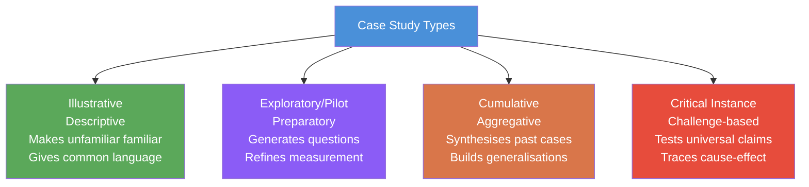

# Case Study Research: Nature, Criteria for Selection, and Types

## Overview

When we want to understand *why* something happened to *this particular person, group, or institution*—not what happens on average across thousands of people—the **case study** is the method of choice. It is the deepest, most intensive form of qualitative inquiry, trading breadth for depth.

From Freud's legendary analyses of individual patients to Robert Yin's modern frameworks for organisational research, case studies have generated some of psychology's most enduring insights. This file examines what case study research is, how cases are selected, and the four types that serve different research purposes.

---

**Source PDFs**:
- 📄 [Block-2/Unit-4.pdf – Pages 39–42](/pdfs/MPC-005%20Research%20Methods/Block-2/Unit-4.pdf)
- 📚 MPC-005 Research Methods, IGNOU

---

## 4.2 Nature of Case Study

### Definition

A **case study** is an empirical research strategy that investigates a phenomenon **within its real-life context**, using multiple sources of evidence to develop a rich, detailed understanding of a single unit—an individual, a group, an organisation, or an event.

Robert Yin (2005), the leading authority on case study methodology, defines it as a research inquiry that:
- Examines a **contemporary phenomenon** in its natural context
- Relies on **multiple sources of evidence** (interviews, documents, observations, tests)
- Uses **triangulation** to converge on understanding
- Benefits from **prior theoretical propositions** that guide data collection and analysis

According to Lamnek (2005): "The case study is a research approach, situated between concrete data-taking techniques and methodological paradigms."—recognising that it is neither purely a technique nor a pure philosophy, but a strategy that bridges both.

### Key Characteristics

**In-depth and longitudinal**: Unlike surveys that collect a few data points from many people, case studies collect many data points from one (or very few) units over time. Depth replaces breadth.

**Holistic**: Case studies examine the case as a whole system—not just one variable in isolation. They seek to understand *the whole person* or *the whole organisation* in context.

**Multi-method**: Data is collected through personal interviews, direct observation, psychological tests and inventories, archival records, and physical artefacts. This triangulation strengthens the credibility of conclusions.

**Both generating and testing hypotheses**: Contrary to the common misconception that case studies only generate hypotheses for later testing, they can both generate *and* test hypotheses within the same study.

**Descriptive or explanatory**: Some case studies describe what a situation is like; others explain why it is that way.

### Historical Roots in Psychology

Case study has a distinguished history in psychology:

- **Freud's psychoanalytic case studies**: His detailed accounts of Anna O., Little Hans, Dora, and the Rat Man remain the most famous case studies in psychology. Through intensive interviews and dream analysis, Freud developed the core concepts of psychoanalysis—repression, the unconscious, transference—from individual cases.
- **Piaget's child studies**: Jean Piaget developed his entire theory of cognitive development through meticulous case studies of his own three children, tracking their reasoning processes stage by stage.
- **Phineas Gage**: The neurological case of railway worker Phineas Gage, whose personality dramatically changed after a metal rod destroyed his frontal lobe, provided foundational evidence for the role of the prefrontal cortex in personality and social behaviour.
- **HM (Henry Molaison)**: The most famous amnesia case in neuroscience—studied over 55 years—revealed the critical role of the hippocampus in memory consolidation.

### Why Case Study Is Not Just "Anecdote"

A common misconception is that case studies are merely anecdotes—interesting stories with no scientific value. This misunderstands their role:

- Case studies can **falsify universal claims**: A single well-documented case that contradicts a general theory is scientifically powerful. The case of HM falsified the idea that all memory is a single system.
- Case studies can **reveal mechanisms**: By tracing precisely *how* a process unfolds in one individual, they generate mechanistic theories that surveys cannot.
- Case studies **situate behaviour in context**: Statistical averages decontextualise; case studies contextualise, capturing the interaction between person and environment.

---

## 4.3 Criteria for Selection of Case Studies

### The Principle: Information-Oriented Sampling

Case studies typically do **not** use random sampling. Instead, they use **information-oriented sampling**—deliberately selecting cases that are likely to provide maximum insight into the phenomenon of interest.

As the IGNOU text notes: "The average case is often not the richest in information. Extreme or atypical cases reveal more information because they activate more basic mechanisms and more actors in the situation studied."

This is a crucial insight: the person with the most severe depression, the organisation that failed most dramatically, or the student who excelled despite the worst possible circumstances often teaches us more about the underlying mechanisms than a randomly selected ordinary case.

### Yin's Framework: Single vs. Multiple Case Studies

Robert Yin (2005) recommends researchers make two key decisions:
1. **Single-case vs. multiple-case**: Study one case in great depth, or study several cases to enable comparison and replication?
2. **Holistic vs. embedded**: Treat the case as a single unit, or examine multiple sub-units within the same case (e.g., different departments within one organisation)?

### Three Types of Information-Oriented Cases

| Case Type | Description | When to Use |
|-----------|-------------|-------------|
| **Critical cases** | Cases that can confirm, challenge, or extend a well-established theory | When theory is mature and needs testing at its boundaries |
| **Extreme or deviant cases** | Cases that are exceptional—unusually successful, unsuccessful, or unusual | When the extreme activates mechanisms not visible in average cases |
| **Paradigmatic cases** | Cases that serve as prototypes or reference points for a broader class of phenomena | When establishing exemplars for comparison |

**Example**: To study resilience in children exposed to extreme poverty, researchers would not randomly sample all poor children—they would identify children who thrived despite poverty (extreme/deviant case) and study them intensively to understand what mechanisms enabled resilience.

---

## 4.4 Types of Case Study

Four major types of case studies serve different research purposes:

### 1. Illustrative Case Studies

**Primary purpose**: *Descriptive*—making the unfamiliar familiar.

These studies use one or two instances of an event to show *what a situation is like*. They give readers a common language and baseline understanding about a phenomenon, particularly when it is new or poorly understood.

**Example**: A case study of one school's successful implementation of mindfulness-based stress reduction program describes in detail how it was set up, what challenges arose, and what the experience was like for students—giving other schools a concrete picture to reference.

**Limitation**: Not designed for generalisation; the goal is illustration, not theory testing.

### 2. Exploratory (Pilot) Case Studies

**Primary purpose**: *Preparatory*—generating research questions and refining measurement approaches before a large-scale investigation.

These are conducted before the main study to identify what questions to ask, what variables to measure, and what instruments to use. They reduce the risk that the main study will use the wrong methods.

**Example**: Before launching a national survey of work stress among IT professionals in India, a researcher conducts exploratory case studies of 3–4 IT companies to understand what forms of stress are most salient, what language workers use, and what data collection approaches are feasible.

**Critical pitfall**: Initial exploratory findings may seem so convincing that they are prematurely released as conclusions—before the main investigation has been conducted. This is a methodological error.

### 3. Cumulative Case Studies

**Primary purpose**: *Aggregative*—synthesising evidence across multiple sites, studies, or time periods.

These compile and integrate findings from past case studies to build toward broader generalisations without requiring new, original data collection.

**Example**: A cumulative case study reviews 15 previously published clinical case studies of dissociative identity disorder to synthesise what common antecedents (typically severe early trauma), presentation patterns, and treatment responses have been found across cases.

**Strength**: Achieves breadth (multiple sites/times) while retaining the depth of case-level analysis. Functions similarly to a systematic review but for case-level data.

### 4. Critical Instance Case Studies

**Primary purpose**: *Challenge and examine*—either studying a unique situation of special interest, or testing a highly generalised claim by finding a counterexample.

These examine one or more sites to:
- Explore a situation of unique interest where generalisability is not the goal, OR
- Call into question a "universal" assertion by demonstrating that it does not hold in a specific case

**Particularly useful for cause-and-effect questions**: By examining a case in great depth, researchers can trace the causal chain from antecedent conditions to outcomes more precisely than statistical approaches allow.

**Example**: A critical instance case study of a highly successful LGBTQ+-affirming school in a conservative Indian city would challenge the generalisation that inclusive policies cannot work in traditional social contexts—one powerful counterexample can reshape a field.

---

## Case Study in Indian Clinical and Educational Practice

Case study methodology has deep roots in Indian psychological practice:

- **Clinical psychology at NIMHANS**: Case formulation is a core competency. Psychiatrists and clinical psychologists routinely conduct detailed case studies integrating biological, psychological, and social factors to understand individual patients
- **Educational psychology**: Case studies of children with learning disabilities, school refusal, or gifted underachievement guide individualised education programs (IEPs) in Indian schools
- **Guidance counsellors**: School counsellors conduct case studies of students with behavioural problems, academic failure, or emotional difficulties to design targeted interventions
- **UPSC/civil service training**: Case study method is explicitly taught as part of the General Studies Ethics paper, where candidates must analyse complex real-world dilemmas

---

## Memory Aid

**IECC** — The Four Types of Case Study:

| Letter | Type | Purpose |
|--------|------|---------|
| **I** | **I**llustrative | Describe and illustrate |
| **E** | **E**xploratory | Explore before the main study |
| **C** | **C**umulative | Collect and synthesise across cases |
| **C** | **C**ritical instance | Challenge generalisations |

---

## External Resources

### Wikipedia
- [Case study – Wikipedia](https://en.wikipedia.org/wiki/Case_study): Comprehensive overview of case study methodology across disciplines
- [Phineas Gage – Wikipedia](https://en.wikipedia.org/wiki/Phineas_Gage): The most famous neuropsychological case study in history

### Educational Videos
- [Case Study Research — Dr. Robert Yin Interview](https://www.youtube.com/watch?v=yin-case-study): The foremost authority on case study methodology
- [Freud's Case Studies — Crash Course Psychology](https://www.youtube.com/watch?v=freud-case-studies): Historical context of case study in clinical psychology

### Research Papers
- **Yin, R.K. (2018)**. *Case Study Research and Applications: Design and Methods* (6th ed.). SAGE. The definitive contemporary guide to case study methodology.
- **Flyvbjerg, B. (2006)**. "Five misunderstandings about case-study research." *Qualitative Inquiry*, 12(2), 219–245. Essential reading for understanding and refuting common objections to case study.
- **Crowe, S., et al. (2011)**. "The case study approach." *BMC Medical Research Methodology*, 11(100). Accessible overview of case study in health research contexts.

### Additional Resources
- [SAGE Research Methods — Case Study](https://methods.sagepub.com/reference/encyc-of-research-design/n37.xml): Authoritative encyclopaedia entry
- [Harvard Business School Case Method](https://www.hbs.edu/case-method/): Institutional perspective on case study as a teaching and research tool
- [NIMHANS Case Formulation Guidelines](https://nimhans.ac.in/): Indian clinical psychology's approach to individual case analysis

---

## Self-Assessment Questions

**Short Answer**

1. Define case study as an empirical research strategy. What distinguishes it from a survey?

2. Why does information-oriented sampling use extreme or deviant cases rather than average cases?

3. Distinguish between exploratory and cumulative case studies with an example of each.

**Multiple Choice**

4. Which type of case study is conducted *before* a large-scale investigation to help identify research questions?
   - a) Illustrative case study
   - b) Exploratory case study
   - c) Cumulative case study
   - d) Critical instance case study

5. Phineas Gage's case, where frontal lobe damage changed his personality, is an example of:
   - a) Cumulative case study
   - b) Exploratory case study
   - c) Critical instance case study
   - d) Illustrative case study

**True or False**

6. Case study research relies on a single source of evidence for triangulation. *(True/False)*

7. Case studies can both generate and test hypotheses. *(True/False)*

8. Random sampling is the preferred approach for selecting cases in case study research. *(True/False)*

Answers

1. A case study is an empirical inquiry that investigates a phenomenon within its real-life context using multiple sources of evidence. Unlike surveys that collect few data points from many participants, case studies collect many data points from one or very few units—trading breadth for depth and providing holistic, contextual understanding.

2. Extreme or deviant cases reveal more information because they **activate more basic mechanisms** that are less visible in average cases. A child who thrives despite extreme adversity reveals resilience mechanisms more clearly than an average child; a company that failed spectacularly reveals failure mechanisms more clearly than one that performed moderately.

3. **Exploratory**: Conducted before the main investigation; example: interviewing 3 teachers before designing a large survey of teacher burnout. **Cumulative**: Synthesises past case studies; example: reviewing 20 published cases of school refusal to identify common themes and build theory.

4. **b** — Exploratory (pilot) case studies are preparatory, conducted before the main study.

5. **c** — Gage's case was a critical instance that challenged assumptions about the separability of personality from brain, demonstrating that frontal lobe damage produces dramatic personality change.

6. **False** — Case study research relies on *multiple* sources of evidence for triangulation (interviews, observations, documents, tests, records).

7. **True** — Case studies can generate hypotheses from observed patterns and test hypotheses by systematically examining specific propositions.

8. **False** — Information-oriented sampling (selecting extreme, critical, or paradigmatic cases) is preferred over random sampling in case study research.

---

## Key Takeaways

- Case study is an empirical, in-depth, holistic inquiry into a phenomenon within its real-life context using multiple evidence sources
- It trades breadth (many participants) for depth (rich, detailed understanding of one unit)
- Cases are selected using **information-oriented sampling**—extreme, critical, or paradigmatic cases, not random sampling
- Four types serve different purposes: **Illustrative** (describe), **Exploratory** (prepare for main study), **Cumulative** (synthesise past cases), **Critical instance** (challenge generalisations)
- Case study has a rich history in psychology—from Freud's clinical cases to Gage and HM in neuropsychology
