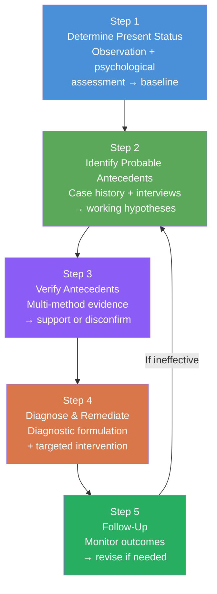
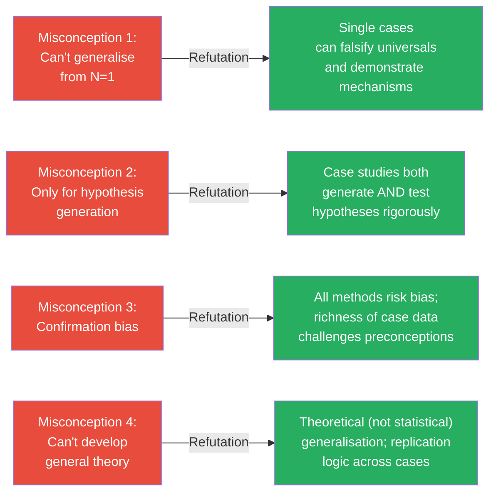

# Case Study: Steps for Conducting, Ways of Use, and Misconceptions

## Overview

Understanding what a case study *is* and what types exist is only the beginning. This file focuses on the *how*—the systematic process for actually conducting a case study, the various practical ways case studies can be used, and the persistent misconceptions that researchers must be equipped to address. Bent Flyvbjerg's (2006) landmark paper on misconceptions about case study research provides the critical scaffolding for the final section.

---

**Source PDFs**:
- 📄 [Block-2/Unit-4.pdf – Pages 42–44](/pdfs/MPC-005%20Research%20Methods/Block-2/Unit-4.pdf)
- 📚 MPC-005 Research Methods, IGNOU

---

## 4.5 Steps for Conducting a Case Study

Case studies follow a **systematic, staged process**—they are not simply unstructured observations or personal accounts. The five steps below provide a rigorous framework used in clinical psychology, educational psychology, and social work practice.

### Step 1: Determining the Present Status of the Case

**Goal**: Establish a clear, objective baseline of the current condition.

This involves:
- **Direct observation** of the case in its natural environment
- **Physical and psychological evaluation**: assessing cognitive level, emotional state, behavioural patterns
- **Standardised assessment tools**: psychological tests, inventories, screening instruments

**Example — Slow Learner Case**: A school counsellor first conducts a comprehensive assessment of the child:
- Cognitive ability testing (e.g., Malin's Intelligence Scale for Indian Children)
- Academic performance review (marks, teacher observations)
- Physical health check (vision, hearing, neurological screening)
- Behavioural observation in the classroom

This baseline establishes *what* is happening before the counsellor attempts to determine *why*.

### Step 2: Identifying the Most Probable Antecedents

**Goal**: Trace backward from the present status to identify likely causal factors.

Based on the baseline assessment, the researcher:
- Reviews the case history (developmental history, medical records, family background)
- Conducts interviews with the individual, family members, teachers, peers
- Formulates a **working hypothesis** (or set of hypotheses) about probable antecedents

**Example**: For the slow-learning child, the counsellor formulates hypotheses:
- H₁: Slow learning may be due to an unstimulating home environment
- H₂: Poor study habits and limited access to learning materials
- H₃: Ineffective teaching methods or inadequate teacher attention
- H₄: Undetected sensory impairment (vision or hearing problems)
- H₅: Emotional difficulties (anxiety, family conflict) interfering with concentration

Multiple antecedent hypotheses are generated rather than rushing to a single conclusion.

### Step 3: Verification of Antecedents/Hypotheses

**Goal**: Systematically test each hypothesis by gathering evidence for or against each proposed antecedent.

This step uses a **multi-method approach**:
- Extended interviews with the child, parents, and teachers
- Structured observation of the child during study and play
- Review of past academic records, attendance, and health files
- Psychometric assessment (specific learning disability screening)
- Environmental observation (home visits, classroom observation)

Each hypothesis is either supported or disconfirmed by the converging evidence. This triangulation of methods strengthens the credibility of conclusions.

**Key principle**: No single source of information is sufficient. Convergent evidence from multiple sources is required for confident conclusions.

### Step 4: Diagnosis and Remedial Measures

**Goal**: Based on verified antecedents, formulate a diagnosis and recommend targeted intervention.

After identifying which antecedents are operative:
- A **diagnostic formulation** is prepared: explaining the causes of the problem in a theoretically grounded, evidence-based way
- **Remedial measures** are recommended: specific, actionable interventions tailored to the identified causes

**Example**: If verification confirms that the slow learner has undetected mild visual impairment *and* receives inadequate parental support for homework:
- *Diagnosis*: Visual processing difficulty + under-stimulating home environment
- *Remedial measures*: Ophthalmology referral for vision correction + parent coaching in homework support strategies + preferential seating in classroom + modified instructional approach

The remedial measures must logically follow from the specific antecedents identified—not be generic, one-size-fits-all prescriptions.

### Step 5: Follow-Up of the Case

**Goal**: Monitor the impact of remedial measures over time and evaluate whether the intervention worked.

After implementing recommendations:
- Regular follow-up contacts with the case (and relevant others—parents, teachers)
- Re-assessment using the same instruments used in Step 1, to detect change
- **Outcome evaluation**: If the intervention was successful → the diagnosis was correct. If not → return to Step 2 and re-examine antecedent hypotheses.

The follow-up step transforms case study from a one-time snapshot into a **longitudinal, iterative process**—continuously refining understanding as new evidence emerges.

---

## 4.6 Ways of Using Case Studies

Case studies can be used in four distinct practical ways, each serving different learning and research purposes:

### 1. Written Analysis

The most rigorous form—a **written case analysis** produced by the researcher or practitioner. This involves:
- Comprehensive documentation of all case data
- Systematic analysis of antecedents and their relationship to the presenting problem
- Evidence-based diagnostic formulation
- Documented recommendations with rationale

Written analyses can function as **term papers** alongside related readings and bibliographies, allowing scholars to integrate the specific case into broader theoretical literature.

**Advantage**: The discipline of writing forces precision in thinking and creates a permanent, reviewable record.

### 2. Panel of Experts

A **panel discussion format** where experts analyse a case collectively, often in educational or training settings. Variations include:
- Experts analyse the case *before* a group discussion, then present their reasoning
- A group first analyses independently, then experts provide critique and additional perspectives
- Multi-disciplinary panels (psychologist, psychiatrist, social worker, teacher) for complex cases

**Advantage**: Multiple expert perspectives surface considerations that a single analyst might miss; models expert reasoning for trainees.

**Limitation**: Group members may miss the active learning benefits of personally grappling with the case before hearing expert views.

### 3. Analysis of Similar Cases

Group members or researchers **share cases from their own experience** that parallel the case being studied. Generalisations drawn from the focal case are tested against participants' experience with analogous cases.

This **cross-case comparison** is particularly valuable for:
- Identifying which features of the case are unique vs. common
- Testing whether proposed mechanisms generalise across contexts
- Building practitioner wisdom through structured reflection on multiple cases

**Example**: A training workshop on adolescent depression uses one detailed case, then invites school counsellors to share parallel cases from their schools—refining the generalisation from the focal case through real-world comparison.

### 4. Cross-Examination

A structured, adversarial format where group members are challenged with **prepared questions** about the case. Each analyst must defend their interpretations with specific evidence from the case data.

**Advantages**:
- Forces careful, evidenced reasoning rather than impressionistic judgements
- Surfaces assumptions and logical gaps in the analysis
- Particularly effective for complex, data-rich cases
- Develops the critical thinking skills essential for rigorous case analysis

---

## 4.7 Misconceptions About Case Study Research

Flyvbjerg (2006) identified five persistent misconceptions about case study research that have unfairly limited its scientific standing. Understanding these misconceptions—and their refutations—is essential for any researcher using this method.

### Misconception 1: You Cannot Generalise from a Single Case

**The claim**: Theoretical knowledge is more valuable than case knowledge because you cannot generalise from N=1.

**The refutation**: This misunderstands what scientific generalisation means. A single case can:
- **Falsify a universal claim**: One unambiguous exception refutes a "universal" law (the classic example: finding a single black swan falsifies "all swans are white")
- **Demonstrate a mechanism**: Showing precisely *how* a process operates in one instance is theoretically powerful
- **Generate theory**: Darwin's Galápagos observations (essentially a "case study" of an island ecosystem) generated evolutionary theory

Furthermore, many theories in psychology are built on single or very few cases: Freud's theory of the unconscious, Piaget's theory of cognitive stages, Broca's area in neurology (from a single patient, Tan). The issue is not sample size but the quality of the analysis.

### Misconception 2: Case Studies Are Only for Hypothesis Generation

**The claim**: Case studies generate hypotheses, but other methods (experiments, surveys) are needed to test them.

**The refutation**: Case studies can both generate *and* rigorously test hypotheses. The ABAB single-case experimental design (discussed in Unit 3) tests hypotheses about intervention effects within a single case. Analytic induction—systematically seeking disconfirming cases—is a formal hypothesis-testing strategy within case study methodology.

### Misconception 3: Case Studies Confirm Researchers' Preconceptions

**The claim**: Case study researchers tend toward verification bias—finding what they already expect.

**The refutation**: This is a risk in all research methods, not unique to case study. Quantitative studies suffer equally from confirmation bias (through selective reporting, outcome switching, and analytic flexibility). Moreover, case study's richness and multi-method nature *increases* the likelihood of encountering disconfirming evidence, because immersion in detailed reality makes it harder to ignore facts that don't fit the theory.

The solution—for case study as for all methods—is systematic protocol, pre-specified hypotheses, and transparent documentation of all evidence, not just confirming instances.

### Misconception 4: Difficult to Summarise and Develop General Theory

**The claim**: Individual cases are so particular that producing generalisable theory from them is impossible.

**The refutation**: The challenge is real but manageable through:
- **Theoretical generalisation** (not statistical generalisation): Case studies generalise to *theory*, not to *populations*
- **Replication logic**: Multiple case studies serve as replications—if the same mechanism appears across different cases, theoretical confidence builds
- **Meta-synthesis**: Systematic qualitative synthesis of multiple case studies (analogous to meta-analysis for quantitative studies) can extract general patterns

---

## Practical Application: Case Study in Indian School Counselling

A school counsellor at a Delhi government school notices that a 10-year-old boy (Ravi) has been disruptive, frequently absent, and failing in mathematics for the past three months. Applying the five-step case study framework:

**Step 1 — Present Status**: Intelligence testing (average range); academic testing (below grade level in maths, average in other subjects); classroom observation (inattentive, avoidant of work, sits near door).

**Step 2 — Antecedents**: Parent interview reveals recent parental separation; teacher reports change after Diwali break; Ravi himself discloses he is worried his father has left because of him.

**Step 3 — Verification**: Home visit confirms conflict and father's absence; Ravi's maths teacher confirms problems began after Diwali; psychological screening rules out learning disability; emotional functioning assessment reveals significant anxiety and guilt.

**Step 4 — Diagnosis and Remediation**: Diagnosis = Adjustment disorder with anxiety, secondary academic underachievement; Remediation = Brief school-based counselling (6 sessions, emotion-focused), parent consultation, teacher sensitivity training, and structured maths catch-up sessions.

**Step 5 — Follow-Up**: Review at 6 weeks—attendance improved, maths performance recovering, behavioural disruptions reduced. Counsellor schedules monthly check-in for remainder of school year.

---

## Memory Aids

### **IVDF** — The Five Steps of Case Study

| Step | Mnemonic | Action |
|------|----------|--------|
| **1** | **I**nspect the present | Determine current status |
| **2** | **V**iew antecedents | Identify probable causes |
| **3** | **D**isprove or confirm | Verify hypotheses |
| **4** | **F**ix it | Diagnose and remediate |
| **5** | **F**ollow through | Follow-up and evaluate |

### Flyvbjerg's Misconceptions — **GCCD**

| Letter | Misconception |
|--------|--------------|
| **G** | Can't **G**eneralise from N=1 |
| **C** | Only for hypothesis **C**reation (generation) |
| **C** | **C**onfirmation bias tendency |
| **D** | **D**ifficult to develop general theory |

---

## External Resources

### Wikipedia
- [Case study – Wikipedia](https://en.wikipedia.org/wiki/Case_study): Comprehensive methodology overview including Flyvbjerg's contributions

### Educational Videos
- [How to Conduct a Case Study — Research Methods](https://www.youtube.com/watch?v=conduct-case-study): Practical walkthrough of the case study process
- [Flyvbjerg on Case Study Research — Copenhagen Business School](https://www.youtube.com/watch?v=flyvbjerg-case): The author explains his misconceptions paper

### Research Papers
- **Flyvbjerg, B. (2006)**. "Five misunderstandings about case-study research." *Qualitative Inquiry*, 12(2), 219–245. Essential reading—directly cited in IGNOU curriculum.
- **Yin, R.K. (2018)**. *Case Study Research and Applications* (6th ed.). SAGE. The definitive methodology text; covers all steps in systematic detail.
- **Crowe, S., et al. (2011)**. "The case study approach." *BMC Medical Research Methodology*, 11(100). Accessible guide to clinical case study methodology.

### Additional Resources
- [Qualitative Research Guidelines Project — Case Study](https://www.qualres.org/HomeCas-3516.html): Practical guidance for rigorous case study conduct
- [NIMHANS Case Formulation Training Materials](https://nimhans.ac.in/): Indian clinical psychology case formulation frameworks
- [Cochrane Qualitative Methods Group](https://methods.cochrane.org/qi/): Standards for systematic synthesis of qualitative case evidence
- [Open Science Framework — Case Study Pre-registration](https://osf.io/): Emerging standards for pre-registering case study protocols

---

## Self-Assessment Questions

**Short Answer**

1. List the five steps for conducting a case study in order.

2. What is the purpose of the "follow-up" step, and what should the researcher do if the intervention appears unsuccessful?

3. Explain Flyvbjerg's refutation of the misconception that "you cannot generalise from a single case."

**Multiple Choice**

4. In Step 3 of the case study process (Verification), which approach is recommended?
   - a) Relying on a single interview with the case
   - b) Using a multi-method approach with multiple evidence sources
   - c) Only using quantitative psychological tests
   - d) Relying exclusively on the case's self-report

5. A training workshop uses a detailed case study, then asks counsellors to share parallel cases from their experience. This is an example of which "way of using" case studies?
   - a) Written analysis
   - b) Panel of experts
   - c) Analysis of similar cases
   - d) Cross-examination

6. According to Flyvbjerg (2006), which of the following is a misconception about case study research?
   - a) Case studies rely on multiple sources of evidence
   - b) Case studies can only generate, not test, hypotheses
   - c) Case studies are well suited to understanding context
   - d) Case studies are particularly valuable for rare phenomena

**Application Question**

7. A clinical psychology trainee at NIMHANS is conducting a case study of a 35-year-old woman with treatment-resistant major depression. At Step 3 (Verification), she interviews only the patient—no collateral history, no records review, no observation. Critically evaluate this approach and describe what a rigorous Step 3 should involve.

Answers

1. **Five steps**: (1) Determine present status; (2) Identify most probable antecedents; (3) Verify antecedents/hypotheses; (4) Diagnose and recommend remedial measures; (5) Follow-up.

2. The **follow-up** step evaluates whether the remedial measures worked. If the intervention appears unsuccessful—the presenting problem persists or worsens—the researcher should return to Step 2 (identifying antecedents) and re-examine whether the initial hypothesis was correct, or whether a different antecedent may be operative. Case study is an iterative process.

3. Flyvbjerg argues that a single case *can* contribute to scientific knowledge in several ways: (i) it can **falsify a universal claim**—one well-documented exception refutes a "universal" generalisation; (ii) it can **demonstrate a causal mechanism** in detail that statistical studies obscure; (iii) many foundational theories (Freud, Piaget, Broca) were built on single or very few cases. The issue is the quality of analysis, not the number of cases.

4. **b** — Step 3 requires a multi-method approach using multiple evidence sources (interviews, observation, records, tests) for triangulation.

5. **c** — Asking practitioners to share parallel cases from their experience for comparison is the "Analysis of Similar Cases" way of using case studies.

6. **b** — "Case studies can only generate, not test, hypotheses" is the misconception. Flyvbjerg and the IGNOU text both clarify that case studies can test hypotheses rigorously.

7. **Critical evaluation**: Relying solely on the patient's self-report violates the fundamental multi-method principle of Step 3. Treatment-resistant depression is particularly complex; verification requires: (i) *Collateral history* from family members (to verify reported symptom timeline, rule out bipolar features, assess psychosocial stressors); (ii) *Medical records review* (to verify previous treatment trials, medical comorbidities, medication history); (iii) *Psychological testing* (to assess severity—PHQ-9, Hamilton Depression Rating Scale; to rule out personality disorders complicating treatment); (iv) *Direct observation* during clinical interview (psychomotor changes, affect quality, cognitive slowing). Without these multiple sources, the "verification" is not verification at all—it is simply the patient's account, which may be incomplete, unconsciously distorted, or limited by the patient's own self-understanding.

---

## Key Takeaways

- Case study follows a **systematic five-step process**: assess present status → identify antecedents → verify hypotheses → diagnose and remediate → follow-up
- **Multi-method data collection** at Step 3 (interviews, observation, records, tests) is essential—no single source is sufficient
- Case studies can be used in four ways: written analysis, panel of experts, similar case analysis, and cross-examination
- Flyvbjerg's (2006) four misconceptions—cannot generalise, only hypothesis generation, confirmation bias, cannot build theory—all have well-developed refutations
- Case study generalises to **theory** (not populations); single cases can be scientifically powerful through falsification and mechanism demonstration
